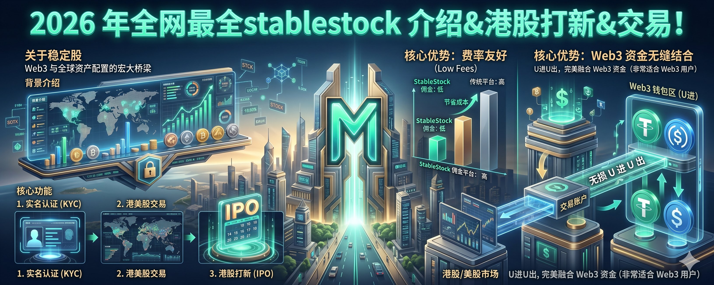
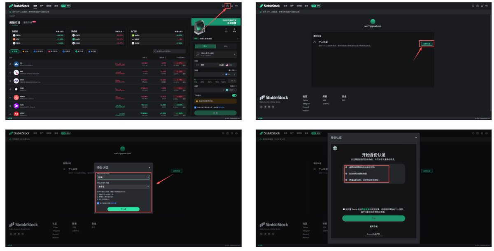
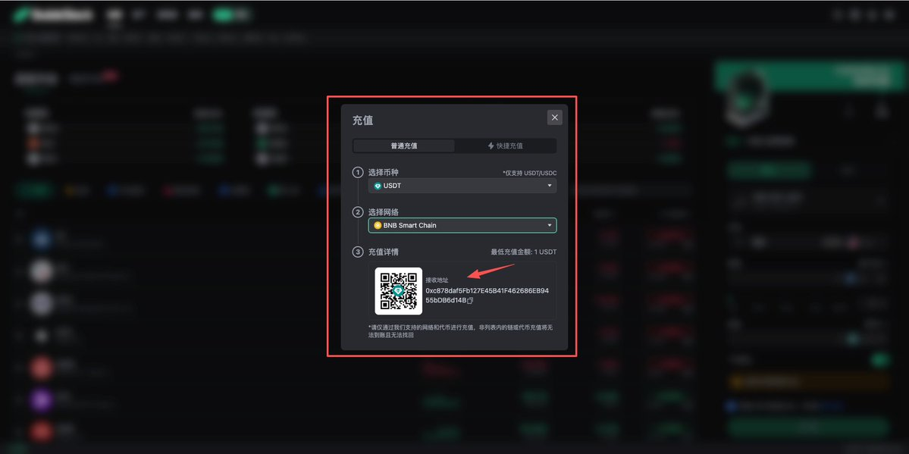
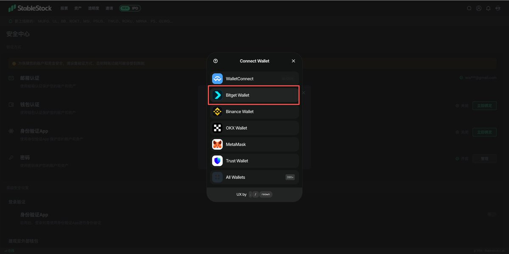
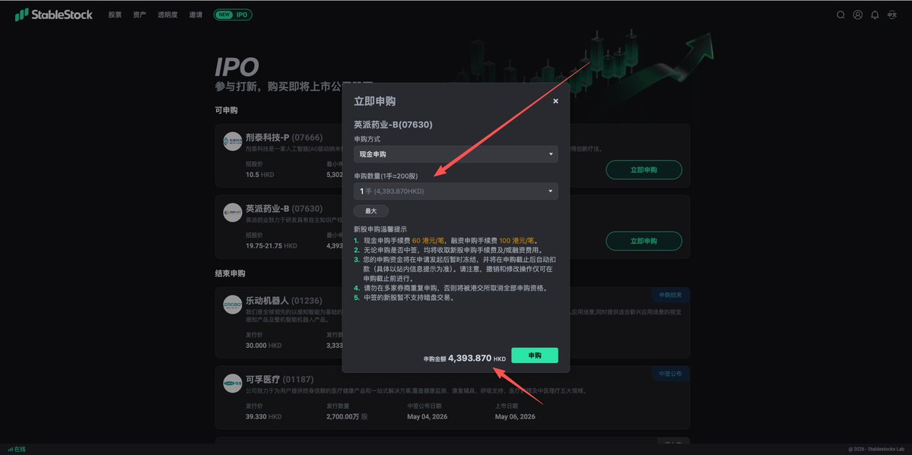
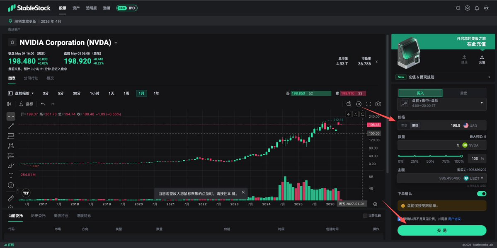

## 一、写在前面

最近港股打新确实重新映入了大家的眼帘。肉眼可见的那就是加密正处于一个熊市阶段，而东边不亮西边亮，恰好最近一段时间的**美股**却十分火爆。

但是传统意义上如果你想要投资美股，需要的流程就比较复杂了——你需要先准备好港卡，然后开一个传统的券商，再然后就是入金再购买，整一套流程下来略微有一些繁琐。

但是针对于 **Web3** 的朋友来说，现在**链上美股**正在如火如荼地进行中，所以大家也就不用再走那套传统的流程了，转而可以直接使用链上美股交易平台进行**港美股的交易和打新**工作了。

那这一期内容我们来细节介绍一下 **StableStock** 这个明星产品，从其背景到注册/打新/费率介绍等入手，来给大家详细聊一下这个平台！

---

## 二、StableStock 介绍

**StableStock**（稳定币友好新一代券商 / TraDeFi 平台）是一款将稳定币与全球真实股票市场无缝打通的创新型 neobroker。

它让用户能够直接用 **USDT、USDC** 等稳定币购买并交易真实的美股、港股及 ETF，实现"**稳定币入金 → 真实交易所撮合 → 券商清算托管**"的完整闭环，同时提供链上代币化资产（sStocks）以支持 DeFi 可组合性。

StableStock 的核心定位是**"让稳定币真正流动起来"**，解决加密用户长期面临的痛点：手里握着美元形态的稳定币，却要在传统股票市场面临开户、换汇、银行通道、时差和摩擦成本等问题。它不是简单地把股票做成合成代币，而是通过**持牌券商体系**提供标准化的股票交易体验，同时在链上解锁 24/7 流动性与可编程性。

### 公司背景与股东实力

StableStock 创始团队拥有深厚的传统金融与 Fintech 背景，主要来自美股 Fintech 上市公司**融360**以及头部美元基金**经纬创投**，团队整体兼具 TradFi 清算经验与 Web3 产品能力。

公司获得顶级机构背书，已完成种子轮融资，领投方包括：

- **YZi Labs**
- **MPCi（经纬中国美元基金）**
- **Vertex Ventures（淡马锡旗下全球创投平台）**

此外还有 Amber Group、Flow Traders、Antalpha、Nomad Capital、Cherry Ventures 等国际交易机构与产业资本参与。

### 核心产品与运行机制

StableStock 主要由三大模块组成，形成"券商清算 + 链上流动性"的双轨体系：

**StableBroker（稳定币券商通道）**：用户直接用稳定币充值，即可交易真实股票。资金通过稳定币→美元通道进入**澳洲持牌券商**的清算体系，所有订单直达纳斯达克/纽交所/港交所订单簿，成交价格与流动性完全来自真实市场。股票分红、拆股、公司行为等权益均由券商体系真实发放并自动到账。

**sStocks（1:1 链上代币化股票）**：在 Broker 买入真实股票后，可 1:1 铸造为 BNB Chain 上的 sStock（BEP-20），支持 24/7 链上交易、套利和 DeFi 组合。每个 sStock 都有真实股票作为 100% 储备支持，并可通过 mint-redeem 机制与底层资产兑换。

**StableVault + StableSwap**：Vault 提供代币化股票的收益策略（自动复投分红等）；StableSwap 则是低滑点链上交易池，支持 sStocks 与稳定币等资产的高效兑换。

### 与合成代币方案的本质区别

StableStock 明确坚持**"真实股票 + 可验证清算"**路线，而非纯合成代币模式：

| 对比维度 | StableStock | 合成代币平台 |
|----------|------------|------------|
| **交易真实性** | 对应真实交易所订单，提供完整券商周结单 | 通常无法出具券商证明 |
| **流动性深度** | 深度来自纳斯达克/纽交所/港交所，无滑点 | 大额交易易造成价格大幅波动 |
| **分红权益** | 分红自动真实到账，可灵活配置 | 多折入价格，收益不透明 |
| **标的覆盖** | 已支持 **900+ 港美股标的** | 多数仅 200-250 只，热门标的常缺货 |
| **费率透明度** | 费率透明，无隐形成本 | "零费率"实则点差更高 |

> 一句话总结：StableStock 做的是一件"简单但极难"的事——在严格合规的前提下，把稳定币的便利性与全球股票市场的真实流动性、权益保护完全打通。在传统金融与数字资产加速融合的今天，StableStock 以**机构背书、真实清算、链上扩展**的三重优势，重新定义"稳定币如何进入全球资本市场"。

---

## 三、注册 & 认证

StableStock 现在没有 APP，只需要在 **Web 端**进行操作，大家可以通过此邀请码进行注册，已为大家安排了 **20% 的消费返现**：

[点击注册 StableStock（邀请码 WISE666）](https://app.stablestock.finance/?join=WISE666)

注册完毕账号之后，如果大家想要打新的话需要先完成**实名认证**。

### 1、实名认证

打开网页，然后选择**实名认证**，准备好自己的**身份证证件**和**人脸**进行实际操作即可完成完整的认证流程。

### 2、入金

现在 StableStock 支持两种充值方式，完全是 **U 进 U 出**（USDT/USDC 操作）：

入金方式一：直接**链上地址转账**入金，走正常的转账流程即可。

入金方式二：**绑定自己的钱包**进行入金操作，整体上比较简单，十分适合 Web3 的朋友来操作和交易！

---

## 四、港股打新

在前面我们聊到过可以使用复星进行打新，最近打新也比较火，但是如果使用复星打新的话，会出现的问题就是需要大家有港卡、券商等走完整个流程，那 **StableStock** 就比较适合一些**没有港户/券商**，同时资金都在 Web3 里面的朋友。

如图所示，找到相关的产品直接进行申购即可。

> ⚠️ 注意：StableStock 打新是需要手续费的——**现金申购 60 港币/笔**，**融资申购 100 港元/笔**。对应到传统券商（如致富/复星）来说要稍微贵一些，这一块大家可以重点关注。

---

## 五、交易

聊完了打新之后我们来聊一下关于**港美股交易**的事情。

前面聊到 StableStock 支持的产品比较多，目前已覆盖：

- **500+ 美股及 ETF**
- **170+ 港股标的**（包括热门 IPO 如 MiniMax、智谱等）
- 港股 IPO 打新、杠杆产品
- 计划逐步推出期权、融资融券等功能

**最低交易门槛低至 10 美元**，支持小额分批建仓！

具体的交易操作比较简单，大家直接上手操作就行。

---

## 六、费率

聊完了交易之后，我们来聊一下具体的费率问题。关于 StableStock 的具体费率大家可以查看官方文档：[费率说明](https://stablestock.gitbook.io/ss/concepts/stablebroker/fee)

StableStock 走的完全是**传统券商的透明收费模式**，主要分成两部分：

- **① StableStock 自己的服务费**：不管买还是卖，都按交易金额收 **0.1%**
- **② 上游通道和监管费用**：直接转给券商、交易所、FINRA、香港政府等（代收代付），金额很低、完全透明

### 美股费用明细

| 费用项目 | 金额 |
|----------|------|
| StableStock 服务费 | 交易金额 × **0.1%** |
| 上游经纪商平台费 | $0.005/股（每笔最低 $1） |
| FINRA Trading Activity Fee（仅卖出） | 约 $0.000166/股 |
| Settlement Fee（结算费） | $0.003/股 |

实际综合下来：**1 万美元左右的交易，全部费用加起来约 0.11%（千一级别）**。买得越多、单笔越大，这些固定小费占比就越低，实际成本还会继续往下掉。

### 港股费用明细

| 费用项目 | 金额 |
|----------|------|
| StableStock 服务费 | 交易金额 × **0.1%** |
| 上游交易佣金 | 0.02%（最低 HKD 15） |
| 印花税（香港政府收） | **0.1%** |
| 交易所交易费 + 结算费 + 其他监管费 | 合计约 0.012% |
| 上游平台费 | HKD 2 / 订单 |

港股因为多了 **0.1% 的印花税**，整体费用会比美股稍高一点，但所有费用都明明白白写在那里，没有任何猫腻。

### 其他贴心的地方

- **充值和提现完全免费**（用 USDT/USDC 几分钟就到账）
- **最低交易门槛只要 10 美元**，特别适合小额分批建仓
- 下单时**所有费用都会实时显示**，绝不会有隐形收费或点差

### 实际费用例子（以 1 万美元交易为例）

假设你用 1 万美元买入一只股票/ETF，然后后面全部卖出（买 + 卖一轮）：

| 市场 | 买入 | 卖出 | 合计 |
|------|------|------|------|
| **美股** | ≈ $11 | ≈ $12 | **≈ $23** |
| **港股** | ≈ $24-26 | ≈ $24-26 | **≈ $48-52** |

> 一句话总结：StableStock 的费用结构超级清晰透明，虽然平台收了 0.1% 服务费，但整体下来就是**千一左右**的传统券商水平，而且没有任何隐形坑。尤其是你本来就拿着稳定币的时候，直接充值就能省掉一大堆换汇麻烦，用着特别顺手舒服。

---

## 七、写在最后

以上就是关于 StableStock 的详细介绍了，从其前世今生到其实力，再到详细的**开户/实名/港股打新教程**，最后也详细介绍了一下费率情况，综合看下来费率都还是蛮好的！

关于链上，我觉得是一个比较明显的趋势——核心还是一个点：如果 CRS 等问题能有比较好的解决方案，也比较适合现在加密货币比较多的朋友，可以**近乎无损切换到美股中**进行交易了！

ok，以上就是今天的全部内容了，如果大家有意向参与港股打新的话，可以抽空学习和申购了。如果大家有遇到任何问题，也可以咨询咱们的大鱼大美女 **@ShuYu622**！

最后，我最近也在微信里面建立起来了一些交流群，目前群内加在一起也有 **1000+ 人**了。多数朋友都觉得 Telegram 电报聊起来不舒服，而且最近网络又比较卡顿，所以把微信群给建立起来，给大家一个自留地用来交流和聊天。

如果你想要找个地方和我一起交流聊天，可以直接扫描此二维码加入群聊，此二维码是活码，任何时候都可以扫码加入，我们就群内互动交流！

