> **Author:** WiseInvest　·　**Version:** 1.0.1　·　**Updated:** 2026-09-03　·　**Changes:** 初始化所有内容

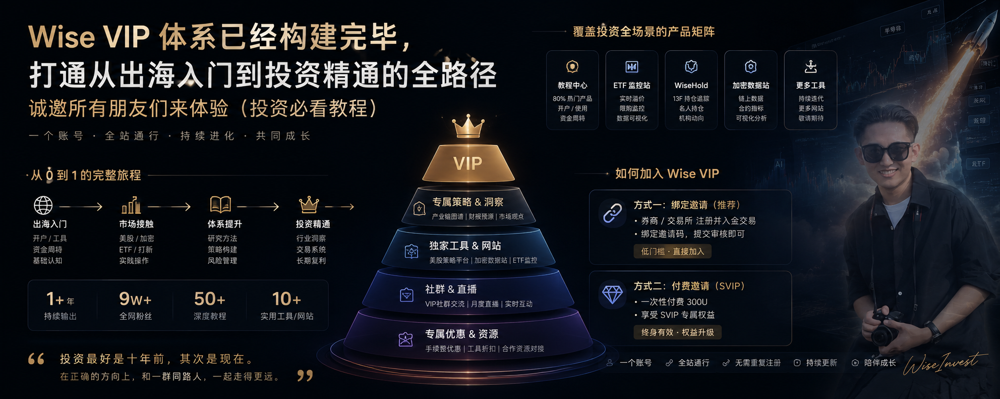

## 一、写在前面
哈喽，大家好，这里是 **WiseInvest**，我是你们的老朋友 **Wise**！
正在努力做最懂小白的博主，践行投资**最好是十年前，其次是现在** ……
我最近在回顾过去，我从去年 10月份开始在**X 更新内容**，同时同步在全网进行内容的同步和更新，到现在也有快一年的时间了，这个一年的时间里面我做了很多的事情。 
就社媒来说，我想大家最关注，我成功把 X 做到了**近乎 5W 粉丝**，小红书**3 万粉丝**，其他的七七八八加起来目前**全网粉丝量大概在九万粉丝**样子。

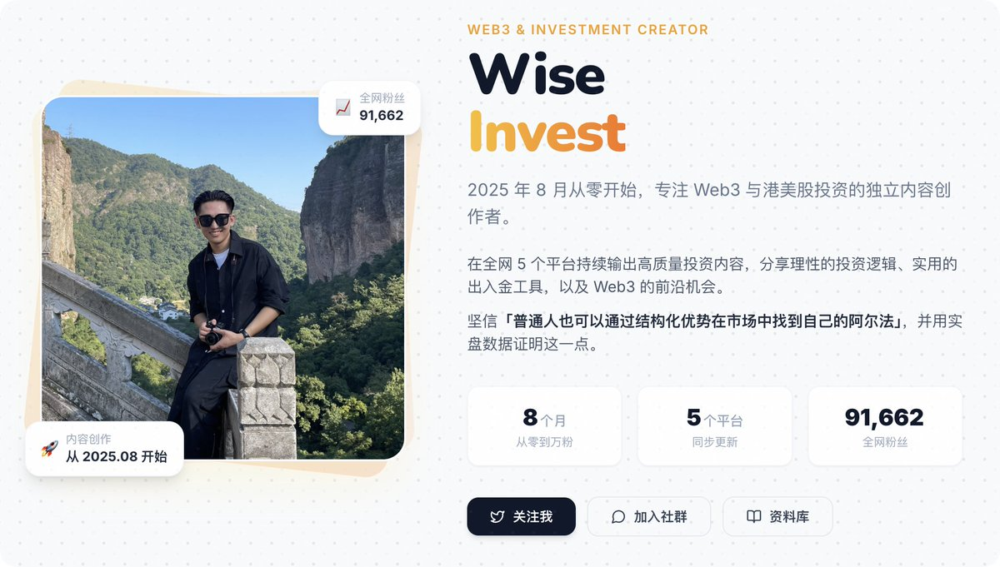
在这个过程中，我没有在任何一个平台刷过任何一个粉丝（所有粉丝均**自然增长**），有很多朋友会好奇我为什么有如此快的增长速度，其实很简单，那就是**做对用户真正有价值的事情**，对他们真正有帮助的事情
PS：主要还是我之前在 web2 时候做过抖音/小红书等平台，有丰富的平台运营经验
但是说实话，我觉得其实多少的粉丝量我觉得这些都是次要的。
🤔🤔🤔
我觉得真正有价值的事情是真正意义上做出了很多的“产品和作品”真正意义上帮助了很多朋友开是了解出海和投资这件事儿。 
就拿我最开始在小红书上布道“纳指”一样，影响了 上千个朋友了解纳指和美股这个世界，打开了新世界的大门。

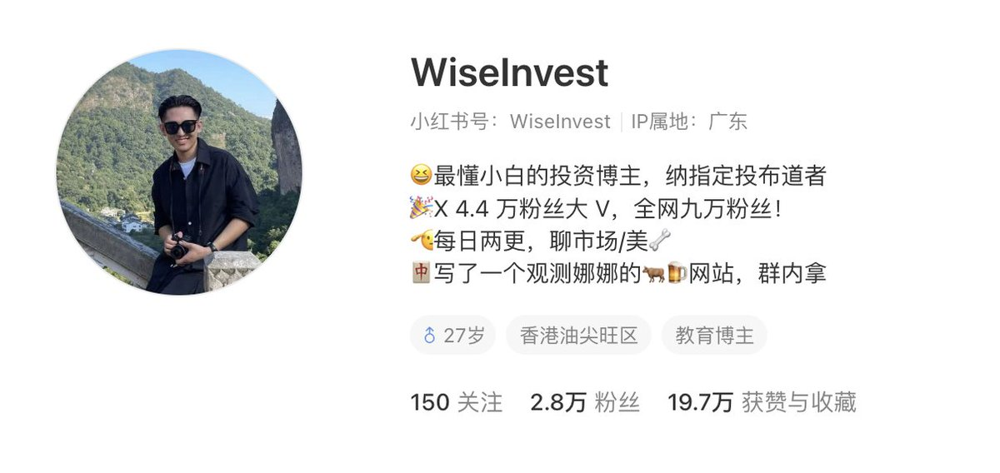
那在这个过程中，我在我们的 X 上也同步更新了非常多的“作品”，也正在努力打造一个“帝国”，即从单方面的只是聊加密/美股，变成一个更加全能的“**Wise**”体系，无论你是关注指数产品、美股产品、加密产品、出海等内容，Wise 这里都有相关的产品给到大家来学习。
那最近**产品越来越多、用户也越来越多**，我的群也越来越多，网站也越来越多，就越发难以管理，所以我就做了一个更加有价值的事情，那就是把整个用户体系都融合在一起，用一个网站功能加以管理，所以也就应运而生了我们的整个 **VIP 体系系统**！
下面我就来给大家**详细介绍**一下：过去我们做了一些产品，以及我们整个后续 VIP 体系要如何去**准备发展**。
帮助到更多的朋友在这个投资理财的道路上走得**更稳、更远**。 
ok，那我们就开始吧……
## 二、Wise 作品
### 1、教程作品
首先，我们的教程作品从去年 8 月份开始，在全网、全平台进行出海等内容教程的更新，目前已经积累了非常多有价值的内容。如果用一张图片来表示的话，我相信这张图片就是一个非常全面的象征。

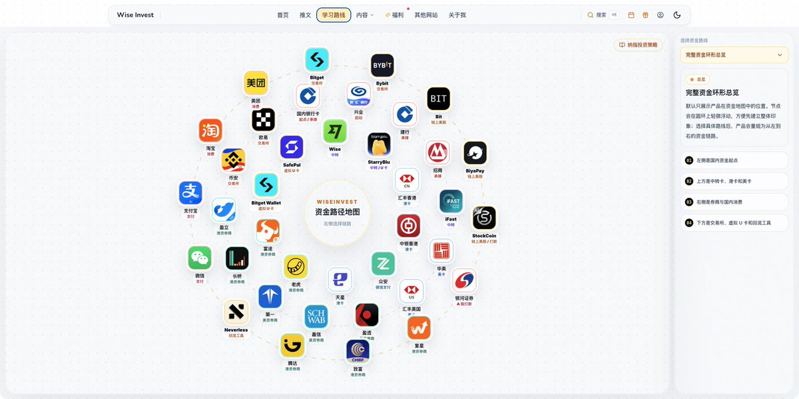
包含了近乎当下 80% 的热门产品的注册/开户/使用、以及联动、资金周转等内容，
举例子有链上美股、链上打新，传统美股、传统打新、A 股打新，以及各种资金周转的渠道，例如国内到中转卡、再到美资/港资券商，以及国内平台资金如何到交易所，以及各种虚拟 U 卡等产品和工具的使用等……

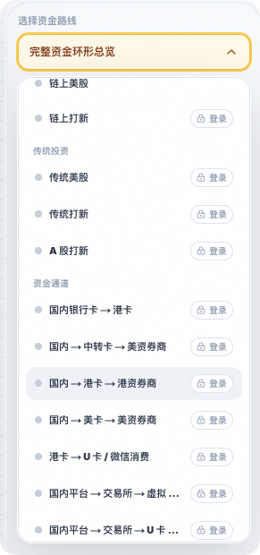
具体的教程内容大家也都可以前往内容板块进行学习与使用

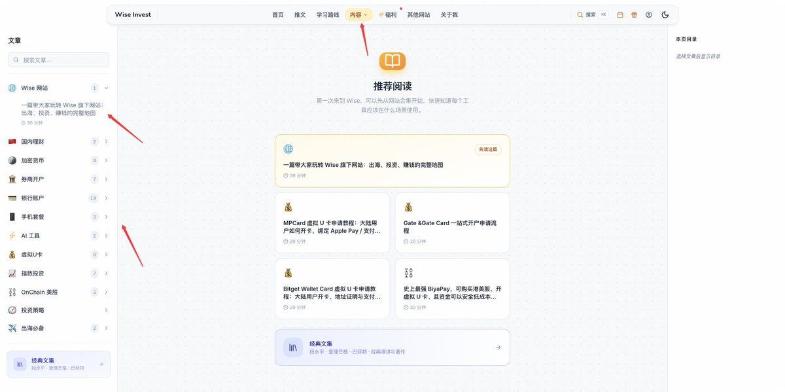
相比于多少的粉丝量，我更加看重这些东西，因为这些东西更加可以真正意义上代表了我的这个账号给各位朋友们带来的价值，也帮助到更多的朋友了解投资市场，开启投资世界的新大门！

路径如下：[点击查看学习路线总览](https://www.wise-invest.org/roadmap)

### 2、网站作品
我记得很清楚，2026 年的**除夕夜**，我没有像往常一样回去过年，而是在自己的房间构建了我们的第一个网站，也就是我们的 **Wise-invest 投资主站**，在除夕夜当天成功上线，到现在为止，已经运行了半年多之久。 
在这个过程中，我在不断优化的同时，也上线了更多能够给大家提供切实帮助的网站。 
例如大家最喜欢的 ETF 网站，可以随时查询很多场内外产品的限购以及溢价等问题。

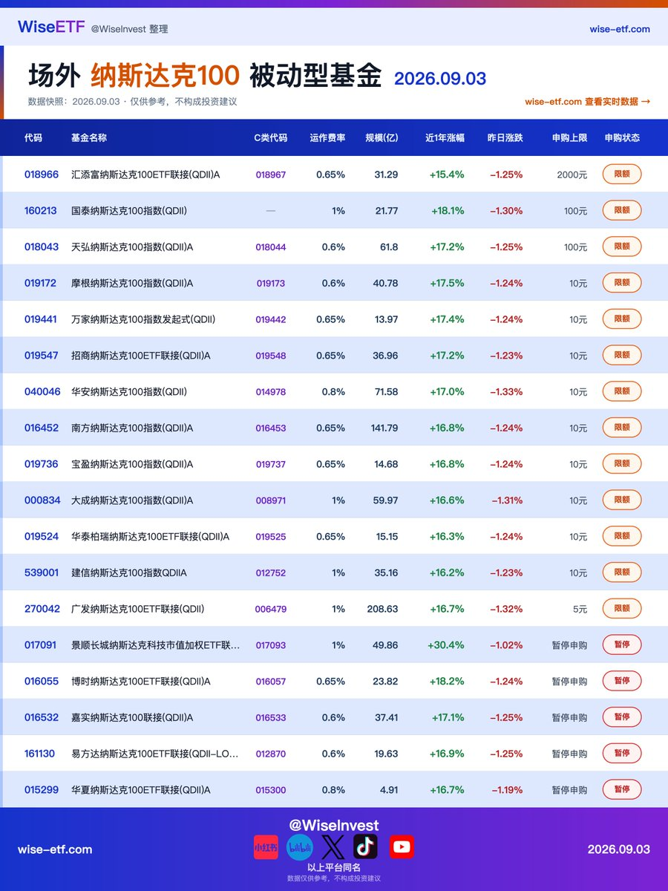
例如大家平时停留时间最长的 WiseHold 网站，记录各大名人，13F 持仓信息的网站：

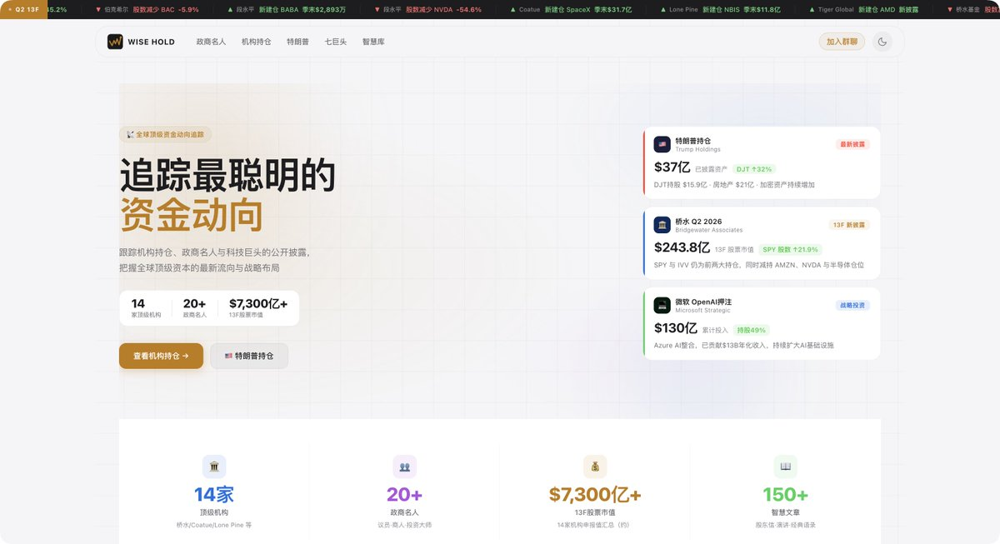
更多的关于我旗下其他的网站如何运转和玩转，大家可以看如下文章，详细记录了我旗下所有的网站产品！

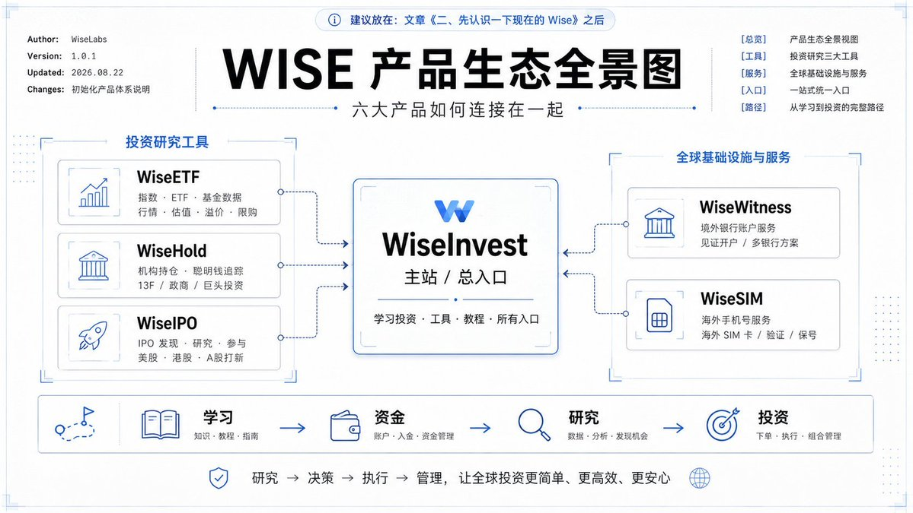

[查看旗下网站作品文章与详情](https://www.wise-invest.org/articles/web/EYO11DG3)

### 3、书籍/Skills作品
聊完了教程和对应的网站之后，我们目前一直都在排期的还有一个**书籍教程**，什么意思呢？
目前我们可以发现，关于体系化的内容，例如纳指如何投资，例如美股如何投资等内容，我们都有意向把他们变成一个一个可视化的书籍内容。

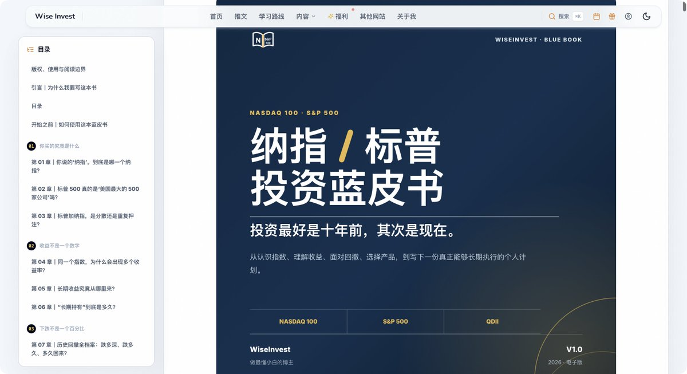

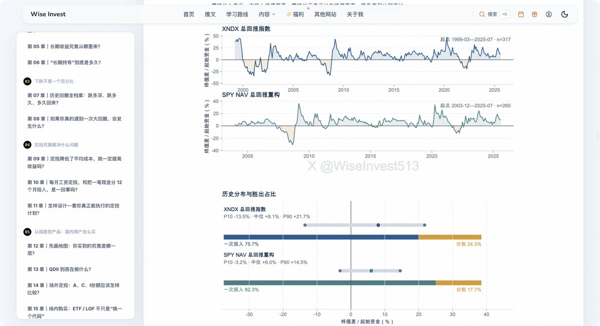
那这些内容只是一部分，我们未来还会继续去给大家创建更多的蓝皮书系列教程，例如
1️⃣、《美股财报阅读蓝皮书》
2️⃣、《AI / 半导体产业链蓝皮书》
3️⃣、《美股公司研究蓝皮书》
4️⃣、《熊市与回撤生存手册》
以谋求最大限度地帮助到更多的朋友，通过 PDF 书籍的形式去获取到更多的成长和收获。
那关于《纳指/标普投资蓝皮书》详细的内容，大家可以看这个教程了

[查看纳指/标普投资蓝皮书详情](https://www.wise-invest.org/book/nasdaq)

## 三、一起加入 VIP
以上就是我们聊完的，我从去年到今年给大家制作的各种产品。
我的思维很简单，那就是账户的粉丝并不能够代表你，真正能够代表你的是，你做出的产品！
但是大家现在也发现了，我们现在的很多产品以及各个内容都散布在不同的网站，也没有一个比较核心的部分来给大家进行更加精进的学习。
也有朋友说从最开始了解各个开户内容——无论是场内券商开户、美资券商开户，还是加密产品开户，开户完成之后，对于怎么操作、怎么投资，能够不能够带着我们一起做投资。
这个我相信也是很多朋友都在思考的问题，我已经成功完成了开户之后，我去哪里学习投资的体系呢？
那这个也是我们后续准备去做的事情——深化投资体系，用体系化的内容把我们的交易水平提高起来！
但是我们在什么地方把这些内容进行承接呢？所以，我就在我的网站开发了一个 VIP 功能，后续我们所有的福利和内容都会在网站中给大家进行呈现了……
且对于不同的网站，如果大家在日常生活中使用时，还需要用各种不同的身份信息进行注册，这样就会比较麻烦、因此，我开发了一个联动系统，请大家只需要在官网登录一个账号，你就可以联动进行登录使用，无需重复注册账号，即可享受 Wise 旗下的所有的网站啦！

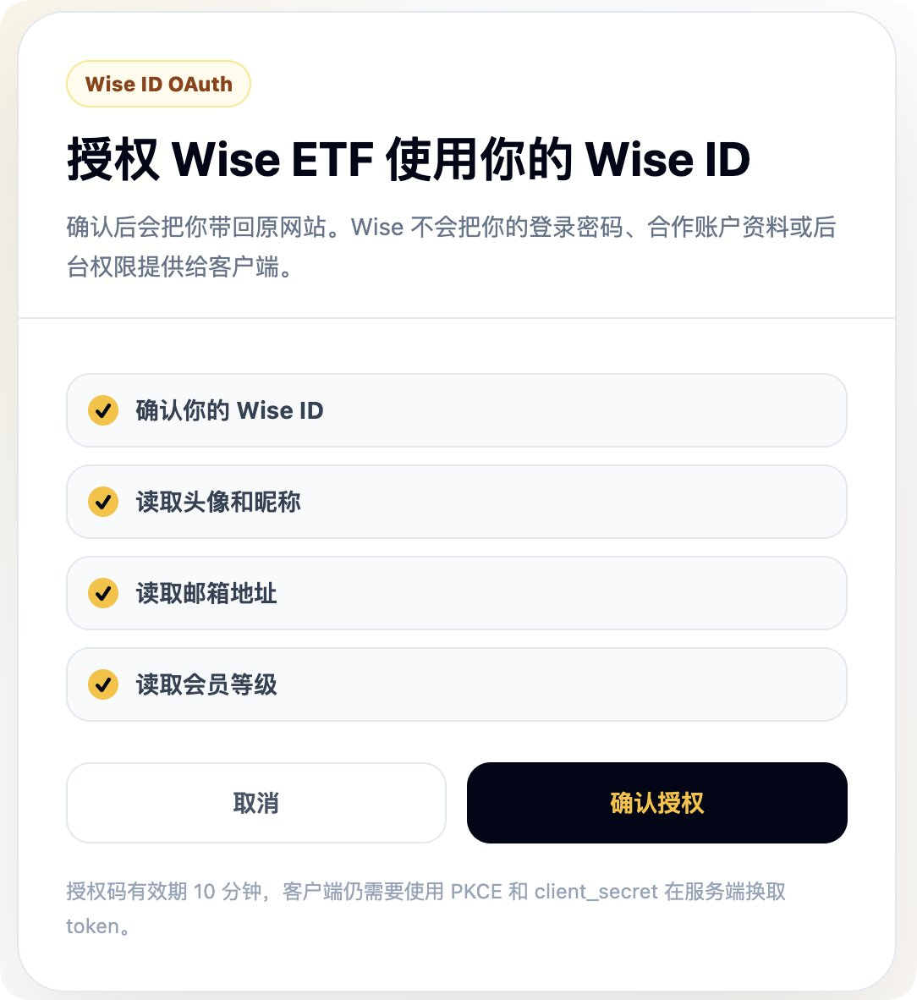
那讲到这里之后，你一定会非常感兴趣我们整个体系，以及如何加入我们整个 VIP体系，Wise 也给大家提供了两种不同的加入方式 
### 其一：绑定邀请

说实话，我们想要去筛选的，还是说在市场上正在进行交易的朋友，无论无论你是：
1. 关注场内 ETF、刚刚接入纳指投资的小白；
2. 正在摩拳擦掌准备进入美股市场的投资者；
3. 亦或是对加密非常感兴趣、正在逐渐了解加密的朋友。
我们都给予了非常多的入口，让大家来加入我们这个 VIP 体系。
链接如下：[点击加入 VIP，查看全部福利与入口](https://www.wise-invest.org/vip)。
如果你是刚刚开始接触定投的朋友，那场内的定投的回报收益率一定是高于场外的，所以我也给大家对接了购买 ETF 免五的券商，大家对接开户。
如果你是准备进入到美股市场的朋友，只关注传统券商，我们的教程里面也有比较完备的体系，从中转卡的开通，到券商的开通，无论是港资的美资的你都可以来对接开户。 
如果你是对于加密感兴趣的朋友们，可以使用我的邀请码来注册交易所，绑定在我名下（入金 100U 交易任意金额，可进入 VIP 群 + 领取 5U 现金奖励）

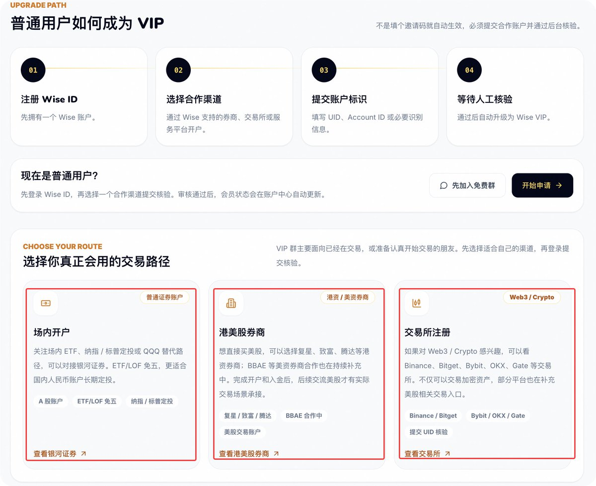
**这个门槛已经很低**，如果大家在过去，有使用过我任何邀请码的朋友，都会欢迎去提交，然后绑定哦。
那如果你的交易所已经注册过或者是绑定过，应该如何处理呢，我们也给大家写了一一个完整的方案，链接如下所示：

[查看交易所绑定方案](https://www.wise-invest.org/guide/exchange-referral)
如果你是币安用户，可以使用如下三种方式完成绑定：

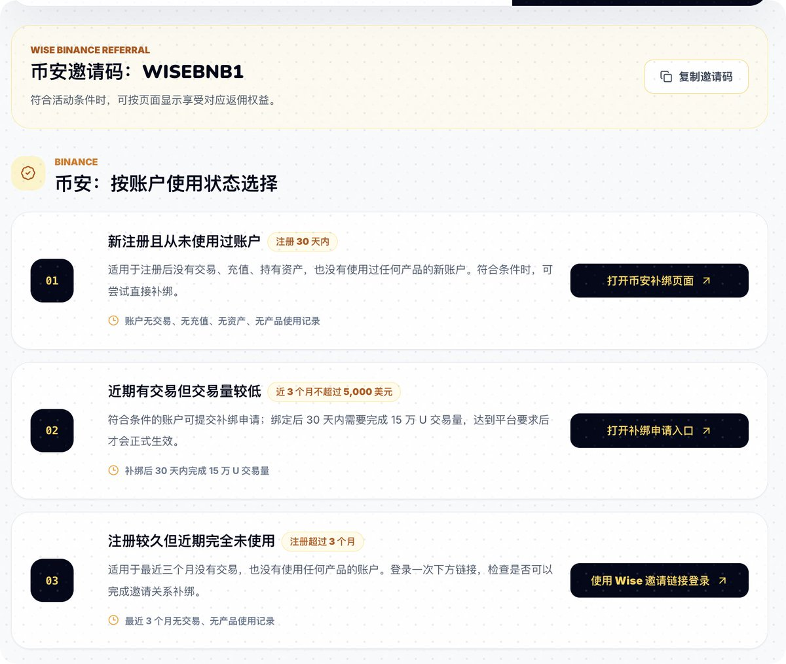
如果你是 Bitget 用户，可以直接注销，如果你是 OKX 用户，直接换个证件重新注册即可，更多的里面都有介绍……
### 其二：付费邀请
那如果说你以上的一些券商都开过户，亦或者是一些交易所你也都完成过开户，可使用另外一种方式，就是付费 300U 的方式， 直接跳过 VIP成为  SVIP 用户，终身有效。
PS：普通 VIP 用户升级成为 SVIP 用户，需要交易量达到一定要的量
成为我们 SVIP 用户之后，也可以享受更多的福利和更高的优惠，以及享受定制 AI 工具，线下见面等福利……

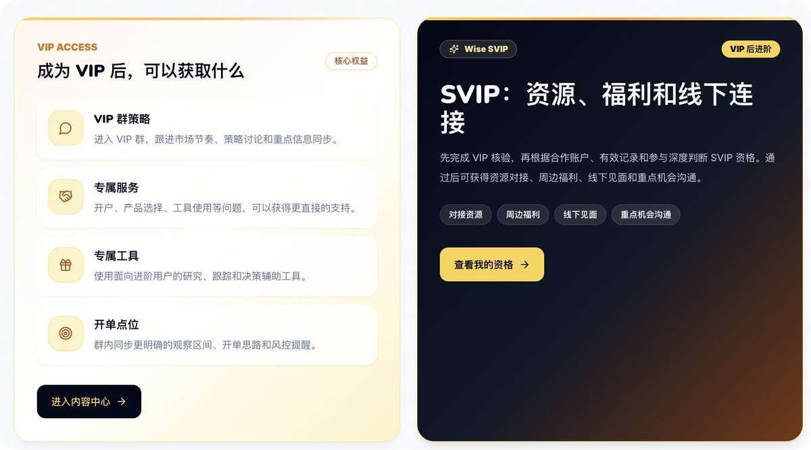
## 四、福利提供
我相信介绍了那么多 VIP 的内容之后，大家一定也非常感兴趣：普通用户和 VIP 用户之间的区别在什么地方？以及，当我成为 VIP 用户之后，可以享受哪些福利呢？
其实这次的 VIP 内容，我们还是要更加关注在交易这些板块上，就是在大家已经完成了基本的产品出海和基本的逻辑了解之后，我们如何用 VIP 的整个体系帮助大家进行更好的辅助交易！
### 其一：群聊
目前来说，我们已经建立起了自己的 VIP 群，我每天也都会在群里面发一些自己对于市场的看法和理解，就目前来说也已经给了一些朋友比较不错的点位和策略，正在帮助更多的朋友构建更加完备的投资体系。 

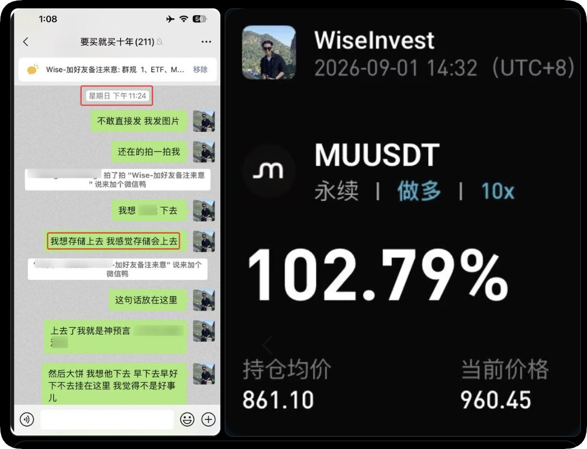
且我们目前正在推进，每个月会完成 1-2 次线上的腾讯会议直播，给大家带来更多我对于行情的理解和分析……

### 其二：网站
目前我们正在开发和美股相关的策略网站，以及和加密相关的网站。
举例子，对于目前 AI 的整个产业链来说，它有 AI 产业链、存储产业链、航天产业链、机器人产业链以及我们的核电产业链。
这些产业链之间的关联关系都是什么样子？它们上下游的影响是如何形成的？以及，我觉得最关键的点在于，当某一个公司准备发布财报时，我们就要提前去预演这个事情：
1. 如果财报数据不错，会对哪些公司造成比较好的影响；
2. 如果数据不好，可能会对市场造成什么样子的影响。
因为这些东西，才是真正有价值的内容，那这些信息，我们都会以 VIP 的形式推送给我们的 VIP 用户！

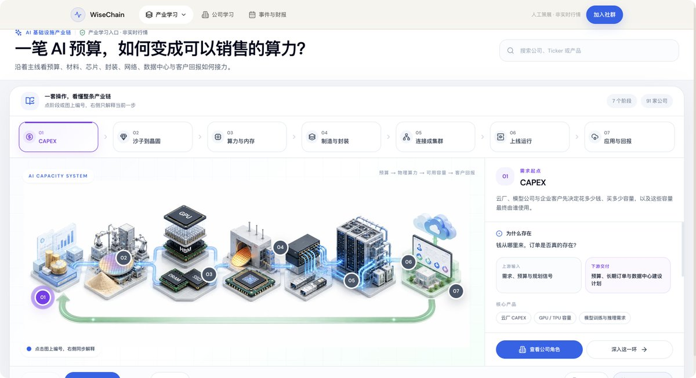
再例如，我们的加密相关网站。对于这个网站，我相信很多初步接触加密的朋友，总是会被各种指标弄得晕头转向。
我们做的网站非常简单，就是把更多的信息和指标以可视化的形式呈现在各位朋友面前。这样，大家就可以比较清晰地看到当前的位置处于高位还是低位。结合这些指标去做操作，也会在这个过程，我也会去和很多做合约的高手一起优化这个系统。
我相信整个开单的胜率也会有一个比较大的提升。

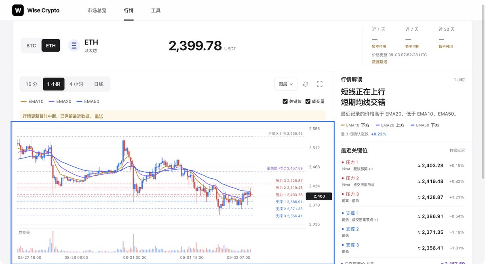
未来也会有更多策略以及定制化的内容，在我们的整个体系和网站中进行同步。当然，这些都只会针对我们的 VIP 用户。
正如我们前面聊到的一样，你只需要在我们的官网中成为 VIP，所有网站的 VIP 功能均可以进行正常的访问。
### 其三：定制
目前来说，AI 的发展一定会随着时代的更迭而越来越快。在这个过程中，每个人对于市场的需求也不尽相同。
我也给大家开发了非常多通用型网站，后续我也会尝试去给大家做更多**定制类型的功能**，辅助大家进行更好的投资与开单。
我们的 VIP 体系意思非常明确：大家在学习完基础内容之后，如果想要更加进阶地对整个市场有更加深刻的了解，那就欢迎来加入我们的 VIP。
## 五、加入链接
以上就是我们对于整个 VIP 体系如何去加入以及它的一些介绍啦，我也在这个过程中不断地进行更新和迭代。
我也相信，这整套体系真正运行起来的那一刻，会帮助到成百上千甚至是更多的朋友，在这个市场中获取到真正超出平均回报的收益。

 如何加入呢？非常简单，大家点击此链接：[立即加入 VIP](https://www.wise-invest.org/vip)，即可看到加入方式。

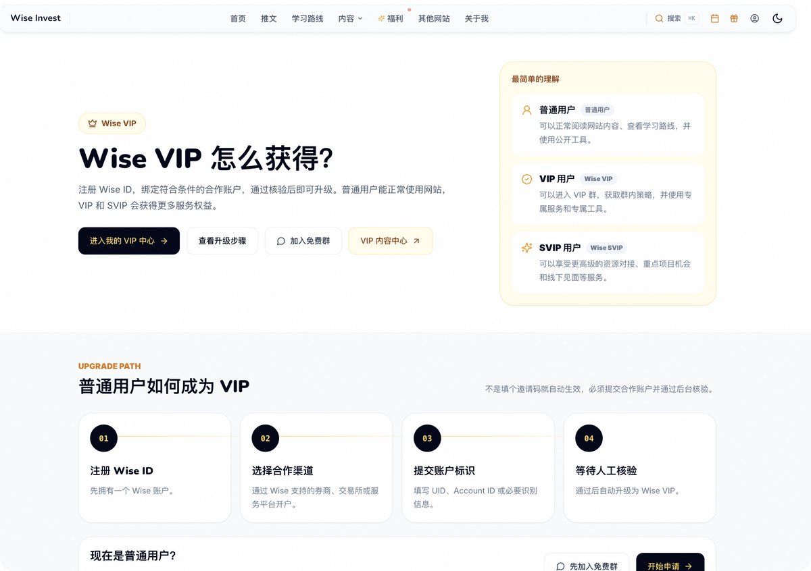
然后注册账号之后，选择对应的平台提交申请成为 VIP，审核通过即可成为 VIP

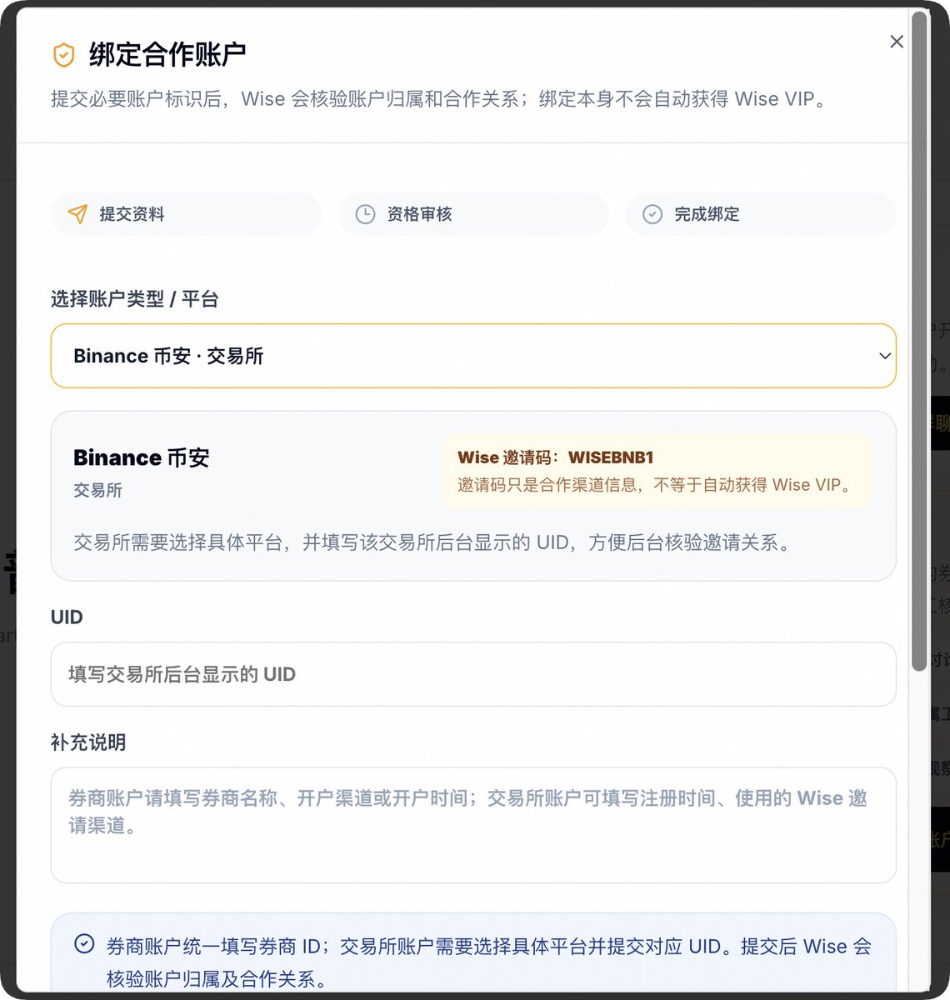
VIP 后台界面：

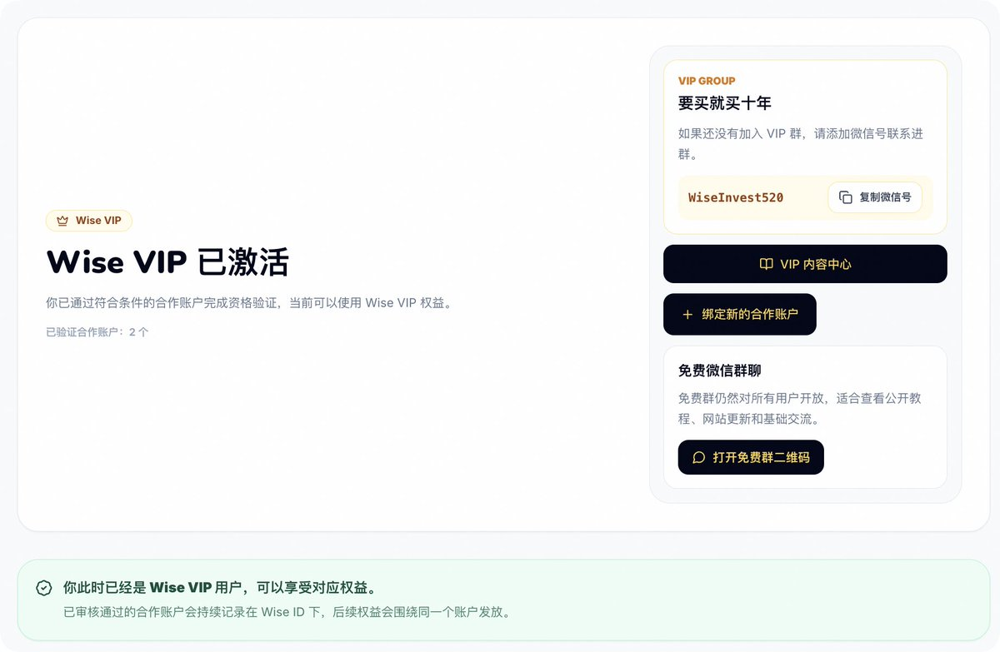

## 六、写在最后
从去年 10月份开始， 到现在一年多的时间，我开始在全网全平台进行内容更新。
最开始的内容都倾向于出海，目的非常明确，就是帮助大家真正理解出海这条链路。
从最开始的纳指投资，让大家了解纳指产品，理解美股市场，再到分享港资和美资券商让大家开户，去亲身经历这些市场，再到最近分享美股和加密等产品！
我觉得整个链路非常清晰——那就是一步一步带着大家从 0 到 1 走完：从不了解这个市场，到了解这个市场，理解行情，理解宏观，理解大趋势……
再到让朋友真正了解投资策略，去开一个自己能睡得着觉的单子，这个也是我们一直都在做的事情。 
如果你在过去使用过我的任何邀请码，开过任何账户，都欢迎注册此账号进行 VIP 审核的提交。
现在来说，无论美股行情即将走出新的趋势，还是加密漫长的熊市已经过去、即将迎来狂暴的牛市。
我之前都和大家讲过多次：2026 年下半年，一定会是所有用心的朋友都能得到丰收的阶段。
如果你是在市场上单打独斗的朋友，或者在过去还没有开过任何加密账户，已经摩拳擦掌了很久，但是一直都没有找到合适的大家庭进行学习，欢迎大家使用如上的成为 VIP 的方式来注册账号，成为我们的 Wise VIP，我来帮助大家做更好的投资，帮助大家获取到更高的胜率。
我在 Wise VIP 大家庭里面等待大家来一起共建了！
