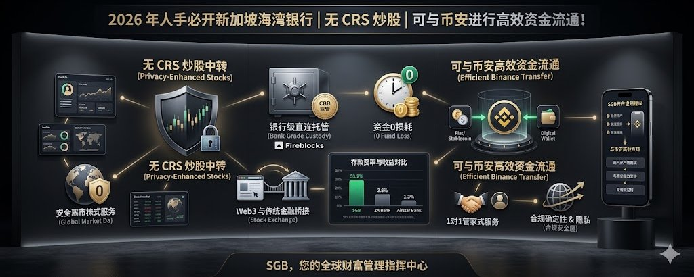

## 一、写在前面

哈喽，大家好！这里是 **WiseInvest**，我是你们的老朋友 Wise！

在前面一段时间我们重点分享了很多关于香港的一些银行卡。但是这些银行卡都有一个比较大的弊端，那就是都需要大家**前往香港**才可以办理！

在这个过程中大家也一直在聊能够不能够推荐一些不会参与到 **CRS**，也比较安全的银行，我说其实也是有的，那就是今天我们要聊到的**新加坡海湾银行 SGB**！

诚然在全球化资产配置和 Web3 时代，很多中高净值朋友和数字经济参与者都面临共同痛点：传统银行跨境入金慢、手续费高、风控频繁拦截；纯加密平台托管风险大、出金合规难；资金在法币与 crypto 之间转换碎片化，导致机会流失、隐私担忧和效率低下。

那我们今天重点推荐一家真正桥接 TradFi 与 Crypto 的新兴力量——**Singapore Gulf Bank（SGB，新加坡海湾银行）**。

它不是普通的零售银行，而是总部位于巴林、由新加坡 Whampoa Group 发起并获得巴林主权财富基金 Mumtalakat 支持的**全数字批发银行**，受**巴林中央银行（CBB）**完全许可监管。

SGB 的核心使命是统一传统金融与数字资产，打造一个 **24/7、无国界、高度合规**的全球财富平台。特别适合有加密收益配置需求、跨境支付频繁、追求银行级安全的中高净值个人、家族办公室和机构用户。

通过 SGB，你可以实现：

- 资金 **0 损耗**实时划转
- **银行直连托管**
- 数字资产无缝转传统股权
- 专业隐私保护和 **1 对 1 中文管家服务**

---

## 二、SGB 银行介绍

**Singapore Gulf Bank（SGB）**成立于 2024 年，由新加坡 Whampoa Group（黄埔集团）发起，2024 年底正式推出企业银行服务，2025-2026 年快速迭代个人及数字资产功能。目前已处理数十亿美元交易，是 MENA 地区首家专注于连接亚洲与中东、fiat 与 crypto 的持牌数字银行。

它不是传统意义上的"又一家银行"，而是为数字经济量身打造的合规桥接平台，解决传统金融与 Web3 割裂的痛点，让用户在单一平台上高效管理 fiat、crypto、跨境支付和传统投资，实现效率、安全与隐私的平衡。

### 背景与强大背书

发起方：**新加坡 Whampoa Group（黄埔集团）** 是由新加坡极具影响力的李氏家族办公室发起的投资集团，深耕亚洲投资，与新加坡主流金融生态保持紧密联系。其共同创办人包括四位核心人物：

- **李润瑛（Amy Lee）**：新加坡国父李光耀的侄女，曾任新加坡著名律师事务所 Lee & Lee 高级合伙人，代表极高的法务合规标准。
- **李汉士（Lee Han Shih）**：华侨银行（OCBC）创始人李光前家族成员，投资集团 Potato Group 创办人，代表新加坡传统银行界的正统血脉。
- **韩浲（Justin Han）**：负责管理李氏家族在中国投资和业务。
- **陈长运（Shawn Chan）**：拥有超过 10 年法律执业经验。

集团 COO Jireh Chua 此前担任新加坡经济发展局（EDB）中国事务主管，曾在政府间平台代表新加坡推动双边合作与发展，为 SGB 的战略布局和跨境业务提供重要政府资源支持。

**李氏家族双重背书**（新加坡建国核心家族关联）：
一方面连接**李光前家族**（OCBC 华侨银行血脉），代表新加坡传统金融的深厚根基；另一方面直接关联**李光耀家族**（新加坡国父血脉），带来极高的信誉与合规背书。

这使得 SGB 在新加坡金融圈拥有独特的"新加坡华侨银行家族 + 李光耀家族关联银行"双重正统性，在亚洲乃至全球财富管理领域具备稀缺的信任优势。

**战略支持**：巴林主权财富基金 Mumtalakat（巴林国王控股公司）直接投资，提供强大主权背书。

**监管资质**：受**巴林中央银行（CBB）**完全许可，这是中东顶级金融监管之一，以严格合规和创新友好著称。SGB 完全符合国际最高标准的 KYC、AML 和托管要求。

**技术与生态伙伴**：
- 与 **Fireblocks** 合作，提供机构级数字资产托管
- 加入 **BNY（纽约梅隆银行）** correspondent banking network，大幅提升 USD 清算能力
- 自有 **SGB Net** 实时支付网络，支持 fiat + stablecoin 混合结算

### 核心产品与服务

- **多币种账户与固定存款**：支持 USD、EUR 等主要币种，固定存款年化利率具备竞争力
- **SGB Net 实时结算网络**：24/7 多币种清算，已全面升级支持稳定币，月处理量数亿美元，效率远超传统 SWIFT
- **稳定币服务（2026 年 4 月推出）**：机构及高净值客户可直接 mint（铸造）与 redeem（兑换）USDC、USDT 等主流稳定币，支持 Solana、Ethereum、Arbitrum 等链，实现 fiat 与 stablecoin 即时无缝转换，无需第三方交易所
- **托管与投资**：银行级直连托管 + 全球股票/资产配置能力
- **跨境支付与资金管理**：高效 USD 清算 + 虚拟账户自动化 treasury 管理
- **开户体验**：个人与企业双线支持，远程数字开户，全球 Anywhere 操作

> 一句话总结：SGB 是由新加坡李光耀与李光前家族关联的黄埔集团支持、巴林主权基金投资的合规数字桥接银行，在单一平台上打通 fiat、crypto、亚洲-中东跨境支付与传统投资，兼具顶级背书、安全合规与前沿效率。

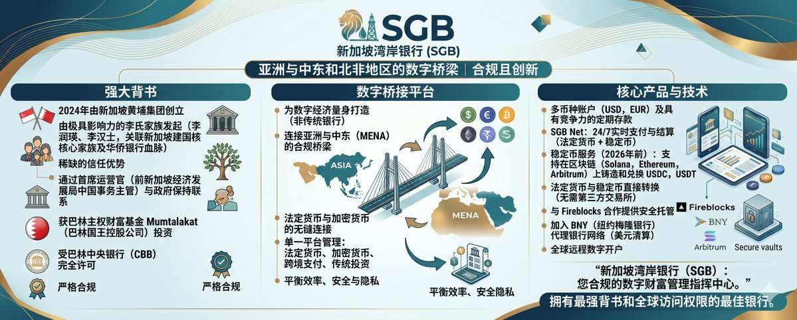

---

## 三、SGB 六大核心优势

### 维度一：告别「入金难」，实现「资金 0 损耗」

以前跨境汇款被拦截、银行到券商/交易所转账动辄几天、扣除高额手续费，是很多炒美股港股或管理加密仓位朋友的最大痛点。

在 SGB，这里实现了**"余额即购买力"**——你的银行账户余额可以瞬间划转用于交易、稳定币操作或支付，无需等待清算、无中间损耗。无论是 Web3 收益快速转 fiat 配置英伟达股票，还是大额 USDT 调度，都做到 **0 延迟、0 摩擦、0 隐形成本**。

### 维度二：银行级托管，拒绝「小券商风险」

很多互联网券商或加密平台只是"交易壳子"，资产托管在第三方，一旦平台出问题，客户资金就面临巨大风险。

SGB 提供**银行级直连托管（Direct-Bank Custody）**。作为 CBB 持牌银行，它与 Fireblocks 等顶级机构深度合作，你的每一笔 fiat 和数字资产都直接由银行体系托管，受严格监管框架保护。安全性与传统大型私行在一个量级，远超普通交易平台。

### 维度三：Web3 资金的「合规终点站」

Web3 玩家最头疼的就是赚了钱以后"出金难"、被传统银行风控、资金来源解释不清，无法顺利配置传统资产。

SGB 打破数字资产与全球股权的隔阂。你可以在一个账户内将**加密收益**（通过稳定币 mint/redeem）无缝转化为可口可乐、英伟达、港股美股等全球核心资产，支持 **193 个国家/地区**的金融往来。

### 维度四：顶级隐私保护与合规确定性

SGB 在巴林严格监管框架 + 新加坡背景法律支持下，提供**专业级隐私与合规安全屋（Professional-grade Privacy & Safe Harbor）**。对于隐私敏感和跨境配置的用户，这里是一个可靠的"安全屋"，让财富增长的同时，也被专业保护。

### 维度五：1 对 1「管家式」中文服务

SGB 特别提供 **1 对 1 专属中文客户经理（1-on-1 Dedicated Stewardship）**。从开户合规指引、大额资金调度、稳定币操作到日常 treasury 优化，都有专人全程跟进。

### 维度六：无 CRS 信息交换（增强隐私维度）

虽然名字叫做"新加坡海湾银行"，但其受监管机构是**巴林中央银行（CBB）**，所以**不会有信息交换的风险，也不会有相对应的 CRS 风险**。大家去进行券商交易也自然就不会有相关的风险！

这六大优势叠加，让 SGB 成为目前加密友好 + 传统安全 + 服务贴心的稀缺选择，尤其适合已经在香港、新加坡、全球有资金布局的朋友，用来做稳定币 treasury、中转支付和多元化资产保护！

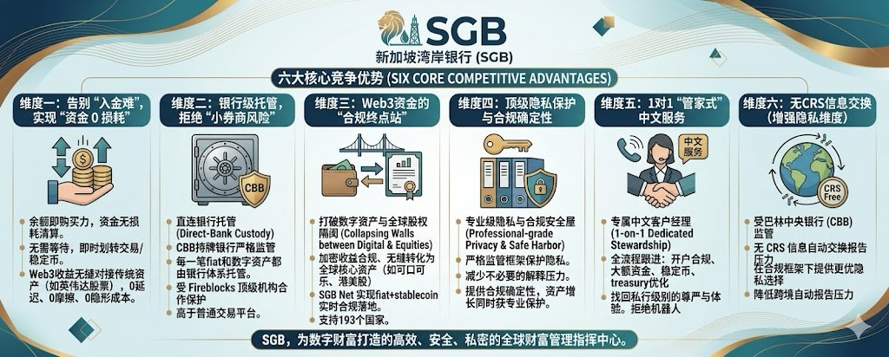

---

## 四、SGB 开户流程

ok，聊完了基本的情况之后，我们来聊一下具体的开户！

虽然是海外银行，但是 SGB 的开户流程尤为简单，**不需要地址证明**，只需要正常提供**护照证件 + 身份证证件**即可完成开户流程。

**1、** 首先在应用商店检索"**SGB**"（新加坡海湾银行），点击**开始注册**即可看到提供的功能，然后输入邀请码 **"3p1o5t"** 点击继续即可进行下一步。

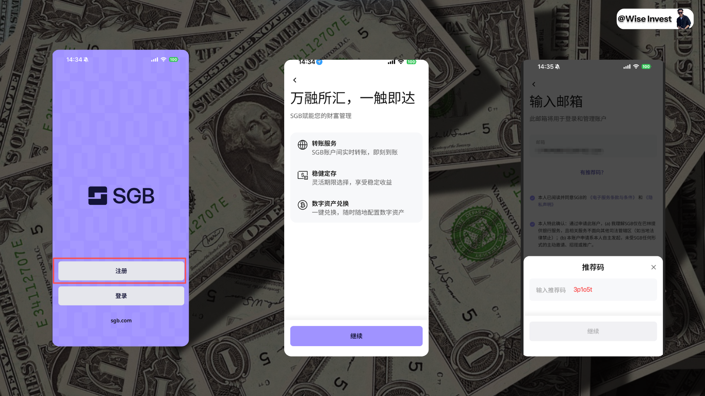

**2、** 接着确定信息和创建账号对应的一个**六位数登录验证码**。

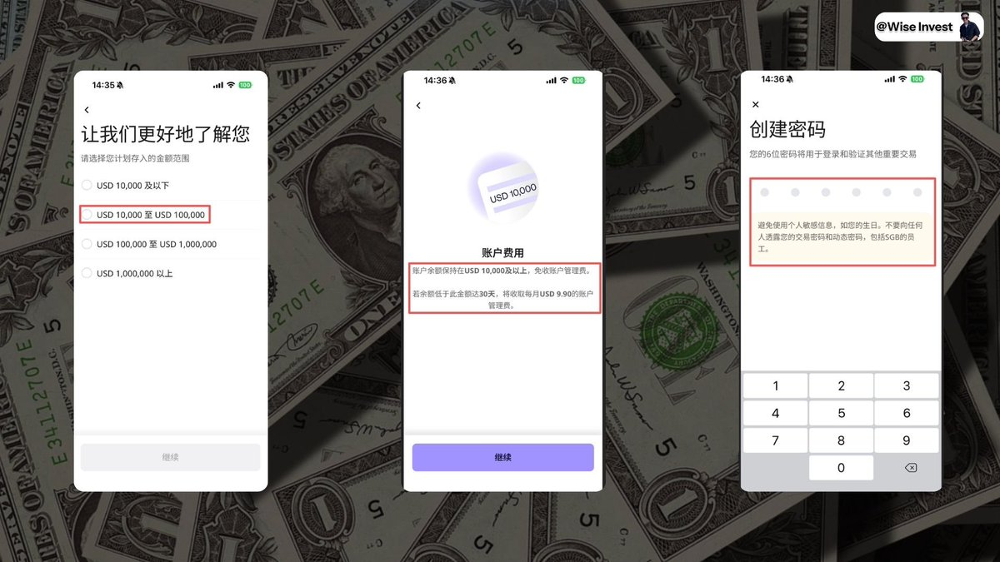

**3、** 接着输入手机号，确定居住的国家是**中国**，并且确保不是美国居民，也并非在美国纳税/出生，确定完毕之后，即可看到需要提供**护照 + 身份证**，即可完成基础的开户要求。

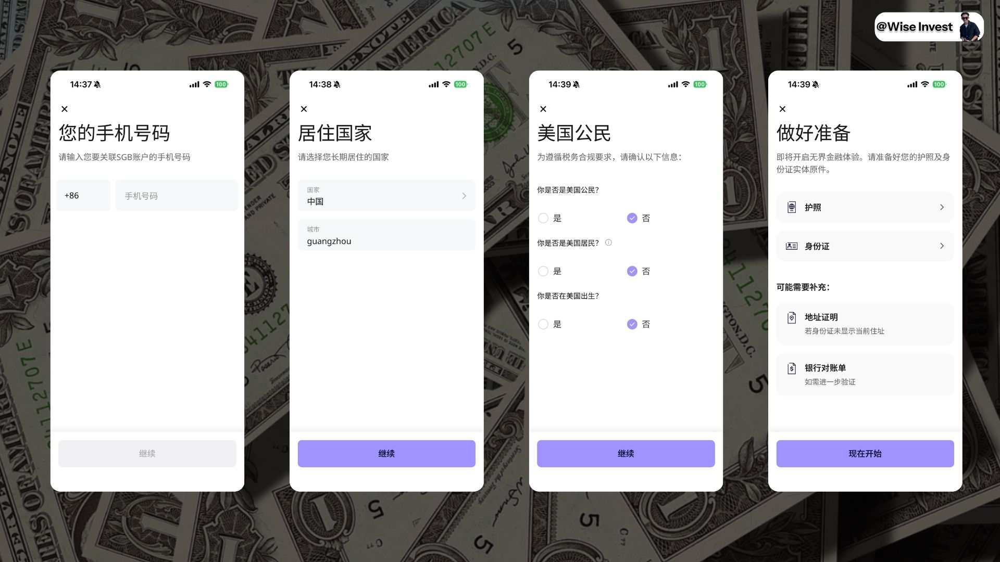

**4、** 然后就是上传护照，这里只需要进行**拍照实时识别**，识别完毕之后记得查阅识别出来的信息是否正确，确定数据没有问题就继续开始**身份证上传和认证**。

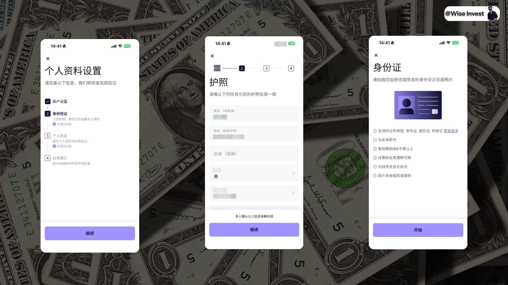

**5、** 填写**职业信息**，这里就是按需填写，然后确保自己并非公众人物，收入来源可以写薪资/投资等，最后确保开户的用途大概是**储蓄/投资**，完善这些基础的信息。

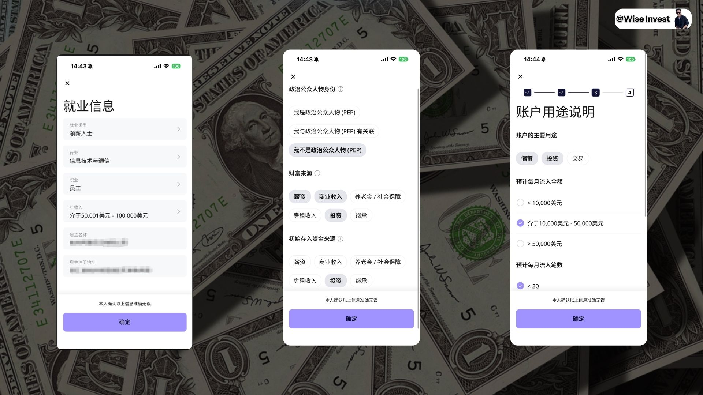

**6、** 确定填写一些基础的信息，例如**交易次数、每月流出的金额**等，最后再确定**税务信息和账户信息**，没有问题之后即可进行下一步。

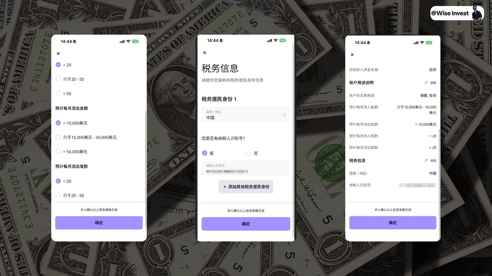

**7、** 确定完毕之后即可**提交申请**，而后就是等待审核，审核通过之后就会看到开户成功的界面。

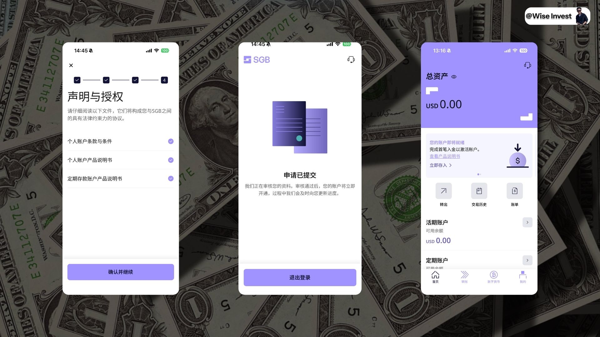

以上就是完整的注册流程，其实从整个注册流程来看整体上不算困难，等同于一个"虚拟银行"的注册流程和简约程度。

---

## 五、存款费率

那既然是银行，我们自然就会关注存款费率。我记得我在之前聊到过，天星（象象）银行的存款费率在众多银行中可以算是友好的，但是对比到 SGB 之后可以发现其费率才是真正的利民。

**三个月/六个月/一年的存款费率都在 3% 以上**，要远远大于香港的传统银行！

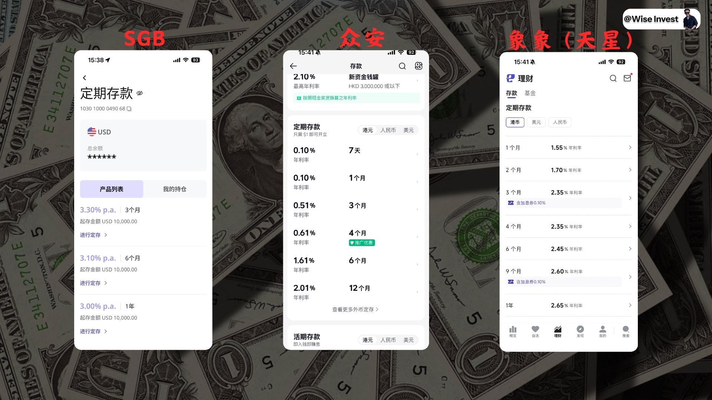 

而且还有一个比较关键的点就在于，对于香港的多家银行，其都会有 **CRS 信息交换**，所有的信息都是不透明的。对于 SGB 来说，其安全性就好了很多，你完全可以把每年的 **5 万美元的外汇**给汇款到 SGB 中，然后资金也在 SGB 中进行流转，即可**完全规避 CRS 的问题**！

---

## 六、币安转账

其实 SGB 还有一个非常好的地方，那就是**加密友好**，这也是我在这里进行介绍的一个主要的原因。前面我们也聊到过，这里我们就拿实际的情况演示**币安如何进行出金**。

**1、** 想要开启丝滑出金？确保完成以下三步：

- ✅ **账户准备**：注册并开通 SGB（新加坡海湾银行）账户
- ✅ **账户绑定**：只需在 SGB App 中选择【数字货币】发起关联请求，系统会引导您注册**币安巴林账户**。请准备一个未注册过的新邮箱进行操作，注册成功后，您的两个账户将自动完成绑定
- ✅ **白名单申请**：发送申请邮件至 **clientservices@sgb.com** 即可完成（提供您的法律姓名、SGB 注册邮箱、币安巴林 UID）

**2、** 在**币安全球**页面将稳定币转至币安巴林账户。

选择【资产】→【提现】，通过**"转账给币安用户"**功能，将稳定币（如 USDT）划转至您的巴林币安 ID。填入您的巴林币安 ID 即可实现**站内秒级划转，零手续费**。

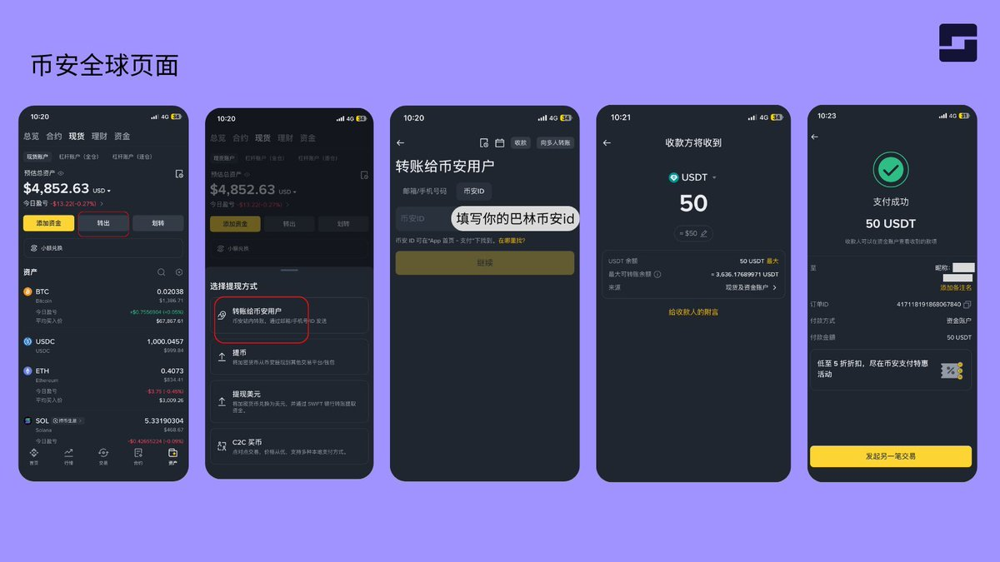

**3、** 切换至**巴林币安（Binance Bahrain）**账号。

✅ 点击左上角头像 → 切换账户 → 选择标记有 **Binance BH** 的选项。

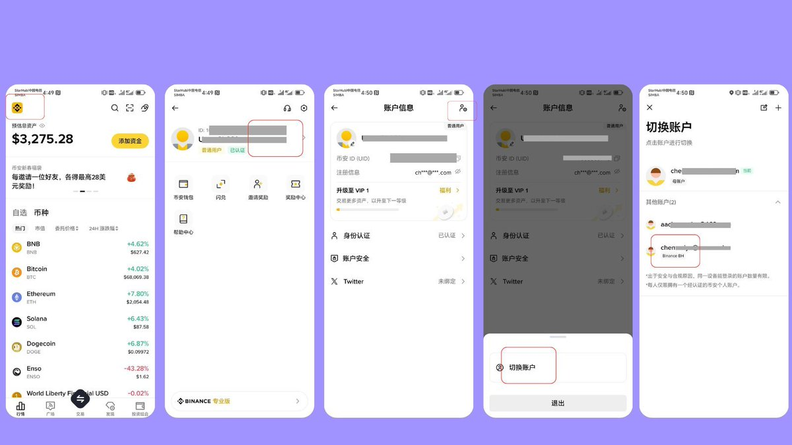

**4、** 在币安巴林页面将系统语言切换为繁体中文后，点击【**出金至法币**】将稳定币兑换成美元。

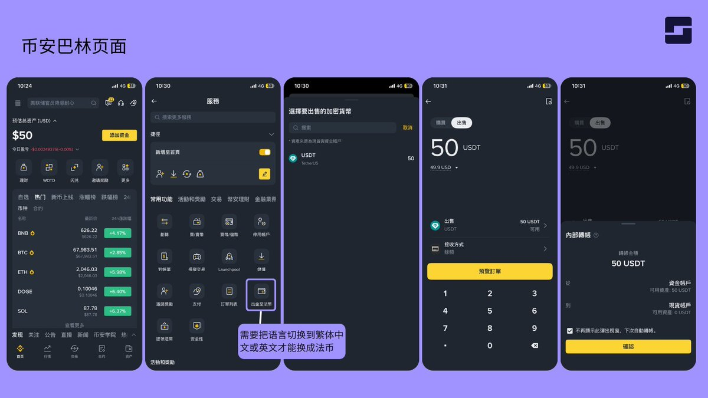

**5、** 兑换成功后，发起**提现至 SGB 银行账户**。

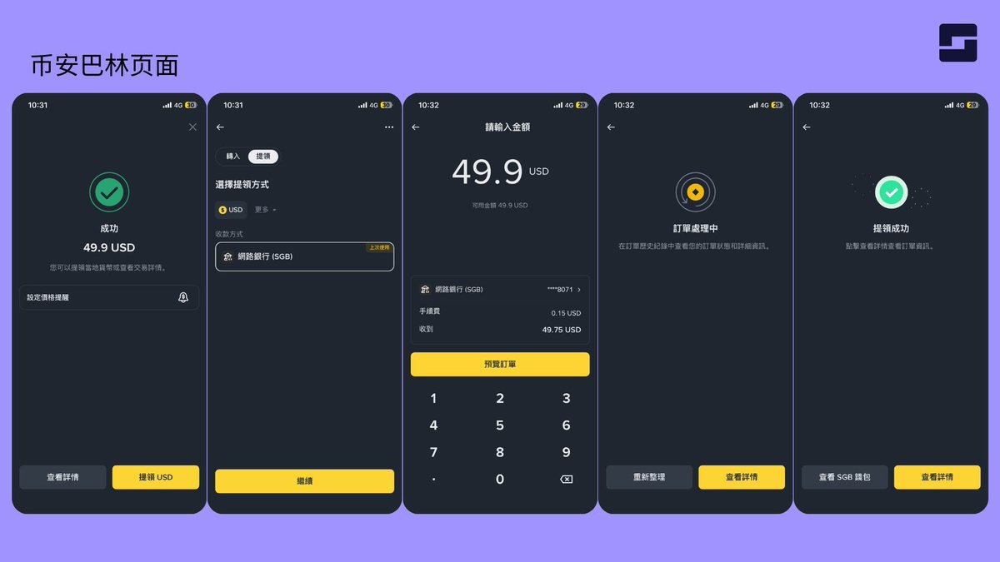

**6、** 返回 SGB 查收资金，**即刻到账**。

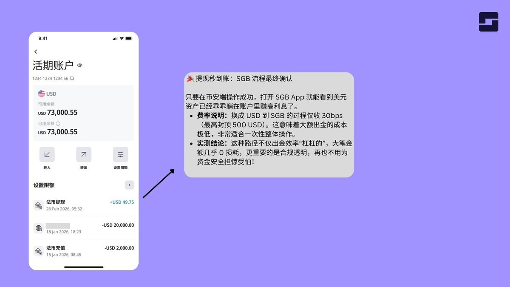

---

## 七、写在后面

SGB 不是又一家"普通银行"，而是数字时代真正的**财富桥接器**。

通过 0 损耗资金流动、银行级安全托管、Web3 合规终点站、顶级隐私保护、专属中文服务以及信息交换优势，它系统性地解决了传统通道的诸多痛点。如果你是中高净值投资者、Web3 活跃玩家，强烈建议尽快体验。

其实 SGB 也可以进行**港美股交易**，而且最主要的好处就在于其并不会被 CRS，但是这部分内容我们就等到下期再来给大家进行分享了。

所以如果大家看到了本期教程，可以准备好自己的**护照 + 身份证**来进行注册和开户了！等到后面无论是国内的资金流转，还是 Web3 的出金，都可以做到高效地出入金，而且不用担心 CRS 的风险了。

大家先注册好具体的账户，等到我们下期再来详细介绍港美股交易的内容，我们就下期再见！

| 关键点 | 说明 |
|--------|------|
| **开户要求** | 护照 + 身份证，无需地址证明，全程远程 |
| **邀请码** | 3p1o5t |
| **存款利率** | 三个月/六个月/一年均在 3% 以上 |
| **CRS 风险** | 无，受巴林 CBB 监管，不参与 CRS |
| **加密友好** | 支持稳定币 mint/redeem，直连币安巴林出金 |
| **客服** | 1 对 1 中文专属客户经理 |

这里是 **WiseInvest**！专注于美股/加密货币投资，坚持投资改变命运，力求通过投资来打造自己财富积累的第三曲线，实现 **10 年内财富自由**！

如果你对投资、理财、赚钱、Web3 感兴趣，欢迎关注我，我也会在后面持续推出更多优质且精彩的内容！

最后的最后，就是如果大家觉得今天的内容对你有帮助，不要忘记给我**点赞、收藏和转发**哦，你的支持就是我持续更新的最大动力。感谢大家的关注！
