## 众安银行开户流程

**1、** 打开 App Store 输入"**ZA Bank**"下载众安银行。

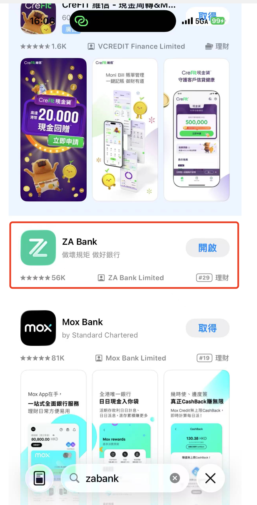

**2、** 点击**立即开户**，勾选自己的证件是**居民身份证**，然后看一眼要求，比其他的银行多了一个要求你填写**内地储蓄银行卡卡号**的要求。

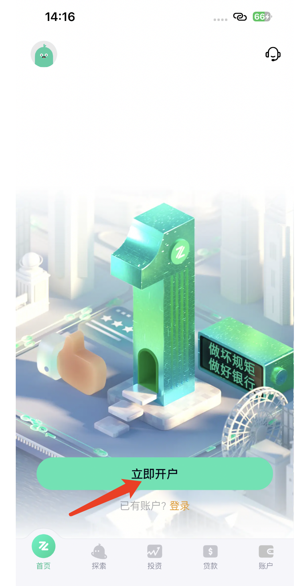 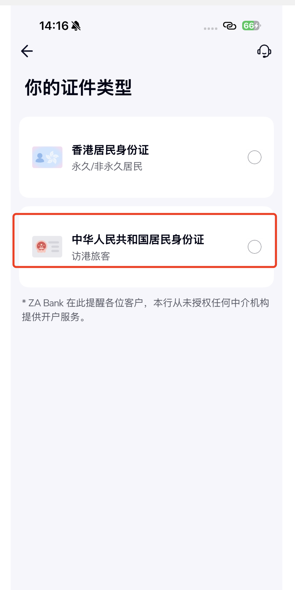 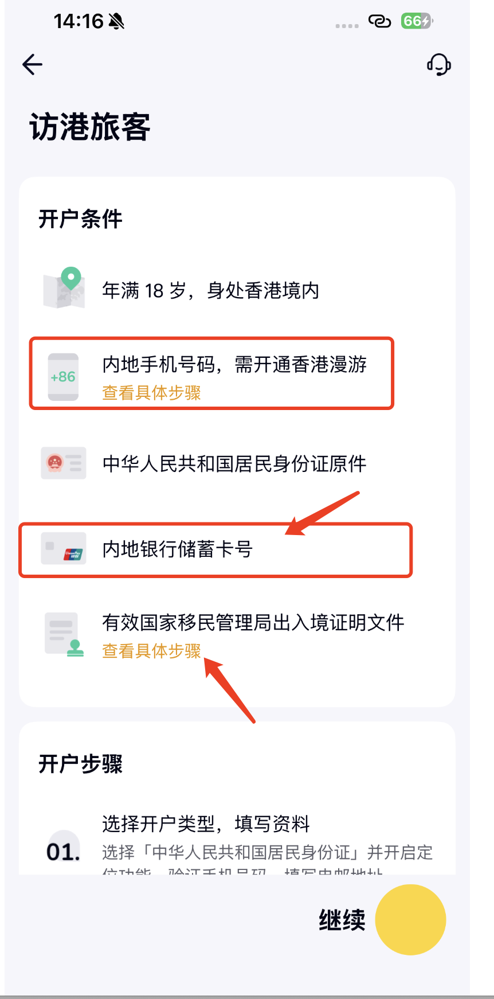

**3、** 可以看到众安银行的优势展示，这个设计要比另外两家好，会给你说自己的优势。

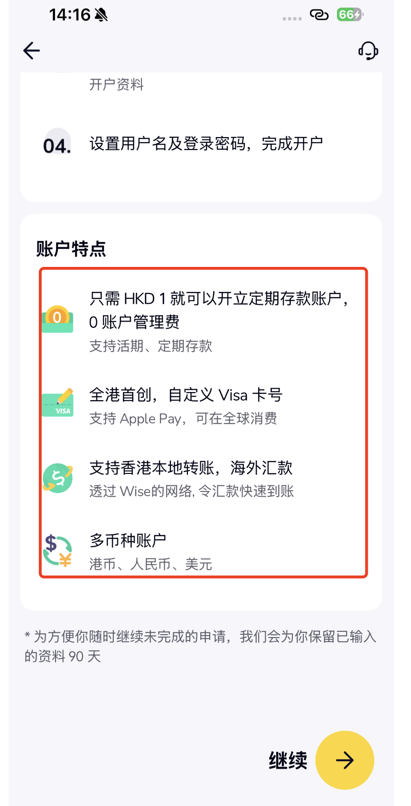

**4、** 填写自己的**手机号和邮箱**，然后进行**身份证验证**，最后再确定一下。

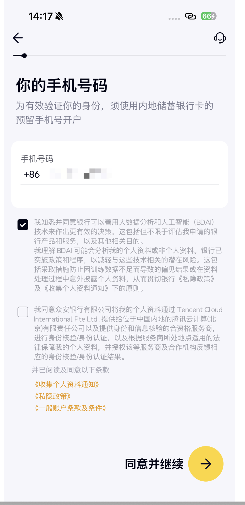  

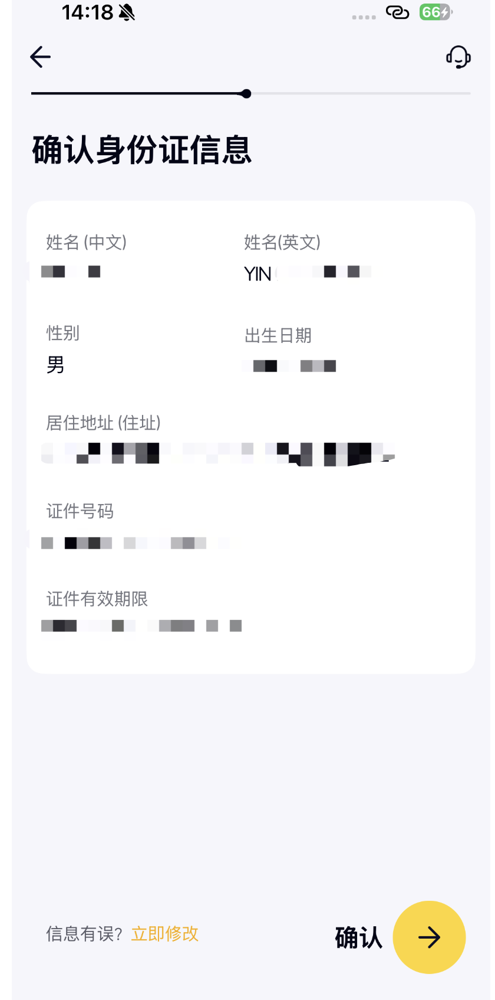

**5、** 同样是**英文名字**要格外注意，每个银行都会侧重再提醒一下。

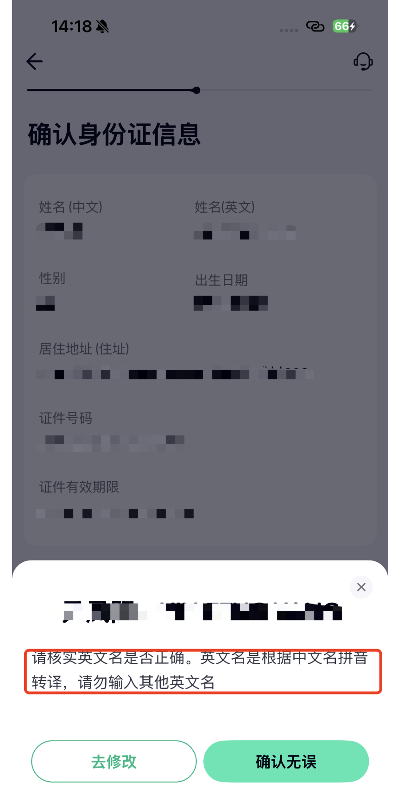

**6、** 填写自己的**纳税信息**和自己的**职业信息**。

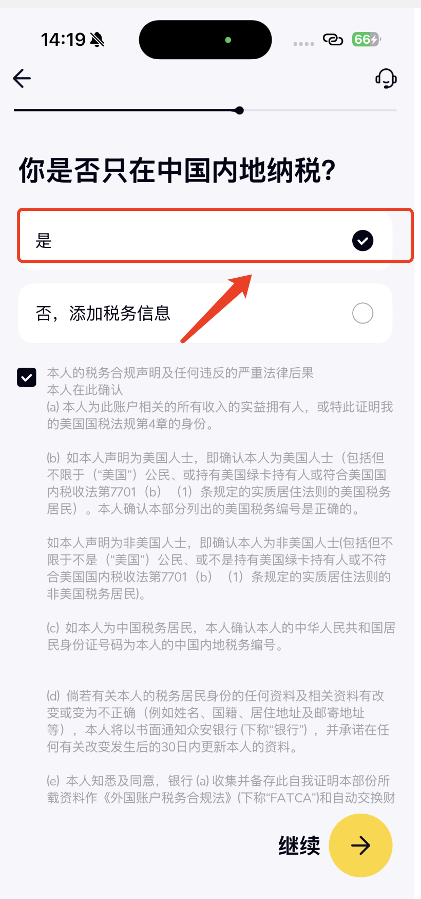 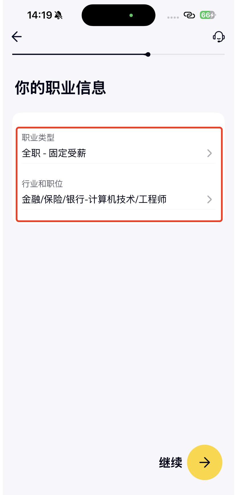

**7、** 最后勾选自己开户的目的**储蓄 / 日常开支**即可，最后确定一下自己的开户信息。

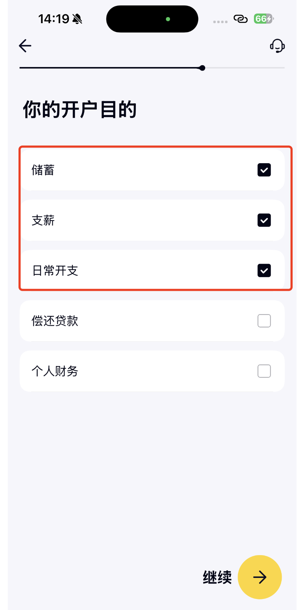

**8、** 设置**密码**，然后进行**个人银行卡验证**，最后按照我们前面一直讲到的提交自己的**出入境证明**即可。

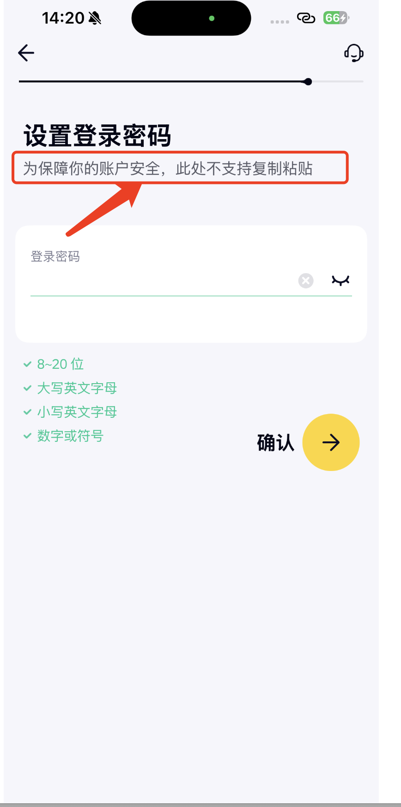 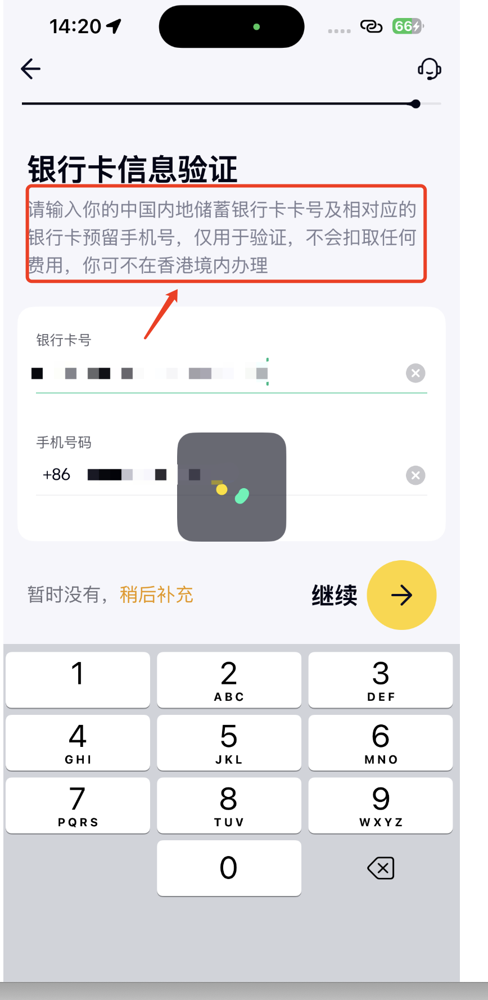 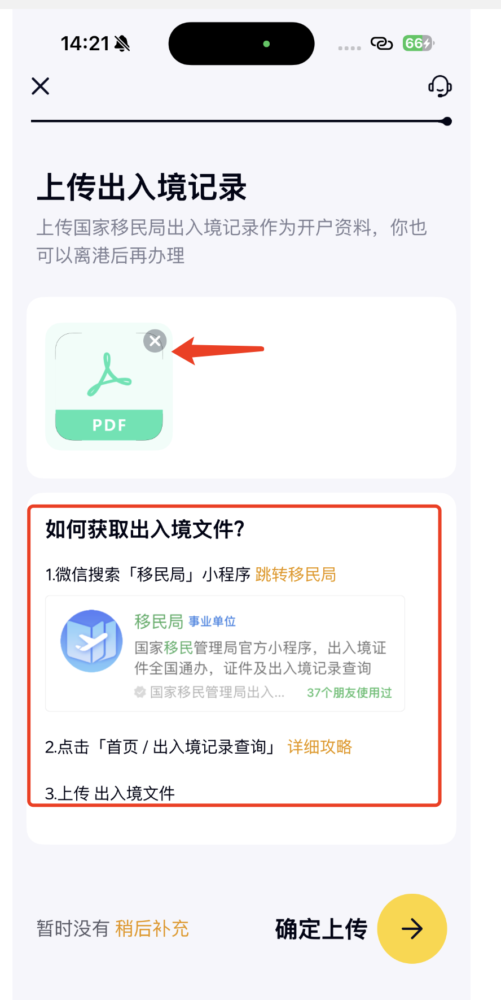

**9、** 后续就是开立自己的**投资账户**，点击继续开立投资账户。

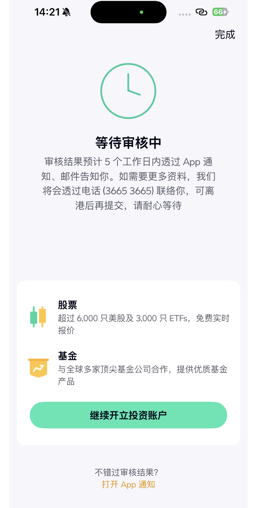

**10、** 把信息顺着填写完毕即可。

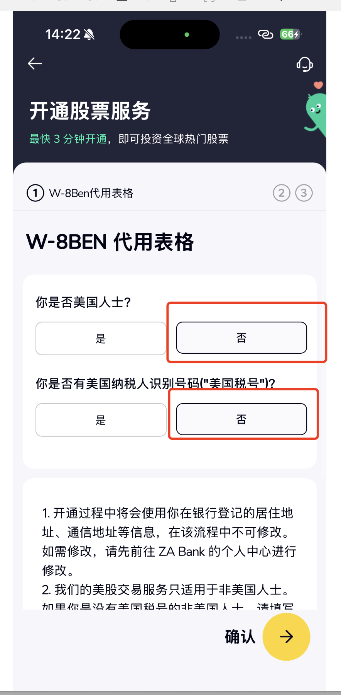 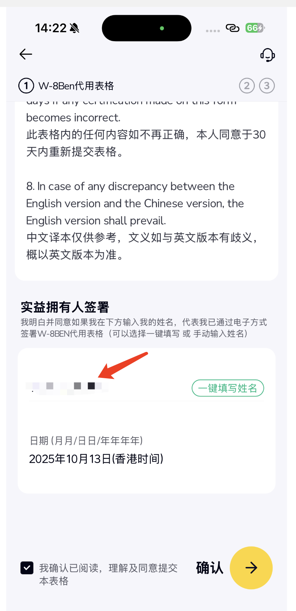 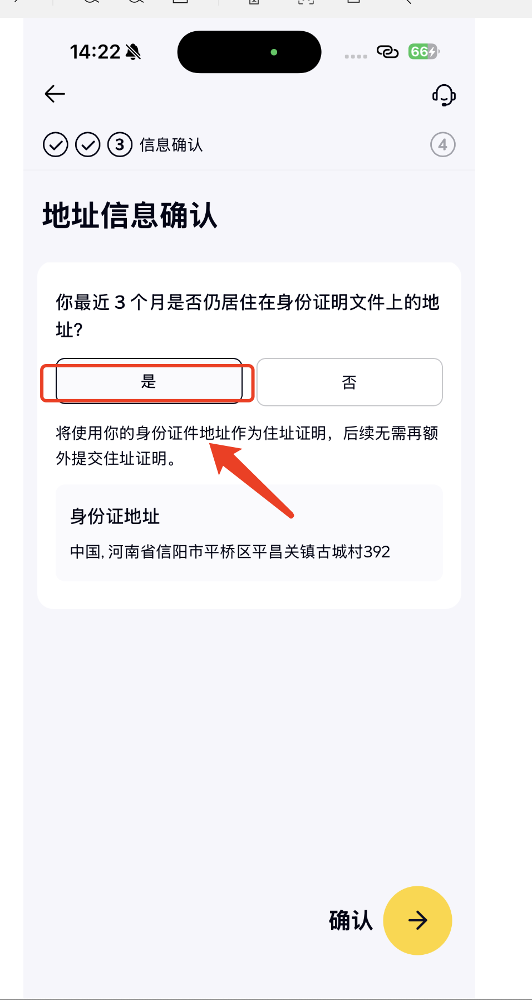 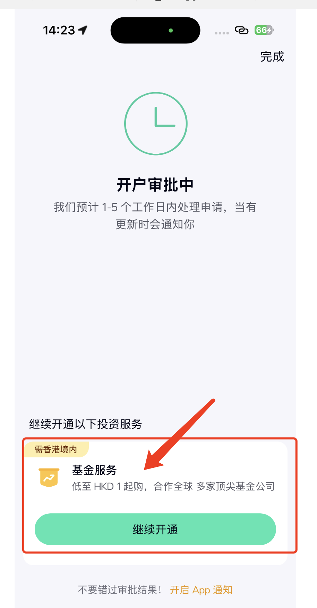

**11、** 在后续的**基金服务**同理，大家继续往后走即可。

**12、** 完成之后记得抽空登录上去，看看有没有需要什么东西需要补充。
