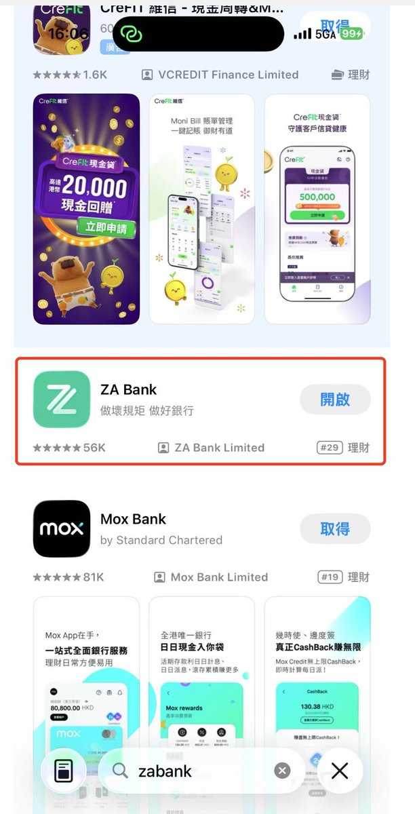

## 一、写在前面

最近一段时间，我发现大家对于"购买美股"这件事情，开始异常感兴趣起来，就包括我国内的一些朋友，也都在找我咨询美股购买。
其实我也可以理解，一方面是战争因素原因，进而导致了美股产品的价格被砍去了很多的水分，另外一方面原因是等到了一定的阶段，大家也都会开始了解投资理财这件事儿！

那聊到了**美股投资**，就不得不聊到咱们的**众安**啦，被大家称作是最方便、也是最适合大陆用户的线上数字银行，界面设计和灵活性都远超其他普通的香港银行。
其实最近推特上也出现了很多众安的教程，但是都是片面的内容，所以我就想要单独出一期内容，来单独介绍一下众安银行！

从**基础介绍、开户教程、绑定国内消费、购买美股以及福利**等入手，来给大家详细介绍一下众安银行这个香港第一的数字银行。

ok，话不多说，我们就即刻开始本期的内容吧！

---

## 二、众安介绍

我们首先还是要先了解一下众安银行，**众安银行（ZA Bank）** 是香港第一家虚拟银行。
**2019年3月27日**获得香港金融管理局（HKMA）颁发的首批虚拟银行牌照，**2020年3月24日**正式开业。

相比于其他的实体银行，众安没有一家线下实体分行，全程**手机 App 操作**，总部设在**香港数码港（Cyberport）**。
这也是数字银行的核心优势：把更多的经费用在线上产品的打磨上！

**关键发展里程碑（超全时间线）：**

- **2020年10月** — 推出香港首张可自定义卡号最后 6 位的 Visa 扣账卡（**ZA Card**）
- **2022年** — 获证监会证券交易牌照，上线基金；与 Wise 合作跨境汇款
- **2023年** — 成为香港超 80% 虚拟资产交易平台的结算银行；5 月推出零售用户虚拟资产交易
- **2024年2月** — 上线美股交易；11 月成为亚洲首家持牌银行为零售用户提供港币/美元直接买卖加密货币（BTC、ETH 等）的服务，**24/7 全天候交易**
- **2025年** — 港股全面上线；用户突破 **100 万**，存款超 **211 亿港元**，首次录得半年盈利
- **2026年** — 与 Nasdaq 合作实时美股数据；持续推出 StockBack 股票回赠等创新玩法；6 周年活动派 **600 万 StockBack** 奖励

> 💡 **ZA Bank** 强调"用户共创"和科技驱动，App 评分 **4.8 分**，支持内地访港人士用身份证+入境记录开户，**0 最低存款要求**，受香港存款保障计划保护（最高 **80 万港元**）。银行编号 387，SWIFT 代码 AABLHKHH。

那他为什么这么火？它不是传统银行的"线上版"，而是用科技重塑银行体验的**"未来银行"**——一 App 搞定存款、转账、消费、投资、保险、贷款。

特别适合**跨境用户、懒人理财族、喜欢边花边赚股**的朋友，常被称作"**港卡三剑客**"之一。如果你准备前往香港办理港卡，那他也是必选的港卡之一！

---

## 三、众安开户

聊完了基础的介绍之后，我们就来详细聊一下具体的开户教程了。在开始之前，大家需要准备如下的材料：

1️⃣ 此时人就在香港，下载众安银行 APP
2️⃣ 准备好你的**港澳通行证/身份证**，以及开通了漫游的手机号码
3️⃣ 准备好**入关证明**（小程序检索 12367）下载自己的证明

ok，准备好这些内容之后，我们就开始咱们的开户流程了！

**1、** 打开 App Store 输入 **ZA Bank** 下载众安银行，如图所示。

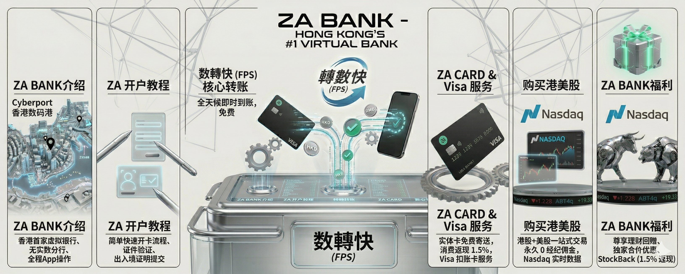

**2、** 点击立即开户，勾选自己的证件是**居民身份证**，然后看一眼要求，比其他的银行多了一个要求你填写**内地储蓄银行卡卡号**的要求，如图 2-4 所示。

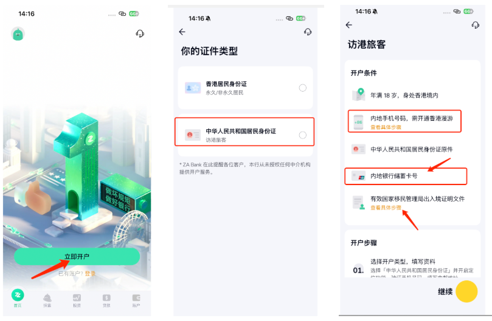

**3、** 如图 5 所示，可以看到众安银行的优势，感觉这个设计要比另外两家好，会给你说自己的优势，把自己的优势展示出来。

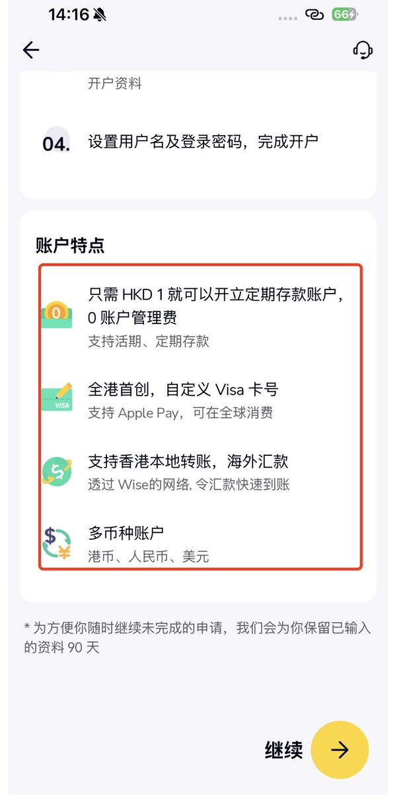

**4、** 填写自己的手机号和邮箱，然后进行身份证验证，如图 6-8 所示！
填写完毕之后，会问你是否有邀请码，这里大家填入：**T659B7**，也可以领取到相对应的奖励（这里建议大家一定要填写，因为可以解锁很多的奖励）

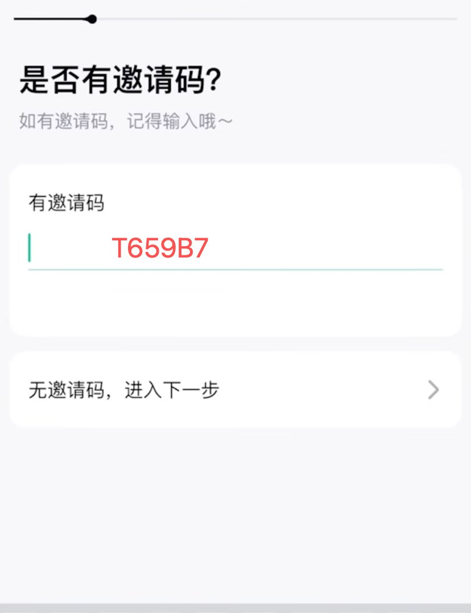

最后再确定一下如图 9-10 所示。

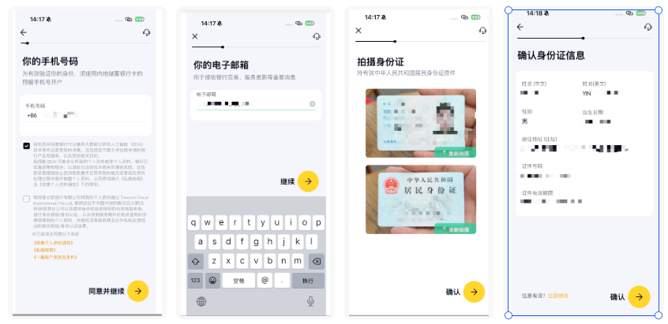

**5、** 同样是**英文名字**要格外注意，每个银行都会侧重再提醒一下，填写自己的纳税信息和职业信息，如图 11-12 所示。

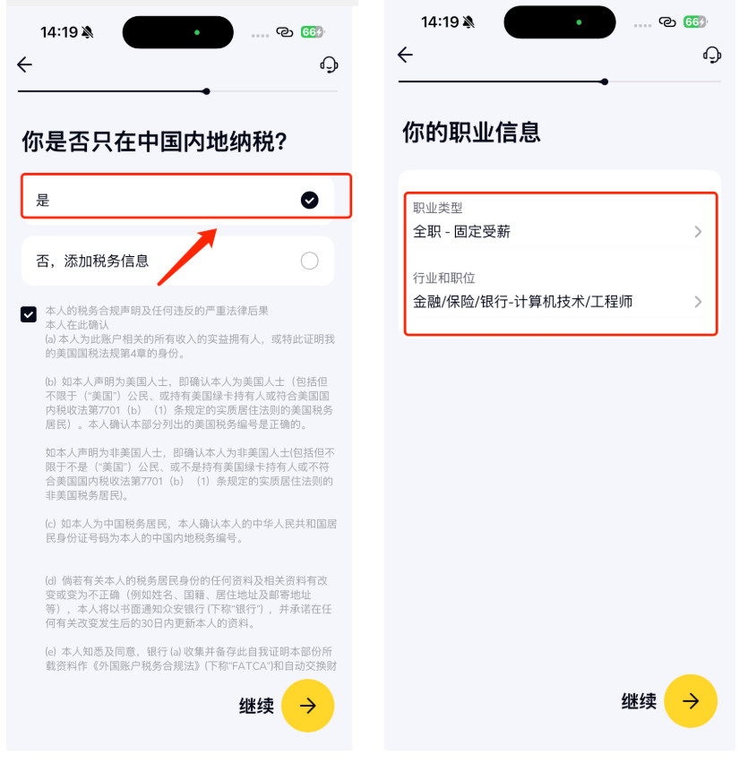

**7、** 最后勾选自己开户的目的储蓄/日常开支即可，如图 13 所示，最后确定一下自己的开户信息，如图 14 所示。

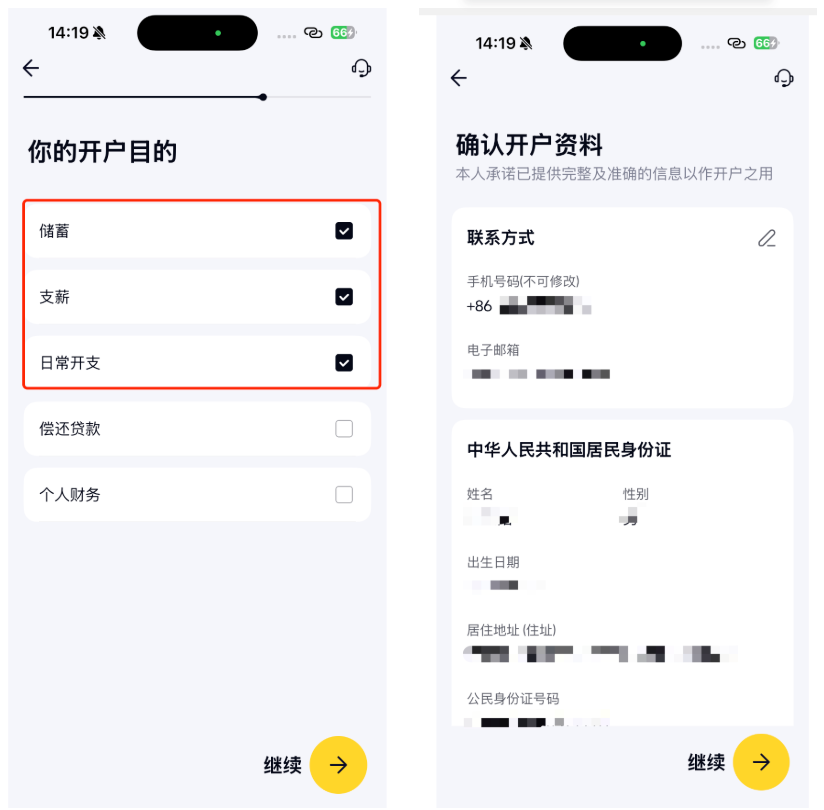

**8、** 设置密码，然后进行个人银行卡验证，最后按照我们前面一直讲到的提交自己的**出入境证明**即可，如图 15-17 所示。

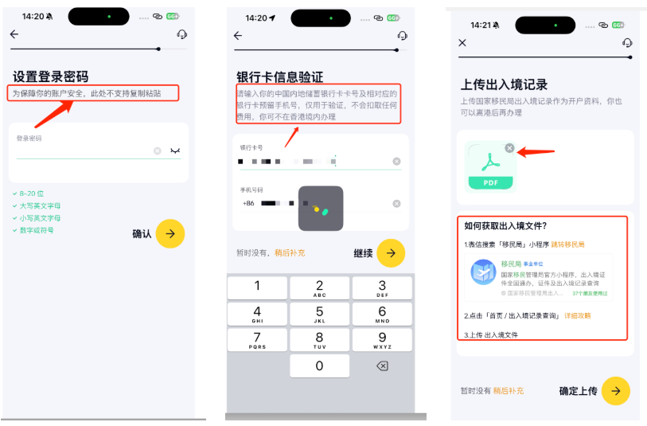

**9、** 后续就是开立自己的投资账户，如图 18 所示点击继续开立投资账户。

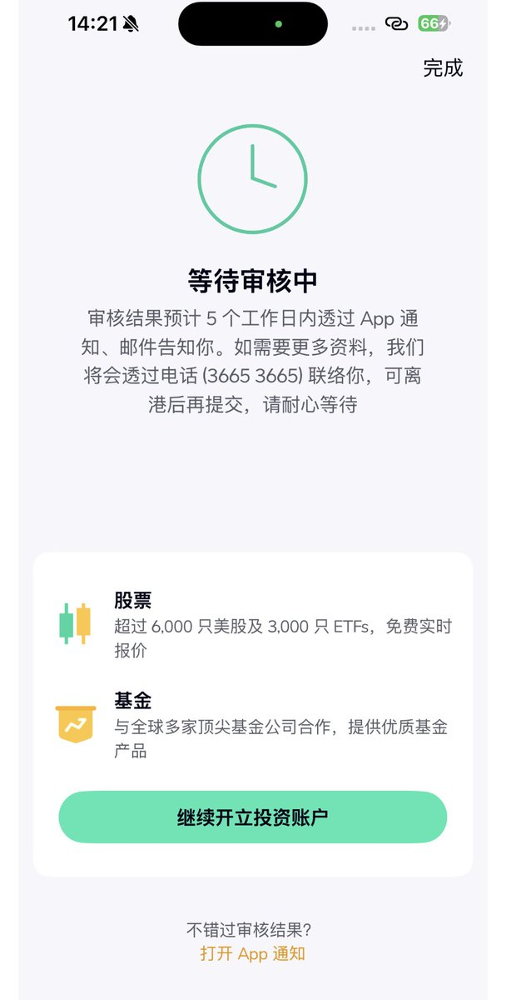

**10、** 如图 19-22 所示，把信息顺着填写完毕即可。

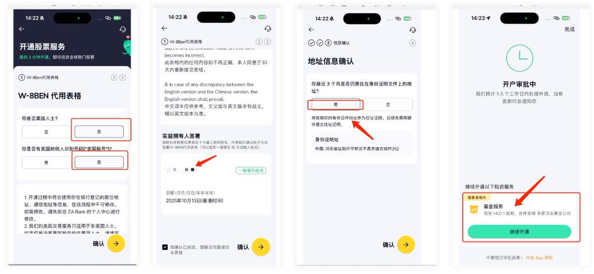

**11、** 在后续的基金服务同理，大家继续往后走即可。

**12、** 完成之后记得抽空登录上去，看看有没有什么东西需要补充。

以上就是成功完成了开户了，开户其实很简单，如果你之前申请开通过实体的汇丰/中银，就会发现，众安的开通简直简单到不能再简单了！

> 💡 按照这个流程正常走，基本上都可以做到 **100% 成功开卡**！

---

## 四、转账功能

聊完了众安的介绍和开户之后，我们就来聊一下众安的转账和消费等功能！

### 1、转数快

**ZA Bank 的转数快（FPS）** 是很多用户每天都在用的核心功能，特点如下：

- **完全免费**，全天候 **24/7 即时到账**，支持港币/人民币
- **首创 5 秒转账缓冲**：转错还能在 5 秒内取消
- 支持手机号码、邮箱、FPS ID 等多种收款方式

**登记转数快（4步，30秒搞定）：**

1️⃣ 打开 ZA Bank App → 点击左上角头像
2️⃣ 点「转数快和转账设定」→「我的转数快」
3️⃣ 选择 Proxy ID（推荐手机号码或邮箱）→ 设为默认收款银行
4️⃣ 验证码 + Face ID 认证 → 完成！

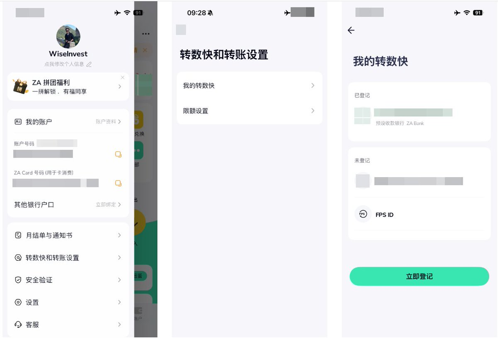

开通完毕之后，还要设置**转账限额**，香港这一点做的非常好，让你自己控制自己钱的安全：

- **本人转出限额**：即自己给自己的账户转出的额度
- **登记转出限额**：即自己设定的白名单转出额度
- **未登记转出限额**：即给陌生人转账的具体额度

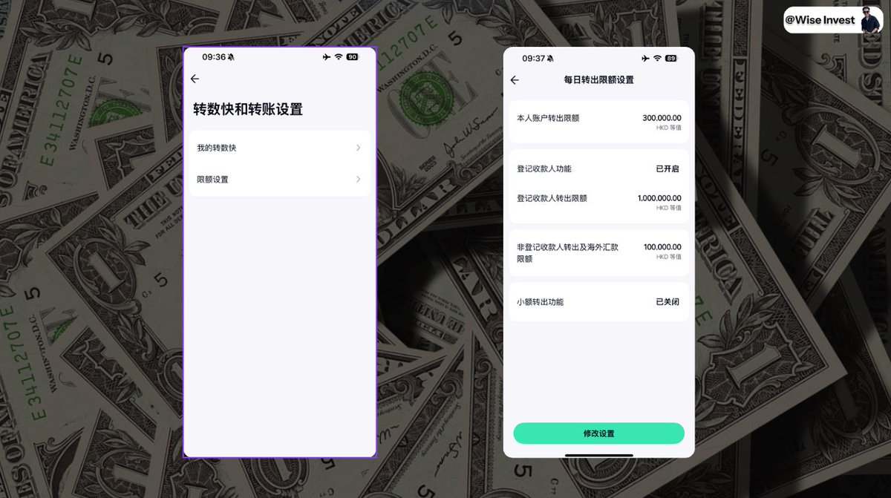

大家依次设置好额度就好，我基本上都设置一个 **10 万的额度**，如果你第一次设置比较少也没关系，后面也都可以修改，问题不大。

**从天星银行转入演示：**

1️⃣ 打开天星银行首页，点击转出，选择**转数快转账**
2️⃣ 输入自己预设好的手机号码，然后在转账银行那里选择**众安银行**
3️⃣ 确定转账，大家可以看到截图的时间，即 **3s** 即可快速直接到账

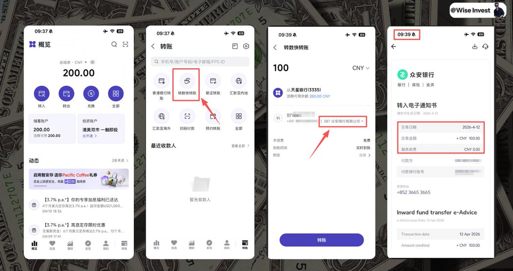

**从国内建设银行转入演示：**

1️⃣ 打开建设银行，在搜索框输入**「跨境支付通」**
2️⃣ 点击进去之后，选择立即汇出，然后输入一些关键数据
3️⃣ 演示 **200 RMB**：币种选人民币、收款类型是手机号码、开户行下拉找到众安、姓名就是自己的拼音缩写、用途选**因私旅游**

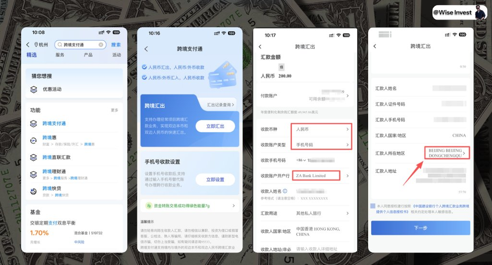

4️⃣ 继续下拉，补充一下你的汇款人现在地址（随便写），汇出之后，就可以立马看到众安收到了这笔汇款

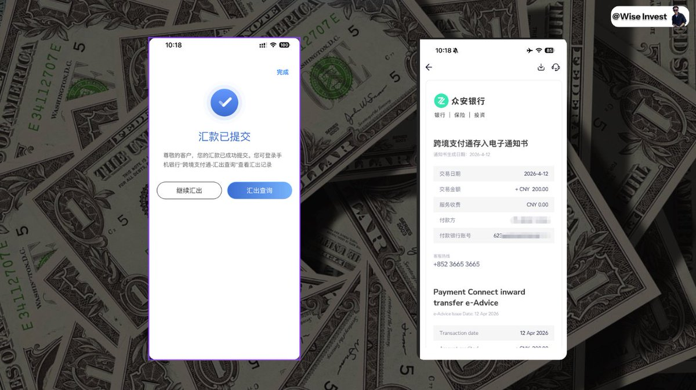

> 💡 **费用说明**：通过转数快转入完全**免手续费**！中国建行、中国银行、招商银行、农业银行等均明确支持，无损入金！每日限额可在 App「转数快和转账设定」里自行调整（同名账户每日最高可达等值 **HKD 200 万**）。

### 2、绑定国内消费

众安银行里面的钱可以直接**绑定到国内的微信**里面进行消费，注意使用这种方式**不会占用外汇额度**，每年限额 **6.5 万**，也够日常的回款了！

具体教程我在之前的推文中有详细介绍，大家可以直接搜索 **WiseInvest513** 查阅我的相关内容进行学习。

### 3、入金券商

咱们办理众安的一个核心原因，是想要出金到券商中进行交易。这里也给大家演示了两个比较有代表性意义的券商，一个是**复星**、一个是**盈透**，详细步骤也都比较多，大家可以搜索我相关的入金教程进行学习。

---

## 五、Za Card

上面聊完了开户和转账之后，其实众安还有一个被大家津津乐道的功能，就是其 **ZA Card**，也就是 Visa 借记卡。

**ZA Card** 是香港第一张可自定义卡号最后 6 位的 Visa 扣账卡，特点如下：

- **无年费、无任何管理费**，你所消费的钱直接从活期账户扣款
- 支持 **Apple Pay / Google Pay**，非常适合用来绑定和订阅产品
- 实体卡免费寄送（黑白两色，卡面不印 CVV 和到期日，**防盗刷**）
- 取现：香港 **3000+ Visa ATM 免费**，全球近 **300 万**可用
- 安全：App 一键锁卡、实时通知、自定义限额、生物识别

**如何开通？** 也非常简单！

1️⃣ 点击账户，点击 **ZA Card** 即可进行申请
2️⃣ 申请时候，你可以自定义你的卡号的后六位

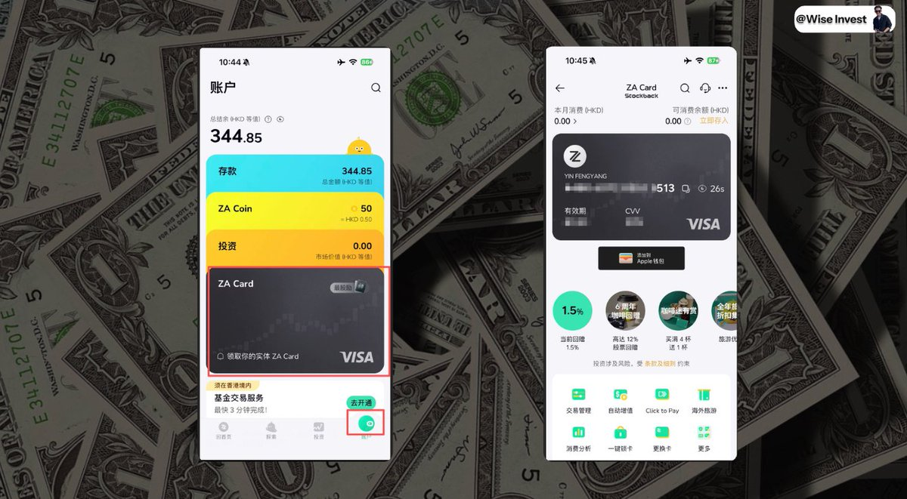

### 1、消费激励方式

开完之后有一个激励计划，即消费返现，目前有两种方式：

**第一种：最鼓励（推荐）**
你使用此卡进行的任何消费，都会以**股票的形式**回赠你 **1.5%**。举例子，你用此卡消费 1000 元，你可拿到 15 的消费返现。你可以拿这个钱去购买相对应的股票产品，也可以进行自选，例如谷歌/英伟达等明星产品。

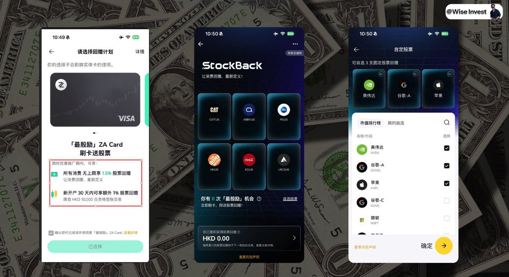

**第二种：最劲抽（不推荐）**
消费了来抽奖，最高是 **200% 回赠**，例如消费 100，抽到 2000 块钱。但是根据大量网友的实测，这个给的优惠跑不赢 1.5% 的回馈🤣。

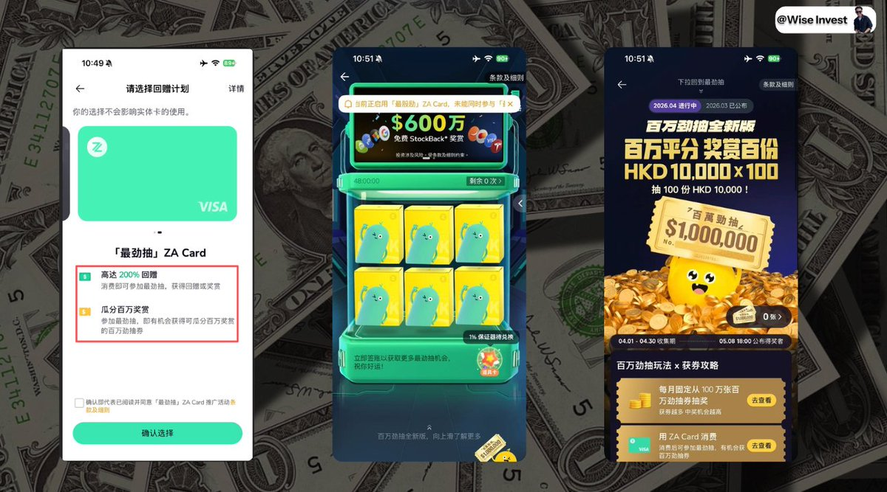

> 💡 **个人建议大家还是开卡之后选择股票回赠会更加好一些。**

### 2、费率说明

这里主要分为两种情况：

- **在香港消费港币**：完全没有任何问题，**零手续费**消费，消费完毕之后还可以领取到 **1.5% 的回馈**，如果你前往香港，直接使用此卡消费就是最舒服的！
- **消费外币**（例如美元/人民币等）：Visa 收取 **1%**，众安收取 **0.95%**，合计 **1.95%** 手续费，不太划算

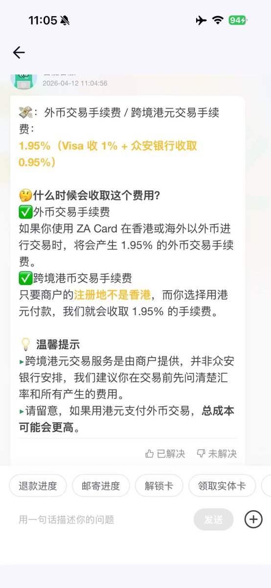

但是即便是 1.95% 的手续费，也被 **1.5% 的 StockBack 回赠**部分抵消，实际损耗极低。而且还记得前面提到的绑定微信消费吗？那个方案完美解决了众安里面的钱在**内地直接消费**的问题！

此外还有 **PowerDraw 抽奖**、指定商户高回赠（咖啡、甜点、旅游平台 **8% 折扣**至 2026.12.31）。

**ZA Card 综合优势：**

1️⃣ 花钱=赚股票，**闭环理财**
2️⃣ 跨境消费、网购、日常支付**一卡走天下**
3️⃣ 安全又省钱，综合手续费极低

如果你想要领取实体卡，也可以直接申请，注意你只能够领取**一次**，所以注意切换你想要的回赠方式，到时候自己支付一个 **35 港币**的邮费即可！

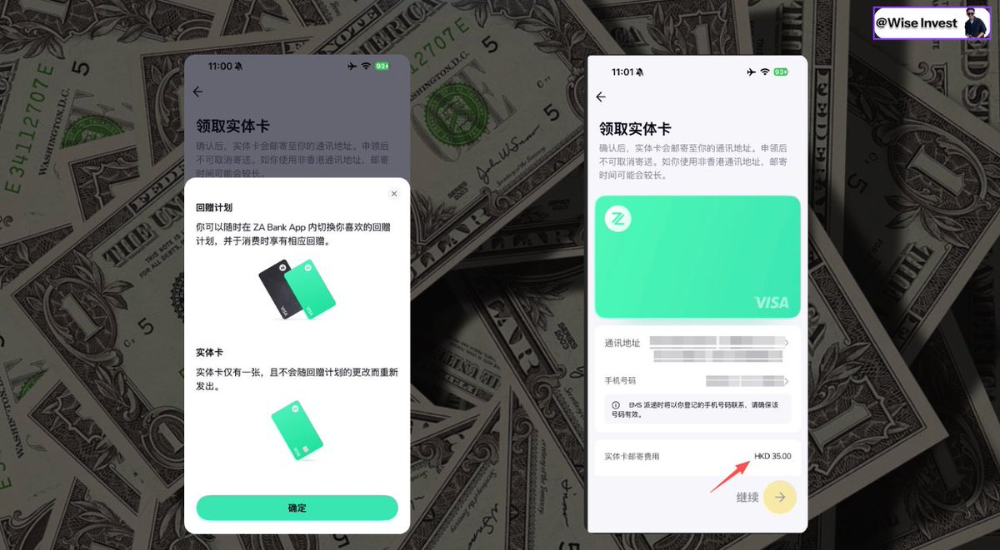

---

## 六、购买美股

那众安还有一个关键的功能，就是其可以**购买美股**，这也是最近其一大特色，包括目前老夏一直都在力推众安购买美股，所以这里就给大家重点聊一下这个板块！

**ZA Bank 2024年**起全面进军证券，于同年 11 月成为亚洲首家持牌银行为零售用户提供**港币/美元直接买卖加密货币**（BTC、ETH 等）的服务，24/7 全天候交易。

现在可以做到**港股+美股一站式交易**，**永久 0 经纪佣金 + 0 存仓费 + StockBack 股票回赠**是最大杀手锏。

**可买产品（2026最新）：**
- **美股**：超 6000 只股票 + 3000 只 ETF（Nasdaq 实时数据）
- **港股**：主要港股品种全面支持，直接从银行账户扣款，无需转仓！

**收费结构（超级透明）：**
- **经纪佣金**：港股、美股一律 **0%**（永久，新老用户通用）
- **平台费（港股）**：交易金额 × **0.05%**，最低 HKD **18**/单
- **平台费（美股）**：每股 USD **0.0099**，最低 USD **1.99**/单
- **存仓费**：0
- **基金**：0% 认购费 + 赎回费全免（至 2026 年 7 月 31 日）

那关于众安和复星的对比，大家也可以搜索我相关的对比文章进行参考。

详细购买操作也非常简单，点击投资，选择产品，然后点击买入即可。

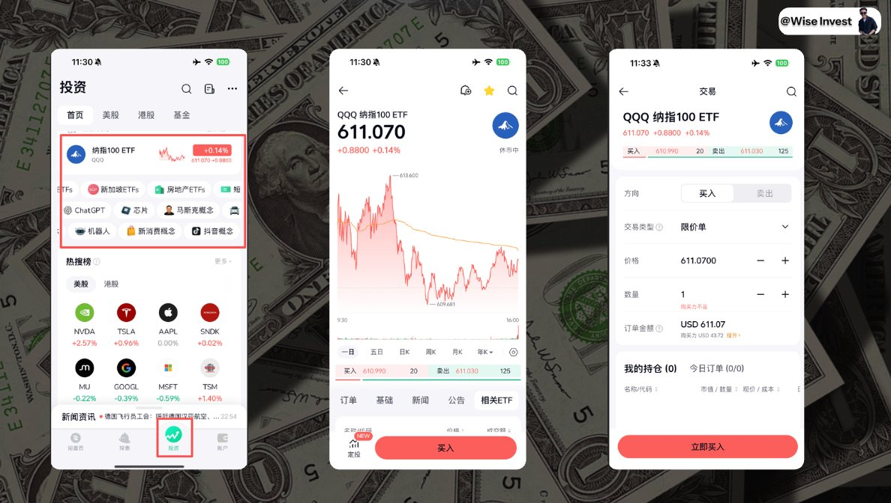

> ⚠️ **这里大家需要注意两个事情：**
>
> 1️⃣ 众安暂时**不支持碎股交易**，不像是盈透你可以想买多少就买多少，众安只能够**单股进行交易**，即你每次购买的必须是一整股，这个需要大家囤好资金再来进行交易。
>
> 2️⃣ 众安**股息税默认是 30%**（即你分红股票赚到的钱，会默认抽走 30%，如果填写了表格，证明不是美国居民，这个可以降低到 **10%**）

**关于股息税，详细说明：**

股息税针对的主要是**分红**的部分，例如七巨头里面的**苹果、Meta 和微软**都会分红，其中苹果做的最好，每年股息率约 **0.4%-0.6%**，是七巨头中分红最成熟的一只（同时大量回购股票）。
相比于**特斯拉、英伟达**等不做分红，即属于是成长型科技股，赚到的钱继续用来进行投资和业务增长。

**QQQ** 也会进行分红但分红很少，当前股息率大约 **0.46% - 0.48%** 左右（年度分红约 **$2.81**/股）。

综合来看，如果你不打算开券商，你弄一个众安库次库次就一直买也没问题；但是如果你买的**高股息股票/ETF**（如某些 REITs 或传统蓝筹）较多的话，还是用券商会更好一些。

---

## 七、福利/政策

上面基本上把众安的消费、美股、ZA Card 聊完了，剩下来聊一下众安目前给到我们的福利政策，我个人觉得都还算是蛮丰厚的！

### 1、存款利息

这部分众安银行玩出了花活，即结合走路来给你的资金进行**层层加息**！

操作步骤：打开首页 → 选择左上角存款 → 点击钱罐（即 **5% 最高年利率**）→ 激活这个钱罐活动。

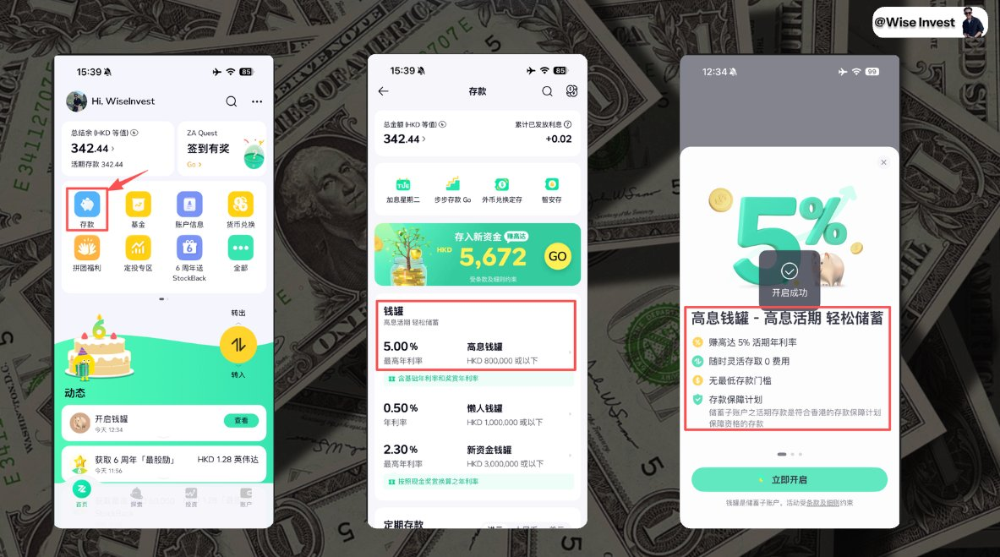

然后就可以看到一个**步步生息**的挑战，点击立即挑战，然后绑定自己的运动（苹果用户绑定健康数据），可以看到：

- 每日 **2k 步**，可以解锁 **0.29%**
- 每日 **1 万步**，可以解锁 **0.5%**

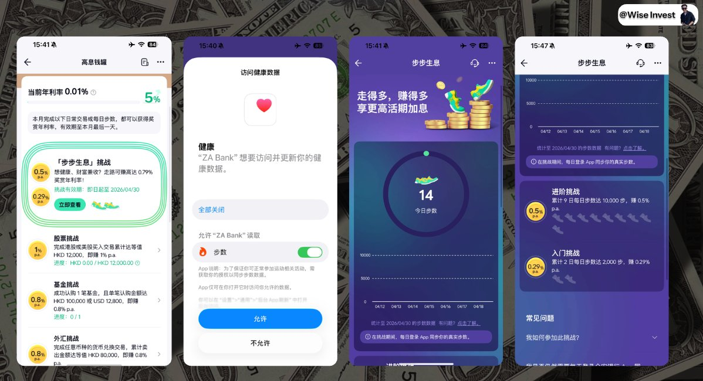

虽然是促销活动，但是这种和自己的**健康绑定**在一起的活动，我觉得还是非常有实际价值和意义的！

### 2、6周年送 StockBack

这个是周年庆活动，参加此活动，你在众安进行的多种行为都会赠送股票：

- **刷卡消费**：例如咖啡、餐饮、订阅 YouTube 等会员进行的任何活动，都会给你赠送股票
- **投资送**：完成股票加入自选、建立定投计划、完成港美股购买，都可以激活奖励
- **存款/汇款/转账**：都会赠送相对应的股票

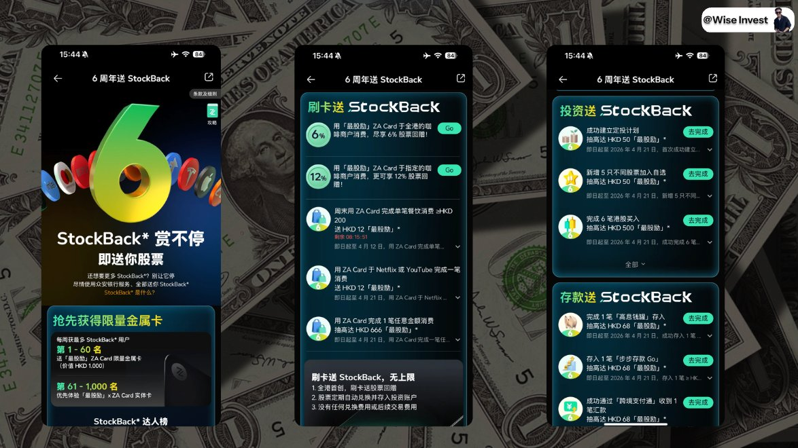

这其实也是上面我们讲到的，我们可以用众安进行**汇款无损到账**、可以用众安进行 **ZA Card 消费还有 1.5% 返现**、可以用众安**购买港美股**，政策福利可以拉平券商的福利。在做这些事情的同时，还可以享受咱们的**股票激励**，个人觉得还是挺好的！

### 3、邀请福利

众安的邀请政策非常友好：

- 刷 Za Card 可得 **2.5% 的股票回赠**
- 基金持仓 **800 的回赠券包**
- 股票现金 **1000 的回赠券包**
- 价值 **126 港币**的兑换立减券

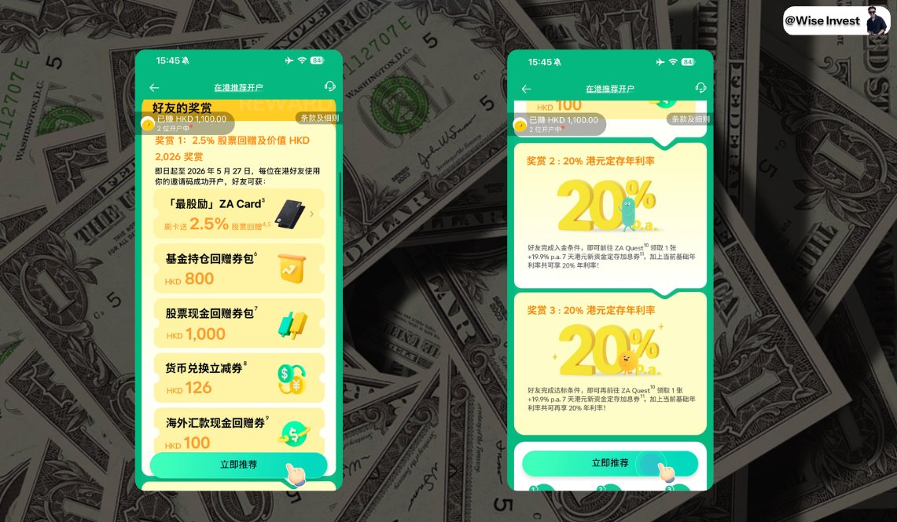

> 💡 所以个人建议大家，如果你有计划前往香港办理众安港卡，**记得填写邀请码 T659B7**，通过邀请加入的朋友可以享受这些福利，相反如果你直接开户，这些福利政策可能就无法享用了！

---

## 八、写在后面

ok，以上就是咱们关于众安银行的详细介绍了！

从众安银行的**发展历史**入手，然后给咱们介绍了其如何进行**开户**，以及不同情况下的**转账和消费**，如转账给香港/美国券商，绑定微信进行国内消费，详细的**购买美股**、以及最后的**福利**等内容！

可以说是目前你能够看到的最详细的关于众安银行的介绍了！那大家如果前往香港之前，记得看这篇文章好好学习学习哦，了解其特性以及其优点和可以赚钱的点！

ok，那如果你觉得本期的内容对你有帮助的话，也欢迎大家一键三连哦！
我们下一期给大家分享关于美股的所有投资的可能性，那大家就下期再见了！
