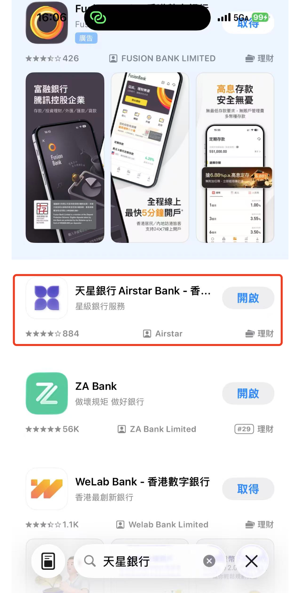
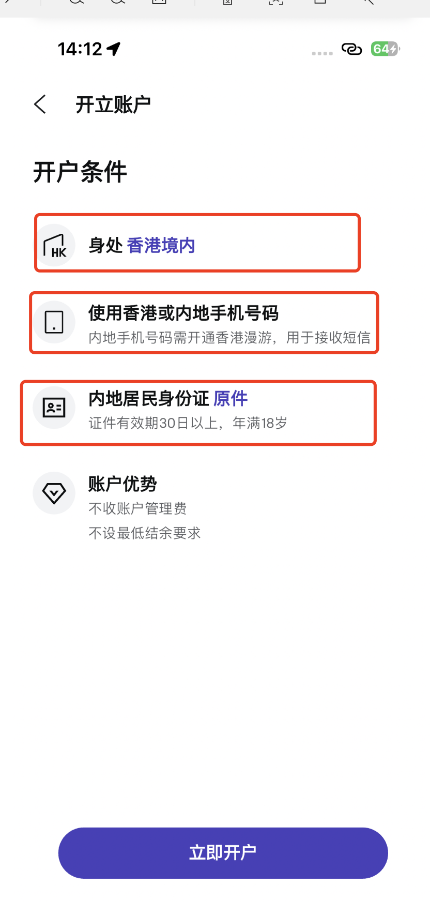
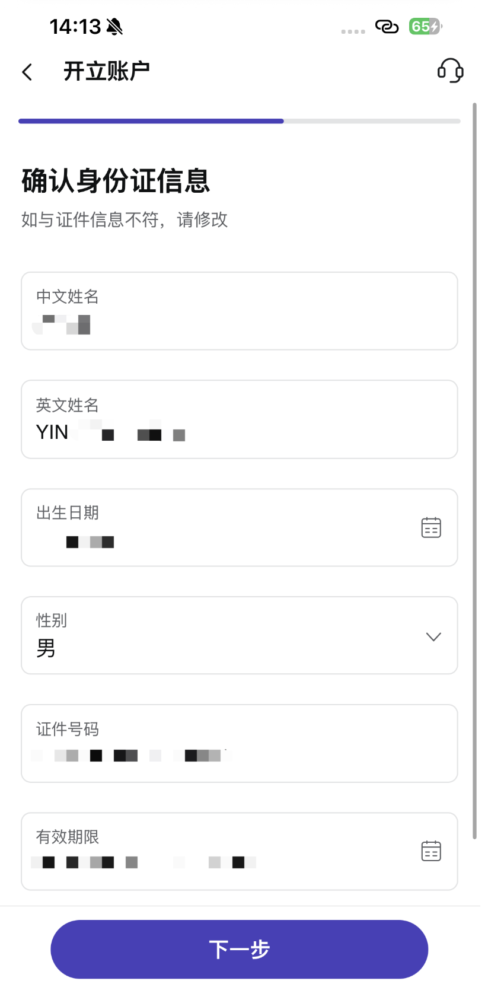
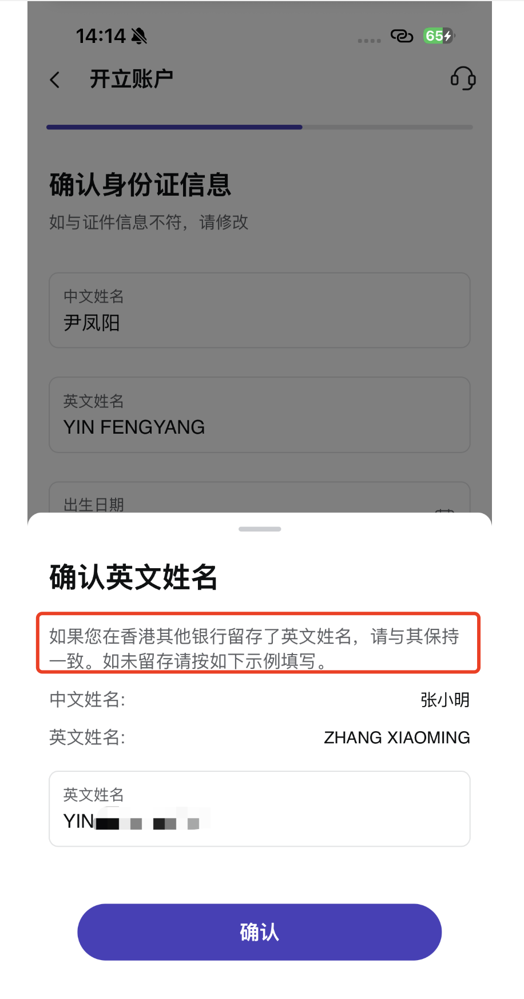
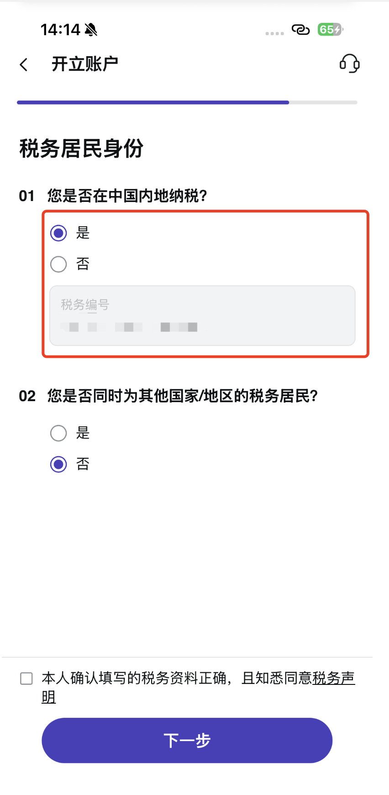
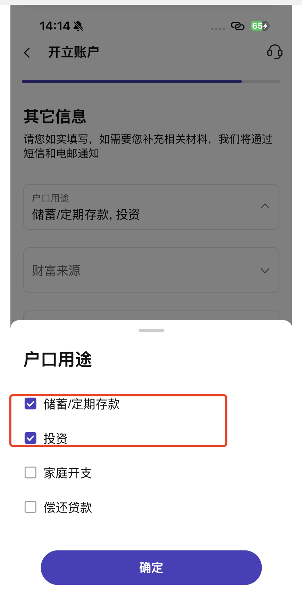
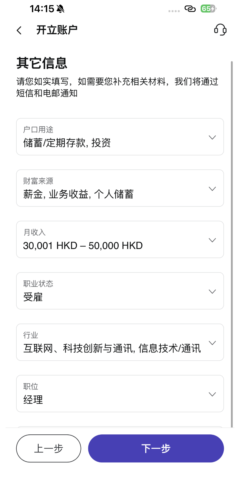
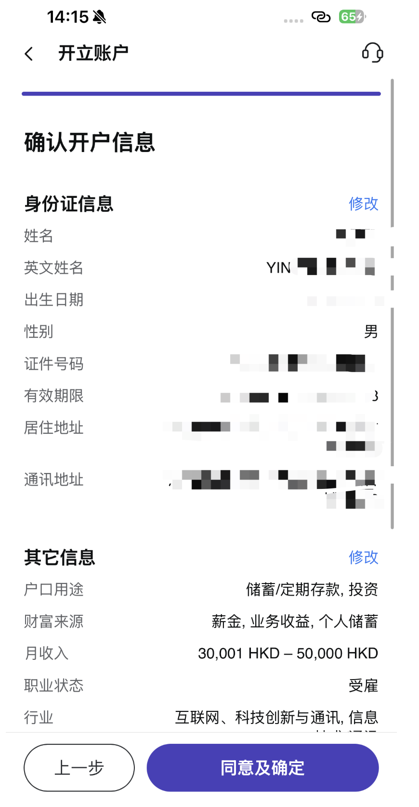
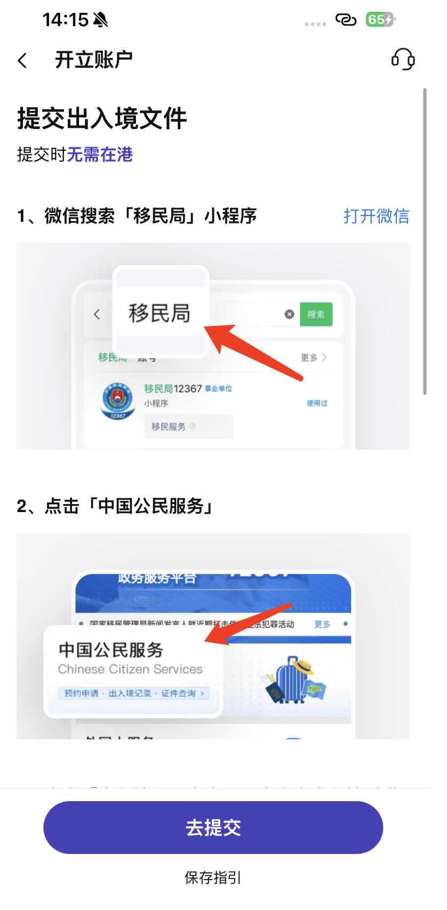
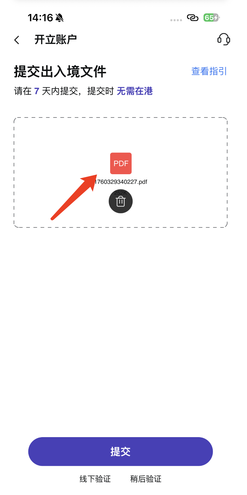

## 天星银行开户流程

**1、** 在 App Store 里面检索"**天星银行**"，找到框出来的这个，不要下载错了。

**2、** 然后点击**立即开户**，选择**内地居民身份证**，可以看要求基本上都是三板斧：要在香港、有港澳通行证/身份证，以及一些通关证明。

  

**3、** 填写自己的个人信息即可，注意**英文名字要是自己名字的拼音**，这个一定要确定好。

 

**4、** 问你是否是**中国内地纳税**，选择**是**并且填写自己的**身份证号码**，问你是否是其他国家的纳税居民，选择**否**。

**5、** 确定开户的用途是**储蓄和投资**，填写自己的其他信息，即**收入、行业以及职位**，进行正常填写即可。

 

**6、** 确定自己的**邮箱账户信息**，然后最后再确定自己填写的信息是否正确。

 

**7、** 按照我们前面聊到的方式去上传自己的**出入境证明**。

 

**8、** 最后就会提醒你**申请已经提交**，后续耐心等待即可。

**9、** 注意及时上去查看，看是否有要求你**补充其他的材料证明**。
