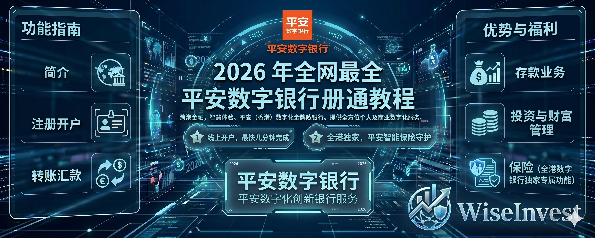

## 一、写在前面

在上一期内容里面我们具体介绍了关于汇立银行的一些注册开通以及一些细节教程，具体开户教程可看这一期教程。
1️⃣、实体银行开户教程（汇丰/中银）
2️⃣、虚拟银行开户教程（蚂蚁/天星/众安）
3️⃣、WIse 开户教程
4️⃣、Ifast 开户教程
5️⃣、见证开户开卡教程
6️⃣、汇立银行开户教程
那我们在完成本期的教程之后，咱们目前香港的八大数字银行所有的开户教程就都告一段落了，分别是众安、蚂蚁、天星、汇立、平安数字银行。 
哎这里就有朋友会问不是还有富融、理慧和 mox 吗这些目前不能够开，是的目前富融和理慧都明确要求有具体的邀请码才可以开户，过去一些个人用户开户的朋友放出来的邀请码目前都是无法通过的，而 MOX 一直以来其实都不允许国内用户通过身份证进行开户了。
所以咱们在去年 10 月份分享过众安、蚂蚁、天星之后，以及昨天分享的汇立，加上今天分享的平安数字之后，关于香港目前可以开的数字银行就已经都结束了。
那过去开的一些银行，我们也就都在给大家整理一下了。
ok，整理完毕之后，我们就开始今天的教程了。

## 二、平安数字银行介绍

平安数字银行（国际）有限公司是香港持牌数字银行，前身为平安壹账通银行（香港）有限公司，简称PAOB / PAO Bank）。
它于2019年5月获得香港金融管理局（HKMA）虚拟银行牌照，2020年9月29日正式开业，是香港第7家虚拟银行。
最初主打中小企业金融服务，2023年11月被同属平安集团的陆金所控股以约9.33亿港元全资收购后，开始大力发展个人银行业务。
2024年5月更名为PAO Bank，2026年3月26日正式焕新品牌为“平安数字银行”，更好地体现与中国平安集团的紧密联系，同时强化品牌辨识度。口号是“安心在·未来在”，定位为一站式数字金融服务平台。
依托平安集团庞大的金融科技实力、保险生态和数据能力，平安数字银行在AI风控、跨境服务和综合金融上优势明显。截至2026年3月15日，个人银行客户存款总额已突破120亿港元。
核心优势与产品体系（一App搞定所有）：
存款与储蓄：活期+定期存款，无最低结余要求，支持灵活资金管理。核心账户活期利率基础不高，但新客有超强促销。
支付与转账：FPS实时转账、跨境汇款、外汇兑换全覆盖，一站式操作。
投资与财富管理：2026年3月重磅推出“双实力理财服务”——银行级资金安全 + 券商级交易体验！储蓄账户资金可直接用于投资港股、美股、基金、货币基金，无需额外转账，随时切换“存款收息 ↔ 投资增值”。支持16小时美股交易、专业分析工具，真正实现资金灵活调配。
保险：全港数字银行中独树一帜的优势！线上+线下全方位保险服务（首家覆盖此模式的数字银行）。线上秒投汽车险、旅游险、家居险等；线下有专业顾问1:1咨询人寿、储蓄保险、财富传承方案，完美结合平安集团保险生态。
其他：全天候App管理、AI智能风控（防深伪、异常交易监测）、e-KYC快速开户。支持香港居民及访港旅客（人在香港即可）线上开户，最快3分钟完成。pingandb.com
安全性：加入香港存款保障计划（DPS），每位存款人最高获保障50万港元。
采用多重生物认证、实时通知，平安集团科技背书，安全可靠。
费用特点：大部分核心服务（如账户维护、基本转账）免费或低费，强调透明普惠，特别适合年轻用户、跨境人群和大湾区客户。
市场地位与奖项：作为香港8家数字银行之一，平安数字银行从中小企业银行起步，如今个人业务快速增长，是平安集团在港综合金融平台的重要一环。凭借科技+保险+银行的生态闭环，在2026年品牌焕新后，竞争力显著提升，特别适合需要“一站式”存款、投资、保险的用户。
总的来说，平安数字银行综合实力强劲，尤其在投资无缝衔接 + 保险服务上领先同业，特别适合计划长期在港理财、跨境资金流动、或想一户打通银行+券商+保险的朋友。
它不是单纯的高息吸储，而是真正想让你“安心在·未来在”——一部手机、一个账户，搞定所有金融需求！当前重点福利（2026年4月最新，截至4月30日/5月31日不等，具体以App为准）：
新客户迎新：使用指定推荐码开户，成功开立储蓄账户后，首30天内首5万港元活期存款享8%年利率；同时开1个月定期存款，首5万港元也可享8%年利率。
新资金定期：港元新资金3/6/12个月最高2.75%（100元起存）。
投资账户：新开投资户可享最高2000港元现金回赠券。
外币兑换定存也有额外高息优惠，利率每日更新，App内实时查看
以上就是关于平安数字银行的基础介绍了，其实就关于其中的保险部分内容我想简单介绍一下，就保险业务来说在香港是一块非常大的业务，平安把这个业务和自己原有的业务进行了一个融合，所以这样就造就了平安独特的优势即数字银行+保险业务独一份。
这也是平安能够独树一帜的一个非常重要的原因，那抛开这个不谈，其背后的实力，以及其一些优惠政策和存款的利率都算是不错，都可以当做一个不错的数字银行用作备选和使用了！

## 三、开户教程

其实整个开户教程我觉得也都非常简单，但是就是有一个小问题比较麻烦，那就是他不允许截图进行使用，所以所有的图片，我都是在实操的过程中，然后用我的另外一台手机进行拍摄的，所以视觉效果上可能会有一些阅读压力。 
那依旧是前提信息的准备工作：

1️⃣、实名登记的内地手机号码
2️⃣、在有效期内的港澳通行证 &个人身份证
3️⃣、不是美国人🤣🤣🤣
4️⃣、出入境证明材料（汇立银行聊过如何获取）
ok，如果此时大家在香港基本上就应该都满足的，那我们就正式开始注册流程吧

**1、** 打开手机应用商店检索“平安数字银行”，再然后登录进来之后就开始完整的注册流程，输入自己的手机号码。

**2、** 关于邀请码大家可以填写 293INR，其实不输入也行，大家正常开通就行了，我看了一下即大家在这个里面存款超过 1 万港币任意月/年我可以获取到 500 港币，那大家同步可以获取到的福利是一些比较高的年化利率数据。
大家如果你有计划在这里存钱的可以填写邀请码，获取到这个福利，如果不计划存钱进来的填写不填写问题都不大。 

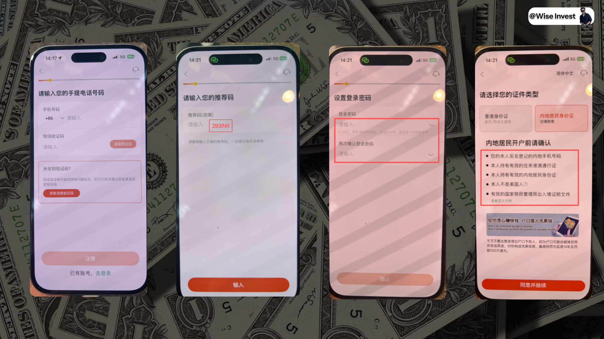

**3、** 而后就是确定你的登录密码，继续进行下一步即提醒你需要准备的材料。

**4、** 然后就是验证你的内地身份证，以及自己的港澳通行证，通过拍摄+NFC 读取的方式。

**5、** 这里多聊一下即这里的 NFC 读取是在手机的偏上方的，就是你的摄像头旁边，一些朋友没有使用过的会放在中间部分，这个时候是读取不到 NFC 的，大家啊多加注意一下。

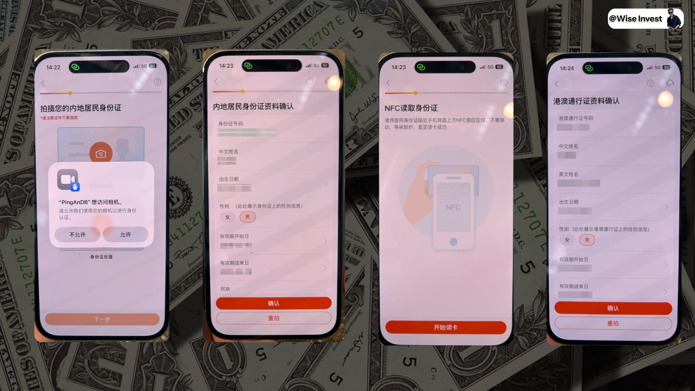

**6、** 而后就是验证你的人脸，以及上传你的出入境记录，这里的出入境记录下载之后如何才能够被文件发现，我在汇立银行开户的时候也有详细的介绍，大家翻看上一期教程学习即可，这里不过多展开了。
而后就是准备开设自己的银行账户信息。

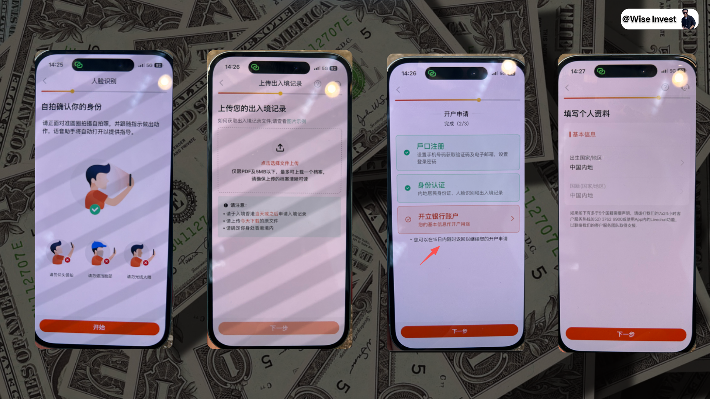

**7、** 填写自己的居住地址个人信息，账户用途以及收入来源，如果你不知道如何填写，亦或者是害怕填写错误，可以参考这个进行填写。

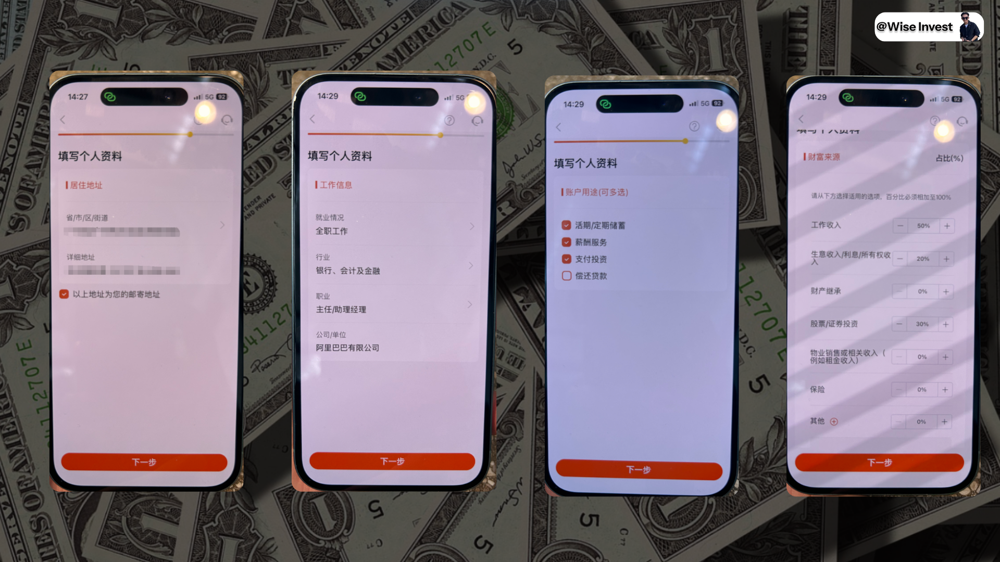

**8、** 最后就是再确定你的税务信息以及你的身份证号码是否正确，即完成了完整的户口注册、身份证认证、以及详细的开立银行账户的流程了。

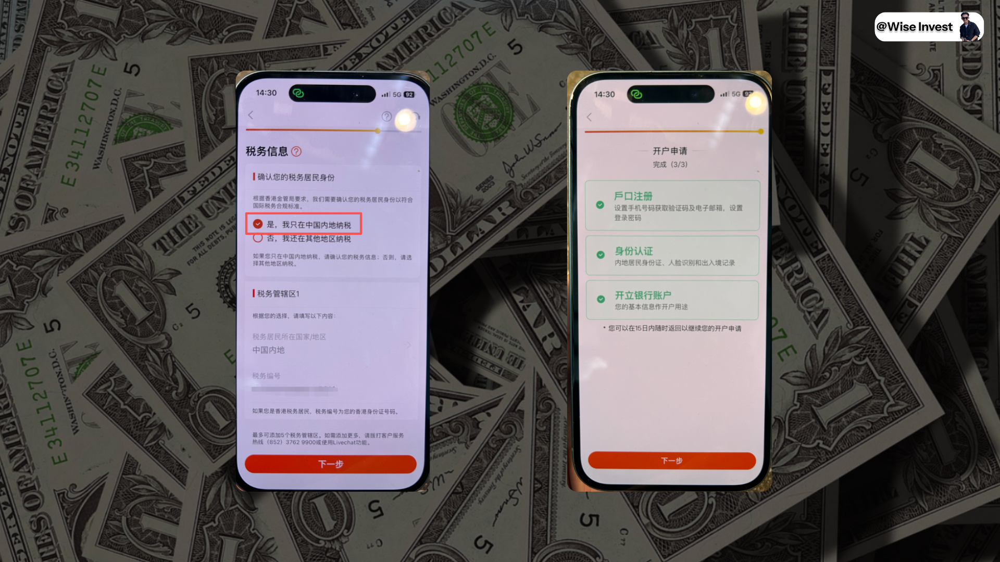

其实整体上和之前咱们开的一些普通的数字银行没什么很大的区别，难度也不算是很高。

## 四、投资开立教程

聊完了注册之后，我们就来顺势来聊一下投资的开立教程，其实这个我们在之前聊到过，现在的数字银行或多或少都会支持投资了，其实也都可以理解。
一方面是数字银行而言，他们不用线下运营其成本可以节省出来更多放在线上运营上，那另外一方面而言，其实就是就数字银行来说，更多承接的也都是转账的功能，。
另外一方面是支持港美股购买在最近一段时间好像已经成为了一个数字银行的标配了，像是众安/澳门蚂蚁/天星（象象），等都在陆续支持港美股购买，
所以投资内容也会是一个重点部分！
ok 那我们就开始吧：

**1、** 确定你开启了定位在 GPS 并且没有开 VPN，然后填写自己的教育以及资产情况，接触过的产品以及是否有衍生品经验都可以按照如图所示的情况进行填写。

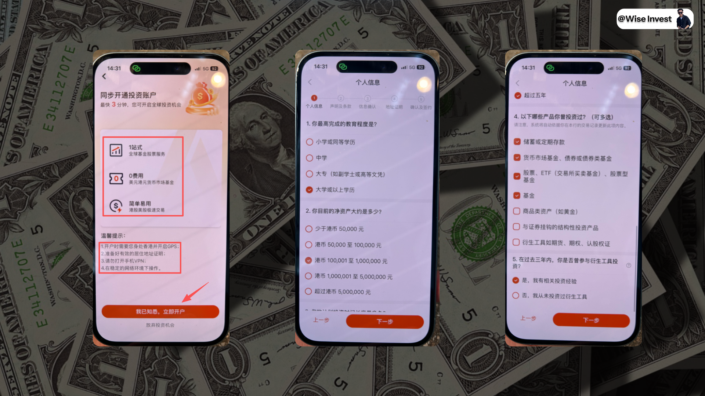

**2、** 是否是机构人员选择否、是否同意提供服务选择是，最后确定信息，确定是否是美国纳税人选择否

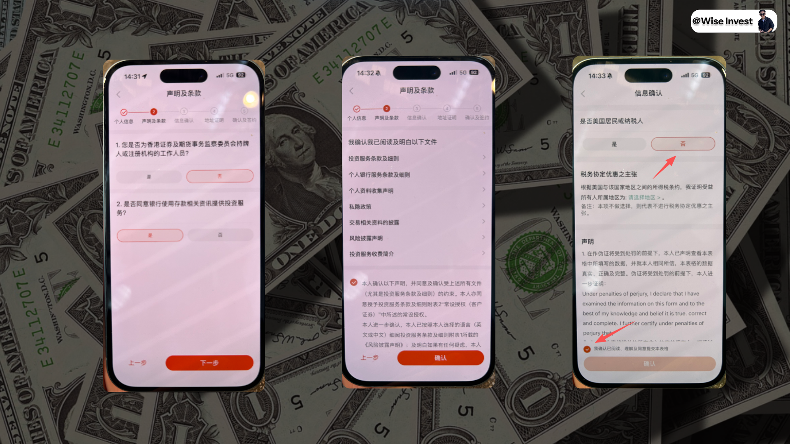

**3、** 签名、确定税务材料、上传地址证明，勾选成为专业的投资者，如上图所示，按需进行填写即可。

**4、** 确定完成之后即完成了申请，后续耐心等待审核通过即可，我当时在香港的时候没有补充我的地址证明，等到我回到内地之后重新补充了一下我的地址证明即成功通过了审核，就可以在平安数字银行里面购买港美股了！

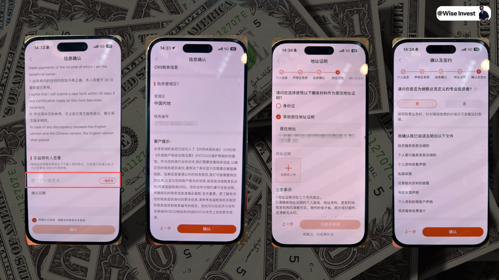

**5、** 我最后也给大家截图了平安的券商界面，一些功能还算是不错，就是界面上其实还是有待提高，对比到一线的众安等还是有一些差距。

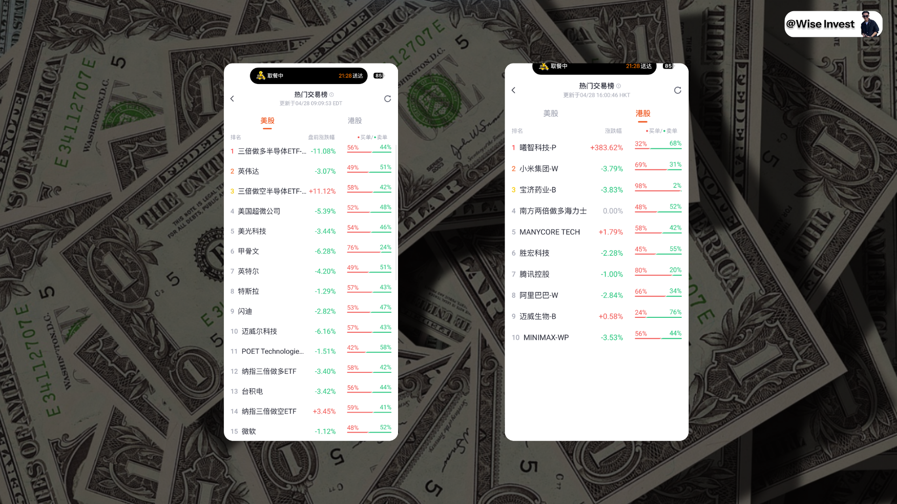

## 五、平安福利介绍

那聊完了开户和转账之后，我们来聊一下平安数字银行目前的功能以及其福利政策。
其实跟汇立相比，平安数字银行的定位更偏向一站式综合金融+平安生态，核心卖点不是单纯的高息吸储，而是真正让你“一部App、一个账户”打通存款、投资、保险三大场景，尤其适合追求长期财富规划、跨境资金管理和综合保障的朋友。

**1、** 存款
平安数字银行的活期+定期存款是入门级主力，无最低结余要求，100港元起存，App内操作超方便。核心账户活期基础利率不高（约0.5%左右），所以主力还是靠定期+新客促销来冲收益。
最新基准利率（2026年4月28日参考，港元新资金/任何资金，具体以App实时为准）：  
1个月：约2.4%（现有资金）  
3个月：2.7%（任何资金）  
6个月：2.6%（新资金） / 2.5%（现有资金）  
12个月：2.75%（新资金） / 2.5%（现有资金）
当前重点福利（截至2026年4月30日，新客最香）：  新客户迎新：使用指定推荐码开户成功后，首30天内首5万港元活期存款享8%年利率；同时成功叙造1个月港元定期存款，首5万港元也享8%年利率（活期+定期双8%，总计最高约HKD656利息，超级划算！）。  
 新资金定期：港元新资金3/6/12个月最高2.75%（100元起存）。  
外币兑换定存：额外高息优惠，部分可达更高水平（App内每日更新）。
 规则 & 优势：  利息按日计算，到期自动派发到核心账户。  
 提前支取有罚息，但整体灵活度高。  
小贴士：活期基础利率低，建议开户后立刻冲新客8%活期+1个月定期锁收益；利率每日更新，App里“存款”页面看得最清楚。新客福利名额有限，赶紧用推荐码冲！

**2、** 投资与财富管理
这是平安数字银行2026年3月重磅推出的核心差异化功能——“双实力理财服务”：银行级资金安全 + 券商级交易体验！
储蓄账户的资金可以直接无缝切换（SWITCH）用于投资，无需额外转账、零延迟：  支持港股、美股、基金、货币基金全覆盖。  
美股交易长达16小时（含盘前盘后），专业分析工具（40+技术指标+实时热力图）。  
卖出收益即时回流存款账户继续收息，资金利用率拉满。
当前福利：尚未持有投资账户的客户，新开投资户并启动服务，可享最高2000港元现金回赠券（股票+基金+笔笔返组合），开立后首60天内交易还有额外返还。
现有个人银行客户最快3分钟就能加开投资户。

**3、** 保险（全港数字银行独家专属功能）
这点是平安数字银行真正领先同业的杀手锏——全港首家提供线上+线下全方位保险服务的数字银行，直接把平安集团的保险DNA植入App！ 
 线上：秒投汽车险、旅游险、家居险等一般保险，无纸化、超快。  
线下：专业保险顾问1:1咨询人寿、储蓄保险、财富传承方案，温度感拉满。
真正实现“存款生息 → 投资增值 → 保险保障”一户搞定，特别适合大湾区客户或需要综合财富规划的朋友。
其他功能：

**1、** FPS实时转账、跨境汇款、外汇兑换全覆盖；

**2、** AI智能风控+多重生物认证，安全有保障；

**3、** 加入香港存款保障计划（最高50万港元/人）。
小贴士：平安数字银行不是单纯的高息卡，而是综合金融平台。核心优势在于“双实力理财”+保险生态，让资金真正“活”起来。
如果你主要是冲存款，8%新客福利很香；如果你想长期玩港美股+买保险，那它几乎是目前虚拟银行里最全能的一张！（所有利率/福利以银行App最新公布为准，投资有风险，借贷需谨慎。
促销截至2026年4月30日/6月30日不等，记得开户时输入我的邀请码领取啦）
以上就是平安数字银行目前的功能和福利全总结。
它的专属功能（双实力无缝投资 + 线上线下保险）在香港8家虚拟银行里真的独一份，特别适合追求“一站式、安心在·未来在”的朋友！

## 六、写在最后

ok，那以上就是关于平安数字银行的一个简单的开通和介绍了，到目前为止，我们关于香港目前可以开的数字银行都已经介绍完毕了，大家可以按照需求去进行学习了。
那最近也是临近咱们的五一假期了，如果你刷到了这个教程欢迎一键三连，到时候也可以一次性前往香港就把所有的银行都给安排下来。
其实虽然说目前的这些数字银行都已经开完了，但是很多的细节功能的介绍和玩法其实我们介绍的都还比较少，目前我们唯一单独介绍的产品银行，可能也就是咱们的众安银行了，可以看如下的教程进行学习！
那不同银行之间的汇率、存款利率，以及现在大家都在支持的港美股购买功能都如何呢？好像都还没有进行一个细节的对比，到时候后面，我就再慢慢地给大家进行连贯在一起进行介绍了！

## 七、下期预告

聊完了虚拟银行之后，我们下期内容将会重点就建行亚洲和工商亚洲，我想就他们俩进行一些对比和转账的对比了，也算是第三部分银行卡的介绍了，专注于境内和境外同名银行转账，到时候参考一下费率等问题啦！

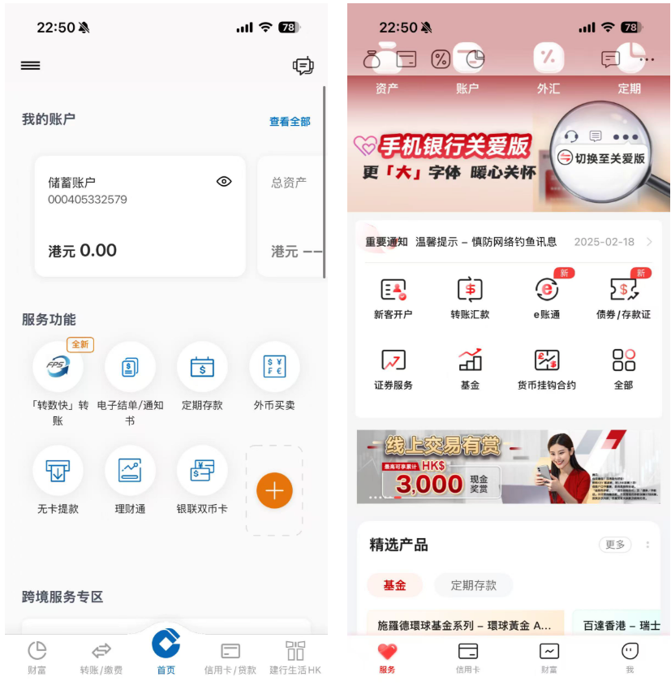

OK，那我们就下期再见了！