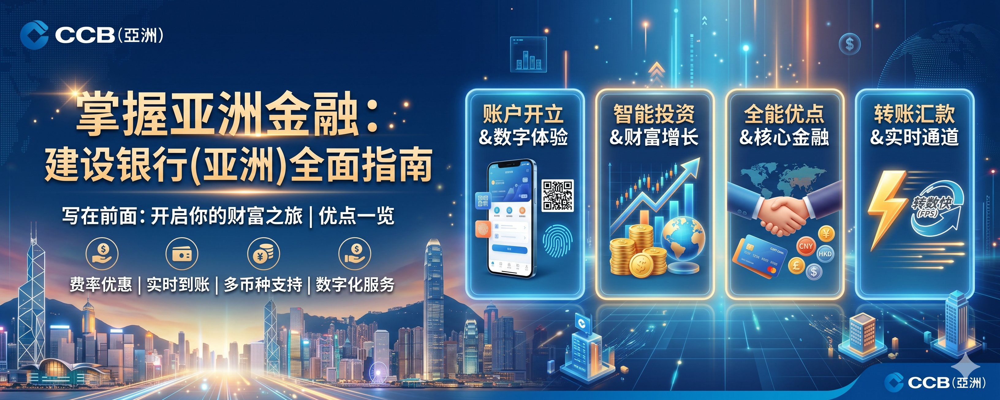

## 一、写在前面

哈喽，大家好这里是 WiseInvest，我是你们的老朋友 Wise，在前面我们已经完成了全部的香港数字银行的开通！
包含两个实体银行+五个虚拟银行+两个数字银行，教程如下：
1️⃣、实体银行开户教程（汇丰/中银）
2️⃣、虚拟银行开户教程（蚂蚁/天星/众安）
3️⃣、虚拟银行汇立开户教程
4️⃣、虚拟银行平安数字银行开户教程
5️⃣、WIse 开户教程
6️⃣、Ifast 开户教程
7️⃣、见证开户开卡教程
如果你还没有看过前面的教程欢迎查阅前面我们的教程进行细节学习了。

**那今天我们重点介绍一下建行亚洲这个银行啦**

还有就是大家可以发现，其实最近几期的教程也都偏向于“简约”，即最近的一些开户教程我们都不会介绍的过于详细在实操上，目前重点关注的方向依旧是开户上，侧重于帮助大家先完成开户，以赶上这波大家准备五一前往香港办理银行卡的一个节点。 
等到后面之后我们再来详细介绍就建行亚洲如何和建设银行进行更加紧密地结合起来！

**ok，话不多说我们就即可开始本期的教程吧**

## 二、建行亚洲介绍

建行亚洲（中国建设银行(亚洲)股份有限公司），前身是1912年由李煜堂、陆蓬山等华商在香港创办的广东银行，是香港历史上第一家由中国人创办的本地银行，已有超过110年的悠久历史。
2006年，中国建设银行全资收购原美国银行（亚洲），并将其正式更名为中国建设银行(亚洲)，成为建行在香港及澳门地区开展零售银行、商业银行和跨境金融业务的核心平台。
目前，建行亚洲在香港设有约50家分行，并在澳门设有分支机构，总部位于香港中环中国建设银行大厦。作为中国建设银行（全球领先的大型股份制商业银行之一）的全资子公司，建行亚洲依托母行遍布全国超过1.4万个网点及全球化的庞大网络，拥有雄厚的资金实力、严谨的风险管理和领先的跨境联动能力。
它不仅是香港持牌银行，更在粤港澳大湾区跨境金融领域深耕多年，尤其擅长为经常往返内地与香港、需要资金灵活调配的用户提供一站式解决方案。

**核心优势：陆港通龙卡——一卡通两地，跨境理财最强神器**

这是建行亚洲区别于其他香港银行的最大亮点。成功开通陆港通龙卡后，一张卡即可同时绑定：  
内地建行账户（支持人民币、港元、美元等多币种活期/定期存款）；  
建行亚洲（香港）账户（港元储蓄、支票及人民币账户）。
两大联动机制超级实用： 

**1、** 自动扣款联动——内地消费/取款时，若内地建行账户余额不足，自动从香港账户扣款；香港/海外消费时，若香港账户余额不足，自动从内地账户扣款，无需手动转账。

**2、** 港元汇款实时到账——香港内地建行之间的港元转账通过网银操作，即时到账，且免电报费。
此外，你还能通过建行亚洲App或网银，一键查询两地账户的综合月结单；在建行亚洲ATM或银通网络直接操作内地定期存款，真正实现“内地香港一卡走天下”。特别适合港漂、跨境工作者、留学家庭或频繁内地消费的用户。

**主要产品线与服务**

存款与储蓄：支持港元、人民币、美元等11种主要货币的活期/定期存款，提供月月增息、VIP贵宾理财等高息方案，利率具备竞争力。  
支付与转账：FPS转数快、跨境汇款、银联/万事达借记卡全球消费，内地建行/银联网络取现低费或免手续费。  
投资理财：证券户口（港股/美股/基金）、债券、保险、结构性产品一站式服务，佣金及认购费优惠明显。  
信用卡与借贷：本地餐饮/交通高现金回赠、海外消费优惠，私人贷款及按揭产品灵活。  
数字服务：支持e账户线上7×24小时开户（香港身份证或内地身份证均可，几分钟完成），App/网银全天候操作，转账、缴费、理财一手掌握。

**安全性与市场定位**

建行亚洲受香港存款保障计划保护（最高可达HKD 500,000），并继承母行严谨的风控体系。凭借中港联动优势，它已成为香港跨境理财的标杆银行，尤其在“大湾区”及“一带一路”相关业务上表现突出。
无论是追求资金安全、跨境便利，还是高息存款+理财的用户，都能在这里找到高性价比的选择。
总的来说，建行亚洲不是纯虚拟银行，而是传统大行背景+香港本地牌照+中港深度联动的综合实力派。如果你有内地资金往来需求，或希望一张卡打通两地账户，它绝对是当前香港开卡系列中最具实用价值的选项之一

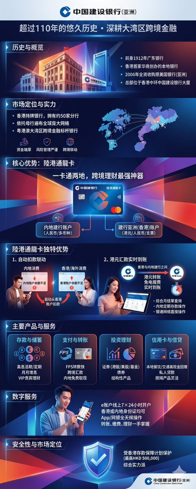

## 三、建行亚洲开通

聊完了基本的建行亚洲介绍之后，我们就一起来聊一下具体如何开通，以及需要注意哪些细节，ok，那我们就开始吧

**1、** 打开手机，咱们检索建行亚洲，其实现在叫做建行港澳，所以这个名字也没错，进行下载。
而后进来之后，点击下面的新客户开通/激活，然后点击立即开始、点击开立户口。 

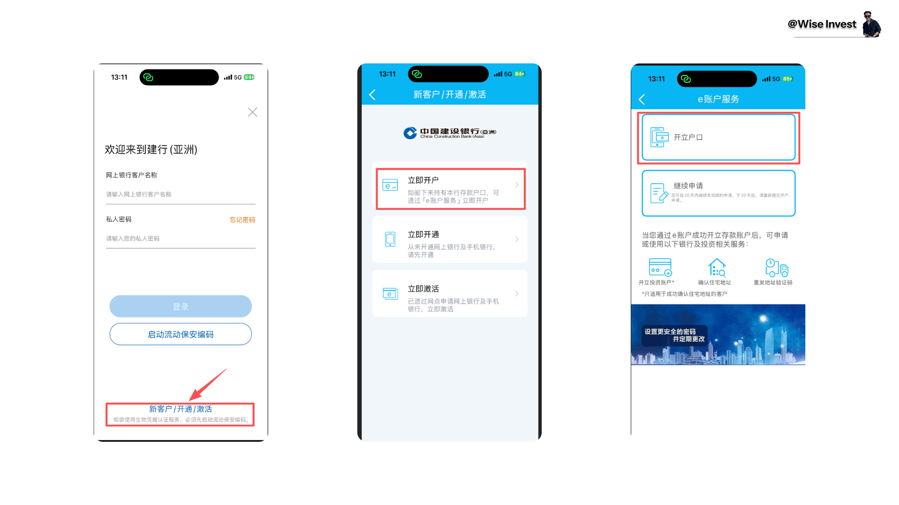

**2、** 接着选择咱们的证件类型是居民身份证、然后开户的准备是
1️⃣、身份证在有效期内。 
2️⃣、港澳通行证在 30 天有效期。
3️⃣、出入境记录数据。 
4️⃣、有效的手机号码。
5️⃣、有效的邮箱地址。 
ok，准备好之后，咱们就准备开始走整个流程了。

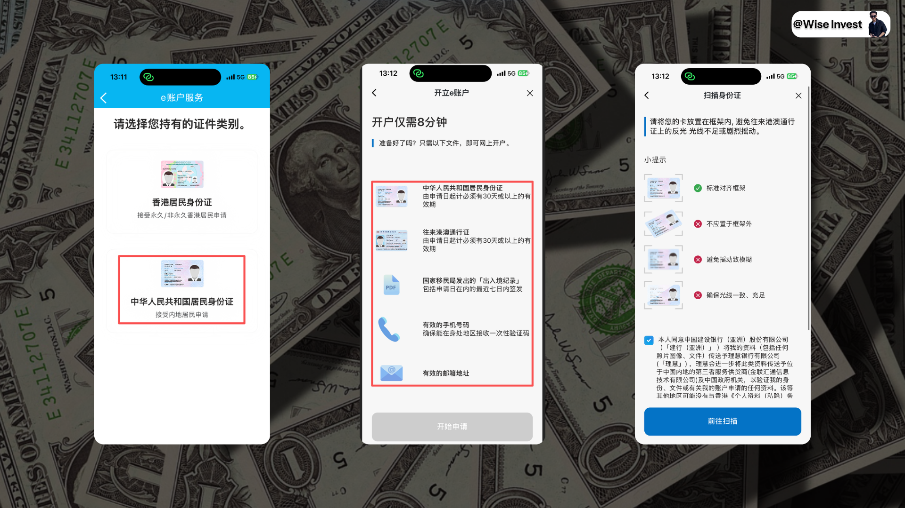

**3、** 通过 NFC读卡的方式获取到咱们的身份证和港澳通行证具体细心，核查一下是否准确。

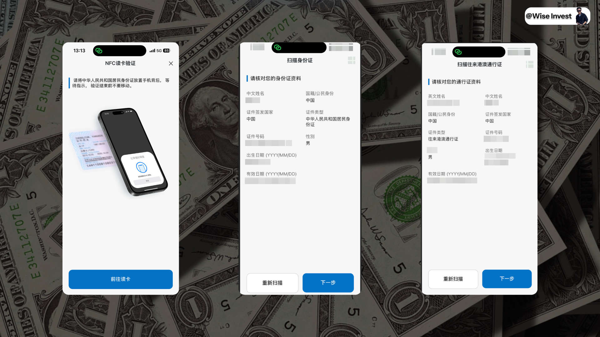

**4、** 然后就是上传咱们的出入境记录信息，以及进行正常的人脸识别，最后确定地址。
地址这里，如果你不想麻烦，可以直接选择就是和身份证地址相同即可，因为暂时看来没有让你上传地址证明这些信息。
但是有一张卡后续可以领取，所以如果你的身份证地址收不到快递，还是要填写你的现在的居住地址。

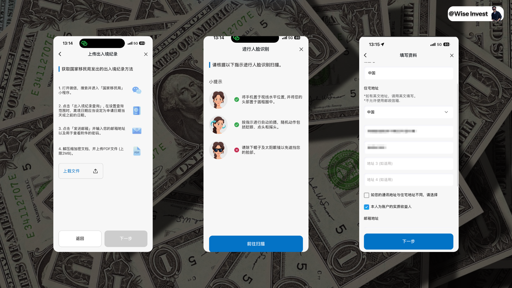

**5、** 完成邮箱验证码验证，而后就是填写咱们的收入和账户资金来源。
如果咱们不知道如何填写的话，直接按照图片来即可，然后账户用途也可以按照图片填写即可。 

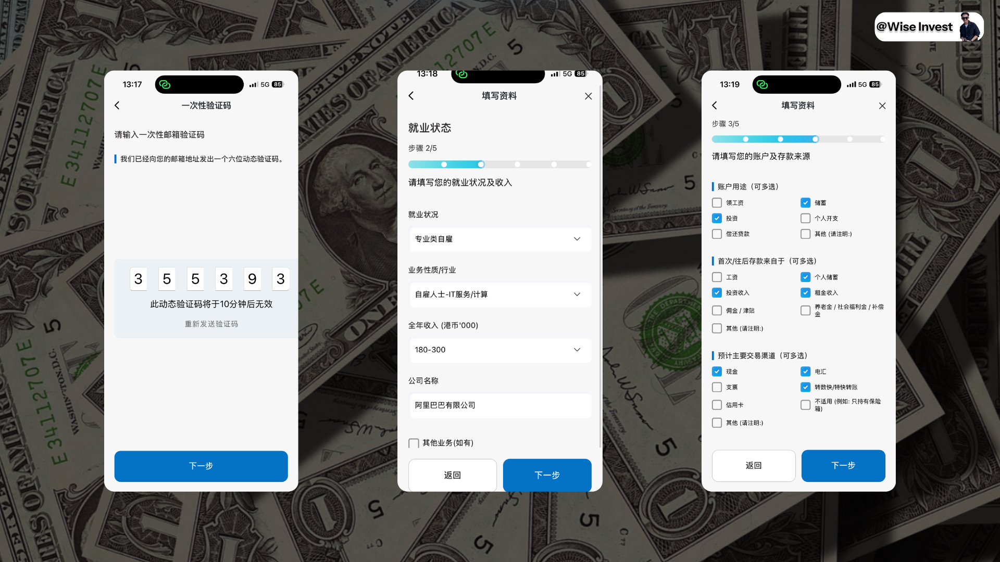

**6、** 每月交易次数、等额港币以及资金目的和来源如图一所示，网点服务的话可以选择铜锣湾支行，或者是尖沙咀支行，最后确定税务编号，以及咱们并非美国居民。

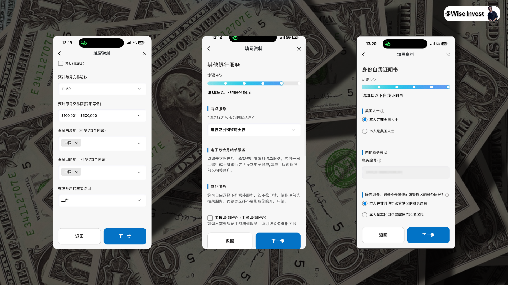

**7、** 最后一步就是同意自己并非其他管辖区税务居民，然后市场推广这里就不勾选、最后再度确定自己的地址信息即可。

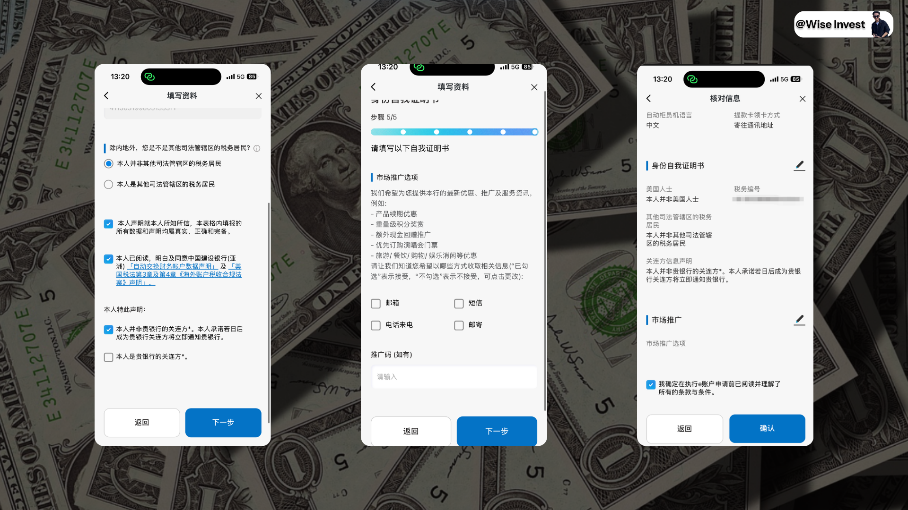

**8、** 最后就是输入你的登录用户名和确定登录的密码，即成功提交了审核。

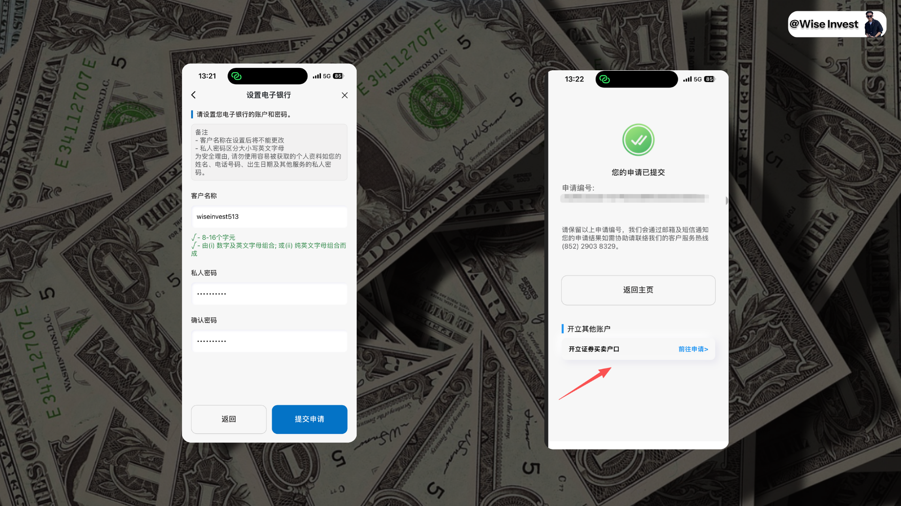

**9、** 这个审核很快，基本上审核通过之后的话，你就可以成功地登录了。

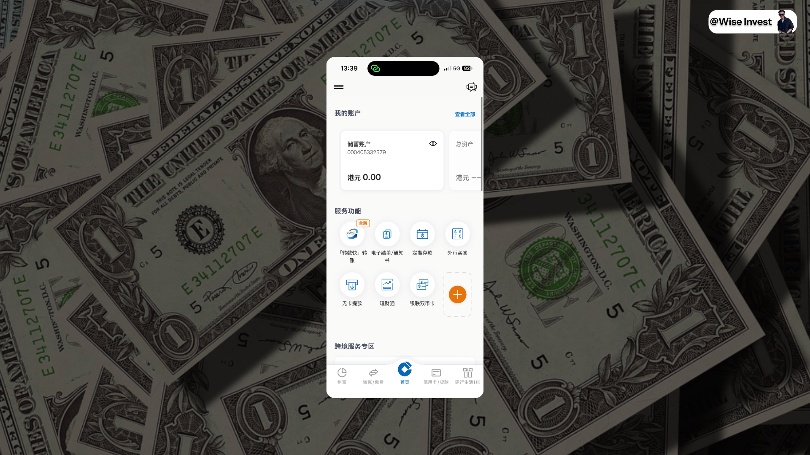

但是此时你好像并无法直接进行转数快操作，至于为什么，我们下面给大家进行详细的介绍。 
以上就是咱们关于开户部分的内容了，其实非常简单，内容也不多，难度也不大，大家按照流程走，基本上 10 分钟即可走完整个开户的教程。

## 四、建行亚洲投资

关于建行亚洲的投资部分内容，大家在完成正常的开通之后，可以点击进行开通，但是这里就有一个问题，那就是毕竟是实体银行，所以对比到数字银行的开通就要麻烦很多，需要大家携带自己的一些关键证件到线下的实体网点进行申请和办理，所以说就会有一些难度和麻烦。

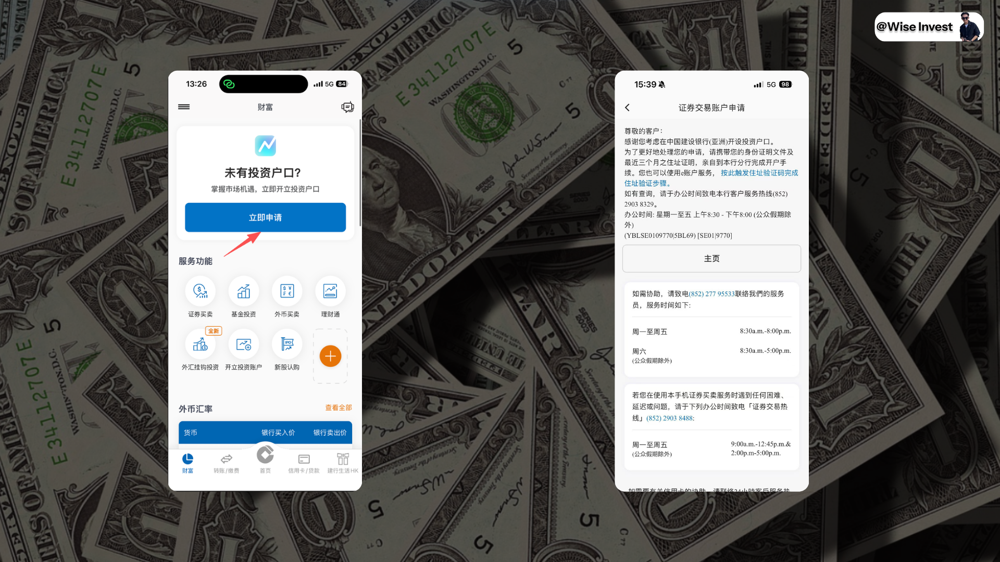

这里我当时在香港的时候觉得没有这个必要，所以我就没有开，大家可以自行参考是否准备开通此投资功能。 
这里多聊一下，其实我在前面聊到过 Ifast 的 IGP 其实也是类似的功能，这种来说我跟觉得主要争对的是你的资金量比较大，这样的话如果你在不同的银行里面进行互相的周转，其效率就会比较低，而且容易触发风控，所以多数时候用传统银行的这种交易的朋友都属于是大户。 
如果你资金量比较大的话，也欢迎联系我，我看如何给咱们进行结构化产品的优化了！

## 五、建行亚洲优点

开户成功后，建行亚洲的福利体系真正开始发力。
无论是现金直入账、高息定存，还是跨境消费回赠、投资佣金优惠，都围绕“新客引流 + 跨境联动 + 日常高回报”三大核心设计，性价比在香港银行中尤为突出。
下面我们按类别为你梳理当前最值得关注的福利（数据截至2026年4月底，以官网最新公布为准，促销名额有限，先到先得）。

**1、** 开户即享双重现金 + 高息定存（e账户新客专属）
通过「e账户服务」成功开户的全新客户，可立刻获得以下震撼礼遇：  
人民币200元现金奖赏：直接存入你的多种货币月结单储蓄账户（推广期内前46,000名，先到先得）。  
3个月港元/人民币定存5.88%年利率：开户后30个历日内，在App或网银叙做定存即可享受。 

 仅开立储蓄/支票户口：定存金额HK$50,000或等值人民币。  
同时开立证券户口：定存金额提升至HK$100,000或等值人民币。
完成开户 + 定存任务后，总奖励价值轻松超过HK$1,600（现金 + 利息）。

**2、** 贵宾理财 / 私人财富更高阶奖励
若你计划存入较大新资金（HK$100万或以上等值），可亲临分行晋身「贵宾理财」客户，进一步解锁：  
3个月定存最高6.88%年利率（阶梯式：首20%资金享6.88%，其余享标准贵宾利率）。  
额外迎新礼包：信用卡免找数签账额、盈富基金股票奖励、限量版999足金金卡等，总价值可达HK$13,380以上。
高端私人财富客户更可享高达HK$55,888综合奖赏。

**3、** 陆港通龙卡 + 银联双币借记卡跨境实用福利
实体卡（银联双币借记卡）到手并绑定内地建行账户后，即升级为完整陆港通龙卡，带来：  
内地建行/银联ATM取现低费或免手续费（视金额而定）。  
香港/海外消费自动从内地户扣款，反之亦然，无需手动转账。  
港元实时到账汇款（香港内地建行间免电报费）。  
银联云闪付绑定后，享受云闪付二维码消费额外优惠。

**4、** 信用卡消费回赠（日常高频回血）
eye Visa Signature信用卡：本地餐饮、外卖平台、交通签账高达11%现金回赠（每月登记，名额有限）。  
TRAVO World Mastercard：海外签账高达4%现金回赠（或HK$1.5=1里数），指定海外商户（Expedia、迪士尼、支付宝/滴滴等）更可叠加至15%。  
海外零售签账推广期内（部分活动至2026年4月底）：累积HK$8,000以上享6%额外现金回赠。
新信用卡客户还可叠加迎新现金回赠或礼品卡（最高HK$800+）。
小贴士与总结：建行亚洲的福利最大亮点在于**“开户红利 + 高息定存 + 跨境日常零成本”**三者结合，尤其适合有内地资金往来、频繁跨境消费的用户。
普通新客用手机开户即可轻松拿到200元现金 + 5.88%定存；资金较多者冲贵宾理财，回报更可观。  所有福利均需在推广期内完成指定任务，且账户需保持有效。
建议开户后立即在「建行(港澳)」App内查看「优惠专区」或「我的奖励」，锁定最新利率与名额了

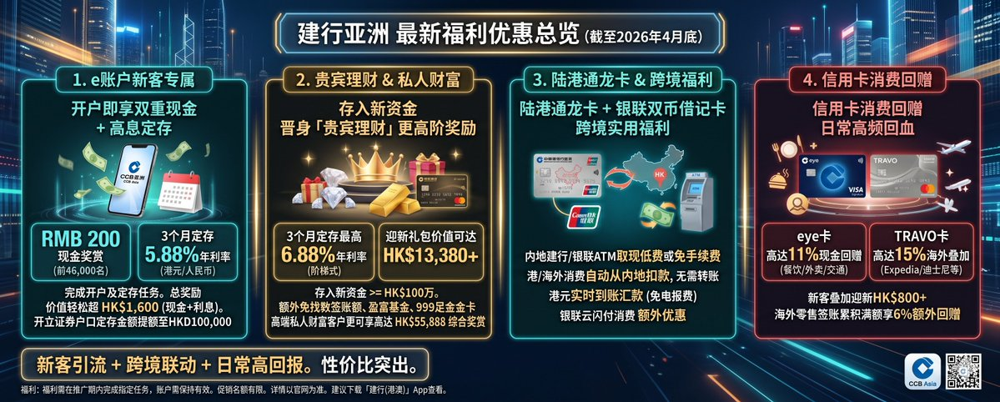

## 六、转数快转账

聊完了基础之后，我就想要来测试一下转账，结果发现无论是通过众安入金还是国内的建设银行入金最后都被驳回了，如下图所示：

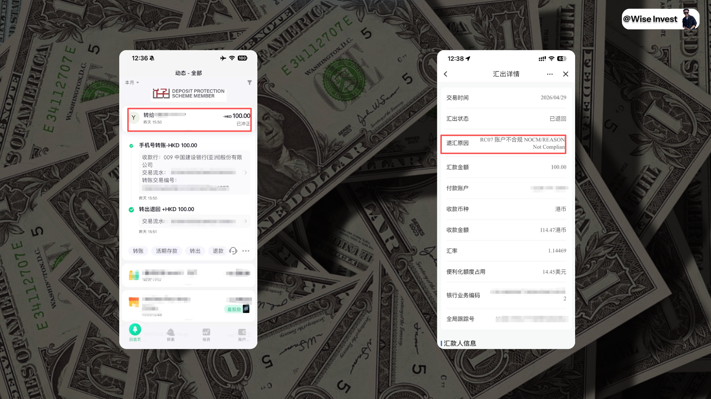

后面我去研究了一下发现，其实就建行亚洲的申请开通，他分为两个部分，
第一个部分是：初步申请成功，就是我们正常的状态。
你提交资料后，App 立刻显示「账户已开通」、有账户号码、能登录。
官网原话：“初步申請成功，戶口則準備妥當但暫未能作存款及提款之用。”

**第二个部分是最终审核 + 正式生效（你现在卡在这里）**

银行后台还要做最后一次全面复核（反洗钱、身份最终确认、跨境风控等）。

官网原话：“成功開戶後，本行會作最後審核，而存款戶口將於審核後啟動作存款及提款用途。”
“戶口最快 3 個工作天後生效。”在最终审核完成前，所有入金功能（包括本地转数快 FPS、跨境支付通、CHATS 等）都被系统锁住。
任何尝试转入的钱都会被自动拒收并冲正退回（这就是你众安银行转账被冲正的原因）。
那这个审核官方是说 1-3 个工作日，但是其实实际上我询问了一些朋友，基本上都是一个 7-15 天，到时候审核通过之后会给大家发邮件，所以到时候大家等待正常审核通过之后，再来通过这种方式进行入金。 
那转数快如何入金和如何具体操作，我们这里就不多展开了，大家可以先参考我们在众安这部分内容的一个介绍 
WiseInvest
@WiseInvest513
·
4月12日
众安开户&使用心得体会｜详细介绍转账、美股、ZA Card、福利政策，一篇文章带你了解完整的众安银行

## 一、写在前面

最近一段时间，我发现大家对于“购买美股”这件事情，开始异常感兴趣起来，就包括我国内的一些朋友，也都在找我咨询美股购买。...

## 七、汇款优势

那还有就是其实我们为什么需要建行亚洲/工商亚洲这些银行卡，其实主要还是转账和资金的流转会更加
这是建行亚洲最大亮点，同集团内转账优势非常明显：

**1、** 港元实时转账（香港建行亚洲 → 内地建行，或反向）：
实时到账（网银/App 操作，几秒到账）。
免电报费（电讯费） —— 这是普通电汇（TT）里最贵的那部分！
手续费：陆港通龙卡专属通道下很多情况下为 0 或极低（部分旧表显示 HKD100/笔，但当前跨境支付通/FPS 南向/北向经常豁免或大幅减免）。

**2、** 跨境支付通（转数快跨境版）：
港元 / 人民币 全程零手续费（截至目前持续豁免，直至另行通知）。
实时到账 + 实时换汇（即使没有人民币户也能从港元户直接转）。

**3、** 对比你转 iFAST：
普通电汇（TT）：通常 HKD50–100 手续费 + 电报费（HKD80–150+） + 中间行费用（可能再扣 HKD100–200） + 可能有汇率损耗。
建行亚洲同集团转账：基本省掉电报费 + 中间行费，总费用能省 70–90% 以上。
一句话：绑定陆港通龙卡后，港元在两地之间转就像本地转账一样便宜、快。
所以适合大家进行转账操作。

## 八、写在后面

以上就是关于建行亚洲的全部内容了，给大家详细介绍了建行亚洲的前世今生，具体的开户介绍以及其具体的优点介绍。
抛开具体的使用性不谈，其实和国内的一些银行卡进行一个紧密的结合还是挺好用的，因为就如果我们正常进行电汇的话，例如我们之前聊到过从兴业汇款到 Ifast，会有一个固定的损耗大概在 10 欧元左右，也就是 100 多样子。 
但是其实兴业银行，其日常使用的频率我们又没有那么多，多数时候我们的资金也都是在建行、中行、工行、招商等几大银行里面，所以用此就必不可少了。
那完整的流程我都已经给大家走完了，大家如果有规划前往香港办理港卡就可以准备操作起来了！
最后的最后，一直都有朋友问我有没有群聊，我说最近其实也建立起来了，目前群内加在一起也有近 1000 人了，我也在努力维持群的正常运转。
所以如果你想要找个地方和我一起交流聊天，可以直接扫描此二维码加入群聊，此二维码是活码，所以任何时候你有计划加入群聊，都可以扫码了，我们就群内互动交流和聊天了！
我们下期再见！

