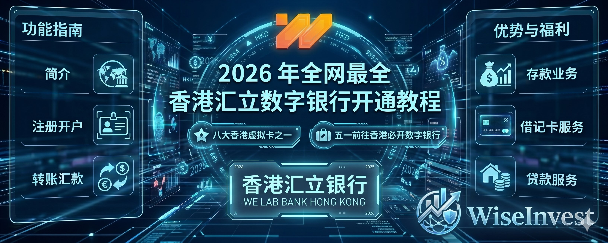
一、写在前面
哈喽，大家好这里是 WiseInvest，我是你们的老朋友 Wise！又来到了咱们开银行卡的课程分享了！
在前面我们已经介绍了有香港的实体汇丰、中银的开通教程、也有介绍众安、蚂蚁、天星等虚拟银行，这些基本上都需要大家前往香港进行办理。 
也有介绍 Wise、Ifast 这些不需要前往香港即可开户办理的线上数字银行！
那也有关于大家可以使用见证开户去开汇丰、渣打、恒生、东亚以及星展等银行，这些银行不需要前往香港，你也可以成功办理
具体的教程我放在下面大家进行自取。 
1️⃣、实体银行开户教程（汇丰/中银）
2️⃣、虚拟银行开户教程（蚂蚁/天星/众安）
3️⃣、WIse 开户教程
4️⃣、Ifast 开户教程
5️⃣、见证开户开卡教程
那距离我上次写去香港开卡的教程也有几个月之久了，上周我受邀参加香港的 web3 嘉年华活动，就抽空再去办理了几张银行卡，他们分别是汇立、平安数字银行、建行亚洲（建行港澳）、以及工商亚洲等四张银行卡！
所以最近几天时间，我们会把重心放在这四张卡的开通上，确保如果大家有计划前往香港办理港卡的话，可以一次性安排 9 张香港银行卡，基本上解决大家所有的用卡需求。
ok，话不多说，我们就即可开始本期的内容吧。
那同样的后续所有的内容，我们也都会同步到咱们的个人网站中，欢迎大家进入到网站中进行学习！
二、汇立介绍
那我们依旧是老样子，在开通咱们的汇立银行的基础介绍，让大家一起先来了解一下这个数字银行：
汇立银行2018年8月21日注册（当时名为WeLab Digital Limited），2019年9月改名为WeLab Bank Limited。同年4月获得香港金融管理局（HKMA）虚拟银行牌照，是首批获批机构中第一家本土创业公司。2020年7月30日正式向公众开放，是香港第三家开业的虚拟银行。

母公司：WeLab Holdings Limited（汇立集团），2013年成立的泛亚洲金融科技平台。集团业务覆盖香港、内地和印尼，服务超过7000万个人用户和700多家企业客户。WeLab Bank为其全资子公司

集团早期以WeLend在线贷款平台起家，后扩展至数字银行等领域。2024年完成WeLend并入银行子公司，2024年底实现首次整体盈亏平衡，是香港数字银行中较早盈利的之一。

存款与储蓄：GoSave 2.0定期存款：灵活起点（低至HKD10），AI辅助，利率具竞争力。支持目标导向储蓄。
储蓄账户：竞争性利率，无最低余额要求。

支付与转账：WeLab Global Wallet：多货币支持（11种主要货币）。
FPS实时转账、跨境汇款。
WeLab Global Wallet Debit Card（虚拟+实体Mastercard）：零外汇交易费、最优汇率保证、现金回赠，支持Apple Pay等。全球消费便利。

贷款：个人分期贷款、信用卡债务整合贷款。
保单贷款、Subscribe+（苹果产品分期）等特色产品。

投资与财富管理：GoWealth数字财富顾问（香港首家虚拟银行推出智能理财顾问）。
基金投资：零认购/转换费，与安联等合作，提供特色基金。

其他：Money Safe等工具，全天候App管理，e-KYC开户最快5分钟完成。
费用特点：大部分核心服务（如账户维护、Debit Card年费）免费或低费，强调透明和普惠。优势与创新科技驱动：自主风险管理系统、专利隐私计算、AI应用突出。推出香港首个AI-powered FX服务等。

安全性：受香港存款保障计划保护（最高HKD 500,000起，视最新规定），实时通知、强认证。
普惠金融：低门槛设计，助力更多人（包括年轻人和中低收入群体）享受优质金融服务。

合作伙伴：Google（AI）、Allianz Global Investors（投资）、Apple/Tesla（生态整合）等。welab.bank业绩与奖项（截至2025-2026最新）

业绩：2025上半年收入约HK$4.6亿（约7000万美元），同比增长约70%，净息差10.7%（远超市场），持续盈利。香港按收入计最大数字银行。

奖项（部分）：Euromoney 2025：香港最佳消费者数字银行、全球Top 20数字银行。
FinanceAsia 2025：香港最佳数字银行、香港最佳普及金融银行。
香港中文大学：香港最创新数字银行。

其他：Cybersec Top Contributor等。
市场地位作为香港8家虚拟银行之一，汇立银行以本土创新和盈利能力脱颖而出，已成为香港数字银行的标杆。它
不仅服务本地居民，也吸引访港人士和注重便利的客户。目前用户规模稳步增长，集团正借助香港经验扩展东南亚（如印尼Bank Saqu）。
三、汇立开通
了解完毕汇立之后，我们可以发现其综合实力来说还算是不错，虽然说算不上非常强，但是也有自己的特点和侧重心，也适合对其不同的功能有特定需求的朋友。
ok，那我们下面重点来介绍如何开通汇立。
那我们在开始开通之前，依旧是进行一些前提材料的准备。
1️⃣、正常接受验证码的邮箱。
2️⃣、开通了漫游，可以正常接受验证吗的手机号码
3️⃣、身份证、港澳通行证、出入关证明。
4️⃣、此时人就在香港。
那如果不知道如何安排行程的，可以参考我之前写的入关和旅游教程。
ok，在我们准备好所有的材料之后，我们就正式开始开户的教程吧。 
1、打开应用商店检索 WeLab Bank 进入到开户界面，点击开立账户、然后点击身份证进行开户，其会告诉你需要准备的一些条件，也会告诉你如何获取到出入境记录。

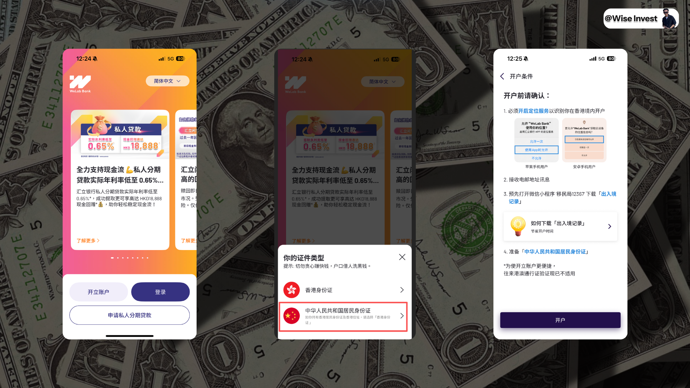
2、然后就是输入自己内地的手机号码，拍摄自己的身份证证件，以及进行自己的人脸识别验证走认证流程。 

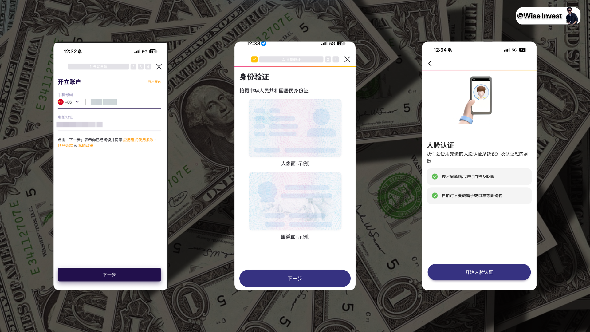
3、而后识别之后，即可看到自己的身份证信息是否正确合适一下，点击下一步即到了咱们的上传地址证明这一块。 
到这里之后你可能会遇到一个问题，那就是下载证明很简单，但是下载之后好像找不到在哪里上传，这里我给大家演示一下。
大家下载之后，用微信打开然后选择其他的应用打开，然后选择保存到自己的文件里面。

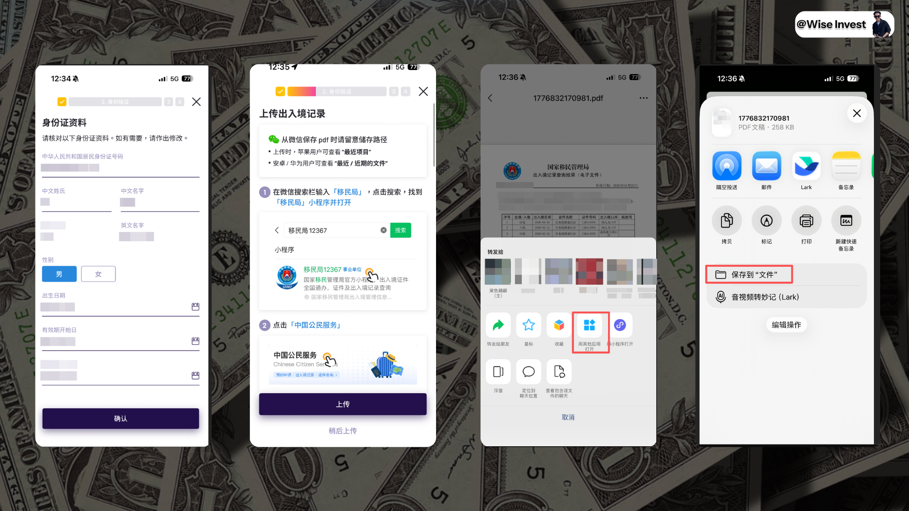
4、接着你上传的以后，既可以看到自己最新保存在文件里面的这个文件，点击上传，而后确定你当前的国籍地区，即中国！

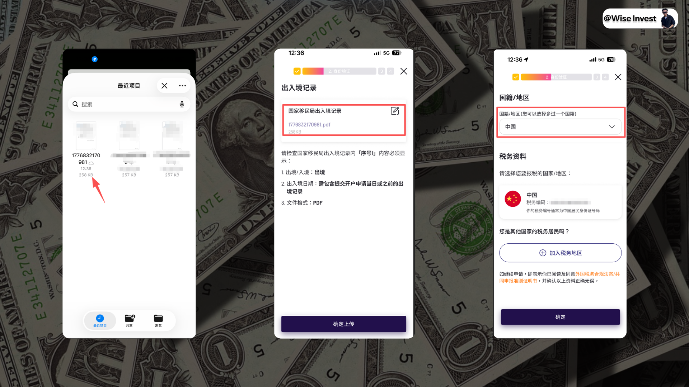
5、完成自己用户名和密码的填写，这里注意密码填写其键盘比较别扭，所以注意写慢一些，不要弄错了登陆不上去。

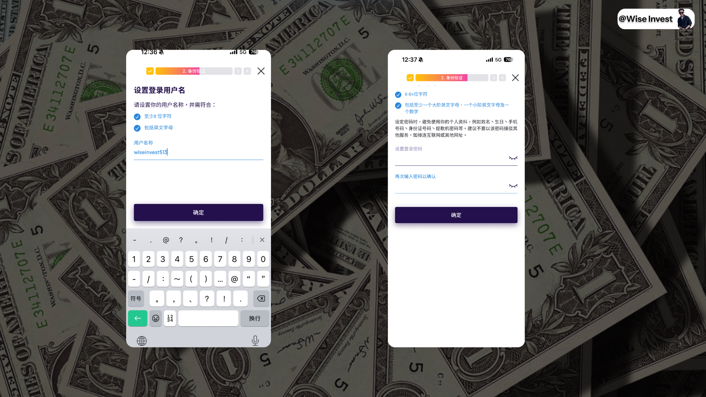
6、而后就是确定自己的交易密码，一般都是六位数的密码，接着地址如果你没有其他的地址安排，就写自己身份证的地址即可，问你要不要申请借记卡，这里我们暂时跳过。

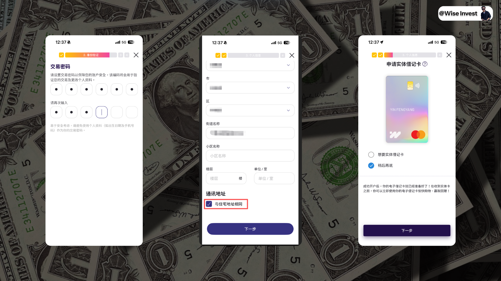
7、接着就是记录自己的工作资料和你自己的账户资料，如果你不知道如何进行填写可以参考我的记录进行填写，最后确定自己没有任何犯罪证明。

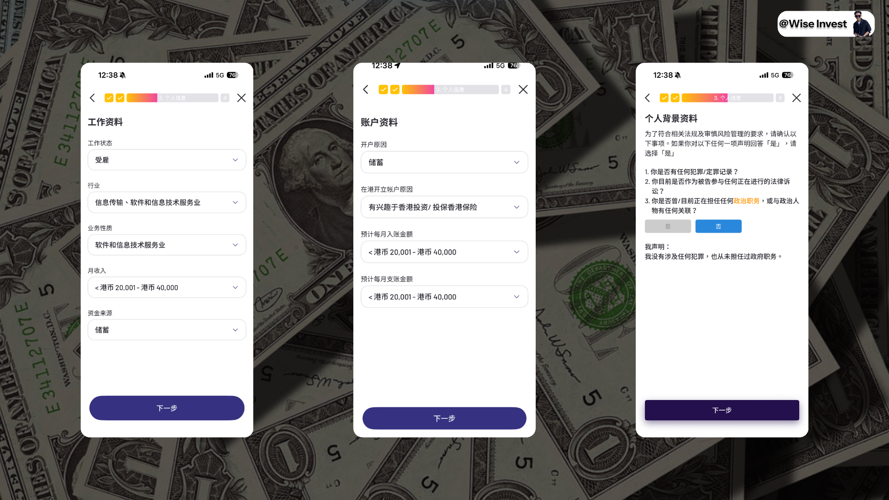
8、而后就是推广信息设置成为默认勾选，在邀请人这里可以输入 FPNLGF，我的个人邀请码，后续可以领取福利，最后阅读完毕这个客户声明即可。

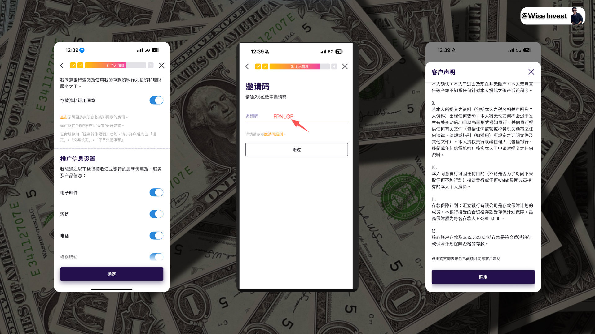
以上就完成了基本账户的申请，下面开始申请开立投资账户
1、点击开始开立投资账户，学历正常填写、投资年限写五年或以下，而后经验就写债券、股票，基金等产品，投资资产按照实际情况进行填写，第三档不会很高，也不会触发风控，建议填写。

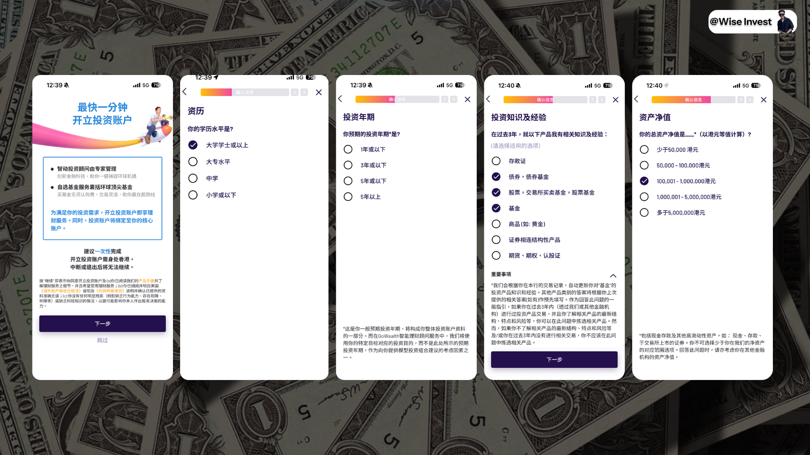
2、选择自己不是持牌人、而后确定信息，最后提交文件，其会说你的信息不需要提供任何文件。

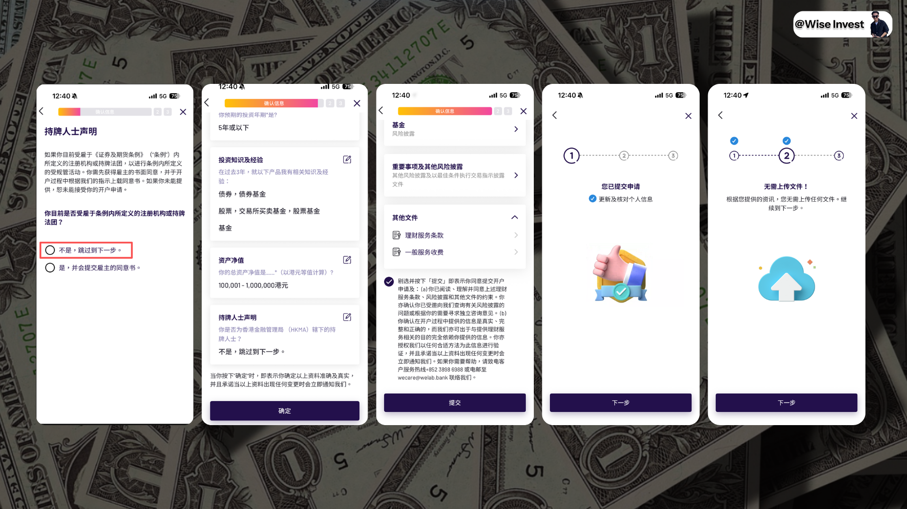
3、审查一下你的一些投资风险，如果你拿不准，直接按照我截图的选择进行勾选即可。

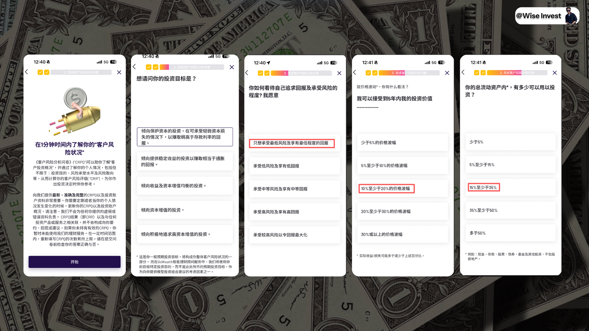
4、继续勾选投资情况，最后即可成功提交所有的选择，后续耐心等待审核通过即可。
完成整个流程申请不算非常复杂，这个也基本上付费数字银行的申请流程，只要你此时人在香港、有基本的材料证明都可以完成开户。

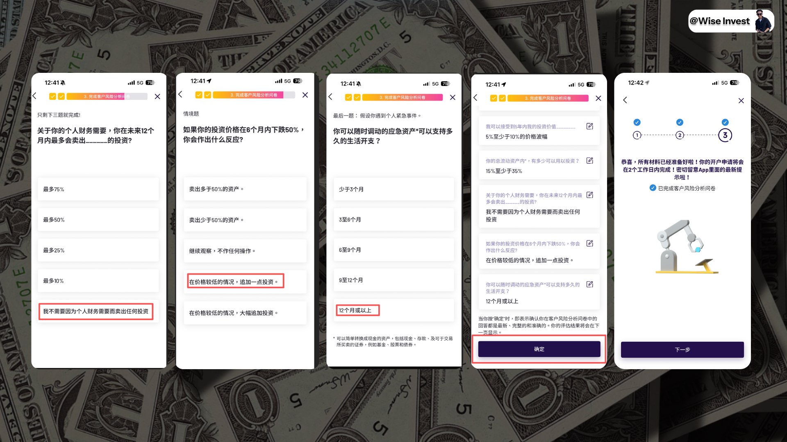
四、入金转账
完成开户之后，我们就来直接尝试转入资金，资金的转入如图所示我们有三种转入的方式，第一种是香港银行正常转账、第二种是转数快、第三种是内地转账。
大家不知道还记不记得我们之前在众安银行详细讲解那一期里面聊到的转数快，这里我们就实操一下。
1、我们打开汇立银行，而后点击存款。

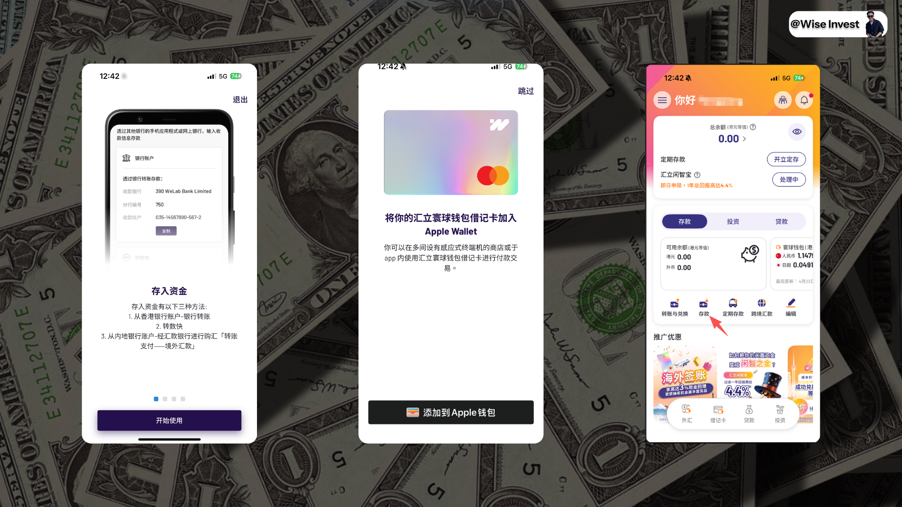
2、我们采用转数快的形式，如果是这种形式我们默认就需要登记自己的手机号码/邮箱作为入账的唯一标识。

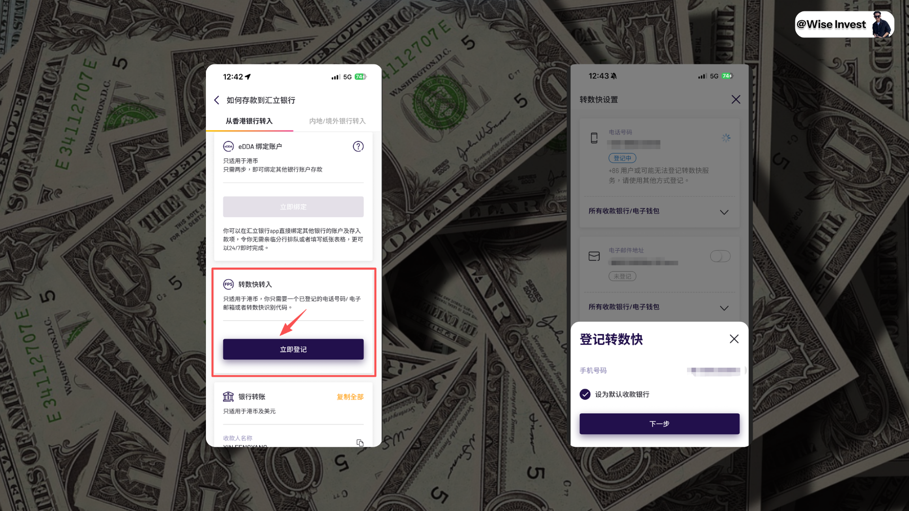
3、接着咱们打开咱们的天星银行，选择转数快转账，然后输入手机号码，接着勾选新收款人。

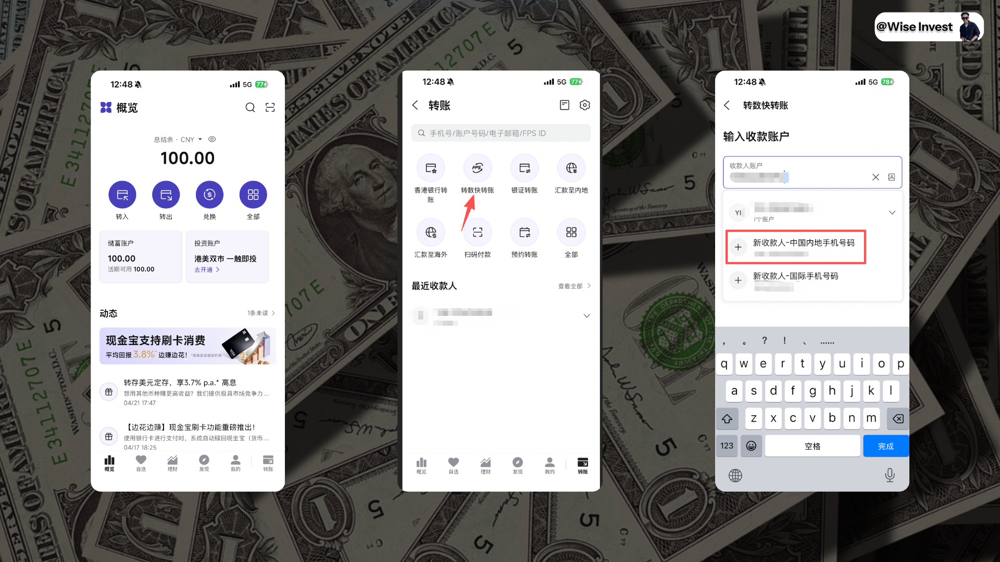
4、我们勾选新收款人，意思就是这个手机号码我们要转账给不同的银行，因为之前我们转账给众安，所以这次重新选择 WELab Bank，就是汇立，接着点击确定，即可看到手续费是免费的，然后到账时间是及时的。
最后我成功转入了 100RMB，核算成为港币是 114 港币！

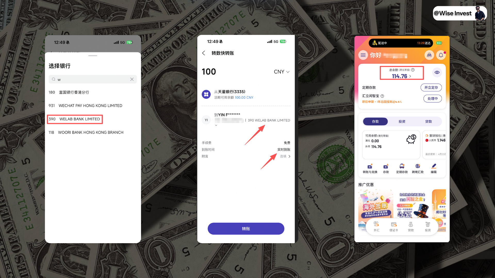
以上就是汇立转账的完整流程了 ，其实有了转数快，我们还可以使用国内的建行、中行、农业银行、招商都这样安排操作，都是无损+快速到账，解决大家资金流转的焦虑
五、汇立福利
那聊完了开户和转账之后，我们来聊一下汇立目前的一些福利情况，其实我们参考到众安的一些介绍而言，就目前的汇立来说同样如此，我给大家做一下小的总结。 
1、存款
 定额存款（GoSave 2.0定期存款）这是汇立最强卖点之一——低门槛、高灵活、利率竞争力强，最低HK$10就能存，随时随地App操作，还能参加“群聚效应”加息。最新基准利率（2026年4月21日参考，HKD）：
1个月：0.50%
3个月：2.20%
6个月：2.40%
9个月：2.42%
12个月：2.45%（目前最高）
18个月/24个月：2.25%
外币定期也支持（USD、CAD、EUR等），部分有额外FX优惠。
当前重点福利（新客/限时）：新客户开户后14天内，可享4% （1个月定期，指定本金HK$80,000或HK$200,000）。
美元FX定期存款促销（4月20日-5月3日）：完成HKD→USD兑换 + 存1个月定期，可额外获1% Bonus Interest，最高可达4% p.a.。
还有“快闪”或节日加息活动（历史曾达9.8%，目前稳定在2.4%左右）。
规则 & 优势：
随时开户、随时提取（提前支取有罚息，但比传统银行灵活）。
利息到期一次性派发到核心账户。
核心账户活期利率仅0.01%，所以定期是主力。
小贴士：利率每日更新，App里会显示实时群聚人数决定最终利率。新客福利最香，建议开户后立刻冲1-3个月定期锁利率。 
2、借记卡
借记卡使用规则：汇立首推的多币种万事达借记卡（虚拟卡+实体卡），主打“Best FX rate + 0手续费 + 现金回赠”，海外消费神器。
核心规则：
支持11种主要货币（HKD、USD、EUR、GBP、JPY、CNY、AUD、CAD、SGD、CHF、NZD）。
 外汇兑换：App内实时锁汇率，成本价（0 markup）+ 0外汇交易手续费（传统信用卡通常1.95%）。
消费回赠（2026年4月1日-5月10日限时）：
 1️⃣、本地消费：最高0.2%
 2️⃣、海外消费：最高3%
 3️⃣、每笔交易回赠上限HK$50（或等值），每月自动入核心账户。
 支持Apple Pay / Google Pay，全Mastercard商户通用。
全球提款：香港JETCO + 海外Mastercard/Cirrus ATM，直接从对应货币账户扣款。
其他费用：无年费、无外汇手续费，透明度高。
小贴士：绑定微信/支付宝海外消费也算“海外”，回赠到账很快（通常2-3个工作日）。实体卡寄送免费，适合经常出国或海淘的用户。 
3、贷款
贷款利率（私人分期贷款 / 清卡数贷款）汇立贷款以超低APR + 现金回赠闻名，特别适合大额资金周转或整合高息卡债。
最新利率（2026年4月）：

1️⃣、私人分期贷款：实际年利率（APR）低至0.65%（包含现金回赠）～36%。
示例：借HK$283,000，还款24个月 → 0.65% APR（含HK$3,000现金回赠）或1.68%（无回赠）。
贷款额：HK$10,000～1,500,000，还款期6～60个月。
2️⃣、清卡数贷款：APR约**4.11%**起（适合整合信用卡债务）。
3️⃣、公职人员/专业人士专属 / 免文件贷款：利率更优（0.65%起）。
优势：
手续费常有免除。
日息极低（HK$300,000贷款每日利息约HK$6）。
审批快（App内几分钟提交，最快1天放款）。
注意事项：最终APR看个人信用、收入、贷款额。借钱前一定要算清楚还款能力，官方强调“还得到先好借”。

六、写在后面
以上就是咱们关于汇立银行的全部介绍和开通教程了，从汇立基础的开立和银行介绍到具体的开通和注册教程，再到具体的转账入金以及目前汇立银行的福利教程等。
以一篇文章的形式带所有的朋友们重新认识一下汇立银行，也重新了解这个数字银行。 
如果上面的内容对你有帮助，也欢迎大家给予我一些支持，一键三连就谢谢大家了。 
正如我在前面聊到的一样，我说上次咱们去香港开了四张银行卡，所以咱们下一期给大家分享一下“平安数字银行”这个香港虚拟银行。
那其实他之前是叫做“”，只不过现在改名了，而等到下一期内容写完之后，咱们关于香港虚拟银行目前还能够开的就全部给大家介绍完毕了。  
后续就是建行亚洲和工商亚洲的开通和介绍了，秉承咱们的目标即打通这个整个出入金的系列和流程了，我也持续在路上！
最后的最后，一直都有朋友问我有没有群聊，我说最近其实也建立起来了，目前群内加在一起也有近 1000 人了，我也在努力维持群的正常运转。
所以如果你想要找个地方和我一起交流聊天，可以直接扫描此二维码加入群聊，此二维码是活码，所以任何时候你有计划加入群聊，都可以扫码了，我们就群内互动交流和聊天了！

欢迎大家点赞和支持我们下期再见！