## 一、写在前面

在前面我们聊到过**香港蚂蚁银行**开户教程，以及一些虚拟/实体银行的开户教程，如果你计划准备在新的一年里面开始投资港美股，可以重点关注一下我的网站哦。

例如你可以查阅此链接：[Wise 投资路线图](https://www.wise-invest.org/roadmap)，里面有较为详细的关于美股投资指南与教程。

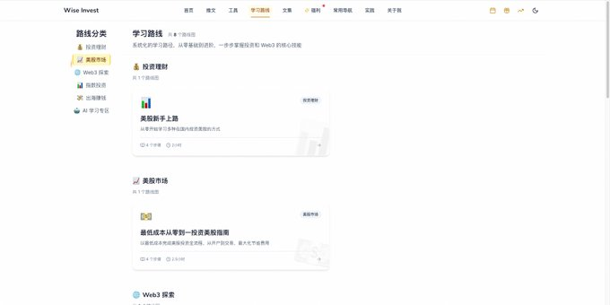

并且一直都在更新与迭代最新的功能，后续也会是我们所有内容的集合地，保持**终身免费**的责任感，让大家可以放心学习！

所以大家可以收藏此网站到自己的浏览器收藏夹里面，如果遇到任何想要学习的内容，都可以来推文里面进行检索学习！

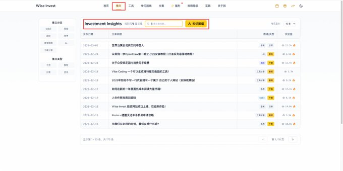

ok，那咱们继续回归到正题。就过去而言，其实我们分享的都是香港的一些银行，有朋友就问我有没有一些**澳门的银行**推荐，其实也是有的。

我在今年 2.10 号的时候去香港参加 Bitget 春宴之前，提前去澳门处理了一些事情，其中就包括办理**澳门蚂蚁银行**，最近一段时间也有了一些使用和体验，觉得还不错，这里就给大家分享一下。

如果大家在新的一年里面已经有规划准备开始投资港美股，那可以开始准备起来了！

看此教程：[港澳游&开港卡教程](https://www.youtube.com/watch?v=8zzn-IHIBIk)

先到澳门，可以顺手开一个**澳门蚂蚁**，然后等到了香港之后，再去开香港的几家实体/虚拟银行。

---

## 二、政策 & 介绍

### 2.1 介绍

那关于澳门蚂蚁银行，目前是**全澳门最大的数字银行**，并且可以做到全程线上开户，**0 门槛、0 管理费**，针对内地用户是非常友好的，而且有线下门店，支持存取款。

具体网址如下：[antbank.mo](https://www.antbank.mo/about)

具体更加详细的介绍，可以看此图：

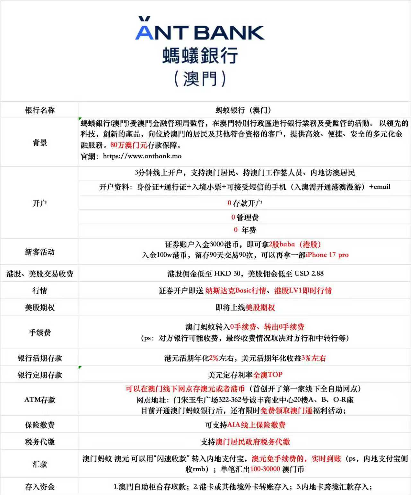

其实开户的条件也非常简单：

1️⃣、准备好**内地身份证 + 港澳通行证**。
2️⃣、年满 **18 周岁**，并且此时人就在澳门。
3️⃣、准备好**澳门入境证明**凭证。
4️⃣、准备好对应的**电子邮箱 & 可以接收验证码的手机号**。

> PS：基本上开户的条件和其他的香港银行没有两样，申请的时候需要咱们在澳门，后续的审批阶段以及激活阶段，咱们都是可以离开澳门的。

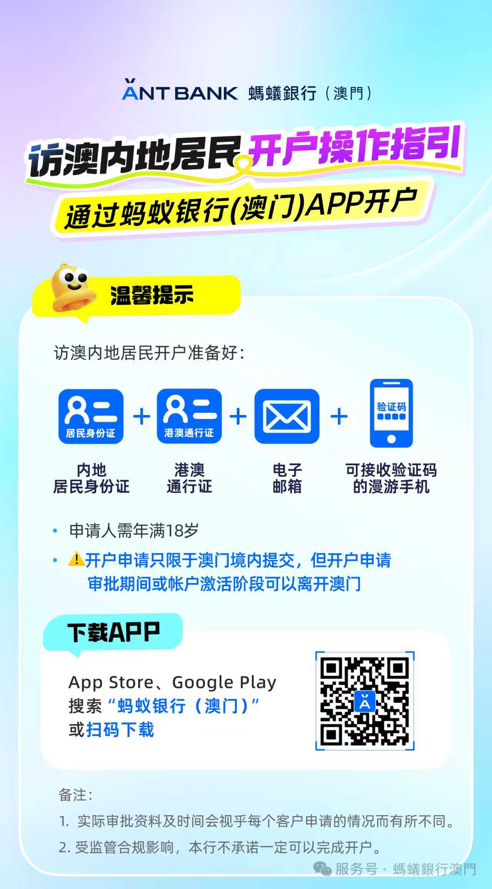

那这里有朋友就说了，其实已经有了**香港蚂蚁**的话，为什么还要开**澳门蚂蚁**呢？这里对于香港蚂蚁和澳门蚂蚁来说是两个独立的 App，但是澳门蚂蚁还有一个功能是香港蚂蚁没有的，即其可以**交易港美股，开通证券账户**！

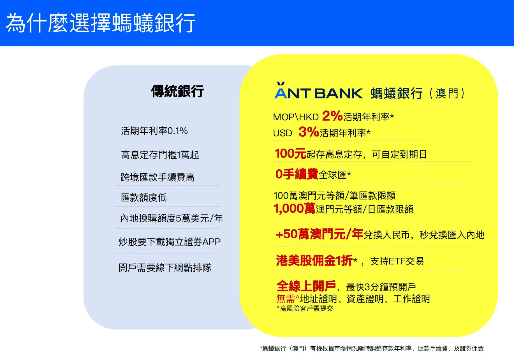

如果大家到了澳门，想要自助服务的，可以前往此**线下服务网点**进行存取款动作。

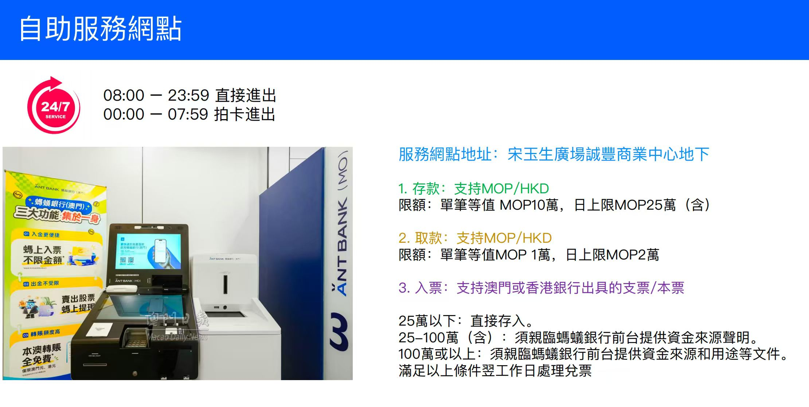

### 2.2 开户奖励

ok，聊完了基本介绍之后，咱们来聊一下开户的**奖励与福利**！

每一个证券、银行开户其实都有不错的奖励，目前澳门蚂蚁最近的发育路政策也都还不错：

1️⃣、入金 **3k 等值港币**，即可领取 **2 股阿里巴巴股票**，价值 340 港币。
2️⃣、入金 **100 万等值港币** & 交易 90 次，即可领取 **9399 港币 / iPhone17 一部**。
3️⃣、转入之后 **3-5 月**完成任何一笔交易，即可再领取**阿里股票**一只。

具体福利如下（每个月有所不同）：

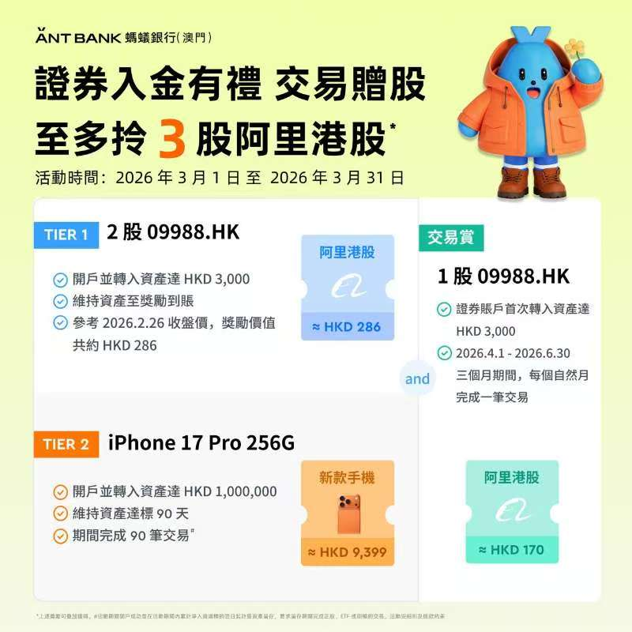

相比于其他券商/银行动辄上万港币入金，**3k 的额度**不算高，大家如果想要开的话，记得入金，领取奖励，后续还可以直接进行交易！

---

## 三、开户指南

ok，那介绍完毕了基本的情况和对应的福利之后，那咱们就来具体的开户流程了！

大家可以直接扫码，走我的**专属邀请链接**：

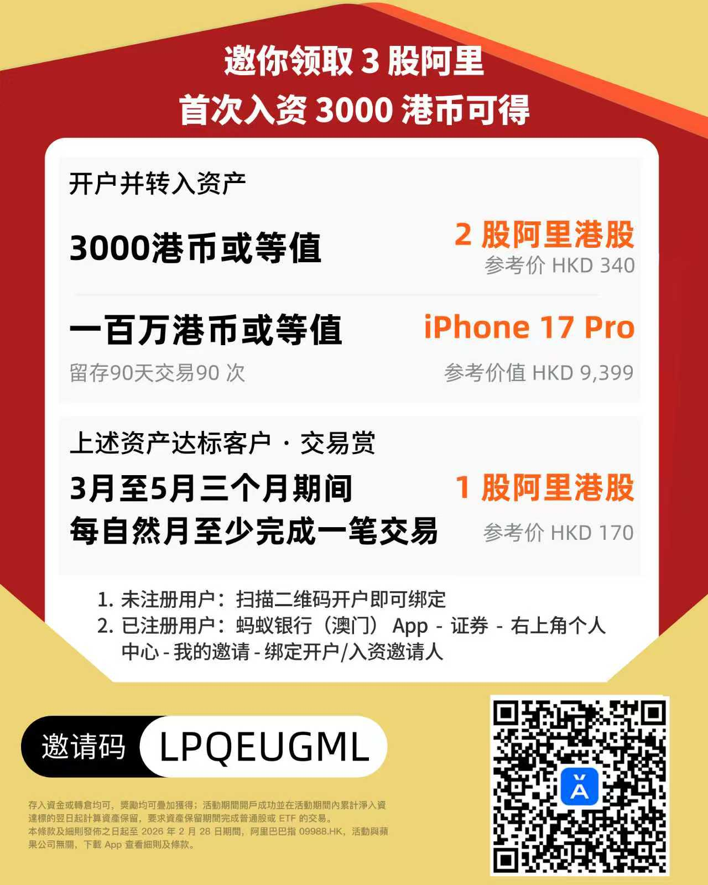

那也可以直接复制此链接到浏览器：[点击注册](https://render.alipay.com/p/c/180020570000149153/index.html?invite-code=LPQEUGML)，而后选择开户，切换到 **+86** 手机号进行注册。

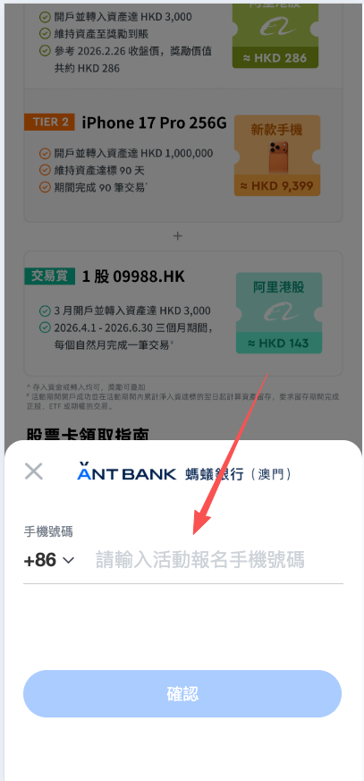

具体的开户流程，大家打开链接，然后按照此图进行学习即可：

**1️⃣、确定自己的位置，准备进行开户：**

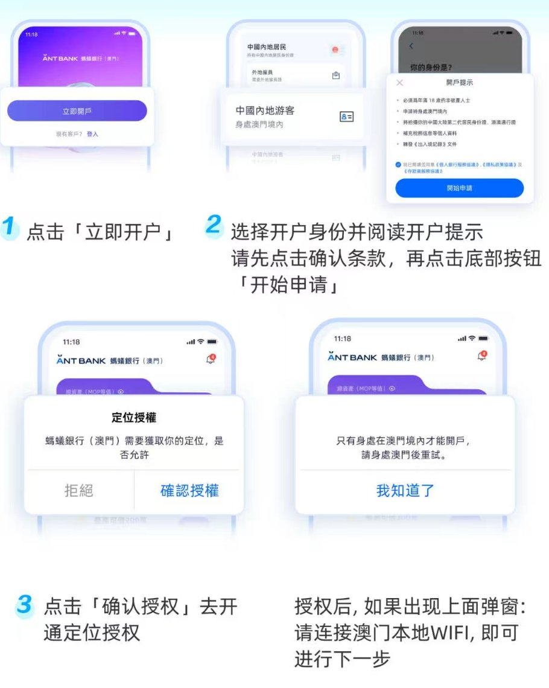

**2️⃣、输入自己的手机号码，拍摄证件，准备核验人脸：**

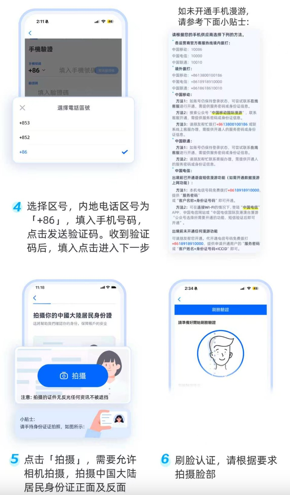

**3️⃣、拍摄港澳通行证和补充其他的地址位置等信息：**

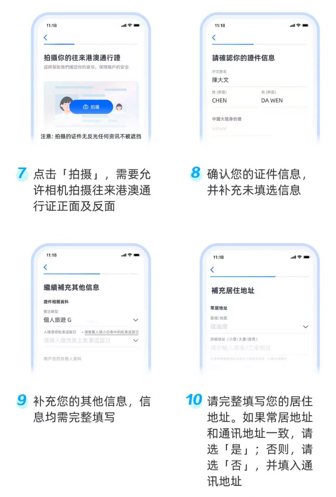

**4️⃣、最后验证邮箱和填写密码：**

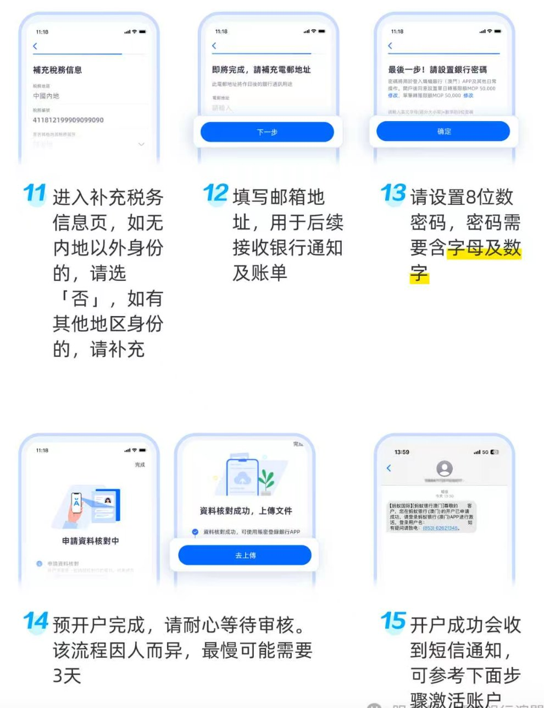

ok，以上就完成了完整的申请流程了，整体的流程其实相对简单，对比去年咱们开户的虚拟银行差不多，都是此等流程。是因为虚拟银行主打一个**简单 + 高效**，实体银行的话，要求可能就会多了很多了。

那这里大家注意一下，大家一般都是先通过邀请码注册账号，然后再去下载对应的 APP，那如果大家直接通过 APP 注册的，可以通过此教程去绑定 Wise 的邀请码：**LPQEUGML**，这样的话入金可以领取到独家福利呀，在此也感谢大家的支持啦！

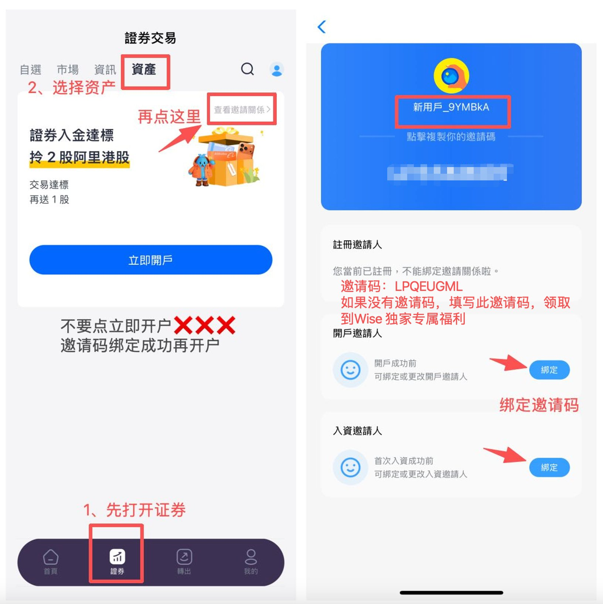

---

## 四、写在后面

ok，以上就是咱们今天的全部内容了，给大家详细介绍了**澳门蚂蚁**的基本情况、福利政策以及开户的整个流程了！

我前一段时间开户的，最近一段时间体验了一下觉得还不错大家可以去尝试一下，主要是我觉得如果你想要**交易港美股**，其实可以试一试澳门蚂蚁。

那同时即是银行卡，又可以交易港美股的还有咱们的**众安银行**，关于众安的开户可以查阅此教程：[众安开户教程](https://www.wise-invest.org/s/02dv2c79)，大家可以填写邀请码：**T659B7**，获取到咱们的独家福利啦！

其实这里我多介绍一下众安，如果大家觉得推荐了那么多的卡不知道开谁，那就**实体汇丰、虚拟众安**，目前众安卡不仅仅可以入金盈透/长桥等，而且还可以直接**绑定在国内的微信**中进行使用，神卡无疑了，这个推荐大家都可以去安排一个，十分方便。

所有的教程，在咱们的 [YouTube 频道](https://www.youtube.com/@WiseInvest513) 中也都有介绍，大家就自己前往学习啦！

那如果你觉得本期的内容对你有帮助的话，记得给我**点个收藏和点赞**哦，大家的支持也是我持续更新的最大动力啦！

**我们就下期再见了！**

