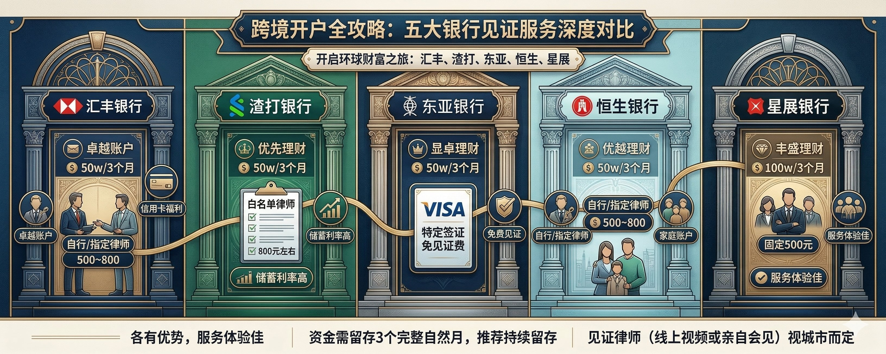
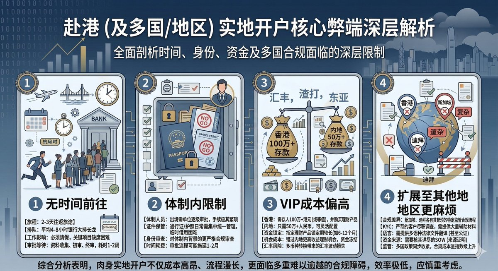
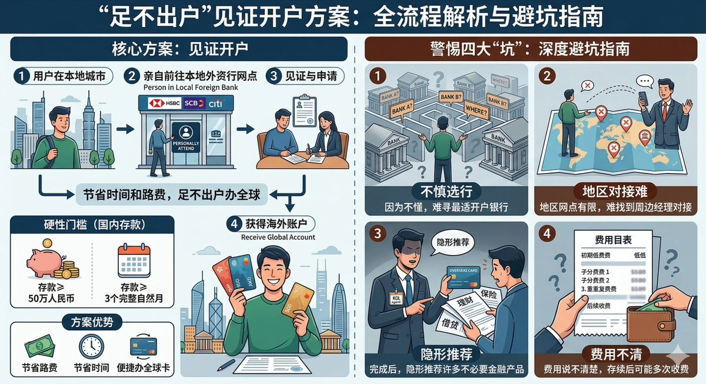
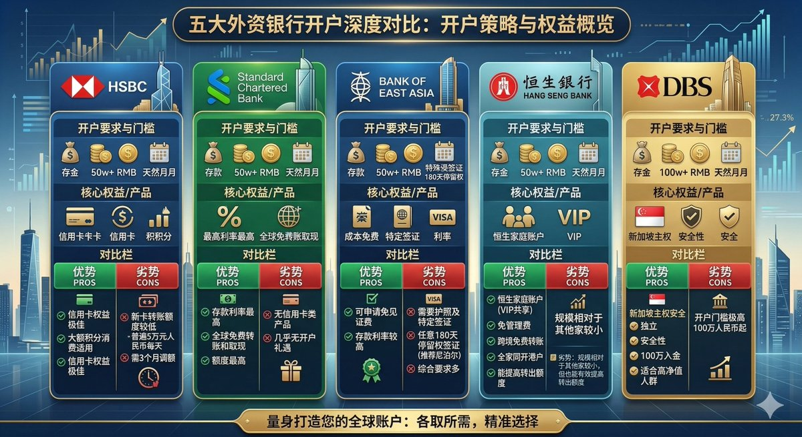
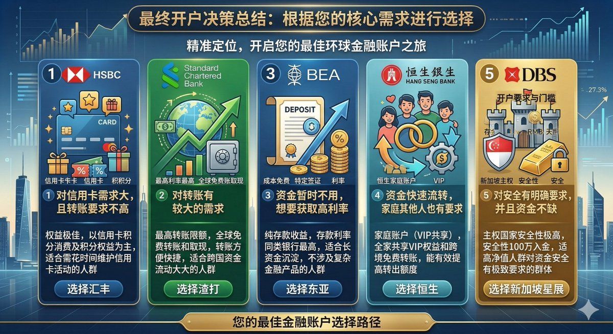
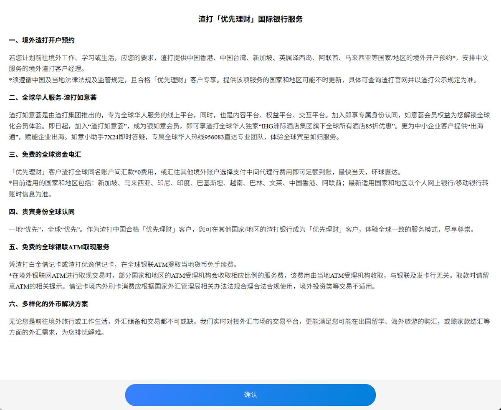
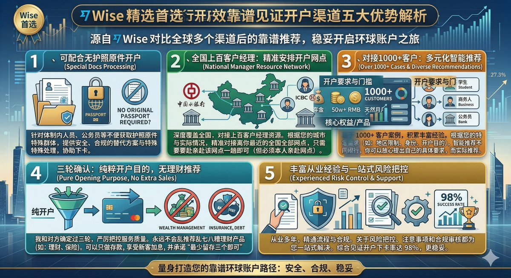

## 一、写在前面

想象一下，你并不需要肉身前往国外，你只需要在某一个银行里面存入 **50 万/100 万**资金三个月，即可同步获取到该银行的香港/新加坡/迪拜/泰国/英美/马来西亚的境外账户，请问这样的境外银行卡获取方式你会行动吗？

**那这个就是我们今天视频里面主要讲到的：见证开户**

在过去我已经聊了很多关于银行开户的内容，例如**汇丰/中银/众安/蚂蚁/天星/Wise** 等，这些实体的和虚拟的！
但是这些主要也都是针对于大家**肉身前往香港**办理港卡这种情况，但是这种情况也会有一些弊端存在：

1️⃣ 很多用户说实在是没有时间前往香港办理，那这些教程可能适用性就没有那么高了
2️⃣ 一些体制内的朋友们可能护照和通行证都无法拿到原件，也无法前往香港办理
3️⃣ 想要开 VIP 账户的一些朋友，例如汇丰的卓越账户、渣打的优先理财、东亚的卓显理财，如果人前往香港可能就需要你存款 **100 万**，但是相比于内地见证开户而言只需要 **50 万**即可轻松搞定
4️⃣ 不只是想要开香港的银行，再或者是新加坡、迪拜等地区银行，日常就会比较麻烦，无法办理！

那这些问题不只是前往香港无法办理的弊端，而且还是你如果没有合适的渠道存在的一个严重的弊端！那这种问题有没有解决方案呢？其实也是有的！

---

## 二、解决方案

其实这种人在家里、即可委托别人办理的，有一个比较完整的方案，那就是**见证开户**：

> 💡 **见证开户**：即只需要你本人亲自去所在城市的外资银行网点，就可以直接申请香港、迪拜、新加坡等境外账户（而不用本人真的去海外，节省时间和路费）。**唯一的硬性门槛是需要在国内存款至少 50 万且至少 3 个完整的自然月。**

其实这种方案是否靠谱大家都可以在网络上进行验证，各个平台也都会有很多这样的客户经理在接这样的客户，但是我在深度去聊了那么多之后，我发现里面的坑实在是太多了：

1️⃣ 因为自己不懂，所以你在寻找的过程中很难找到最适合自己开的银行
2️⃣ 如果找到了合适的银行，每个地区的网点也都会有限制，很难找到在自己周边的客户经理帮助你进行对接
3️⃣ 找到了对接之后，对方只是为了拉人头，帮助你完成开户之后，也会隐形给你推荐很多你不要的东西
4️⃣ 费用说不清楚，后续可能存在多次收费！

这些也都是我在实操中感受最深的点，其实说白了就是一个关键的点，全部都是因为**信息差**，而信息差这种东西，就最需要你找一个真正懂的老师去了解去学习！

所以今天我就以一篇文章，来给大家详细讲解一下就我目前了解到的关于**汇丰银行、渣打银行、东亚银行、恒生银行以及星展银行**这五家银行在当下最新的开户条件！

以及不同银行之间到底有什么区别，不同的情况到底适合哪一家银行，什么银行适合转账、什么银行适合家庭等，一篇文章给大家讲清楚！

---

## 三、简单对比

首先来聊一下各家的优势和劣势吧：

### 汇丰银行

- **优势**：信用卡权益极佳，适合国内外每月大额积分消费的人群，且需要花时间维护信用卡活动
- **劣势**：目前新开储蓄卡转账额度较低，普遍为每天 **5 万元人民币**，需要三个月后才能调额

### 渣打银行

- **优势**：存款利率同类银行最高，且转账方便快捷，**全球免费转账和取现**，且额度最高
- **劣势**：没有信用卡类产品，几乎没有开户礼遇

### 东亚银行

- **优势**：可以申请**免除见证费用**；存款利率较高
- **劣势**：需要护照以及任意 **180 天停留权**的签证，推荐尼泊尔，综合要求较多

### 恒生银行

- **优势**：恒生家庭账户（**优越理财 Family+**）：一人存 **50 万**达标优越理财，全家 **3 位直系亲属**（配偶/父母/成年子女）共享 VIP 权益、免管理费、跨境免费转账、同开香港账户
- **劣势**：规模相对于其他家较小，但能有效提高转出额度

### 星展银行

- **优势**：新加坡独立主权国家，安全性高，适合高净值人群
- **劣势**：开户门槛较高，**100 万人民币**起

---

## 四、详细对比

以上是简单的对比，下面我再根据每一家银行详细的对比，给大家一个详细的介绍：

### 汇丰卓越 VIP

汇丰我们了解的比较多，我们之前也开过汇丰的卡，是汇丰 One，卓越就是需要充值 **100 万**，而如果在内地通过见证开户的方式就是只需要 **50 万**即可。

**见证费**大概就是 **500-800**，这笔钱是见证费，是给律师的，汇丰这一块管控不严格，一般是这个价格，那如果你想要省钱的话，可以去小红书找人 **350** 其实也是可以搞定的。

做的比较好的是**信用卡权益**，就是我们之前聊到的**红蓝狮子卡**，所以比较适合平时有大额消费的人群，信用卡需求大人群。

但是劣势也非常明显，那就是额度早期确实比较有限，**单人单日在 5 万元人名币**左右，需要**三个月**之后方可调额。

### 渣打优先理财 VIP

渣打我们聊到的也挺多，关于渣打其存款利率基本上做到比较好，而且转账也都比较方便快捷，**全球免费转账和取现**。

**费用**基本上都在 **800 左右**，核心是对于渣打而言，见证上必须使用其指定的**白名单律师**方可完成见证，其对于客户的要求可能会更高一些。

好处就是**转账额度**会比较高，可以给你快速开到 **100 万的转账额度**，适合快进快出想要周转的朋友。
但是羊毛出在羊身上了，其他相关的福利，例如**信用卡类产品**，以及**开户礼遇**这部分就基本上没有了。

### 东亚显卓理财

东亚相比于前面的两个要稍显逊色，其也没有那么出名，所以其**见证费基本上是免去的**，这部分不收费，而且为了弥补自己的不足，其**利率**上也都是最高的。

但是虽然免去了见证费用，其他的要求却多一些，例如开户需要**护照**以及任意 **180 天停留权**的签证，推荐尼泊尔可以安排起来，相对之下对于个人的要求也会稍微多一些。

而且材料不同于汇丰和渣打会邮寄到**个人家里面**，东亚只能够**邮寄到网点**，到时候需要自己去取。

> 💡 **普遍建议的方式**是先把钱放在东亚里面存三个月，等到三个月之后再把钱拿出来放到其他地方去！

### 恒生优越理财

恒生其实和东亚一样，知名度没有那么高，所以也在考虑用其他的方式吸引顾客。举例子恒生有一个特殊的政策即**恒生家庭账户（优越理财 Family+）**：

如果你一人存 **50 万**达标优越理财，**全家 3 位直系亲属**（配偶/父母/成年子女）可共享 VIP 权益、免管理费、跨境免费转账、同开香港账户。

好处就是如果你想要开多个账户，并不需要存入多笔钱，只需要**一笔钱**即可获取到**多个账户**，这样的话，你资金流转的额度就会高效很多。

这也是恒生在内地**独有的政策**，所以如果你觉得家里人需求比较多，可以尝试一下恒生。

### 星展丰盛理财

前面聊到的都是**香港**的银行，但是星展不一样，其实是**新加坡**银行，新加坡我们都了解，其独立/主权国家，所以资金上会更加安全有保障一些。

官方指定律师较少，**费用固定是 500 元**，价格不算是贵，中规中矩，但是相比于其他的银行存入 **50 万**即可完成开户，星展需要 **100 万**，所以星展更加适合的是**高净值客户**。

即你对财产的**安全性要求比较高**，而且对**私密性**有一定的要求，且资金流转压力不大的话，可以选择星展银行！

**综合小总结：**

1️⃣ 如果你对**信用卡需求大**，且转账要求不高，选择**汇丰**
2️⃣ 如果你对**转账有较大的需求**，可以选择**渣打**
3️⃣ 如果你资金暂时不用，想要获取**高利率**，选择**东亚**
4️⃣ 如果你想要**资金快速流转**，家庭其他人也有要求，选择**恒生**；如果你对**安全有明确要求**，并且资金不缺，可以选**新加坡星展**

---

## 五、流程安排

聊完了基本的介绍之后，我再来简单聊一下对接安排：

> 💡 **见证开户**：只需要你本人亲自去所在城市的外资银行网点，就可以直接申请香港、迪拜、新加坡等（而不用本人真的去海外，节省时间和路费）。唯一的硬性门槛是需要在国内存款**至少 50 万且至少 3 个完整的自然月**。**不加急正常一个多月**内后续可申请免除全部年费管理费等费用。

**1、** 联系 **Wise**，我会帮助你直接对接给渠道，而后渠道会帮忙和当地外资银行的客户经理预约好时间地点

**2、** 到时候你本人亲赴去网点一趟大概**半小时**完成开户（此时开通的是国内账户，只需携带**身份证+本人实名手机号**）

**3、** 后续客户经理就会帮您对接律师，相当于您委托律师帮您进行后续海外账户的开设事宜

**4、** 后面客户就不用跑网点或者跑海外了（**和律师视频十分钟**，费用自理）

**5、** 等**国际快递收卡激活**即可，无需支付任何费用，效力同亲赴海外开户

即大家对接有需求，过来联系我，我直接把咱们对接给我线下见过面的渠道，然后渠道给大家安排具体的事宜，后续完成海外账户的开立！

**不同国家申请详解：**

**1、** 无论您选择渣打还是汇丰等，当您在渣打中国的账户日均余额超过 **50 万元**的时候，可以帮您提交海外开户申请，即无需出国即可申请**香港、新加坡、马来西亚、迪拜、泰国、越南、英美**等地的渣打账户

**2、** 这些账户都是**相互独立**的，隶属于不同国家，故您可以按需申请一个或者多个

**3、** 如果您申请**香港**，下卡率几乎 **100%**

**4、** 如果您申请**新加坡**，能为您特殊申请**完全免费**

**5、** 如果您申请**马来西亚、迪拜、泰国**，会根据您的实际情况筹划

**6、** 如果您申请**英美**等地，一般会建议您有留学或者工作签证

**7、** 如果你有**海外生意**，迪拜比较值得推荐

如上是渣打的一些服务和介绍情况。

---

## 六、渠道优势

那这个渠道是 Wise 对比了多个渠道之后得到的一个比较靠谱且稳定的渠道，有什么优势呢，我也给大家简单聊一下：

**1、** **不方便获取护照原件**的可配合开户

**2、** 对接了**全国上百个客户经理**，可以根据你实际情况安排具体的开户地址【只需要亲赴网点一趟即可，但必须本人亲赴网点，全国全部网点均可对接，有全国客户经理资源】

**3、** 对接超过 **1000+ 客户**，根据你的情况推荐不同的银行，你可以放心提出自己的需求，而后根据实际情况进行推荐

**4、** 我和对方确定过三轮，即**永远不会给你推荐乱七八糟的理财产品**，只以开户为目的。【可只存存款，并享受新客加息，同时最少留存三个月即可】

**5、** 从业多年，有丰富的经验，关于风险把控以及注意事项都给你一站式解决。【综合见证开户下卡率 **98%**】

---

## 七、写在后面

以上就是详细的关于咱们在内地使用**见证开户**的全部流程和介绍了，给大家详细地介绍了不同银行的见证开户的细节和优劣对比。

如果说你此时此刻在国内，不想要前往香港，亦或者是不方便前往香港办理港卡，但是同时对境外银行卡有自己的需求，需要来自**香港、新加坡**以及其他国家的银行卡，那通过在国内入金 **50 万/100 万**，见证开户也是最好的解决方案。

其实我在前面聊到了很多，我觉得唯一可以给到大家建议的就是**尽可能配置全球的优质资产**，获取到更多被动增长的财富，例如优质公司的股票/指数，定投 MG 国运，相信 AI 时代下财富的高速增长。

这也是咱们睁眼看世界的最大获益了！所以如果大家有需求的话，可以扫码添加我的联系方式，备注**「开户」**，亦或者是直接检索：**WiseInvest513**，添加我的个人联系方式！

到时候我给你推荐办理渠道，大家直接去进行对接，对方有丰厚的经验，可以最大限度地帮助到需要办理的家人们！

那同时如果你有其他**投资、理财、美股、Web3** 相关的问题，也都欢迎添加我个人联系方式咨询哦。我们就下期再见！

