## 蚂蚁银行（香港）开户流程

**1、** 首先在 App Store 中检索"**蚂蚁银行（香港）**"下载对应的 App。

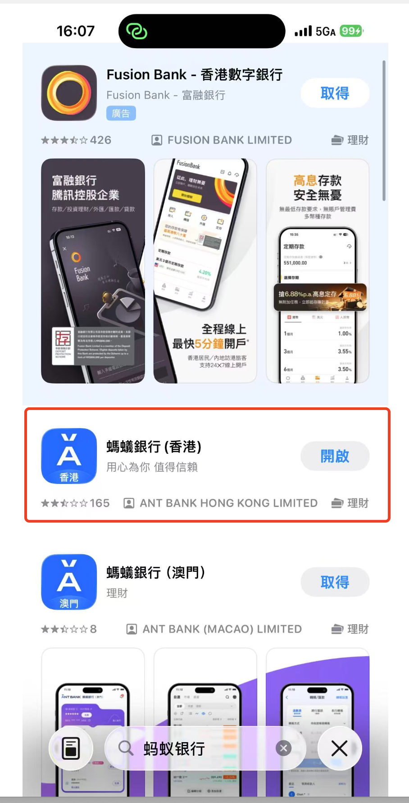

**2、** 选择**开启银行户口**，然后身份证件选择**内地居民身份证**，查阅开户条件：人在港、满 18 岁、有身份证，以及出入关证明。

 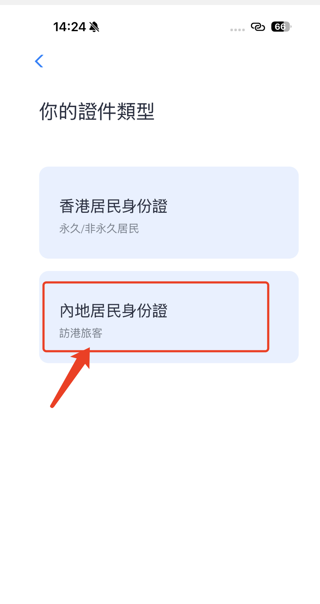 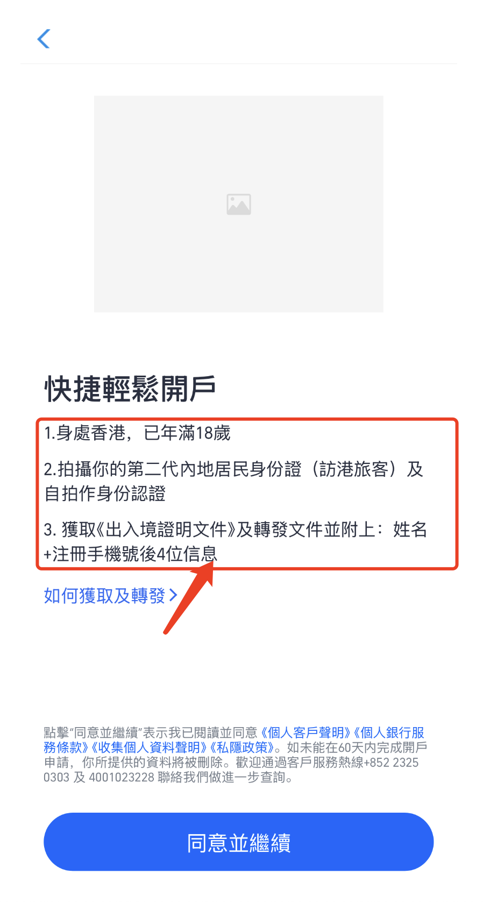

**3、** 填写自己的**手机号**，验证自己的**身份证**，检查自己的个人信息。

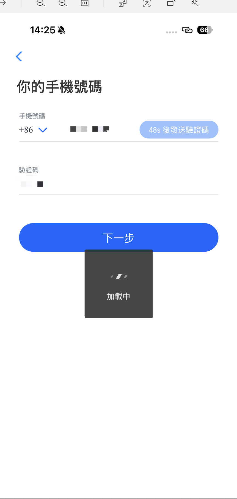 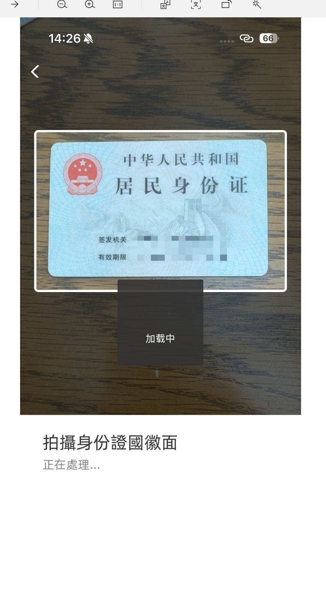 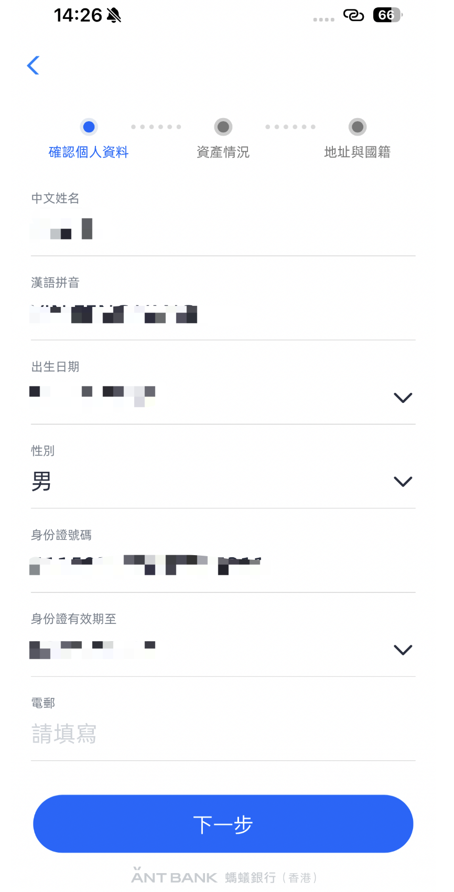 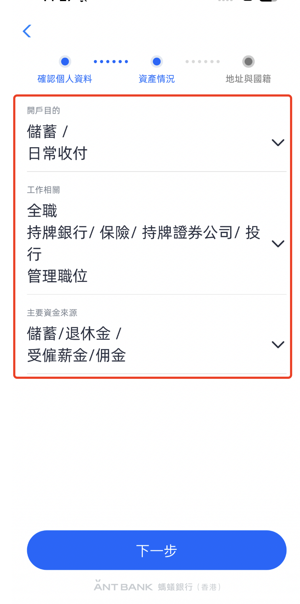

**4、** 填写自己的**居住地址**，设置**登录密码**，再就是上传自己的**出入境证件**，即进入到审核界面。

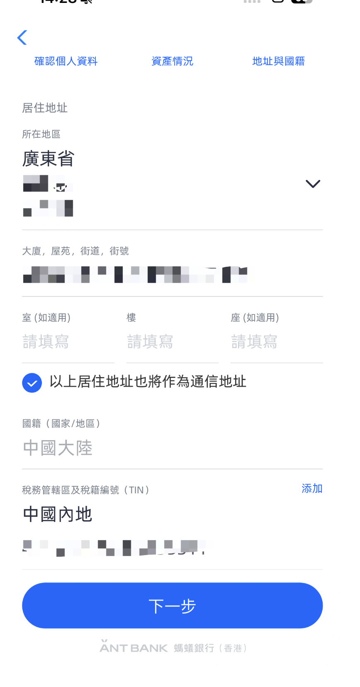 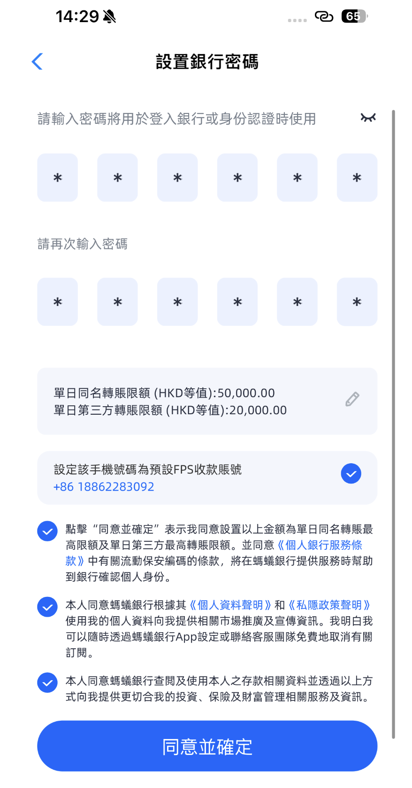 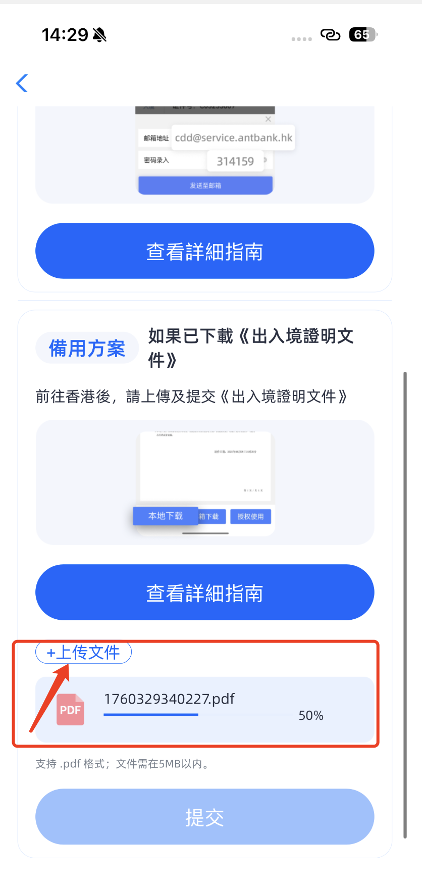 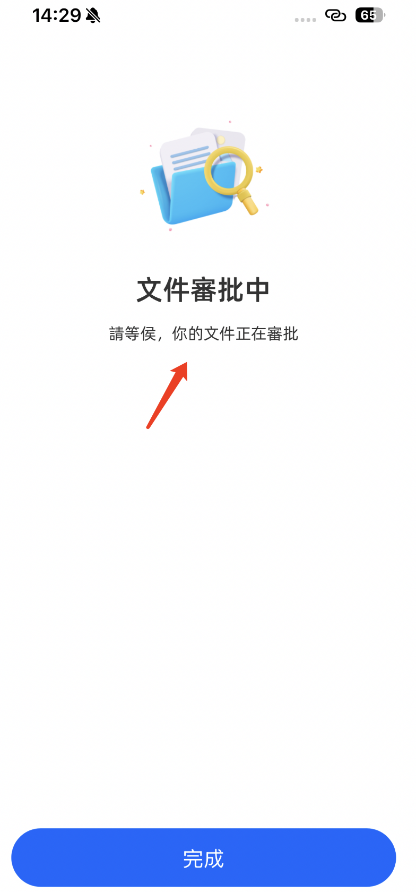
