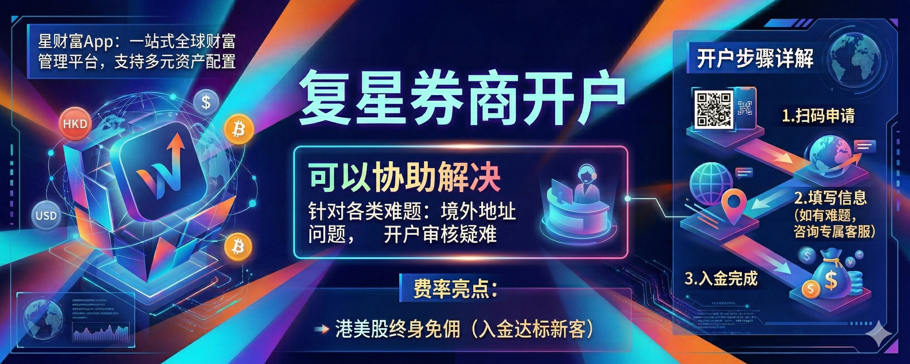

## 一、写在前面

哈喽大家好，这里是 Wise 投资有术，我是你们的老朋友 Wise！

在过去我们给大家推荐了多个券商的注册和开立，有港资券商例如盈立、致富等，也有美资券商例如嘉信理财、第一证券等。

这里给大家罗列一下咱们过去推荐的券商开立教程，大家可以按需学习：

1️⃣、盈立注册教程！
2️⃣、致富注册教程！
3️⃣、第一证券注册教程！
4️⃣、嘉信理财注册教程！

那如果你在过去没有开过任何一家港美资券商，我觉得**复星**是一个不错的选择。

今天这期教程，我主要是给大家聊一下关于**复星证券**的开通的完整流程。那我们不只是会聊复星的介绍、税务的介绍，以及费率的介绍等，并且和一些其他的券商进行一个详细的对比。

那还有就是关于我们如何通过咱们过去开的银行卡，例如 **Ifast 银行卡**入金复星、**众安**入金复星、以及咱们聊到比较多的**汇丰银行**如何入金。

那同时来说也会重点和大家聊一下关于**税务和费用**的问题，因为在过去我们分享了很多相关的开户教程，但是就费用和是否缴纳税这部分，我们还一直没有机会来细聊。

所以我们也会趁着开复星的这个教程的时候，把过去关于费用问题也会给大家做一个详细的讲解和整理。

那因为教程内容比较多，我本来想要一期内容写完，但是发现这样内容就太多了！所以我们**分为两期**来讲解：

- **第一期（本期）**：主要讲解复星的注册和开通教程
- **第二期（下周）**：详细讲解目前主流的入金方式，并结合所有券商细致聊一下税务问题

也算是把过去没有填完的坑给补一下，ok，话不多说我们就即可开始本期的内容吧！

---

## 二、复星介绍

那我们在开始之前，先具体介绍一下**复星证券**以及其背后的一些安全保障。

### 1、成立时间介绍

复星国际证券有限公司（简称**复星证券**），前身为恒利证券（香港）有限公司，成立于 **1987 年**，是香港一家历史悠久的持牌证券公司。

2014 年，复星国际（港交所：00656.HK）全资收购恒利证券，随后更名为复星恒利证券（后逐步升级为复星国际证券）。2018 年获得**香港上市保荐人资格**，进一步拓展投行业务。

### 2、产品和费率

**星财富 App** 定位一站式全球财富管理平台，支持多元资产配置。一个账户即可交易：

**股票类：**
- 港股（正股、ETF、窝轮、牛熊证、新股打新及暗盘）
- 美股（正股、ETF）
- A 股通（覆盖 2000 多只股票）

**衍生品：** 美股期权

**固定收益：** 美债（极速交易）、企业债、国债、债券融资

**基金与理财：** 公募/私募基金、结构性产品、"星财宝"货币基金（支持余额自动转入，历史年化收益曾超 3-4%）、财富商城提供头部机构产品

**虚拟资产：** 支持加密货币相关 ETF（如比特币 ETF），合格投资者可通过虚拟资产直接认购 ETF 份额或场内交易，还提供 USDT/USDC/BTC/ETH 等合规兑换服务

支持夜盘交易、全球多市场布局，适合多元化配置需求。

**费率亮点：**

- **终身免佣活动**：新客户入金达 1 万港币起，可享港股 + 美股 + 美股期权终身免佣（仅收取平台费：港股约 15 港币/笔，美股平台费约 0.005 美元/股最低 1 美元/笔，美股期权平台费约 0.65 美元/张）
- **美债交易**：0 佣金 + 0 平台费 + 0 托管费 + 0 代收息费，全免优势明显，适合长期持仓
- **港股打新**：现金打新免费，融资打新手续费较低
- **基础费率参考**（未免佣时）：港股佣金万 2.1 起（最低 3 港币），美股佣金 0.0035 美元/股起（最低 0.99 美元）

其他：入金更高额度可叠加现金券、期权券等福利。费率有竞争力，整体对费率敏感型交易者友好。

### 3、证书（牌照）介绍

作为香港首批获得**虚拟资产交易服务牌照**的券商之一，复星证券可为合格投资者提供虚拟资产相关服务，包括加密货币 ETF 交易、虚拟资产直接认购 ETF 等，同时支持作为 Participated Dealer（PD）参与虚拟资产现货 ETF 的首发与二级市场交易。

复星国际证券有限公司持有香港证监会（SFC）颁发的多项受规管活动牌照，合规性有坚实保障：

- **第 1 类**：证券交易
- **第 2 类**：期货合约交易
- **第 4 类**：就证券提供意见
- **第 6 类**：就机构融资提供意见
- **第 9 类**：资产管理

### 4、适合人群

复星证券（星财富）适合以下投资者：

- **费率敏感型交易者**：追求港美股终身免佣 + 美债 0 费用福利，想降低长期交易成本的用户
- **全球资产配置需求者**：希望一个 App 覆盖港股、美股、A 股通、期权、加密 ETF、基金、债券等多种资产，实现多元化配置的投资者
- **新手及中级投资者**：App 提供 24 小时资讯、AI 分析、LV2 行情、便捷开户入金（支持 eDDA 等），操作相对友好；同时有投研支持和新股工具
- **对虚拟资产感兴趣的用户**：合规支持比特币 ETF 等产品，适合想在监管框架内接触加密相关投资的人
- **内地用户中的部分群体**：通过专属渠道开户相对友好（通常需境外地址证明，如香港/海外银行账单），适合已有一定准备材料或追求低门槛香港券商的用户

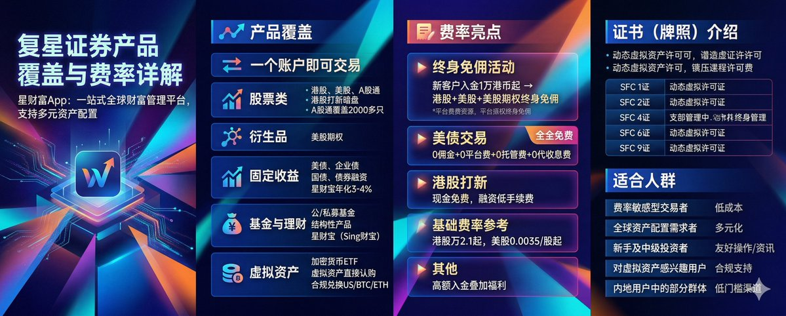

---

## 三、复星开户

ok，那我们在聊完了复星的介绍之后，就具体来聊一下具体的**开户教程**，整个教程比较简单，大概需要 **30 分钟**即可搞定！

首先咱们需要拥有一个**港区 ID** 方可下载咱们复星证券，那港区 ID 获取大家不是很了解的话，可以看此教程进行学习。

如果想要购买港区 ID 的话，我也把教程放在咱们的评论区，大家可以自取了。

大家也可以直接拿这个微信扫码即可先完成账号的注册，而后后续再进行账号的登录了。

### 1、下载 App

首先我们打开咱们的应用商店，检索**星财富**，如图所示的即是复星证券的 APP 了，而后大家点击邀请码输入邀请码：`AGVPK3` 获取到 Wise 的独家支持与官方独家福利，而后选择 **CA 见证开户**。

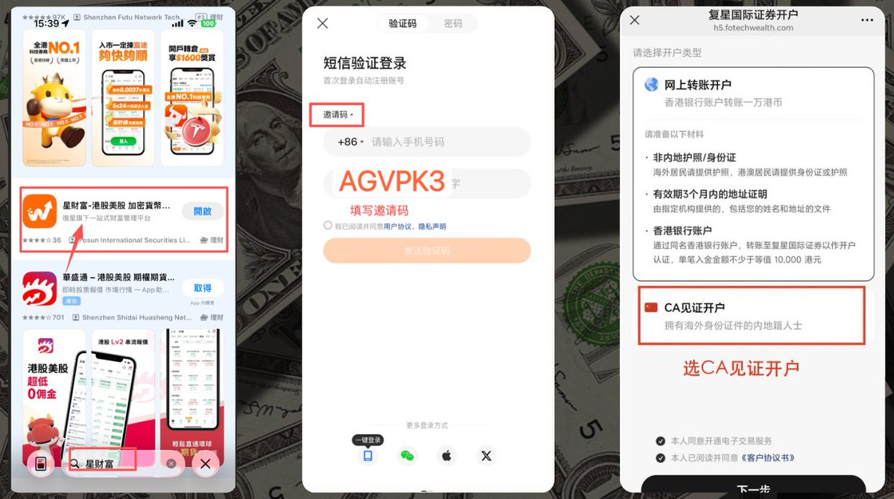

### 2、提交证件

然后其会让我们提交**香港/澳门以及相关的海外证件**，这一步如果大家没有境外身份证正面，可以私信我，我给大家安排官方渠道对接。

然后就是拍摄自己的**内地身份证原件**，也就是自己的身份证，以及自己的**内地银行卡**进行二次验证。

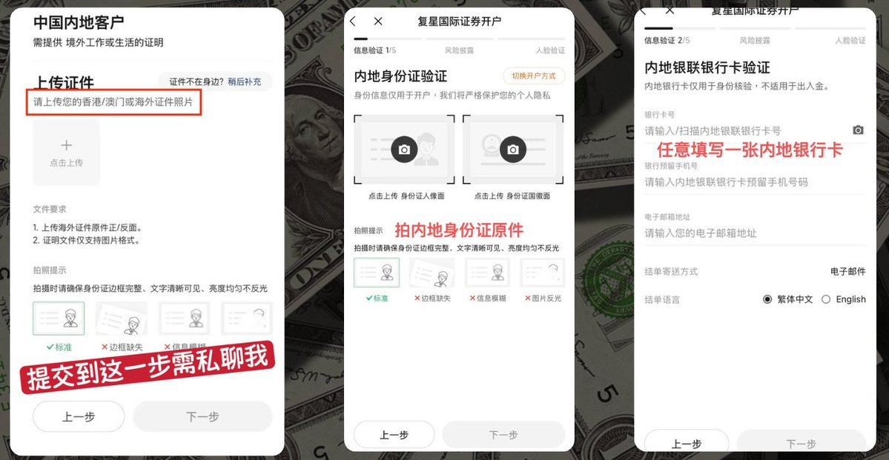

### 3、填写职业信息

填写完毕之后就会让我们填写咱们的**职业信息**，这个按需填写，而后收入情况可以如图所示填写，也可以根据自己的实际情况进行写，最后再勾选自己的**投资经验**，都勾选 1 年以下也都是没问题的。

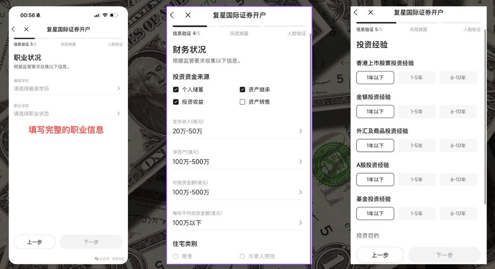

### 4、选择账户类型

选择咱们的账户是**保证金账户**，我们把港股/美股/期权，以及理财都可以进行默认的勾选，最后再确定一下身份证号信息。

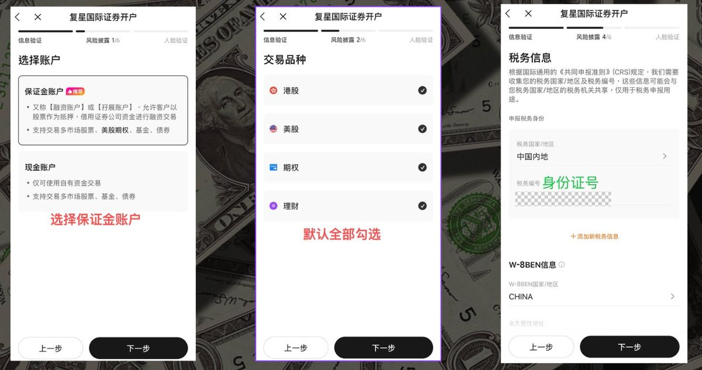

### 5、签署协议

完成之后，签署一下相关的协议，即可进入到**审核界面**了，如果大家进入到这个界面之后，直接私信我进行加急就好了。

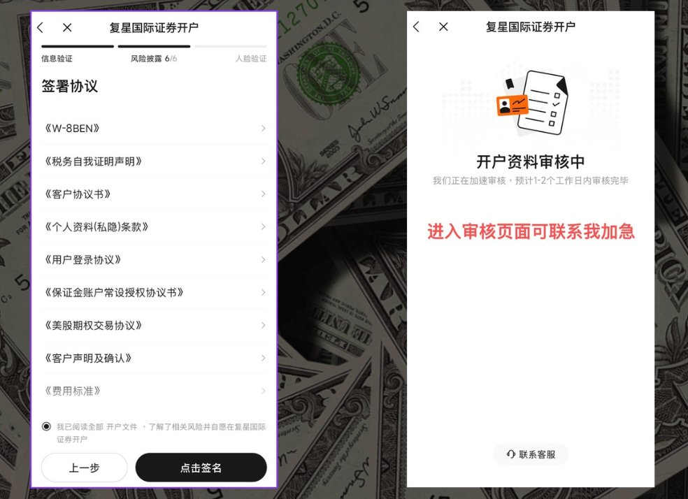

我这边对接了官方的人员，如果材料没有问题，加速给大家审核通过了。

那在这个过程中，可能还有一些细节点大家没有注意到的，也可以看这一张较为完整的开户图。

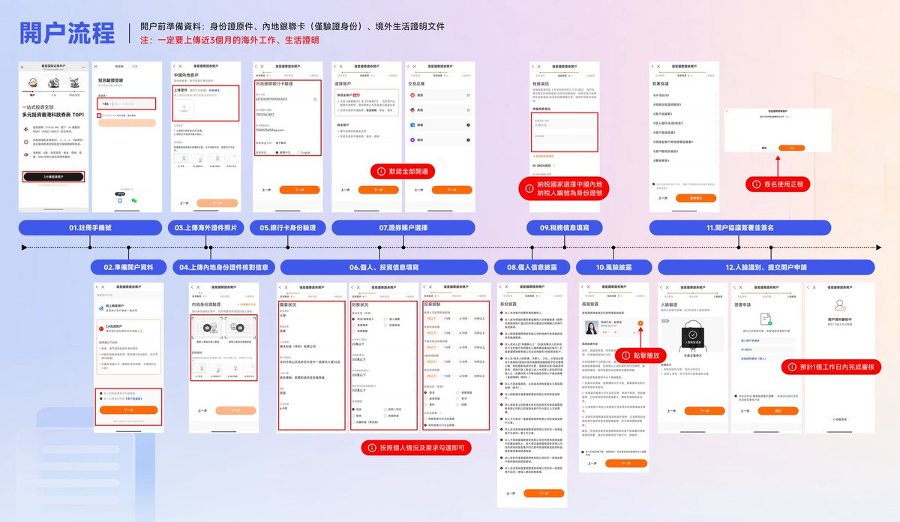

其实整体的开户个人觉得比较简单，至少要比一些美资券商要简单，但是这里也有几个**注意事项**：

1. 如果你没有境外地址正面可以联系我，我给你免费提供指导，其实还是以咱们粉丝们都可以成功开户为目的。
2. 大家申请之后记得去联系我去给大家进行加速处理，到时候发我咱们的注册邮箱/手机号即可对接官方人员给咱们加快处理了。

---

## 四、复星福利

咱们聊完了开户之后，我在这里给大家聊一下目前复星的一些**福利政策**以及入金的政策，这部分我们在前面都有聊到过。

关于港资券商来说其都会做到给大家做到非常好的**免佣政策**，但是有一个前提那就是需要大家进行入金一定资金才可以，这个也可以理解，那这里就拿复星举例子。

1️⃣ **入金 1 万港币**可以做到港股/美股/期权**终生免佣金**，对于其美债产品可以做到 0 佣金，0 平台费，0 托管费。

2️⃣ **入金 2 万港币**，可获得：
- 400 港币现金券奖励（4 张 * 100 港币，每交易 8 笔港美股自动返现 1 张）
- 50 港币现金券（交易 1 笔期权即可返现）
- 6% 现金通加息券
- 全港独家上线高收益货币基金，躺赚近 4%！资金不占用，无需转出可直接用于股票交易和打新，当日计息，赎回小时达！

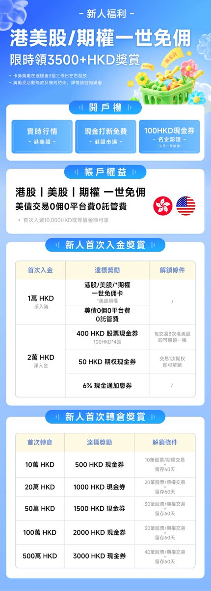

3️⃣ 具体的费用大家也可以看如下图所示的，以及对比其他券商平台当前的一些优势点，大家可以自己进行查阅。

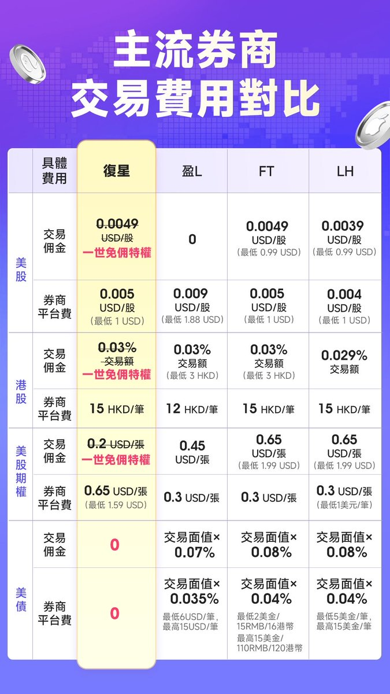

4️⃣ 此外的话，还有一个闲置基金你可以在复星购买的一些基金都有哪些产品，如果你此时的资金正巧放在复星里面，也可以享受到 **4% 的稳定年化收益**，这个福利政策还算是蛮香的。

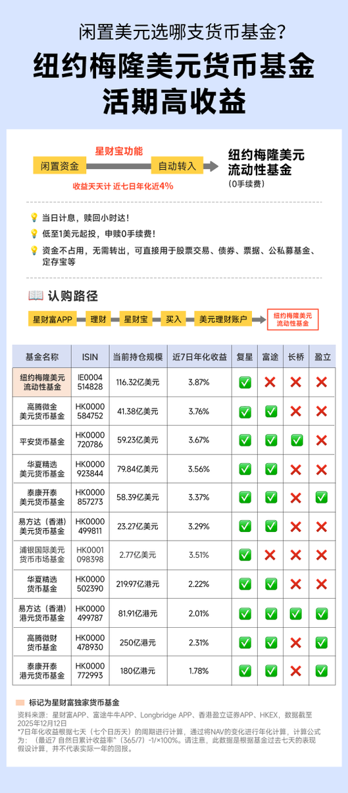

5️⃣ 那最后来说还有一个，其实不单单是我们经常聊到的关于港美股的购买，还有**公募、私募基金、国债、企业债、金融债**这些都可以在复星里面进行购买。

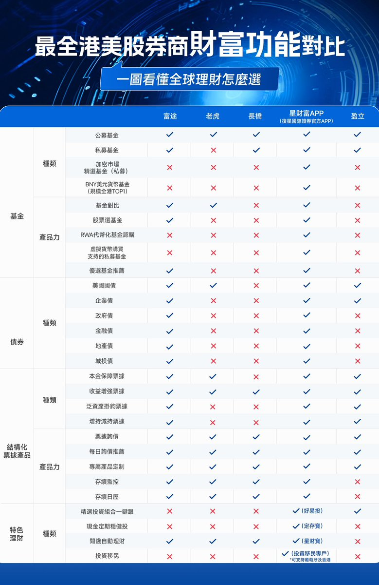

如果是一些优质的投资组合，你可以使用**好易投**进行一键式跟踪；如果是定期稳定理财，你可以使用**定存宝**；如果是自动理财，你可以使用**星财宝**，总之其相关的理财和相关的功能都还比较完备。

所以大家如果在完成注册之后，我建议是认认真真研究其功能一遍，也方便后续自己进行更好的使用。

---

## 五、写在后面

就过去而言，虽然复星的综合实力比长桥要更优，但是不可否认的是长桥的界面设计确实比较丝滑，那最近我和复星的内部员工也在聊，复星现在推出的这些活动，以及优惠政策，来抢占市场。那这个也比较容易理解。

所以我觉得如果此时你目前还没有用得比较得心应手的券商，可以试一试复星，福利待遇和优惠政策做的也都还不错。

这里我还和大家多聊一下，目前券商比较多，我个人的推荐顺序是：

- **美股券商**：盈透为主，而后是第一 & 嘉信，嘉信更加完备，转账会更加方便
- **港股券商**：复星 & 长桥是首选，目前长桥无法注册情况下，复星福利待遇也都不错，大家可以尝试去开通，来享受这个福利了！

---

## 六、下期预告

在前面我们聊到过，我们期望是可以能够一篇文章讲清楚所有的注意事项，关于税率，关于 CRS 等问题，但是发现效果就不会很好了，所以我们会分 3 期内容：

- **下一期**：重点讲解关于如何去通过 **IFast、汇丰、众安**进行入金
- **下下期**：根据过去推荐的所有的券商进行一个介绍，详细讲解咱们资金在国内，出金到券商中进行交易，都会有哪些风险

最后的最后就是我们目前也制作了一些网站，内容咱们也都放在了咱们的投资网站里面，我就不在推文里面写了，大家前往咱们的**投资网站**进行具体内容的学习了！

ok！

那我们下期大概也就是三天后我们就准备给大家制作咱们的入金教程了，这个周六周末，如果大家有意向开户，可以准备一个完整的时间准备开始注册好开户了。

那当然如果你有需求的话，可以联系我解决境外地址正面的问题了！

ok 那本期教程制作不易，如果对大家有帮助的话，也感谢大家的**一键三连**！

如果本期内容点赞过 100，我也会在三天内给大家更新完毕完整的通过 Ifast、众安、汇丰等银行卡进行入金了，给大家安全完整的教程了！

**我们下期再见！**
