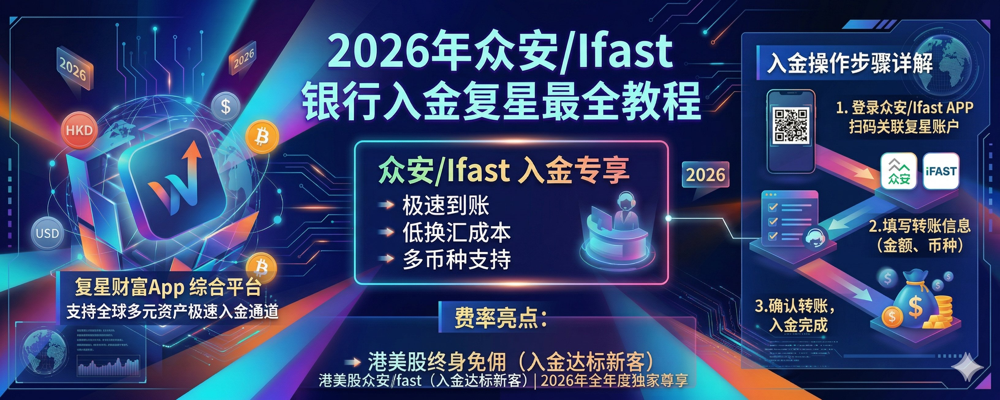

## 一、写在前面

哈喽，大家好这里是 **Wise 投资有术**，我是你们的老朋友 **Wise**！

在上次的教程里面，我们详细介绍了关于[**复星的注册和福利**](/articles/broker/sQSbLRe8)，如果大家还没有注册复星的可以查阅我的上一篇内容进行注册和学习啦！

那今天这部分内容是**复星的第二个教程**，就是重点讲解一下如何使用复星证券来进行**入金操作**！

其实复星的入金流程我个人操作下来十分简单！个人觉得主要还是复星是港资证券，和很多香港的银行都会进行一个非常丝滑的联动处理，就像是我们常常听到的**中银 / 汇丰 / 众安**等，可以做到绑定银行卡之后，即可直接在券商里面进行资金的转入。

其实和国内的银行卡转券商的流程基本上都是一样的，那对比到一些国外的银行卡，例如 **IFast**，可能就要困难一些了。

那今天的入金教程，我想大家也都猜到了，我们给大家安排**两个参考银行**入金：

**一个是 Ifast 银行**，其是英国的数字银行，关于其优点我们在前面讲到过！即不需要你去香港，你也可以注册此银行，而且配合咱们的**兴业银行寰宇人生借记卡**，转账就非常友好，十分适合无法前往香港但是想要购买港美股的朋友们！

- 1️⃣、英国 Ifast 注册教程
- 2️⃣、Ifast 数字银行入金盈立 / 长桥 / 盈透教程

**另外一个就是咱们的众安银行**，这个在过去也给大家多次推荐过，其实香港 No.1 的数字银行，界面设计和其他的香港银行完全不在同一个等级里面！

不仅可以丝滑入金**盈透 / 复星 / 致富**等证券，而且还可以丝滑绑定到国内的**微信**进行消费，年度有 **6.5 万的额度**，而且这个额度还不会占用咱们的外汇额度。

- 1️⃣、众安银行注册教程（开户享受福利）
- 2️⃣、众安银行入金盈透教程
- 3️⃣、众安银行资金汇微信教程

主要是其还可以直接购买港美股，即其一方面是一个**银行**，另外一方面也是一个不俗的**"券商"**。

ok，话不多说，我们就即可开始本期的内容吧！

---

## 二、入金教程

### 1、众安入金

首先是咱们的**众安银行**的入金教程，内容不多，大家可以放心食用！

**1️⃣、添加银行账户**

打开复星 App，点击下方的**账户**，而后点击**存入资金**、一般我们都是存入港元这样损耗也都是最小的，而后点击**添加银行账户**。

**2️⃣、选择众安银行**

因为众安是香港地区银行，所以咱们选择**香港银行账户**、而后下滑找到众安银行，选择众安银行。

接着就可以填入自己的银行账户号码，就是自己的**众安银行账户号码**，那我们就可以去众安银行找到具体的号码填入进来。

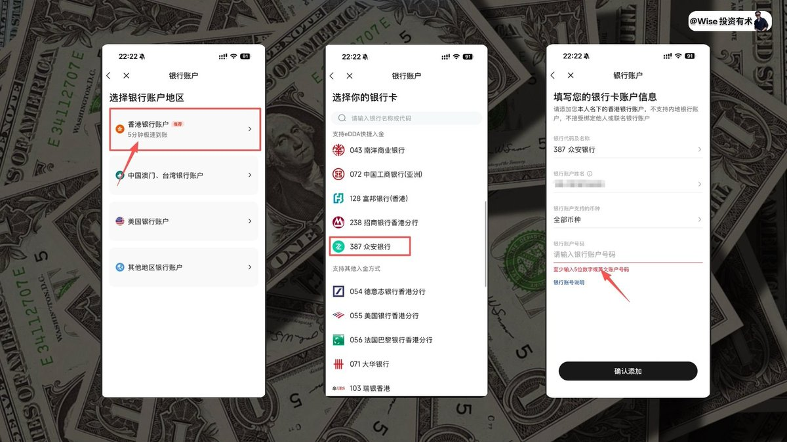

**3️⃣、授权 eDDA**

打开众安银行 APP，选择左上角点卡自己的账户以及转账界面，选择**账户号码（用于转账及存款）**，接着去首选 **eDDA**，即可看到会要求咱们授权咱们的证件号码，以及手机号，手机号码记得填写你在申请开通众安银行的手机号。

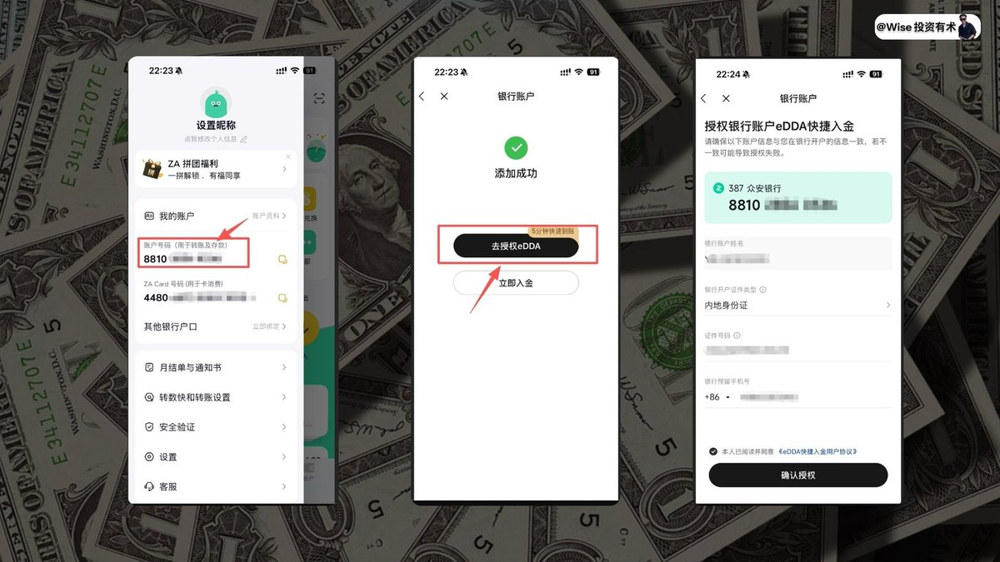

**4️⃣、立即入金**

确定授权完毕之后即可选择**立即入金**，选择 **eDDA 快捷入金**，而后选择存入资金，这里我们选择存入**大于一万港币**的资金，可激活相对应的奖励系统。

而后确保你的众安银行卡里面有足够的资金量，即可成功从众安银行入金到咱们的复星券商了。

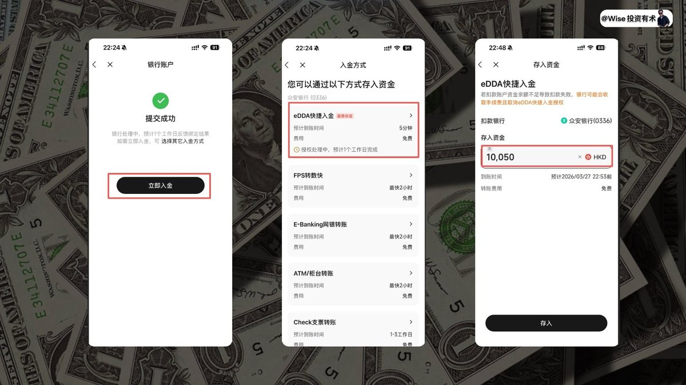

其他的香港银行也都是类似的操作，我这里就不做过多的演示了，大家可以自己去尝试按部操作即可。

---

### 2、Ifast 入金

ok，聊完了咱们的众安入金之后，我来给大家聊一下使用 **IFast 银行**进行入金操作。

其实在之前，我记得我录制过一期教程，即使用 Ifast 入金盈透 / 盈立以及长桥的教程，大家可以看这期教程。Ifast 的具体介绍我们这里就不多展开了，其实 Ifast 在国内也算是比较好开通的，只要你有相关的信用卡账单都是 ok 的。

**1️⃣、存入资金**

首先还是在打开复星、点击**存入资金**、而后选择**港元**、添加银行账户。

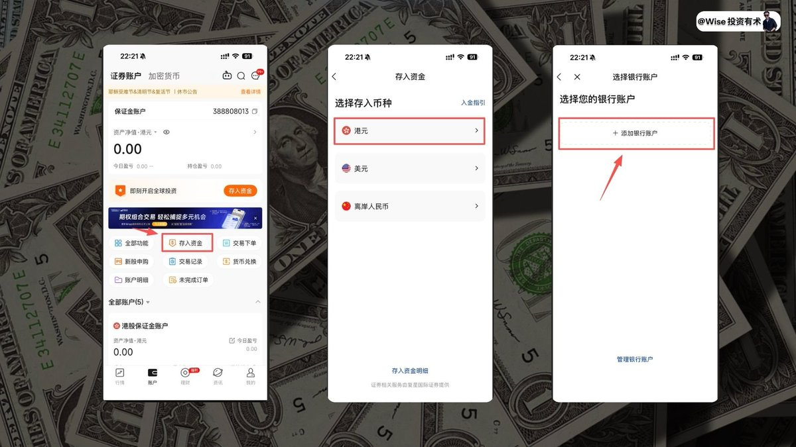

**2️⃣、选择英国银行账户**

接着在选择地区银行的时候咱们记得选择**其他地区的银行账户**，接着就是选择**英国银行账户**。

会看到有要求我们要填入例如银行名称、账户号码、等内容，那这些内容我们就前往 **IFast** 获取，打开咱们的 Ifast 选择**我的账户**，可以看到自己的多币种账户，点击进去。
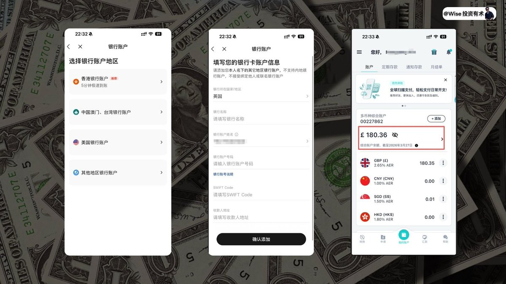

**3️⃣、填写账户信息**

而后选择**国际账户**，即可看到自己的账户信息，而后依次填写**银行名称、银行号码、Swift Code 代码**，以及**收款人地址**如图所示一一对应起来即可，添加完毕之后即可进行入金操作了。

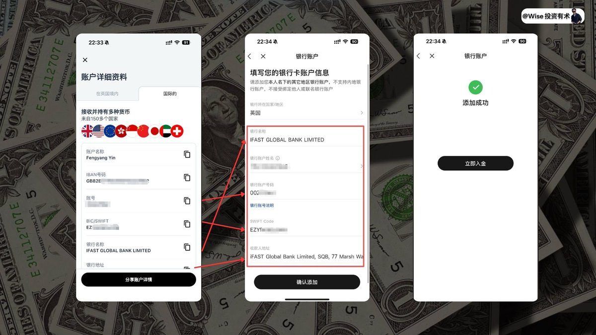

**4️⃣、切换汇丰银行**

选择咱们的 Ifast 银行，可以看到如图所示我们的转账地址，这里多加注意一下，记得把**收款银行切换成为汇丰银行**，这样入金基本上就是**零损耗**的。

而后打开 Ifast 账户，点击**汇款**，选择**国际汇款**。
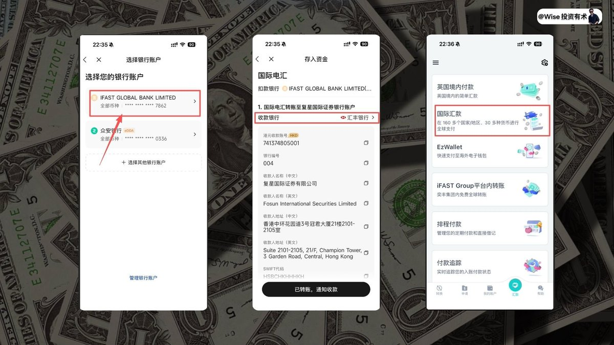

**5️⃣、填写汇款信息**

接着选择汇款地区**香港**，收款人账户类型记得勾选**商业**，收款人收到货币类型记得切换成为**港币**，付款目的，这里选择 **Paying myself**。
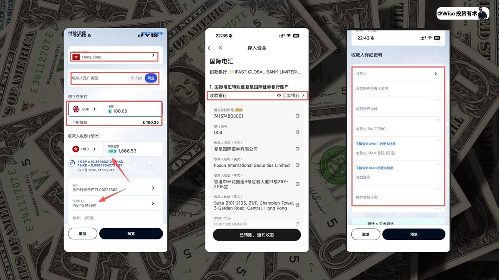

**6️⃣、自动换汇**

大家可以看到，这里比较好的点在于 **Ifast 会自动给咱们进行换汇**，并且是**实时汇率**，所以省下了咱们还要去换汇的步骤和麻烦，接着就如图所示，我们可以看到咱们的收款人详细资料，把账户信息填写进去即可。

如图所示一次对应好咱们的收款信息，我也都一一进行了标记。

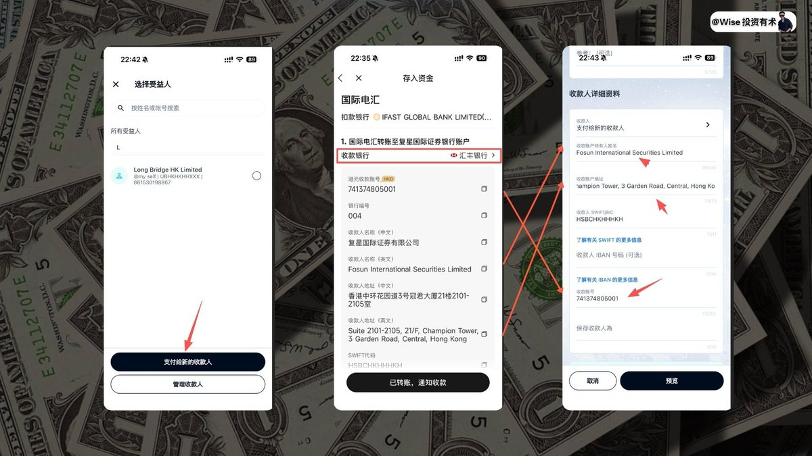

**7️⃣、处理地址格式**

填写完毕之后需要你预览，你会发现地址是**无法通过**的，如图所示，记得把地址里面的**横杠 / 斜杠都删除掉**，方可保存进行下一步预览，而后看一下信息有没有问题，如果没有问题，就点击**授权**即可。

就会进行正常走流程，最后记得把转账的**凭证保存**下来。

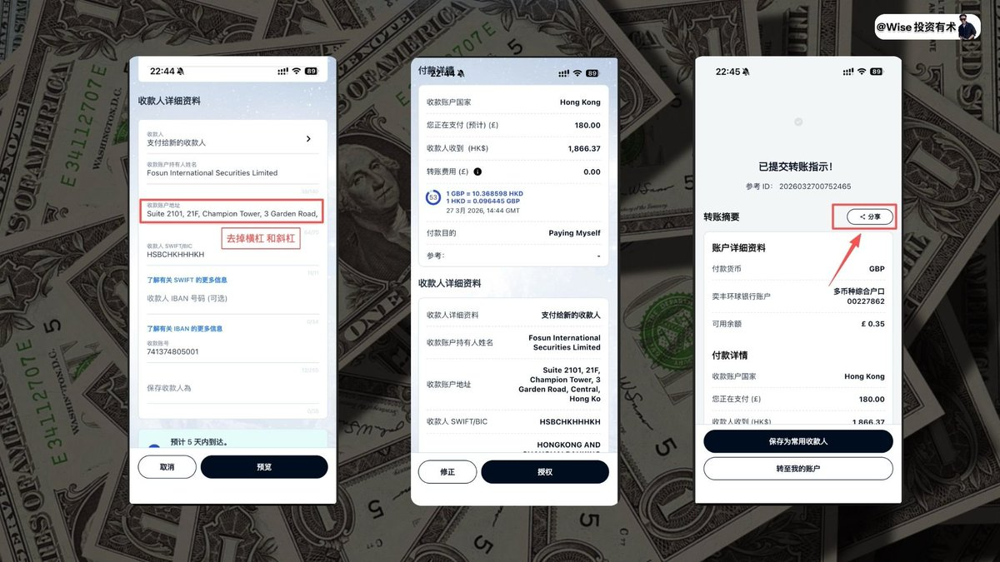

**8️⃣、零损耗转账**

大家可以看到，就如图所示的界面中，咱们的**转账费用是 0**，即我们几乎是没有任何损耗的就把钱从 Ifast 转账到了复星证券中。

把钱从国内的银行转账到 Ifast 再从 Ifast 转账到复星，唯一的损耗就是寰宇转账 Ifast 会有一笔固定的损耗，**10 欧元**，所以你单笔转账的资金越多，这个损耗比就会越小。

所以如果此时你是第一次进行这个操作，我个人建议可以转账在 **3 万以上**，这样方便你进行投资的同时，也减低损耗。
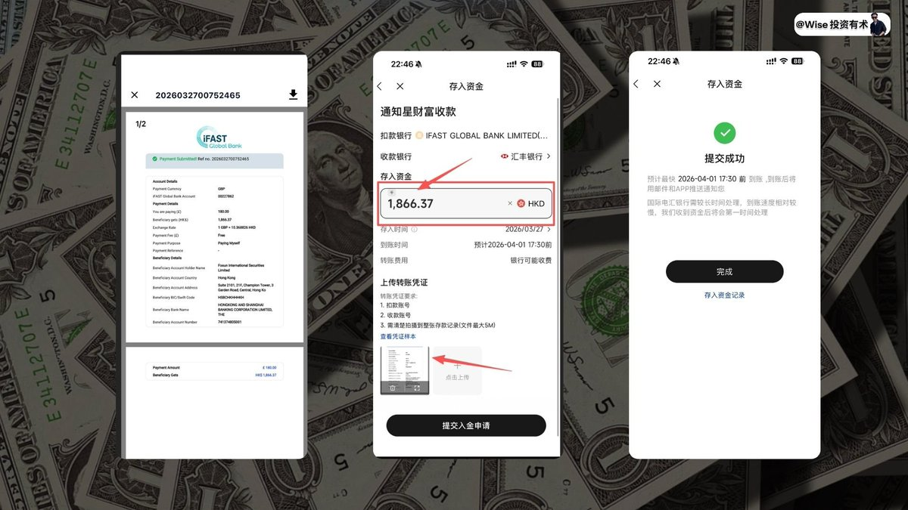

而后回到咱们的复星 APP，记录咱们转入资金，这里注意一下，大家一定注意的就是**转入的资金一定要和转出的资金数字对应起来**，其他的问题不大，后续就可以耐心等待资金从 Ifast 转入到复星了。

---

## 三、投资教程

其实所有的港资券商在入金上都不算非常难，因为可以和香港的银行进行无缝衔接，所以如果你计划在 **2026 年投资港美股**的话，我有如下教程可以操作参考。

- 1️⃣、国内换汇成为港元，而后利用**寰宇人生**汇款到 **Ifast 银行**中，而后把 Ifast 里面的钱直接汇款到**长桥 / 盈透 / 复星**中进行港美股购买。
- 2️⃣、国内换汇成为港元，而后利用**寰宇人生**汇款到**众安 / 汇丰 / 中银**，然后再把这里面的钱汇款到**长桥 / 盈透 / 复星**中进行港美股的购买。
- 3️⃣、而后就是资金也可以从国内 C2C 到**币安 / 欧易**，再到 **Bitget / SafePal**，而后再到盈透证券中，也是一条路。

我这里做了一个图，里面所有节点都可以进行点击，方便学习！

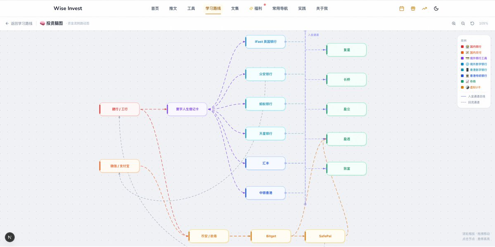

---

## 四、写在后面

ok，以上就是今天教程的全部部分了，详细介绍了目前**复星的入金流程**以及完整的**投资港美股教程**。

目前 Wise 也成功打通了资金从国内到港股，以及和 Web 的联动操作，这个是目前的地图，大家可以详细看这个地图，我也把这个流程做到了咱们的网站中，具体链接我就放在评论区了。

如果大家觉得今天的内容对你有帮助的话，还请不要忘记**一键三连**哦，大家的支持也是对于我的最大鼓励了。

ok，那最后依旧是你有需求的话，可以联系我解决**境外地址证明**的问题了。

ok 那本期教程制作不易，如果对大家有帮助的话，也感谢大家的一键三连！

上次我们聊到过，我们即将会安排关于比较详细的关于**港资券商购买的税务问题和资金安全问题**，我也咨询了相关比较专业的人士，给大家制作一期详细的教程了！

如果本期内容点赞过 100，我也会在三天内给大家把这期教程制作出来了！

那我们下期再见！
