## 一、写在前面

上次我们聊到过，我们 2026 年的一个重心便是打通**港美股购买的链路**，包括但不限于港美股券商开立、出入金系列教程、资金流转流程等。

截止到目前为止，我们也打通了几条链路，如果你是第一次刷到此篇内容可以点击如下内容进行学习。

**1️⃣、港卡**
- 实体银行之汇丰&中银注册教程
- 虚拟银行之蚂蚁/天星/汇丰注册教程

**2️⃣、中转卡**
- 英国 Ifast 数字银行注册教程
- Wise 仅仅凭借身份证注册开通教程

**3️⃣、虚拟卡**
- Bitget 虚拟 U 卡注册教程（开户赠送 5U 空投）
- SafePal 虚拟 U 卡注册教程（开户赠送冷钱包）

**4️⃣、券商**
- 中国大陆内地仅凭身份证开户香港券商盈立证券
- 中国大陆内地仅凭身份证开户香港券商致富证券
- 中国大陆内地仅凭护照开户美国券商嘉信理财

大家给证券入金的方式也多种多样，你如果只要一张身份证，那就是 IFast 入金盈立的方式，如果你办理了港卡，那就通过港卡入金，如果都不想要办理，那你办理 BG 和 SP 也都可以给盈透入金。

操作的方式多种多样，大家按照自己现在已经有的资源进行准备自己的入金链路。实在无法准备的，其实也可以在 BG 亦或者是币安中链上购买也都是可以的。

所以如果你此时还没有关注我的，记得给我**点个小关注**哦，点个关注不迷路，什么时候想要来投资美股了，都可以第一时间找到我！

---

## 二、第一证券介绍

**第一证券**（Firstrade Securities Inc.），成立于 **1985 年**，总部位于美国纽约，是美国最早一批提供在线交易服务的券商之一。由台裔美国人 John Liu 创立，早期专注于服务华人社区，如今已成为全球投资者，尤其是亚洲地区用户（如香港、中国大陆）的热门选择。

它是美国金融业监管局（FINRA）和证券投资者保护公司（SIPC）的成员，受美国证券交易委员会（SEC）严格监管。作为一家纯本土美国券商，**Firstrade 不参与 CRS**（Common Reporting Standard）信息交换，这点对注重隐私的投资者特别友好。

**核心优势**

**零佣金交易：** 股票、ETF、期权、共同基金等全部**零佣金**（自 2019 年起实现），债券和 CD 交易费用也极低。这意味着你省下的手续费就是赚到的，尤其适合长期持有或频繁交易的用户。

**中文支持完善：** 官网和 APP 提供**简体/繁体中文**界面，客服支持中文电话、微信、在线聊天（工作时间覆盖亚洲时区）。这对非英语母语用户来说是巨大便利，许多香港投资者反馈比其他美系券商更易上手。

**无最低资金要求：** **0 元开户**，无账户维护费、无不活跃费。无论你是小额试水还是大额配置，都无压力。

**多样化投资产品：** 支持美股、ETF、期权（包括指数期权）、共同基金、债券、CD 定期存款等。还提供 IRA 退休账户和教育储蓄账户，适合长期理财规划。

**交易工具强大：** 移动 APP 和网页平台支持实时报价、图表分析、自定义警报。期权交易工具集成 Chain 视图和 Greeks 分析，适合进阶用户。夜盘交易几乎 24/7 可用，覆盖盘前/盘后时段。

**入金出金灵活：** 支持 ACH 转账（免费，从美国银行）、电汇（国际电汇费用由银行收取，通常 20-50 美元）、支票存款。香港用户常用 Wise、港卡入金，速度快、手续费低。出金同样免费 ACH 或电汇。

**安全保障：** SIPC 保护最高 **50 万美元**（包括 25 万美元现金），额外购买超额保险覆盖高达 1.5 亿美元。清算由 Apex Clearing 负责，资金隔离存储。

---

## 三、准备开户

聊完了上面的前置教程，也聊完了这个介绍，那我们就开始正式的注册开户教程吧，在开始之前，我还是有几个事情要和大家多叮嘱一下。

**1️⃣、** 请提前准备好自己的**护照号、地址证明**等信息，并且将其名称修改成为英文。

**2️⃣、** 准备好自己地址的**英文缩写**以及自己所在地的**邮编**。

**3️⃣、** 适当准备好一个**谷歌翻译**，如果遇到不是很懂的内容直接复制内容出去进行翻译！

**4️⃣、** 整套流程下来需要 **10-15 分钟**时间，所以请确保自己有完整的并且网络稳定的时间。

**5️⃣、** 尽可能按照流程进行，如果有不懂的部分请及时寻求 AI/博主帮助，防止开户不成功，前功尽弃。

ok，如果你已经成功准备好上述内容之后，我们就正式开始第一证券的注册吧！

**1、** 首先我们打开：`https://invest.firstrade.com/cgi-bin/login?ft_locale=zh-cn` 然后选择**立即开户**！

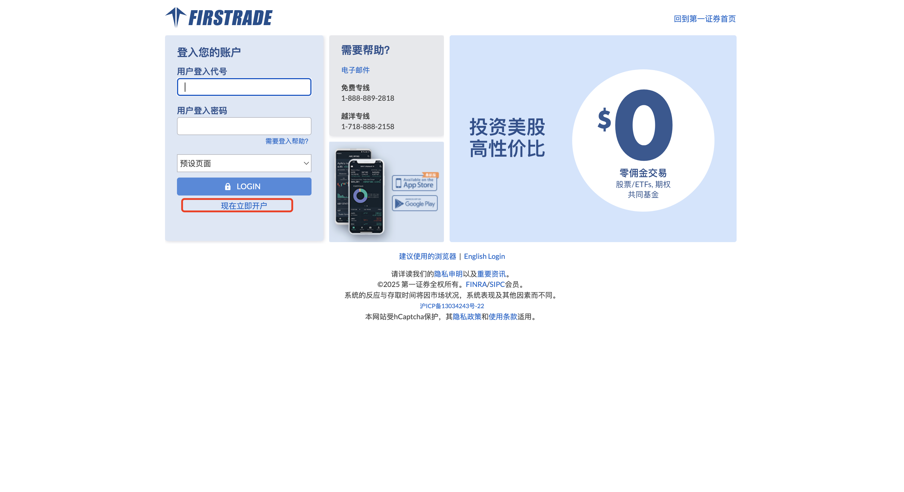

**2、** 接着选择**"非美国公民以及非美国永久居民"**进行申请和注册。

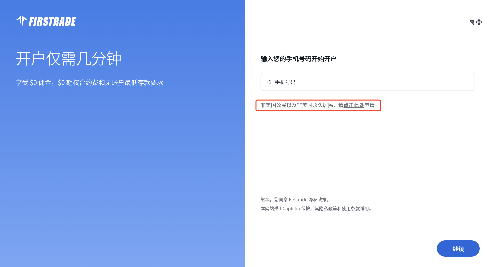

**3、** 选择**接受验证码**进行走注册流程。

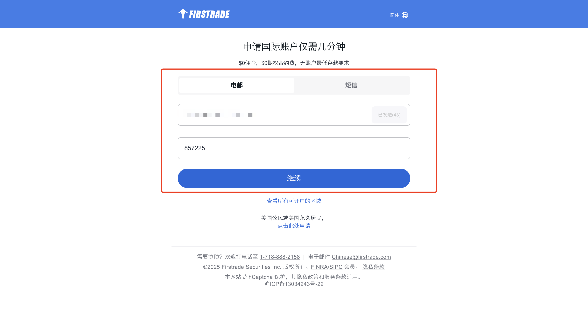

**4、** 定位位置在中国，国际和出生国家都是**中国**，在这里可以看到其要求：**1️⃣ 护照 2️⃣ 居住地址（英文）**，提前准备好。

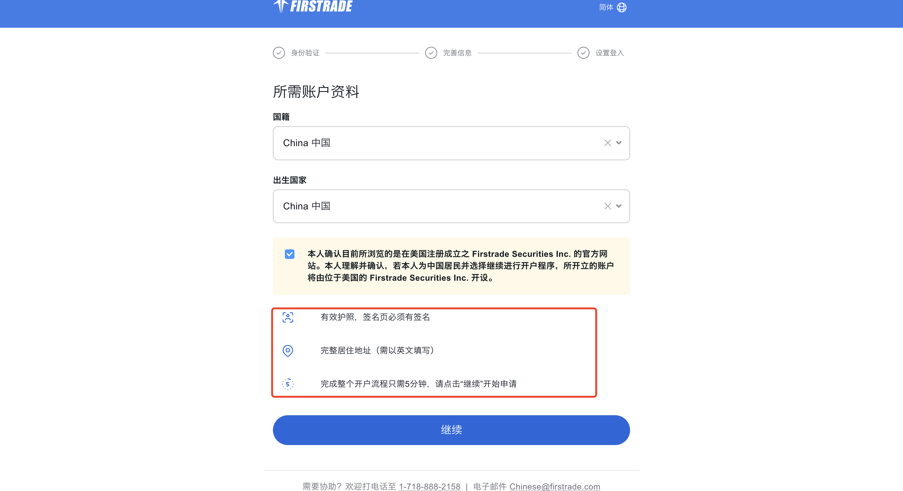

**5、** 而后准备**上传自己的护照**，其实就是有人像的那一页，两个都用同一个图片也是 ok 的。

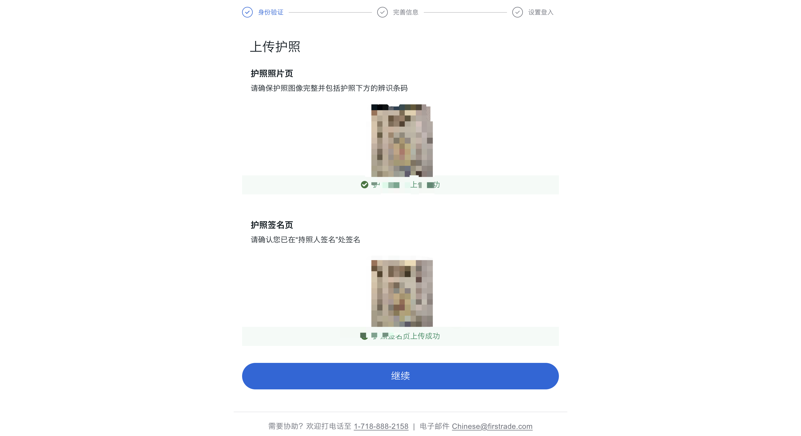

**6、** **护照号码**正常填写，而后**税务识别号码**就是自己的身份证号码。

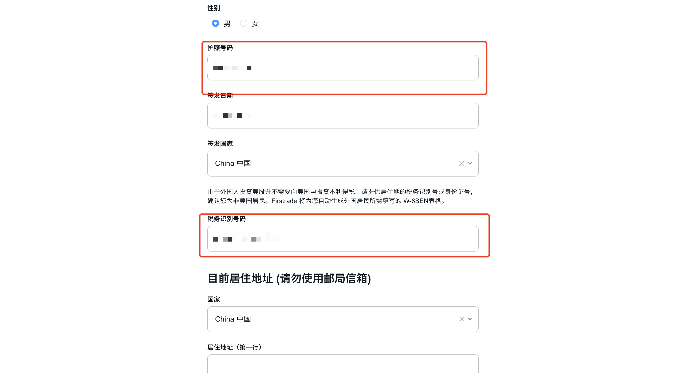

**7、** 记得提前用谷歌翻译把自己的**地址翻译成为英文**，而后进行填入。

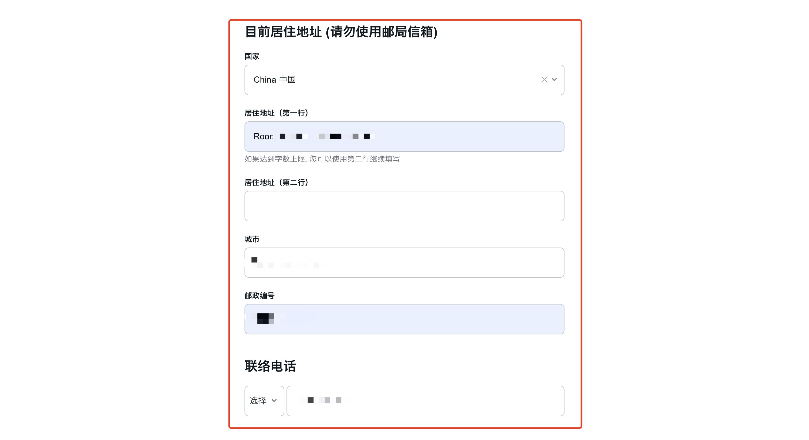

**8、** 工作情况，还是按照我们过去一贯的策略，有的话就写具体的，如果没有的话写一些**阿里/腾讯**等也是 ok 的。

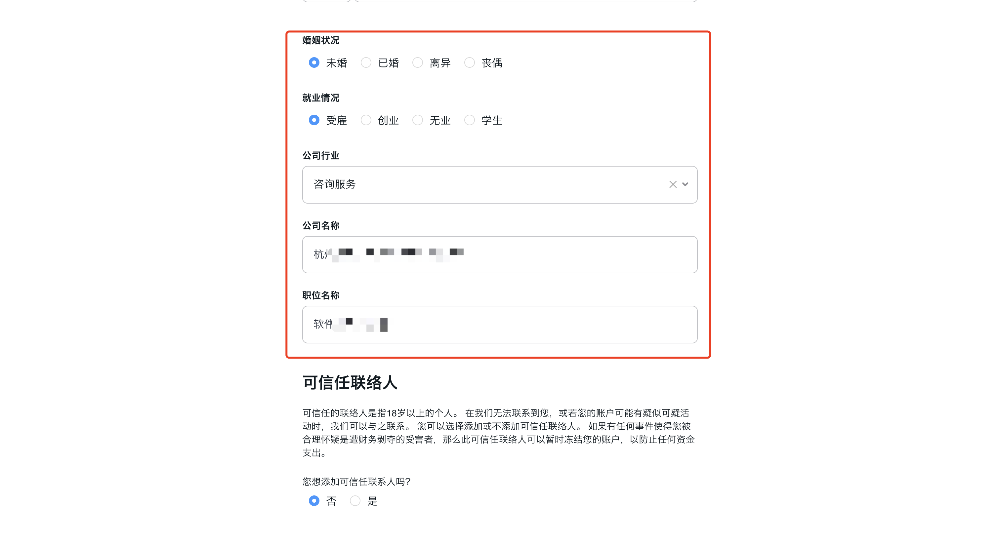

**9、** 收入资产和总资产**按照逐渐变大**即可，这个大家自己按照自己的情况填写，经验就写**丰富/良好**，目标就写**增值**。

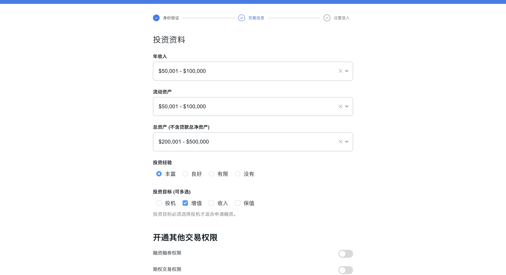

**10、** 完毕之后就设置自己的**登录名以及密码和 PIN 码**即可。

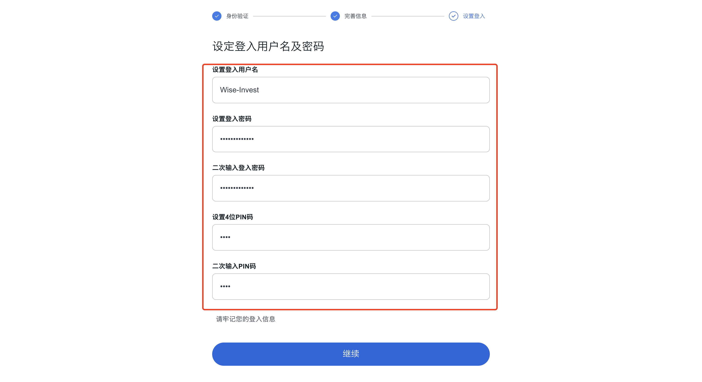

**11、** 完毕之后后续即可看到自己的**申请已经正常提交**了。

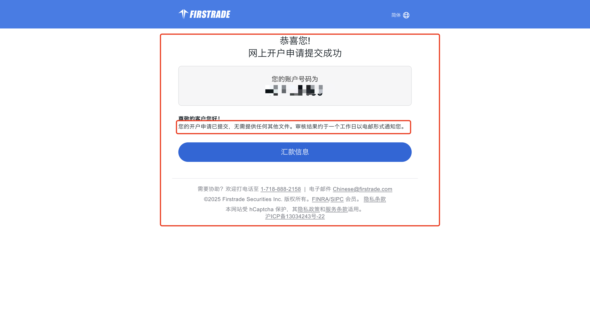

**12、** 而后回到首页输入自己的**用户名和密码**进行登录即可。

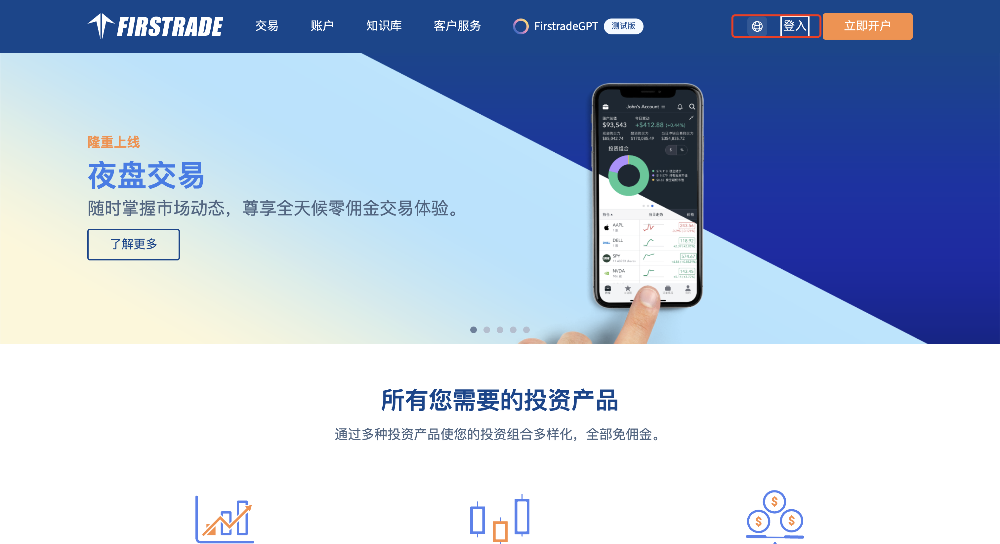

**13、** 在确定信息的时候注意其提到的是否是为了**个人用途**，而非商业用途这里**勾选是**，其他的默认否即可。

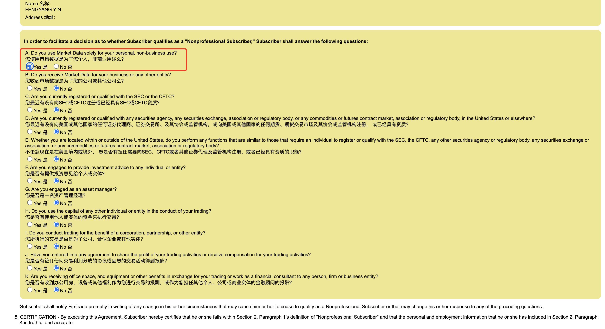

**14、** 设置自己的**密保信息**。

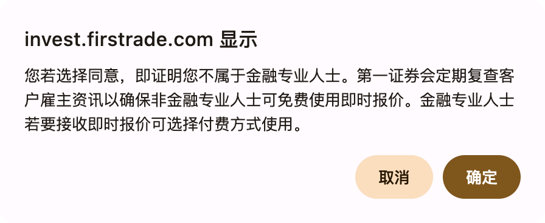

**15、** 完成之后即可看到自己的**申请已经提交，在处理中**。

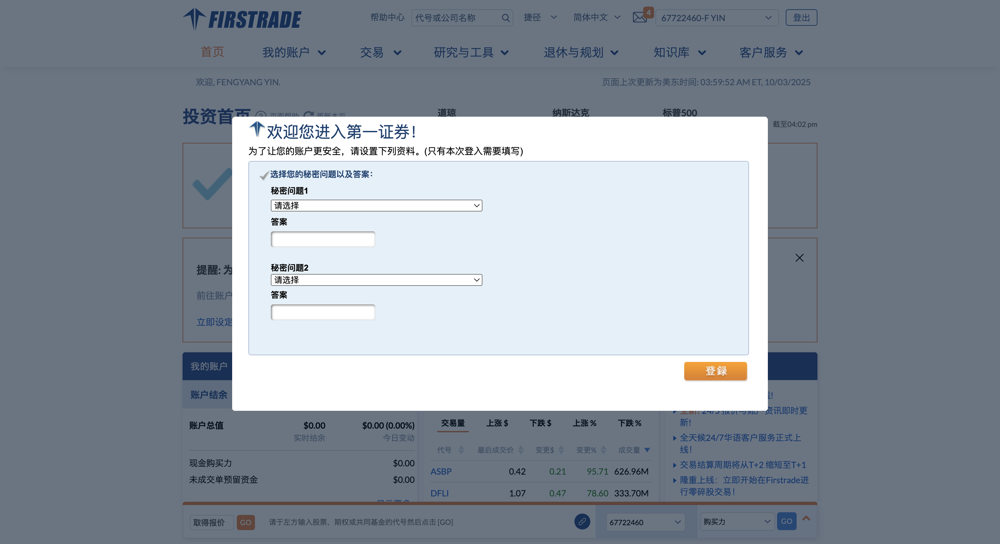

**16、** 而后成功通过之后即可完成**入金**的操作即可。

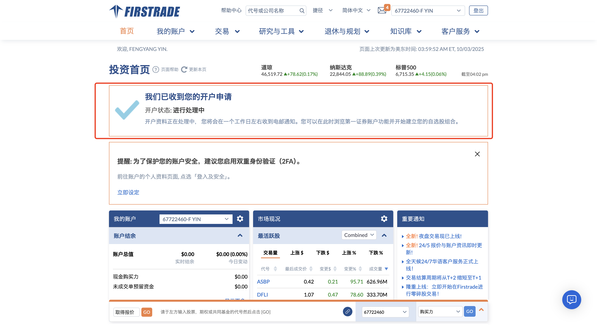

**17、** 那后面我们就来完善具体的**出入金系列教程**了，敬请期待！

---

## 四、写在后面

以上就是第一证券的注册教程了，整体的流程还是比较简单的，对比于盈透还有嘉信都是比较**轻便**的。

那对比于盈透和嘉信，@LZRationalnvest 也做了一张图，大家可以参考！

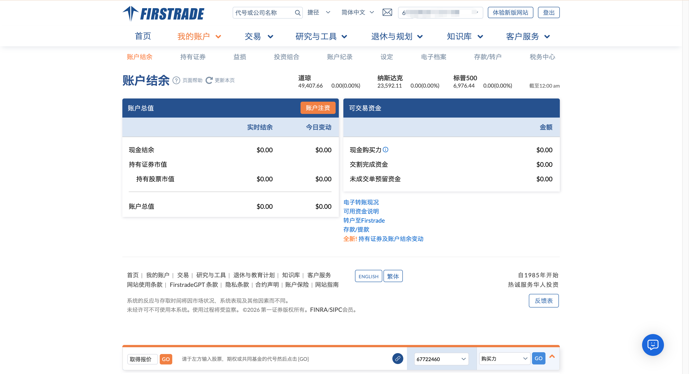

这里是 Wise 投资有术，励志在指数/美股/加密/中做最懂小白的博主，如果你对这些内容感兴趣，欢迎给我**点个关注**哦。那我们就下期再见了！
