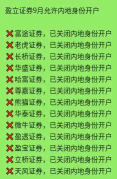
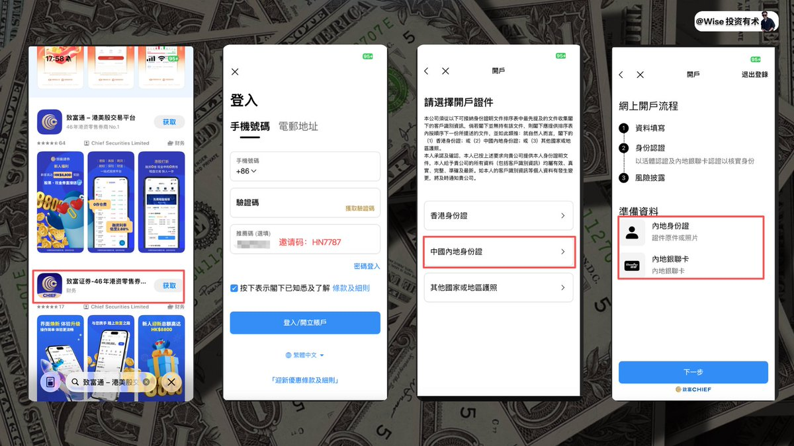
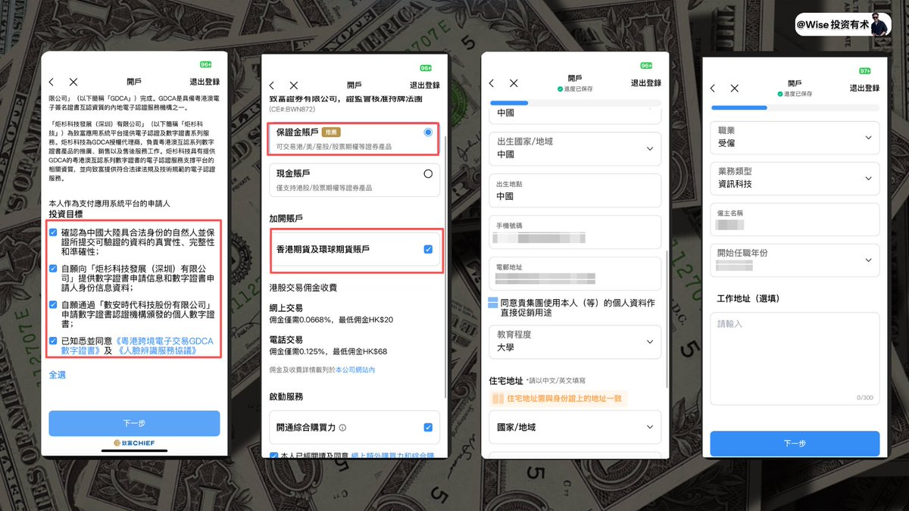
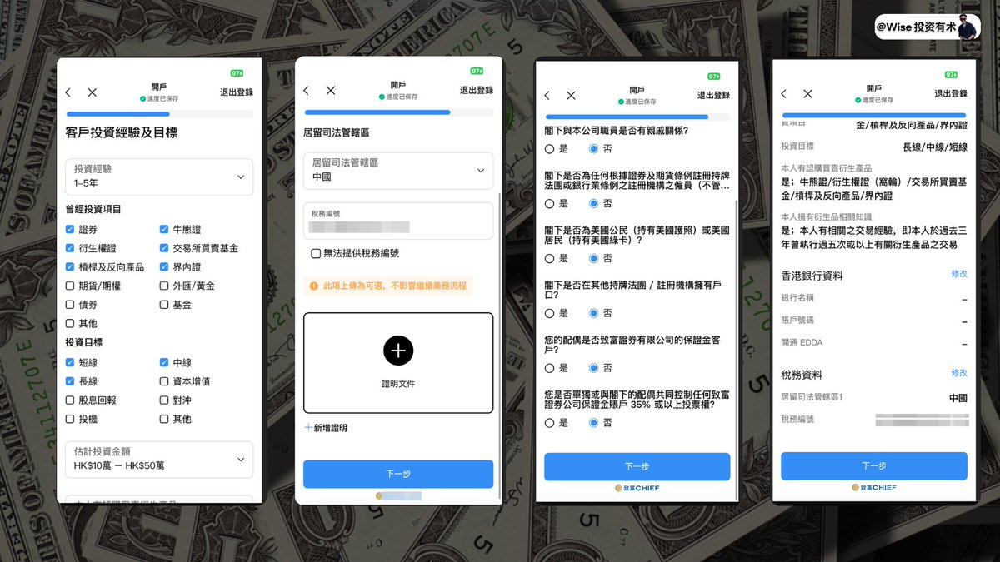
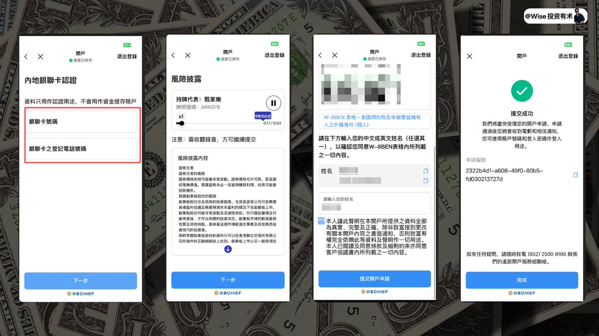
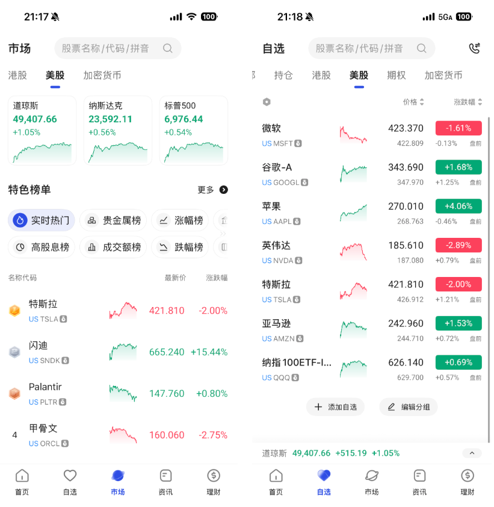
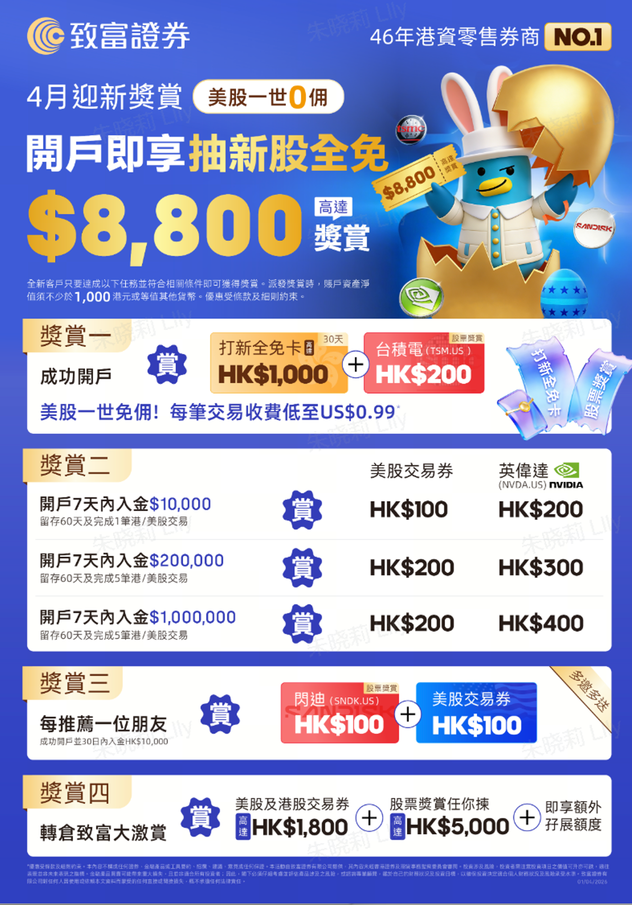

## 一、写在前面

从 2025 年 9 月份开始，各大券商都在陆续关闭中国大陆用户开户的这个渠道，就我们熟知也是常用的**盈透证券**更是直接关停了在国内的公众号平台。

如果用一张图来表示这个惨状的话，我想下图就是最佳的表示：

虽然很多证券都在陆续关闭开户的渠道，但是依旧还是有一些可供我们选择的。

而 Wise 在之前也分享过一个**盈立证券**的开户的教程，具体教程链接如下：2025 年盈立证券最全开户教程  大家可以点击链接进行学习！

而今天我们给大家推荐的是**致富证券**，相比于盈立证券，致富的历史要更加悠久，并且实力也更加雄厚，下面我们还是先来简单介绍一下，而后再进行具体的开户流程。

---

## 二、致富介绍

**致富证券**（Chief Securities Limited），它是一家非常典型的香港本土老牌券商。致富证券成立于 **1979 年**（已有46年历史），隶属于**致富集团**（Chief Group），总部在中环，是香港本地资本的零售证券公司之一。

官网如下（点击前往）他们自称"**46年港资零售券商No.1**"。

### 主要特点和优势

**1、监管合规：** 持有香港证监会（SFC）第1、2、4、5、7、9类受规管活动牌照，覆盖证券交易、期货、资产管理、顾问等业务，受严格监管，客户资金有**投资者赔偿基金（ICF）保障**（最高50万港币）。

**2、分行网络：** 全港有**13间实体分行**，覆盖港岛、九龙、新界，是香港分行最多的证券行之一，适合喜欢面对面服务或传统风格的本地投资者。

**3、交易产品：** 支持港股、美股、A股（沪深港通）、新加坡股票、股票期权、期货、基金、债券、IPO打新、月供股票等。App叫"**致富通**"，也支持线上遥距开户。

**4、费用亮点**（2026年最新常见宣传）：0存仓费、0平台费（部分情况）
港美股LV1免费即时报价
孖展利率低至 **2.88%**（全港较低水平之一）
美股低至每笔 **US$0.99** 或每股 **US$0.01**
月供港美股基金免佣等

**5、开户：** 支持**内地身份证线上开户**（无需存量证明或海外地址证明），很多内地投资者用它来玩港美股打新或长期持有。

**6、其他：** 有独立会计师每日复核客户资产的制度（香港首创），强调资金安全；经常有开户迎新优惠（如现金券、股票券、里数等，高达**几千港币**不等，视活动而定）。

---

## 二、注册教程

**1、** 打开 App 检索"**致富通**"，你可以看到两个选项，记得去选择下面的一个致富证券进行下载，界面更加符合我们现在的体感。

**2、** 然后选择输入自己的手机号进行注册，记得填写邀请码：`HN7787`，记得如果开户的话一定要填写哦，有我找官方绑定的最新福利赠送给大家！

**3、** 然后选择中国内地的身份证，就可以看到其要求我们准备的材料，其实只需要有一个**内地的身份证 / 或者是内地的银行卡**即可完成注册流程，门槛不算是高，非常适合一些想要投资港美股，但是没有一些境外证明的一些朋友。

**4、** 接着按照其要求直接全部勾选即可，这一块不用过多在意

**5、** 接着按照其正常的流程走，默认开通一些账户，就让其自动一次性帮助我们开通掉。

**6、** 然后是你自己的身份证信息，正常识别，识别之后会要求我们填写手机号码，和具体的邮件地址。

其实致富证券可以说是我看看到的开各种证券里面**最方便的一个**，基本上所有的东西都会给你预设好，所以直接不需要怎么动脑筋下一步就好了。

**7、** 但是这里注意下，你的**教育程度**其会默认是初中，记得修改成为对应的教育程度。

**8、** 而后正常填写自己的职业和业务类型，这一块如果你现在确实在某一家公司任职，正常填写即可，那如果你没有的话，可以填写阿里之类的

**9、** 投资经验和目标，也都是预设好的不用过度在意，直接往下走就好。

完成之后其会要求你设置自己的香港港卡，这里你点击**稍后**即可，可以先不理会。

**10、** 税务编号就是自己的**身份证号**，然后提供证明这里可以不写。

**11、** 默认的一些选择，其也都帮助你设置好了，直接选择默认的**否**即可。

**12、** 接着就是确定一下具体的信息是否有误，如果没有问题就直接进行下一步就好

**13、** 接着会让你**验证人脸**正常验证即可，完毕之后填写具体的银行卡卡号，以及具体手机号，按照实际情况进行填写

**14、** 听着他读一会这个风险纰漏即可继续进行下一步。

**15、** 而后 **W-8BNE** 会要求咱们进行签字，正常签字即可。

**16、** 完成之后即成功完成开户的申请，后续耐心等待开户通过即可

**17、** 整个过程不会很久，大概 **5-10 分钟**，你就可以成功审核通过，通过之后，即可正常完成后续的入金系列的动作了！

**18、** 最后成功开户，**致富证券**要比致富通的界面看起来"现代化"很多，所以大家最好是下载**致富证券**，使用起来更加舒服。

---

## 三、写在后面

如果大家要注册和入金的话，大家最好是在开户的 **30 日之内**，入金 **1 万港币**，并且留存 **60 日**之上，这样可以享受更多的福利政策，如下图所示就是最新的 2 月份的好礼赠送。

很多券商都有一个基础的入金要求，大家看准之后入金，这样有利于领取到更大的权益哦！

上次我们聊到过，2026 年的一个重要中心就是把**券商**这一块的内容给补充齐全，所以后面我们也会尽可能把市面上可以办理的证券教程也都给大家安排一遍。

日常大家可以选择 **2-3 个**进行开户办理，选择 **1-2 个**自己比较喜欢的进行日常使用即可。

那如果你不知道如何购买美股的话，可以重点看一下这个教程：**2026 年全网最全最详细普通人购买美股教程**，详细记录了各种购买和投资美股的方法！

那如果你觉得以上的内容对你有帮助，记得给我一件**三连**哦，大家的支持也是我持续更新下去的最大动力！

ok，那我们下期再见了！
