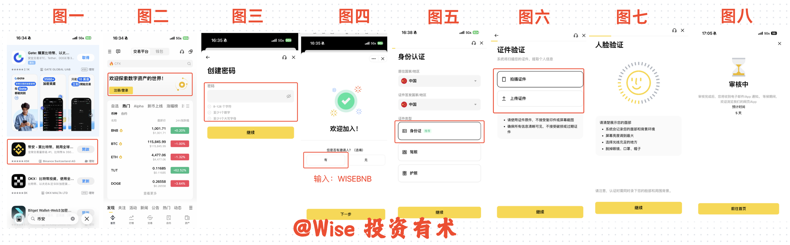
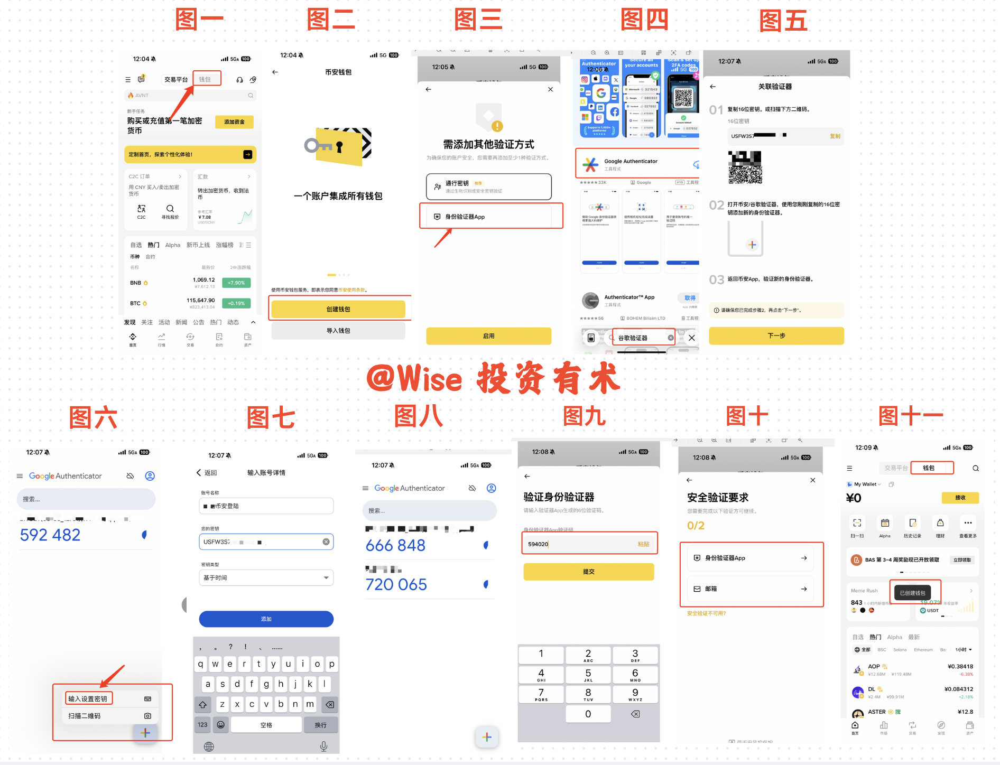
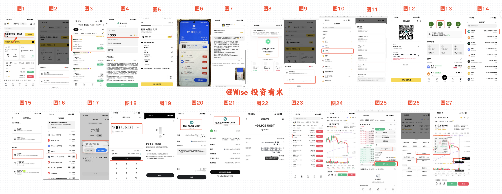
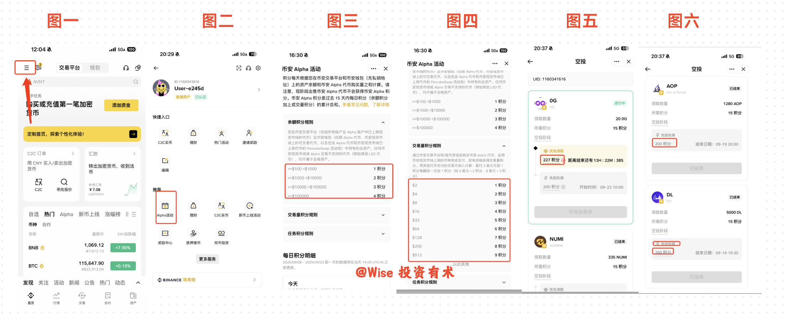

## 一、写在前面

在 8 月份我开始记录欧易的帖子的时候，那个时候我刚刚开始自己的 BTC/ETH 定投生涯，到目前为止已经定投超过了 23 周。

坚持了那么久，唯一可以感叹的是人生很快，要做的事情想好了就去做，要做的投资想好就立马入手！

我这个计划是定投十年，每周 100U 的 BTC/ETH，在币圈里面做实验，看看在标普 500/纳斯达克 100 上的定投思想在币圈里面适用不适用。十年之后我们再来见分晓，实践出真章！

其次就是为什么还是要创作这一篇帖子，我的思考如下：人天生对于未知的事情都是恐惧的，即封闭自己的思想不接触。

我自认为我后续这个账号发展的三大马车分别是**定投纳指/标普**、**美股相关开户&出入金&基础信息普及**、**币圈入门&科普&实操**，这三大方向。

我对这三大方向的目标也很明确：

**1️⃣** 定投确保财富的持续增长，确保下限

**2️⃣** 美股来提高自己财富的多元化，以抵御未知的黑天鹅事件

**3️⃣** 币圈持续跟进，紧跟 Web3，我认为未来的大机会、十倍百倍基本上都在 Web3 领域

然而我在入圈的时候，收罗了很多的信息和资讯，大家都默认用户都是"老手"，所以很多基础的科普知识少之又少。但我认为基础的建设、成体系化的思考才是打破不确定性和未知性最好的方式，所以这也是我一直在努力的方向：即成为朋友们在投资领域最好的朋友，也是最懂小白的投资博主。

那今天的这期内容，主要分为四个章节，分别是币安的基础下载、登录以及实名，钱包的介绍 & 创建，币安的入金 & 买币，以及最后的如何玩转空投，让你不炒币也可以在 Web3 领域赚到钱。

由于我会把所有的内容都融合在一篇帖子里面，所以势必会有很多图片，我会把每个章节的图片融合成为一张图片。那这样很有可能就会导致图片看不清楚的情况，我也会把图片打包放在夸克网盘里面，供大家学习。

夸克网盘链接：[点击查看图片资源](https://pan.quark.cn/s/000c3012de07?pwd=eyHL)

> PS：以上所有截图操作机型是 iPhone 16，如果非苹果用户，先看一遍流程再进行操作，部分内容会有所不同。

---

## 二、币安基础操作

首先就是我们下载币安，这里注意一下：**国区 ID 无法下载，需要用到港区 ID**。所以如果有条件，建议大家多弄一个苹果 ID，一个国区，一个港区，一个美区，在未来都用得到。

至于如何去修改账号地区，可以参考此篇推文学习：[点击查看教程](https://x.com/WiseInvest513/status/1998992921048264916)

> ⚠️ 不要去下载美区的币安，是英文版本，不适合我们。

**1、** 在 App Store 中检索「币安」，找到繁体字显示的币安，点击「取得」。

**2、** 下载完毕之后进入正规的币安最新界面，点击去注册账号，填写密码。

**3、** 在「是否有邀请人」这一栏，首先选择「有」，然后填写上我的邀请码 **WISEBNB**，一方面是对我教程的支持，另外一方面如果成功入金 100U 之后，也可以来私信我，我给你拉专属的服务群。

也可以直接点击此链接在 Web 端完成注册：[注册币安账号](https://www.binance.com/join?ref=WISEBNB)

**4、** 在完成基本账号的创建之后，就是进行实名的身份认证。默认大陆用户选择**身份证**，如果你是非大陆用户，可以选择港区驾照或者相关护照进行实名验证。

**5、** 这个流程基本上走完就行，因为币安要求每个用户都必须进行实名验证，来确保安全性，大家也不必担心自己的身份信息被泄露，在保证身份信息这一块币安已经做的非常完备。

**6、** 在我的印象中，这个流程非常快，大概只需要 1–2 小时即可完成验证。

**7、** 进行到此，恭喜你，你已经完成了币安的注册和实名，已经一只脚踏入到了币圈的世界里面了！相当于你现在已经拿到了入场券，剩下的就是去置办自己的资产，然后开启自己的数字投资之路了！

---

## 三、钱包的理解 & 创建

我们首先来理解一下钱包是什么？在日常生活中钱包是用来存储现金资产的地方，在币圈里面有着异曲同工之妙。

其本质是一种用于**存储、管理和交易加密资产**（如比特币、以太坊、USDT 等）的工具。通过管理你的私钥（证明资产所有权的密码）和公钥（类似银行卡号的地址），让你能安全地发送、接收或持有加密货币。

就和你所有的钱在股票/证券里面没有落袋为安，这个钱就不一定是你的钱。但有朝一日你把这笔钱提现出来，放在了你自己的钱包里面，这笔钱别人就永远拿不走。

币安 App 上的钱包是**托管类型**的钱包，不同于欧易的非托管钱包——非托管钱包需要自己保存私钥，虽然可控性更好，但对于小白来说风险也会更大。如果你是小白，暂时可以这样理解：你在币安这个银行开了一个账号，然后你的钱包就是你的银行卡，把钱还是放在这里，在某种程度上还是币安在帮助你进行管理。

**1、** 首先回到首页，点击交易平台旁边的钱包按钮，然后点击「创建钱包」。

**2、** 选择验证方式，这里通行密钥比较简单，用你这个账户实名的人脸验证即可。这里给大家操作一下身份验证器来进行验证。

**3、** 选择「身份验证器 App」，在此之前，去 App Store 里面检索「身份验证器」，就是 **Google Authenticator**，获取即可。

**4、** 然后按照操作流程复制自己的密钥，来到自己的验证器，点击右下角的「+」号，选择「输入设置密钥」。

**5、** 输入这个验证器的名字（例如「币安登录」），把密钥输入进去，类型选择「时间」即可。成功之后，他会给你一个按照时间流转的六位数验证码。

**6、** 把自己得到的验证码回到币安输入进去进行身份验证，之后再进行邮箱验证即可。

**7、** 最后回到钱包，你即成功地打开了你的钱包。这个钱包没有需要你管理的私钥，平台帮助你管理了。

**8、** 现在有了钱包之后，剩下的就是添加资金。有两种操作方式：一种是通过我们交易所里面的钱充值进来，另外一种是通过钱包地址来接收代币。这部分操作流程可以看下一章节，操作流程基本上相同。

---

## 四、币安的入金 & 买币

了解完毕我们的钱包之后，目前就是有了账号，也有了自己的钱包，就像是我们开了某一银行的账号，也办理了一张独属于自己的银行卡。剩下的就是充值资金进入到自己的银行卡里面。

在这一块上有**两种充值方式**：

- **链上充值**：就像是你在其他钱包/交易所里面有钱，直接充值进来（卡对卡）
- **C2C 充值**：直接通过支付宝/微信进行充值（相当于现金入金）

**【C2C 交易流程】**

**1、** 首先回到主页，点击「添加资金」，然后选择「C2C 交易」。

**2、** 直接选择「自选区」进行交易，便宜而且安全。选择一个成单量比较好的，点击「买入」。

**3、** 输入我们要买入的金额，以 1000 元举例，他会提示我们大概可以得到 140.44U，点击下单。

**4、** 之后就得到了一个支付宝账号和名字，打开自己的支付宝去转账即可。

> ⚠️ 注意三个小问题：
>
> **第一**：如果出现延时到账的情况，放弃转账（一般出现在入金超过 2w 的情况），换一个号来入金即可，也可以用余额宝里面的钱直接转出。
>
> **第二**：用自己**实名的支付宝**号进行入金，这是必须的，不然会出现查收不到的情况。
>
> **第三**：在这个期间，如果资金已经转出去但没有收到款，不要进行其他操作，去联系官方客服即可。

**5、** 转账结束之后，截图自己转账的记录，上传凭证，即可得到 140U 的收款。如此便成功地把自己支付宝里面的钱转入到了币安里面。

**【链上充值流程】**

**6、** 还是回归到入金界面，选择「链上充值」，然后选择 USDT 进行入金，选择 **Arbitrum One** 网络。

**7、** 选择完毕之后，你会得到充值二维码、地址，以及对应的网络。注意：链上充值一定要注意**相同网络**，否则钱就丢了！

**8、** 然后打开我们的欧易（如果没有欧易账号，可以看上一篇教程）。

**9、** 点击右下角的「资产」，选择 USDT 资产，选择「交易所」。

**10、** 选择相同的网络，然后把我们在币安得到的地址复制进来。

**11、** 这里选择充值 100U 从欧易到币安，最后他会提醒我们有多少的手续费。

**12、** 最后就是成功转账 100U 到币安，然后我们也可以在币安中看到这笔款项。

**【买入 BTC 流程】**

**13、** 点击主页下面的「详情」界面，找到 BTC。

**14、** 点击「买入」，填写金额（做演示填写 10U）。

**15、** 回到 K 线图，如果看不到自己买入的记录，可以点击对应标识，点开「历史委托」即可看到自己买入的价格和当前的价格。

到这里基本上你就已经完成了从小白到币圈人的转化，也成功拥有了自己的数字 BTC 货币。

---

## 五、空投的玩法 & 赚钱

分析完毕基本面之后，来聊一下币安的 **Alpha**，也就是我们常说的空投。

**如何理解空投**：就是你每日在币安用自己的 U 来刷交易量，或者自然交易达到某一个数值，每日积累足够的积分。积分是累计过去 15 天所有积分，在币安每隔一段时间就会有新币发行，如果你拥有的积分可以达到官方要求的积分数量，即可消耗一部分积分来领取这个代币。后续可以直接把币卖出来换取 U，然后赚钱。

用一句话理解：**刷交易量 → 领取官方奖励代币 → 卖出换成 U**。

**如何获取更多积分，有两种方式：**

**第一种**：存入资金。存超过 1000U（约 7k 多块钱），每天可以得到 2 积分。

**第二种**：交易量积分，呈现指数级别上升，刷 512 交易量可以得到 9 积分。

过去的空投积分要求，高的在 225+，居多的在 200+，所以计算过去 15 天的总和，最少一天要刷 14 积分，除却每日 2 积分的被动获取，每天要刷 12 积分。

**个人建议的三个实操阶梯：**

| 阶梯 | 资金 | 每日交易量 | 15天积分 | 说明 |
|------|------|-----------|---------|------|
| 初级 | 1000U | 4096 | 210分 | 适合小白，磨损不高 |
| 进阶 | 1000U | 8192 | 225分 | 磨损稍高，领取概率更好 |
| 高阶 | 10000U | 8192–16384 | 240–255分 | 成功率最高 |

**操作流程：**

**1、** 打开行情界面，点击左上角三条杠，点击「Alpha」，即可进入空投界面。

**2、** 那么多代币，选择哪个去刷呢？建议选择**波动性比较小的币**来刷。因为我们的目的就是买入之后立马卖出，如果选中波动性比较大的币，很有可能在卖出时被反撸，最后的收益小于操作时候的手续费。

**3、** 交易流程就是我们前面聊到的购买和卖出即可。

这部分内容可以看此视频教程进行学习：[点击查看详细视频](https://youtu.be/frRapUcAFPI)，详细讲解了如何快速刷积分，更多的数据，我每天也都在持续更新！

---

## 六、总结

今天这期内容，整体上来说是偏小白 + 基础操作，主要给大家分享了**币安的注册、入金、开通钱包，以及空投的简单逻辑和步骤**。

其中关于**钱包部分**以及**空投部分**，我个人认为是后面还需要重点介绍的部分，这部分内容涉及到的知识点比较多，单单泛泛地学习还是有点难度的。所以这两部分内容我会在后面额外再开一个章节的内容给大家详细讲一下，尽可能把我在这个过程中遇到的困惑，以及可以细节把握的点都给掌握完全。

如果各位朋友看到这里，也欢迎给我点个赞，如果点赞过 200，我也会在一周内给大家详细分享！

---

## 七、写在最后

我目前的投资思路是：纳指/标普确定财富稳定增长、美股七巨头确定财富的多元化、然后币圈是后面我认为财富十倍、百倍的地方。

我把投资当做是一个事业，所以我都会持续分享；而朋友们只需要把投资当做是一个「副业」即可，持续专注在自己能够赚钱的领域里面疯狂赚钱就行，专业不一样，侧重点也不一样。

很多朋友找我来咨询如何投资，我很害怕一种人，就是这个也要投资，那个也要投资，不是说不好，而是精力管理都是有限的。一个人想要成功的唯一秘诀就是**专注**。

> 专注定投、专注美股、或者是专注币圈。

人生路很漫长，一步一步投资，总会有收获。

这里是 **WiseInvest**！专注于美股/加密货币投资，坚持投资改变命运，力求通过投资来打造自己财富积累的第三曲线，实现 10 年内财富自由！

如果你对投资、理财、赚钱、Web3 感兴趣，欢迎关注我，我也会在后面持续推出更多优质且精彩的内容！最后，如果大家觉得今天的内容对你有帮助，不要忘记点赞、收藏和转发，你的支持就是我持续更新的最大动力。我们下期再见，拜拜！
