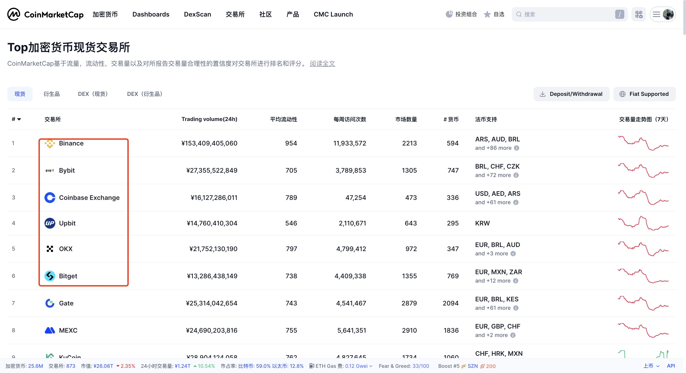
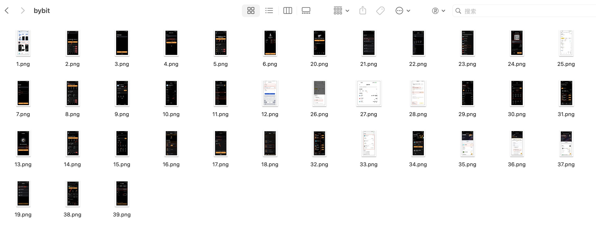

## 零、写在前面

在前面的三节内容里面，我们给大家完整地分享了欧易、币安、和 Bybit，有朋友在后台留言私信我问我有很多朋友也在用 Bybit，这个交易所如何，靠不靠谱、需要不需要顺便也开通一下等问题。

同时也想要让我介绍和分享一下，以及站在更加专业的角度来对比 Bybit 和其他交易所之间的区别，同时作为我们散户而言，对于各大交易所之间应该如何侧重进行选择。

想着这个交易所介绍系列，这个已经算是最后一个了，所以就在这篇文章里面先行介绍一下基础的功能、包括注册、注意事项、薅羊毛。

> PS：本来想着顺便分享一下 Bybit Card 和 Bitget Card 进行一个对比，后来我去问了内部的工作人员，对方聊到目前已经停止大陆用户开卡，但是这也是短暂的，后面还是会开放的，届时再给大家进行分享。

---

## 一、Bybit 交易所介绍

**一句话介绍**：Bybit 成立于 2018 年，由 Ben Zhou 发起，目前总部/重要运营中心迁往中东的迪拜（近年来全球化扩张明显），是全球交易量和用户数位列前几位的加密货币中心化交易所之一，产品从衍生品起家，逐渐扩展到现货、期权、借贷/理财、NFT、API 生态与机构服务。

**主要产品线**：
- 衍生品（Bybit 的起家业务）
- 现货交易
- Bybit Earn / 理财产品
- 借贷、杠杆、保证金账户
- API、做市与机构服务

**核心优势**：
- **衍生品深度与撮合能力强**，起家于衍生品，有成熟的永续合约和期权产品，适合做高频、套利与机构对冲
- **产品线完整**，从现货/衍生/借贷到理财/NFT/机构托管，能承接用户生命周期
- **全球化与合规推进积极**，已拿到地区牌照（如 UAE SCA），为面向机构与企业用户铺路

从以上角度来考虑，我认为 Bybit 是一家合格并且不错的交易所，有自己核心突出的产品，产品线完整，有正规的牌照，且有专业的技术团队与 API 支持。

用最直白的话来讲就是：**Bybit 你注册一个用一用不亏。**

---

## 二、注册 KYC & 注意事项

**1、** 首先打开自己的 App Store 检索「bybit」（注意需要特定 ID），然后下载，点击中间的注册按钮，输入自己的邮箱进行注册。

> ⚠️ 在进行到这一步的时候，你可能会因为网络的问题而无法连接到网络，注意把自己网络的节点切换到**日本**去，即可成功连接网络。

**2、** 然后选择自己的地址（可以选日本，也可以选中国），填写自己的邮箱，注意可以填写邀请码：**WISE5130**。

也可以通过浏览器点击如下链接进行注册：[注册 Bybit](https://partner.bybit.com/b/WISE5130)

> 如果你通过我的邀请码注册了 Bybit，并且成功入金 100U，可以私信发我 UID，我拉 VIP 服务群。

**3、** 然后点击「去认证」，这里可以选择自己的护照或者是身份证。你使用护照还是身份证的区别不是很大，你有护照的话，最好用护照，没有用身份证也可。

**4、** 实名通过之后，这里大家要注意保护自己的安全，最好添加一个**谷歌验证**。

首先点击人头像，然后访问个人空间，然后点击「安全设置」，最后添加以下验证：谷歌身份验证器、资金密码以及防钓鱼码，确保自己的安全。

**5、** 关于谷歌验证器，原理很简单：你下载一个 App，然后把密钥复制到谷歌验证器中，其会根据时间每隔一段时间给你生成一个动态的六位数密码，通过这个动态码对账户进行二次保护。

完成之后，后续即可进行正常地操作。

---

## 三、入金操作

关于 Bybit 入金操作和 Bitget 大体一致，这里用**币安进行演示**：

**1、** 首先点击 Bybit 的「资产」，然后点击「充值」，点击「存入加密货币」，选择 USDT，选择网络是 **BSC 网络**，最后得到一个地址和一个二维码。

**2、** 打开你的币安 App，点击「资产」，选择「转出」，选择「链上提现」，选择币种是 USDT，然后点击右上角的扫描得到具体的地址。

**3、** 确定网络，确定金额，可以看到通过 BSC 转账基本上是**秒到并且无损耗**的。

> 💡 在加密货币中，我们从法币充值成为加密货币的过程中，一定要注意各种手续费，这部分是不可忽视的损失。

最后，我们回到了 Bybit，可以看到成功收到了 100U 的加密资产，后续就可以在 Bybit 进行系列的操作了。

---

## 四、赚钱策略

### 4.1 新手福利

首先回到首页点击「更多」，然后点击「福利中心」，可以看到只要完成了一级身份验证即赠送 **20U 的手续费折扣券**（有总比没有好）。

重点：**如果充值入金 100U，并且交易量大于 10U**（大家可以买入 BTC，再卖出 BTC 个 10U，即可满足要求），然后就可以点击进去选择 **20U 等值的代币**，后续再把这个出手掉即可无损赚 20U。

### 4.2 Spot X

聊完新手福利之后，剩下的就是一些交易量的活动，里面有 **Token Splash、LaunchPool、空投盛典、LaunchPad**，大家点击进去会发现基本上大差不差。

例如 **LaunchPool 的质押赚币**，在 Bybit 上，可以看到其质押赚币多是其代币自己的池子，即你要先购买这个代币，然后才可以赚币。相对于 Bitget 的 ETH/BTC 池子来说，要稍微有一些不一样，当然自己的池子其收益一定会更大。

其实和币安的 LaunchPool 基本上也都是互补的关系，相关的代币也都会上，所以如果你看好时机，也是可以做到**一鱼多吃**的效果。

**空投盛典**：不同于其他交易所，这个是你只要通过 X 关注并且完成任务既可以领取，有点像是嘴撸的感觉。

**LaunchPad**：即低价认购，然后上线出售。

其实这个系列里面无论是 Bitget，亦或者是 Bybit，主流的都是 LaunchPool，即质押赚钱，对于欧易也是如此。

### 4.3 理财赚币

关于理财，这部分内容在 Bybit 的优先级很高，享受一个单独的界面，并且在主菜单还有一席之地，就证明其重要性。

具体的操作细节即我们前面分享过，看准在不同时期里面不同的收益如何。Bybit 对于新手福利还是蛮大的，就例如**新手 555% 福利**，如果你放里面 300U，两天之后可以收获 9U 左右，还是满香的。

> 网盘图片资源链接：[点击查看](https://pan.quark.cn/s/58e380db5375?pwd=JhAm)

---

## 五、四大交易所对比

目前四个交易所的入金 & KYC 也都简单分享过了，也从 Bitget 和 Bybit 中分享了如何从交易所薅羊毛，整体上我觉得做到了扫盲的效果。如果你认认真真把这四篇帖子看完，基本上也就对交易所有了一个基础的了解。

| 交易所 | 定位 | 核心优势 | 适合人群 |
|------|------|---------|---------|
| **币安** | 加密世界的央行 | 生态庞大、流动性强、大额无滑点 | 专业玩家、一站式用户 |
| **欧易** | 技术派 + 产品体验流 | UI 业内一流、Web3 布局领先 | 华语用户、体验党 |
| **Bitget** | 社交交易与跟单之王 | 跟单交易、活动丰富、奖励机制完整 | 新手、慢慢熟悉交易的朋友 |
| **Bybit** | 衍生品专家 + 国际感强 | 合约深度强、延迟低、VIP 分层清晰 | 合约交易员、量化玩家 |

> 币安是「权威银行」；欧易是「科技精品」；Bitget 是「社交圈子」；Bybit 是「专业交易室」

大家可以看着自己的喜好，选择适合自己的交易所。

---

## 六、写在最后

对于个人来说，我没有特定的偏好，不同的交易所也都会有不同的活动，我会参加，然后也会在不同的交易所进行不同的操作。

例如币安最近主要是用来购买中文币，主力是欧易，界面我觉得很不错；Bitget 目前用来做定投使用；然后 Bybit 目前在进行更加专业的操作……

**如果你是新手小白，我个人建议**：可以找一个时间，把四个交易所都开一遍，然后用币安 & 欧易进行 C2C 入金，再去给 Bitget 以及 Bybit 入金。学习交易所互相的链上转账，了解基本的交易所操作，还可以顺便薅一个羊毛。

几个交易所加在一起可以薅到**四位数的羊毛**。

我觉得在 Web3 里面赚钱，主要是有货币优势，你在交易所里面都是以 U 进行计算，你薅到 10U，就是 70RMB，你薅到 100U，就是 700RMB 了。

加密货币交易所这个系列就正式完结了！🎉

这里是 **WiseInvest**！专注于美股/加密货币投资，坚持投资改变命运，力求通过投资来打造自己财富积累的第三曲线，实现 10 年内财富自由！

如果你对投资、理财、赚钱、Web3 感兴趣，欢迎关注我，我也会在后面持续推出更多优质且精彩的内容！最后，如果大家觉得今天的内容对你有帮助，不要忘记给我点赞、收藏和转发哦，你的支持就是我持续更新的最大动力。感谢大家的关注！
