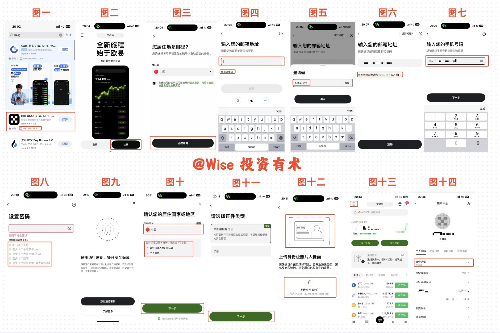
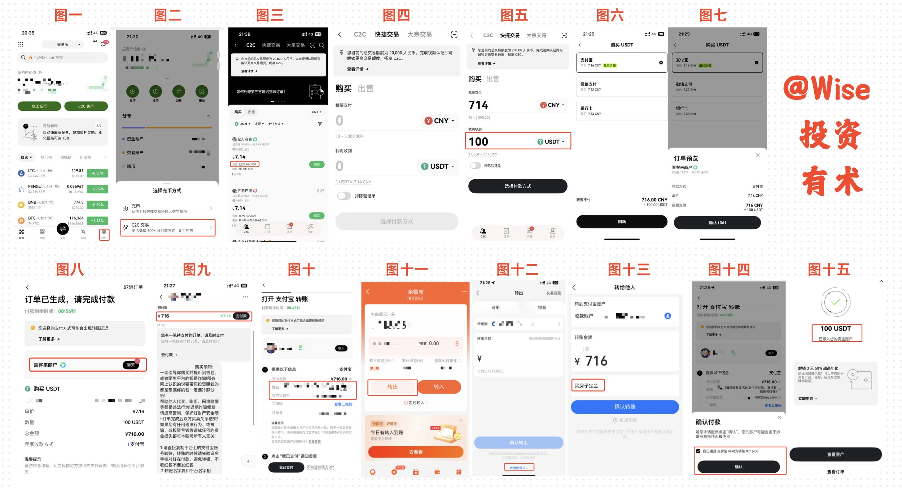
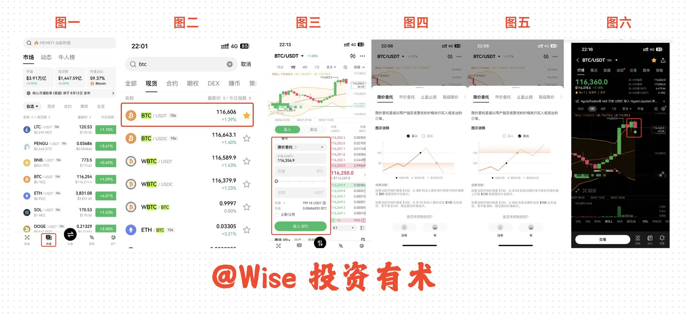

## 一、写在前面

时间是 2025 年的 8 月 7 日，此时 BTC 和 ETH 经过一周的震荡重新回到了 116000+ 和 3800+。

上一轮的下跌或许是因为涨的太多进行正常的下调，亦或者是非农数据的出炉导致的震荡，其实无论我们怎么解释都行得通，亦或者是都是我们自己的主观想象。

我们发现自从特朗普上台之后，加密市场一直都是腥风血雨，他上台之后自己推出的 Trump 让多少人一夜暴富，又让多少人倾家荡产，其实我们已经不得而知。

但是不得不否认的是，特朗普的出现，或者是这个被大家称作是「加密货币总统」确实让加密市场迎来了更多的目光和关注，也带来了更多的增长！

或许此时此刻 BTC 或者是 ETH 已经不像是最开始蛮荒时期是极致的个人主义和疯狂的造富机器！但是随着各种政策的不断出台以及长久以往的对人们潜移默化认知的影响，越来越多的名人和政府开始公开持有他们，在某种程度上也从侧面印证了加密市场、加密货币并非不懂的人口中的「骗局」！

如果你是一个长期主义者，目标是 20、30 年后 BTC/ETH，亦或者是你是一个想要靠 BTC 翻身的「闲鱼」，或许当我们开始谈论它，开始接触它、开始持有它，在若干年后，我们突然会意识到命运的齿轮在这一刻已经开始转动！

而自我接触加密货币以来，我深感一个道理，那就是一个普通人想要加入这场盛大的狂欢是如此困难。我们要克服的不只是物理上的难题，例如如何使用交易所、如何进行身份证认证、如何购入 BTC、如何看走势等；更是认知上的难题，BTC 是不是骗局，是否可以长期持有、是否值得去研究和投资，以及是否值得去信任这些问题。

所以我今天想要给大家科普的是**物理篇**，这篇文章只有一个目的，那就是教会大家如何在目前你什么都不懂的情况下，仅仅通过这一篇文章让你可以成功购买一份属于你自己的 BTC！

> PS：此文章是系列文章，分为上、中、下篇，我将在未来几天时间里面分别介绍欧易、币安和 Bitget 的具体操作方法和细节。

---

## 二、交易所注册

在开始本章节内容之前，我们先来了解一下什么是交易所：所谓的加密货币交易所是一个数字平台，允许用户买卖、交易加密货币（如比特币、以太坊等）或将其兑换成法币。通俗来讲就像一个数字货币的「股票市场」，提供交易撮合、资产存储和价格信息等功能。

**欧易**是全球第三大交易所，全球合规，持有多个国家和地区的监管牌照（如迪拜 VASP、澳大利亚 AFS），平台界面简洁，操作便捷，移动端 App 支持 160 多个国家，功能强大，很是适合新手和专业交易者。

**1、** 打开 App Store（注意是美区账号，国区账号检索不到）检索「欧易」，找到对应的 App，下载安装。

**2、** 下载完毕之后，点击右边的「注册账号」。

**3、** 选择国家为「中国」，点击同意条款，开始创建自己的账号。

**4、** 输入自己的邮箱账号，确保可以接收到验证码，同时填写邀请码：**58547997**。

> 💡 通过我邀请码加入的欧易，您后续在欧易购买 BTC 手续费终生减免 20%，同时您作为受邀方，在完成新手任务之后也有机会获得价值 100U 的新手奖励，同时也是对本教程最大的支持！
>
> 如果你是电脑端查阅此篇推文，可以直接点击如下链接：[注册欧易](https://oyicn.link/ul/YbU25D?channelId=58547997)，直接快速在网页端注册欧易，快人一步！

**5、** 填写完毕之后即为绑定成功。

**6、** 后续输入自己可以接收验证码的手机号，绑定手机号。

**7、** 输入特定密码（注意密码不要和其他平台账号密码一致，容易被盗取，建议更换新的密码）。

**8、** 添加个人通行密钥，确保账户安全，可以是人脸验证也可以 PIN 码，确保安全。

**9、** 完成之后，确定我们国家和地区是中国，选择**身份证**作为验证选择，进行验证。

**10、** 选择之后，上传自己的身份证正面，并配合人脸验证即可通过实名认证。

**11、** 稍作等待认证成功之后，你就可以进入到欧易的主界面了！

**12、** 点击左上角九个点，再点击个人头像，即可看到自己的个人认证信息。

以上，全程不超过 15 分钟，你就完成了从零到一拥有一个欧易交易所！后面就可以开始自己愉快的交易之旅了！

---

## 三、入金购买 USDT

现在我们已经拥有了一个交易所，按照我们之前的理解是不是可以直接去购买 BTC 了呢？

**答案是不能的！**

我们需要先把我们的钱转化成为 **USDT**，因为 USDT 才是各类交易所所认可的货币，才可以用来购买 BTC。

**什么是 USDT？**

USDT（Tether）是一种稳定币，其价值与美元 1:1 锚定，旨在保持价格稳定，广泛用于加密货币交易。主要优点包括：

- **价格稳定**：与美元挂钩，波动小，适合作为交易中介或避险资产
- **流动性强**：在各大交易所（如币安、OKX）广泛支持，交易便捷
- **用途广泛**：用于购买其他加密货币、跨境转账或存储价值

**C2C 交易须知（购买前必读）：**

> **第一**：我们在交易所上购买的 U 并不是交易所卖给我们的，而是一些持有 U 的用户点对点出售，也就是 C2C 交易。
>
> **第二**：在境内通过支付宝/微信/银行卡购买 U 会不会违法？答案是不会，不用担心违法等问题，但是有时候购买会出现风控，这个时候不要进行交易即可。
>
> **第三**：我们是先付款给 U 商，U 商把他们放在交易所上的 U 拨给我们，所有的交易都会有平台进行担保，如果对方不放行，我们去找平台进行举报即可。
>
> **第四**：哪个渠道购买最便宜？目前来看支付宝依旧是最便宜的，我们作为新手玩家最开始都是使用 C2C 进行充值交易。

**操作流程：**

**1、** 打开欧易交易所，点击右下角的「资产」，然后点击屏幕上方的「充币」，选择下方的「C2C 交易」。

**2、** 在上面有 C2C 和快捷交易，C2C 交易价格更低，但是有最低额度；快捷交易价格高一些，但是没有额度限制。

**3、** 我们作为新人，出师入金都会比较少，所以以快捷交易举例子：输入 100U，可以看到大概需要支付 714 元。

**4、** 选择付款方式，例如支付宝需要支付 716，微信支付 722，银行卡支付 733，我一般会选支付宝。

**5、** 然后点击「预览订单」，确定订单，即可进入到支付界面。

**6、** 进入到聊天界面，点击「去付款」，即可拿到对方的支付宝信息，去支付即可。

> ⚠️ 注意：支付的时候不要写「买 U」等字眼，可以写「买车定金」、「买房定金」等。

**7、** 最好采用**余额宝**付款，因为小比订单不容易被风控，如果是超过 5k 元的汇款，很容易被风控，所以采用余额宝风险更低。

**8、** 打开支付宝，点击「余额宝」，点击「转出」，然后点击「转出给他人」，输入金额，进行名字对应转账。

**9、** 转账结束之后，去欧易支付界面，点击「确定付款」，确定已经给对方账户支付了对应金额。

**10、** 完成之后，大约过了 10s，你就会收到欧易的入金提醒，提醒你成功充值 100U！

到此，不过 10 分钟时间，你成功学会了如何把自己的 RMB 充值成为 USDT。

---

## 四、购买 BTC

很棒，如果你按照我的流程和操作，即便是慢一些，你也可以大概在半小时内，拥有自己的交易所账号以及成功地入金 100U，大概就是充值 700 多元人民币！

但是到这边还没有结束，因为我们的目的是为了购入 BTC，所以下面我们会给大家讲解一下如何购买。

> ⚠️ 交易所的功能很丰富，我这里只是初级教程——即教会大家走完这个小流程，至于里面的投资、合约和跟单等内容等到后面我们出高级课程了再给大家做分享！
>
> 作为小白，**不要轻易尝试合约和加杠杆**，不然一个操作不当，很有可能你辛辛苦苦赚到的钱，就亏出去！

**操作流程：**

**1、** 打开欧易，点击下方的「市场」，点击搜索，搜索 BTC，找到 BTC/USDT 加入收藏。

**2、** 点击「交易」，进入到购买界面。

**3、** 买入/卖出都分为两种：一种是**委托**，另外一种是**直接购买**。委托的意思是，如果此时市场正在回调走下行，你定委托单为 12 万，此时如果跌破 12 万，系统会自动帮你购买，卖出同理。

**4、** 当然我们也可以直接购买，输入数量，例如我们输入 10U，点击购买，会显示委托价格和购买的 BTC 数量。

**5、** 点击「买入 BTC」，即成功买入 10U。你可以回到 BTC 走势图，可以看到自己在 K 线图上的「B」图标记录，即寓意着你成功买入 10U 的 BTC。

> 如果你在 BTC 12 万时候，购入了 10U，有朝一日 BTC 涨到 24 万之际，你的 10U 就会变成 20U！

至此，你成功地购买了人生的第一笔 BTC，距离暴富又近了一步！

---

## 五、写在最后

**1、** 这是欧易的操作流程，因为欧易界面简单，对新人友好所以我先从欧易介绍起，后面我们也会陆陆续续介绍关于币安和 Bitget 如何注册、入金和购买加密货币！

**2、** 我个人信奉长期投资和长期持有，但是因为加密货币被大家称作是割韭菜圣地，所以我也在做实验，每周定投 100U 的 BTC 和 ETH，看看一年之后会亏还是赚。具体推文链接：[点击查看](https://x.com/WiseInvest513/status/1952017101805457420)，欢迎大家关注，和我一起来做这个实验！

**3、** 入金的方式有很多，我们最开始没有资源和人脉的时候直接采用支付宝充值是最快的方式，在没有完整了解整个币圈之前，请不要轻易相信他人给你进行充值。

**4、** 小白除却采用现货购买加密货币以外，请你在没有完全掌握 80% 信息之前不要涉猎合约，也不要轻易尝试。

以上就是今天的全部内容了，如果对你了解如何投资 BTC 有帮助的话，欢迎点赞、收藏和转发哦！我也会不定期在支持我的朋友里面定期抽奖，送 U，欢迎大家的关注。

您的支持是我最大的动力，我们下期再见！
