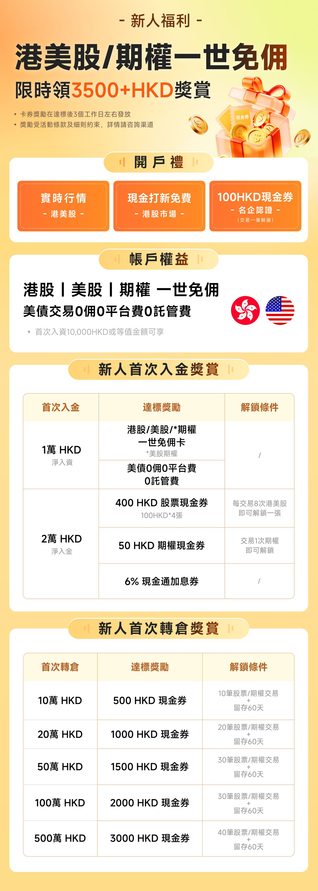
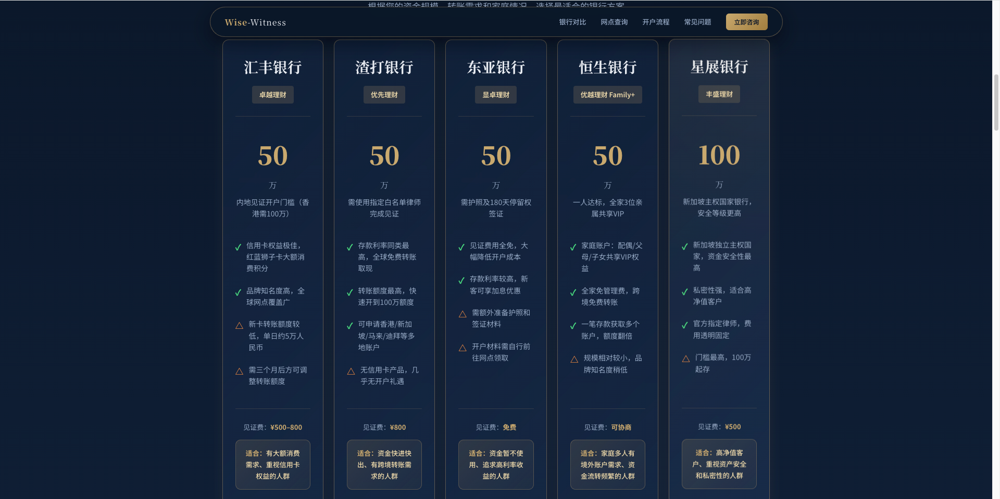
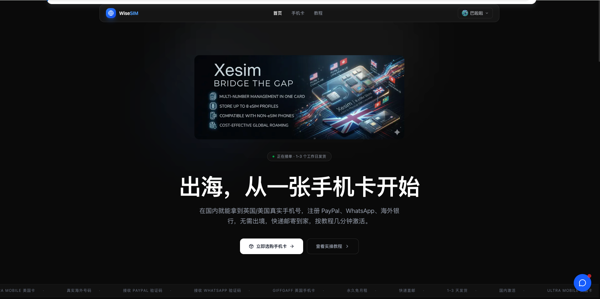

## 一、写在前面

目前国内用户投资港美股的最全策略和方案即分为三步走，其实所有的港美股投资这个逻辑，即：

1. 选择一个国内的银行卡，进行换汇，这里推荐的是兴业银行的寰宇人生借记卡，此卡有转账的后续费减免！
2. 选择一个中转银行卡进行中转，这里的中转卡可以是 Ifast、Wise 这种不需要前往香港办理的，亦或者是需要前往香港办理的港卡。
3. 选择一个券商进行入金购买，这里我目前比较推荐复星证券，其可以进行丝滑开户

## 二、国内银行卡

国内卡推荐的是兴业银行，汇款会有手续费优势。

具体可以查看此链接进行学习：[wise-invest.org/s/p0ilie7g](https://www.wise-invest.org/s/p0ilie7g)（看后半部分内容）

## 三、汇款银行卡

如果没有条件可以选择 Ifast 英国数字银行，无需前往香港办理港卡。

具体可以查看此链接进行学习：[wise-invest.org/s/p0ilie7g](https://www.wise-invest.org/s/p0ilie7g)（看前半部分内容）

## 四、香港港卡

- 实体港卡教程：[实体卡教程](https://www.bilibili.com/video/BV1iC15B7Em1/)
- 虚拟港卡教程：[虚拟卡教程](https://www.bilibili.com/video/BV1zw1UBLEaj/)

## 五、券商

### 复星

- PS：复星证券的福利待遇更加好，也比较出名，所以现在推荐大家开这个券商，入金一万港币就可以做到港美股终身免佣了，但是目前需要一些境外地址证明，这个大家如果没有的话，可以联系我，我 100% 给大家对接官方渠道进行审核通过！

复星券商可查阅此地址进行学习：[查看复星开户教程](https://www.wise-invest.org/articles/broker/sQSbLRe8)

复星证券最新的四月份福利如下：

## 六、其他推荐

### 1、见证开户

即足不出户，往某个银行里面存款50万，三个月，即可获取到此银行的其他国家银行账户，非常适合无法前往香港/不想出国，但是想要办理海外银行卡的朋友，具体介绍链接如下所示：

[见证开户](https://www.wise-witness.com/)

### 2、giffgaff 手机号购买

如果你想要注册一些产品，但是国内的手机号无法注册，非常需要一个境外是的手机号，那 giffgaff会是一个不错的选择，每年只需要 6 块钱，即可保号，而且接短信完全免费，注册使用之后一张卡可以使用 20 年！

[手机卡购买链接](https://www.wise-sim.org/)

## 七、写在后面

大家可以前往此链接进行更多内容的学习，那也欢迎大家关注我个人公众号，获取到我的个人联系方式，有问题可以咨询我进行交流。

大家记得扫码关注哦，我们也会不定期给大家安排抽奖的福利了！

