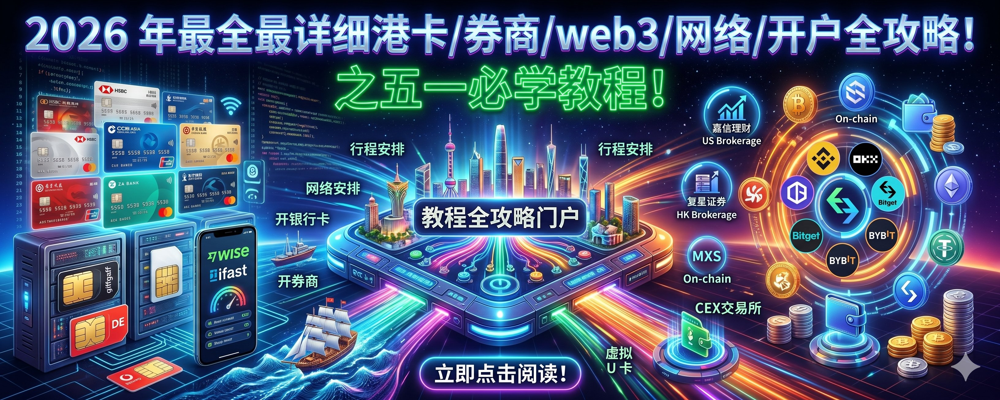
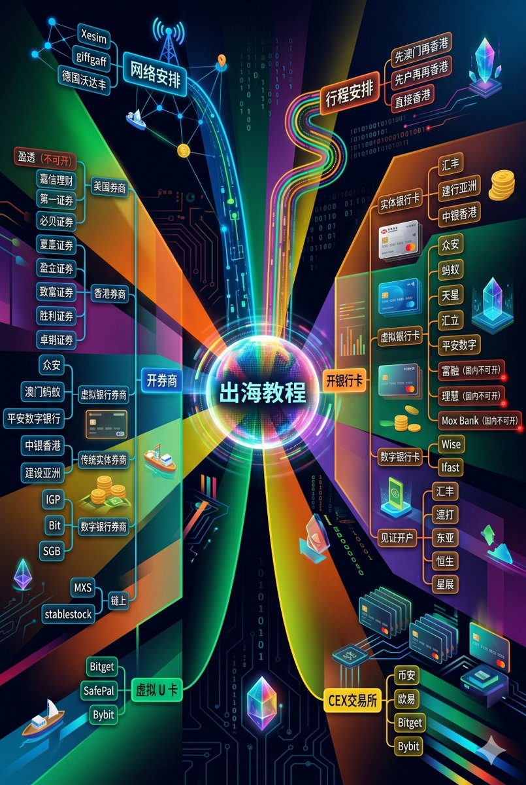
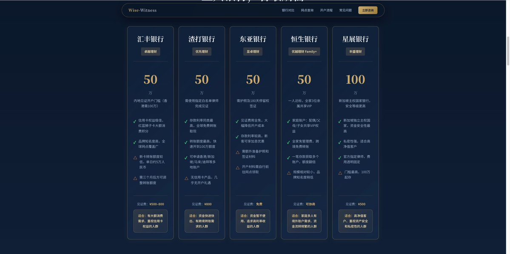
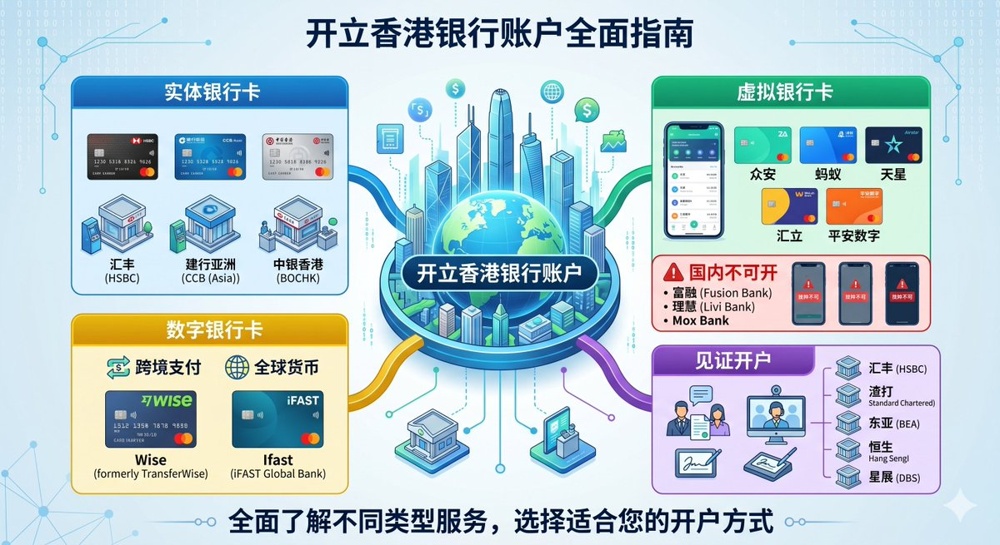
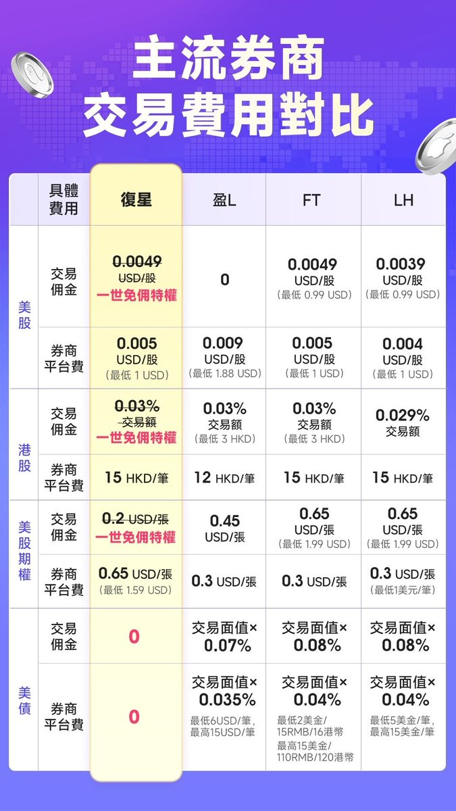
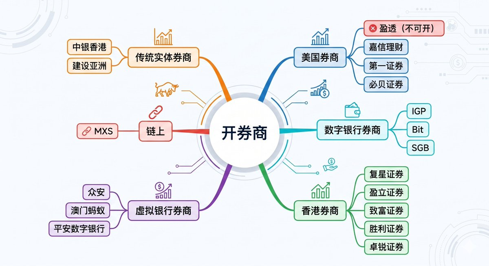
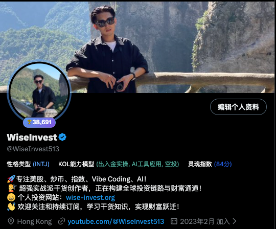
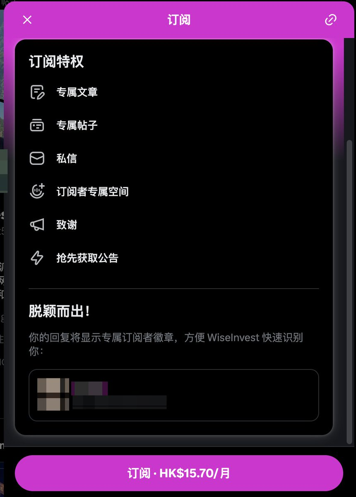

## 一、写在前面

哈喽啊，今天就是五一假期了，Wise 在这里预祝大家五一假期可以玩的开心了！

我们最近也算是加班加点把各个银行/券商等内容都做了一个整理和教程安排，但是最近内容变多了，很多朋友也都在说感觉学的东西有一些多，总是有一些云里雾里的。

所以我就想着乘着这个五一假期，把我们过去的一些教程/资源等再做一个详细的整理，来帮助大家进行更好的学习！

所以说如果你有计划这个五一假期前往香港办理港卡，开始准备投资港美股，那这个系列我将称作是**最全教程**。亦或者是这个假期你没有外出的一些安排，你有计划准备在家里学习和整理这些知识点，准备利用这次的五一假期给自己安排充电，等到假期结束之后，错峰出行前往香港办理这些卡，那这些教程也可以帮助你了解和学习到很多专业的内容！

亦或者是你过去对于 **Web3** 一直都比较感兴趣，一直都想着这个时间好好研究下他们之间的关联点以及操作，那这个合集教程，就是目前我给大家准备的**最全的系列教程**了。

但是咱们的内容也都比较多，所以我就专门做了一个脑图来详细展示咱们今天这期的教程都包含哪些内容，也好让大家有一个预览。

如果大家把这个里面的教程都了解完毕也都学习完毕之后，我相信大家基本上就已经把美股系列的都给了解的七七八八了！

ok，话不多说，我们就即刻开始吧。

---

## 二、行程安排

> **Tips**：赴港其实是一件非常简单的事情，只需要你前往你本地的出境服务大厅办理一个**港澳证**即可。而且港澳通行/护照即便是你不出行，如果你比较关注于出海的话，其实也都是必不可少的有效证件，推荐办理。

然后就是安排上，我这里推荐的行程安排是有两条路，一条行程是**先澳门再香港**兼顾旅游+开卡。可以参考如下的教程安排：

---

那另外一条路其实也就比较简单了，就是你**直接前往香港**办理，可以直达香港，也可以在深圳/广州等地进行一个中转。

具体教程可参考：[赴港行程安排教程](https://www.youtube.com/watch?v=8zzn-IHIBIk&t=2s)

---

## 三、银行卡开立

> **Tips**：聊完了行程安排之后，我们就来聊一下开卡这件事情，其实现在不比之前比较复杂和困难，现在都比较简单，大家完全可以线上走完这些流程。

目前开的这些卡，我也想先给他们进行一些分类：

- **1️⃣ 实体银行卡**：顾名思义就是现在有实体网点的银行卡
- **2️⃣ 虚拟银行卡**：就是所有的业务都是在线上进行，没有线下实体的网点
- **3️⃣ 数字银行卡**：这个偏向于全球类型的一些银行卡，不用一定前往香港办理
- **4️⃣ 见证开银行卡**：这些银行卡属于是国内存钱，然后你可以开全球范围的银行账户

### 1、实体银行卡

目前实体银行卡我们比较推荐的是**汇丰**和**中银香港**这两张卡，目前汇丰比较好下卡，但是中银香港已经卡的比较严格了，所以大家如果要准备中银的话就需要去线下网点进行预约办理。

对此我的态度是提前在网上找好一些渠道，无论是预约的渠道还是说线下的渠道，聊好价格，看是否要准备办理。

[汇丰银行开户教程](https://www.wise-invest.org/articles/bank/WoxUXncV)

[中银香港开户教程](https://www.wise-invest.org/articles/bank/AO9Yfph5)

还有一个是**建行亚洲（港澳）**，顾名思义就是咱们的建设银行对应的香港的银行卡，好处就是可以和本地境内的卡进行一个比较好的系统转账。

[建行亚洲开户教程](https://www.wise-invest.org/articles/bank/0uzSFs7d)

### 2、虚拟银行卡

目前香港的虚拟银行卡分为八家，他们分别是众安、蚂蚁、天星（象象）、富融、理慧、汇立、平安数字银行（PAO Bank）以及 MOX Bank，其中**富融、理慧和 MOX Bank** 现在已经不能够开户，唯一可以开户的就是剩下的五家。

那剩下的五家我们也都已经制作过相关的教程，教程如下，大家可以点击学习。

**1️⃣ 众安、蚂蚁、天星教程**

[众安银行开户教程](https://www.wise-invest.org/articles/bank/2aiiqnjt)

[蚂蚁银行开户教程](https://www.wise-invest.org/articles/bank/OwFAe2JD)

[天星银行开户教程](https://www.wise-invest.org/articles/bank/ucHyMf8P)

**2️⃣ 汇立开户教程**

[汇立银行开户教程](https://www.wise-invest.org/articles/bank/wMpXaoI5)

**3️⃣ 平安数字银行开户教程**

[平安数字银行开户教程](https://www.wise-invest.org/articles/bank/wgBs7jp3)

### 3、数字银行账户

这些也都是我们目前在用，并且**不需要你前往香港**办理的银行卡，分别是 **Wise** 和 **Ifast**，都是英国的线上数字银行账户，比较适合无法前往香港的朋友，具体教程如下，大家可以点击学习！

**1️⃣ Wise 数字银行账户**

[Wise 数字银行账户开户教程](https://www.wise-invest.org/articles/bank/Ysn8tPfj)

**2️⃣ Ifast 数字银行账户**

[Ifast 数字银行账户开户教程](https://www.wise-invest.org/articles/bank/AARzryKJ)

### 4、见证开户

其实还有一种方式，如果你在中国大陆，无法前往香港，但是有计划开汇丰、渣打、东亚、星展和恒生等银行，可以采用的方式就是在国内存钱一段时间，再然后进行**见证开户**的方式进行开卡。

[见证开户详细教程](https://www.wise-invest.org/articles/bank/QonLSJp0)

这种好处就是你可以开其他国家的银行账户，坏处就是需要一定的门槛，大家也都需要有一定的体量，具体如下所示。

### 5、总结

如上的银行卡涉及到**众安、蚂蚁、天星（象象）、富融、理慧、汇立、平安数字银行（PAO Bank）、Mox Bank、中银香港、建行亚洲、汇丰、渣打、东亚、星展、恒生、Ifast、Wise** 等 18 家银行/银行账户。

基本上满足大家各个方面不同的需求，大家可以根据自己不同的情况进行资料和内容的自取了！

---

## 四、券商开立

> **Tips**：券商目前主流的分为港资和美资券商，当然现在细分下来还有传统实体银行券商、虚拟银行券商、数字银行券商，我这里也都聊一下。

### 1、美资券商

目前美资券商里面比较被我们熟知的就是**盈透、第一、嘉信、必贝**等，好处就在于我们不用担心 CRS 等问题，但是缺点也比较明显。目前盈透关闭开户，其他的必贝、第一和嘉信使用起来也都各有各的千秋。

目前我们已经给大家制作了第一证券和嘉信证券的教程，分别如下。

**1️⃣ 嘉信理财开户教程**

[嘉信理财开户教程](https://www.wise-invest.org/articles/broker/MWyWMwwN)

**2️⃣ 第一证券开户教程**

[第一证券开户教程](https://www.wise-invest.org/articles/broker/eKIyMXl8)

必贝教程我们也已经在路上，大家可以耐心等待。

### 2、港资券商

港资券商其实可以开户的还是比较多的，例如**致富、盈立、卓锐、胜利、复星**等券商。咱们也制作了致富、盈立、复星等教程，教程分别如下。

**1️⃣ 复星证券开户 & 入金教程**

[复星证券开户教程](https://www.wise-invest.org/articles/broker/sQSbLRe8)

[复星证券入金教程](https://www.wise-invest.org/articles/broker/myu8sVmc)

**2️⃣ 致富证券开户教程**

[致富证券开户教程](https://www.wise-invest.org/articles/broker/GaobLP0X)

我这里个人比较推荐的是**复星证券**，如下是其和其他证券的一个对比图，大家可以作为参考。

复星证券一直比较抢手，所以开户的话对外界来说是需要境外地址证明，但是我对接了官方渠道，如果你有**港澳通行证/护照**均可进行开户，如果有需要可以联系我！那如果你都没有的话，但是还是想要开户，可以联系我去进行致富的开户。

### 3、虚拟银行券商

其实如果就论购买港美股而言，现在很多的虚拟银行也都在支持港美股的购买，例如我们聊到比较多的**众安银行**就做的比较好，那其实不只是众安，例如澳门蚂蚁、天星、平安数字等其实也都支持港美股的购买。

目前我只是对众安进行了一个详细的介绍和对比，大家可以查阅此教程详细了解众安银行购买港美股的一些情况和费率对比。

[众安银行购买港美股教程](https://www.wise-invest.org/articles/bank/4EB0zNOS)

### 4、实体银行券商

这个其实就是实体银行中购买港美股，就像是我们前一段时间开的**建行亚洲**，其中也内置了投资产品的购买。但是这些传统券商他们的优点比较明显，那就是资金可以在银行里面进行比较低损耗地周转，但是缺点就是费用一定是比较贵的，所以这部分我们暂时不展开做推荐。

### 5、数字银行券商

这里其实我在之前聊到过，**Ifast** 是被我们忽视的一个银行，其 IGP 就是一个比较好的业务，到时候我也会给大家进行一个比较详细的介绍。这部分内容我在前面也聊到过，大家可以先看一下之前的教程，然后后续我们再进行比较具体的详细的分析。

### 6、总结

其实如果做总结，我们可以在以下渠道购买到港美股：

| 类型 | 平台 |
|------|------|
| 美国传统券商 | 盈透 |
| 香港传统券商 | 复星 |
| 香港数字银行 | 众安 |
| 传统银行券商 | 建行 |
| 数字银行券商 | Ifast |

但是他们之间的区别和费率呢？那又是一个比较大的内容了，欢迎关注后续持续分享！

---

## 五、交易所学习

> **Tips**：目前的交易所可分为 CEX 和 DEX 交易所，我们重点关注 **CEX 交易所**，因为更加容易上手，相关的服务做的也都会更好。这里我们就直接放出对应的学习教程，大家按照教程进行学习就好。

### 1、币安交易所

[币安交易所注册&使用教程](https://www.wise-invest.org/articles/crypto/GaM38JYk)

### 2、欧易交易所

[欧易交易所注册&使用教程](https://www.wise-invest.org/articles/crypto/mAPQm7WZ)

### 3、Bitget 交易所

[Bitget 交易所注册&使用教程](https://www.wise-invest.org/articles/crypto/k3RVVcw4)

### 4、Bybit 交易所

[Bybit 交易所注册&使用教程](https://www.wise-invest.org/articles/crypto/e6utod7B)

---

## 六、虚拟 U 卡

> **Tips**：虚拟 U 卡部分也是我们在过去多次聊到的，其功能多变，非常适合咱们在 Web2 和 Web3 之间进行资金的流通。在过去推荐过多次，我这里再做一个小总结。

### 1、Bitget 虚拟 U 卡

首先的虚拟 U 卡，可以用来进行 Web2 和 Web3 的资金流转和消费，你可以直接拿这张卡绑定在国内的美团/淘宝中进行消费，可以直接把 Web3 里面的钱直接进行消费，而且费率友好，且在一定的额度之内，消费都是**免手续费**的。

[Bitget 虚拟 U 卡开卡教程](https://www.wise-invest.org/articles/vcard/WK8p1cCV)

### 2、SafePal 虚拟 U 卡

和 Bitget 背后的 U 卡服务商是同一家，如果说 Bitget 更加适合日常的消费，那 **SafePal** 更加适合大家用来进行资金的流转。其不仅仅可以直接入金券商，而且还可以直接出金到国内的银行卡里面去，即你**不需要进行额外的换汇**即可完成这些动作。

[SafePal 虚拟 U 卡开卡教程](https://www.wise-invest.org/articles/vcard/E4lD5AIn)

但是上述的虚拟 U 卡现在开卡都**需要护照**才可以开卡，如果你没有护照的话，可以试一试下面的。

### 3、Bybit 虚拟 U 卡

Bybit 虚拟 U 卡依靠 Bybit 交易所而建，其目前**不需要其他证件**即可完成正常的开卡工作。而且在前一段时间使用 Bitget/SafePal 订阅 Claude 经常封号的时候，我拿 Bybit 订阅的 Claude 依旧非常坚挺地没有被封号，并且一直都在正常使用。所以如果你平时没有一个比较好的虚拟 U 卡用来进行 AI 产品订阅的话，那 Bybit 会是一个不错的选择。

[Bybit 虚拟 U 卡开卡教程](https://www.wise-invest.org/articles/vcard/wYKRLDvK)

---

## 七、网络/手机卡安排

> **Tips**：目前越来越多的产品正在逐步要求大家使用境外手机卡进行注册，所以境外手机卡也要准备提上日程！

[境外手机卡申请教程](https://www.wise-invest.org/articles/simcard/EAN52fdr)

另外一款是保号神卡 **giffgaff**，具体教程如下：

[giffgaff 保号神卡申请教程](https://www.wise-invest.org/articles/simcard/isBZdnTm)

那目前**德国沃达丰**已经不能够再成功注册了，已经关闭了国人注册的通道，所以如果大家还有境外手机号需求的，可以来试一试 giffgaff，目前还能够进行申请和使用。

这些东西不确定未来会如何，所以大家如果有计划和规划的，可以提前准备上了。

---

## 八、福利特供

正如我的介绍所言，我正在构建**全球投资链路与财富通道**！

如上虽然制作了非常多的内容，但是大家也都可以看到我们依旧是还有非常多的内容正在排期中。其实我们可以预见的是在 2026 年，**美股/链上美股**都会是一个非常重要的板块，就包括最近港股打新重新火爆了起来，我也正在准备制作教程分享中！

可以想象到的是美股今年一定会有非常大的机会，而我也正在这个板块里面持续深耕，那如果你看到了这里，你也对出海、投资、Web3、美股感兴趣的话，欢迎关注。我也期望我通过这些内容的介绍，帮助大家来打开这个世界！

那同时介于内容偏多，即便是很多朋友看完了内容，但是总归是依旧会有很多问题，所以我也借助推特的订阅系统开了一个订阅。我也来聊一下我的订阅都会有哪些福利：

🎁🎁🎁

- 我过去创业了三年时间，对于商业有自己独特的理解，可以来聊**商业**
- 构建了许多关于投资以及美股内容，可以来聊**投资/理财**，帮助你做财务规划
- 如果你对**创作**感兴趣，可以帮助你进行内容转发和冷启动
- **专属 VIP 服务群**，进行专属订阅者专属服务
- 固定每个季度进行好礼赠送（书籍/周边等）
- 回关 + 优先回复 + 优先关注

🎁🎁🎁

目前订阅只需要一个月 **2 美元**，没有设置很高的价格，其实也不靠这个赚钱，只是为了能够给更多对这些内容感兴趣的朋友提供专属的支持与服务，期望能够帮助更多的朋友打开这个投资世界的大门。

💐💐💐

那同时为了感谢大家的支持与订阅，我也特地就**前 10 名订阅**的朋友免费赠送咱们价值 69 元的 giffgaff 手机卡一张以表示感谢，仅限前十名，大家先到先得了！

[点击订阅 WiseInvest（2美元/月）](https://x.com/WiseInvest513/creator-subscriptions/subscribe)

---

## 九、写在后面

ok，以上就是今天内容的全部部分了！

我尽可能把目前我能够想到的，以及未来我们准备规划的内容都给大家详细地整理了出来，目的也非常明确，那就是**尽可能以一篇内容就解决大家遇到的所有的关于投资/美股/理财/开户/Web3，乃至出海的一些问题**！

但是这些东西依旧是非常非常之多，我们目前依旧处在一个"入门"的阶段，但是大家也不用担心，我们后续也会持续就这条路一直走下去，也会一直给大家带来更多有价值的分享。

那如果你觉得上述的内容对你有帮助，也记得不要忘记**一键三连**了，大家的发财手也是对于我创作内容的最大支持了。

最后的最后，其实我最近也在微信里面建立起来了一些交流群，目前群内加在一起也有 **1000+ 人**了，我也在努力维持群的正常运转。核心也很简单，那就是多数朋友都聊 Telegram 电报聊起来不舒服，而且最近网络又比较卡顿，所以还是把微信群给建立起来，给大家一个自留地用来交流和聊天。

所以如果你想要找个地方和我一起交流聊天，可以直接扫描此二维码加入群聊，此二维码是活码，所以任何时候你有计划加入群聊，都可以扫码了，我们就群内互动交流和聊天了！

以上就是咱们这期教程的全部内容了，期望能够在大家的投资和理财的道路上给予大家一些帮助，打开通往复利致富世界的大门。

我也会在这个路上一直陪着大家，实现人生意义上的**财富自由**。

我们下期再见！
