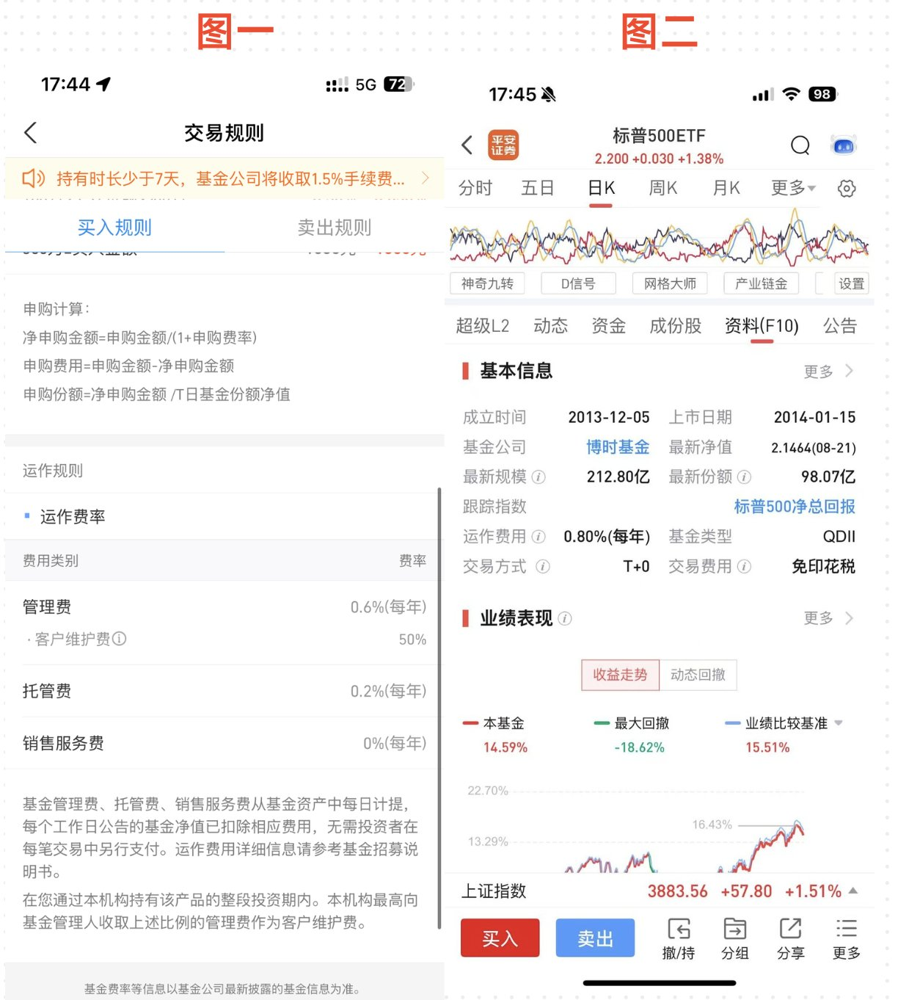

最近很多朋友通过我写的内容了解到了纳斯达克和美股定投，很多朋友也都开始行动了起来，这点我表示很开心，可以帮助到大家。

因为人生的财富我个人觉得其实主要通过三部分获取：

**第一部分**是继承，你直接继承你父母的财产。

**第二部分**是主动劳动，例如你创业，亦或者是打工，市场和甲方根据你的劳动给你的报酬。

**第三部分**，我觉得就是通过**资产的配资**，通过合理分配自己的资产，购入拥有持续升值的产品，来达到**被动增长资产**的效果！

无论是基金/股票产品也好，或者是房产也好，只要是**优质资产**都可以称得上是第三部分的收入！

但是在我们过去，市场和学校传授给我们的大部分都是去出卖自己的劳动力去获取财富，这也是绝大多数的普通人获取财富的最佳方式！

但是我们翻阅各种千万，亿万富翁，你会发现他们很大一部分财富都是通过**配比自己的资产**，实现更多的**被动资产收益**。

说一个好笑的事情，那就是迅雷，前段时间重新进入到大家的视野竟然是押宝成功了影石Insta360，影石后来上市之后，迅雷也大赚了一笔！

所以我觉得大家可以刷到我的内容，并且认认真真去执行，收获的我个人觉得不仅仅是你可以通过投资来增长自己的财富。

在另外一个层面上是**思维的转变**，从通过劳动力来赚取财富，转变成为利用自己的财富去进行投资，从而**复利**赚取更多财富。

投资这个词距离我们其实一只都不远，相反，当我们打开这个视野之后，就打开了**收入的第二曲线**，后续也可以把这个思想一代一代传承下去，从而慢慢一步一个阶梯地走向"**财富自由**"！

所以，如果大家刷到这个内容，期望大家可以快速点个关注哦，防止后面刷多了就找不到了，血亏！！！

ok，那我们就开始今天的这期内容！

前面我们已经分享了很多关于支付宝/app 投资的一些事情，对于很多刚刚接触到投资的朋友，这部分内容总归是有一些难以理解！

我后续也会持续写一些更加容易懂的内容，分段把整个流程给大家梳理下来。

我看评论区，很多朋友对于**场内**和**场外**还是有一些疑惑，或者是不懂，或者是想要了解他们之前的详细区别！

但是这部分知识点还是很细的，所以我就想着单独给大家开一篇内容，给大家详细讲解一下！

我这里就拿其中的一只拿出来举例子，我们拿大名鼎鼎的**博时标普 513500** 和其A 类基金 **050025** 举例子。

关于其费率部分，如图1 和图 2 所示：

而博时标普 500ETF 联接（QDII）A 具体代表了什么含义，大家可以具体看我的上一篇内容，比较详细地接受了都是什么含义，这里就不一一介绍了。

这期主要讲我们在场内 **513500**，和 **050025** 购买的区别在哪里？

## 一、背景概念

**513500** → **场内 ETF**，追踪标的：纳斯达克100（QDII ETF）。

**050025** → **场外联接基金**，本质是基金公司帮你买 513500 或者相同成分的 ETF/期货，通过场外渠道购买，常见于支付宝、天天基金等。

> 虽然标的一样，但投资工具和交易逻辑差别很大。

## 二、为什么场内 ETF 通常优于场外联接基金

### **1、** 申购赎回机制不同 → 成本差异

| 特征 | 场内 ETF (513500) | 场外联接基金 (050025) |
|------|------------------|----------------------|
| 申赎机制 | 实时在交易所买卖 | 基金公司"T+1"申赎 |
| 价差 | 直接成交价差低 | 有净值折溢价风险 |
| 清算速度 | T+0买卖T+1到账 | T+1确认T+2到账 |

#### 解释：

**ETF 场内买卖**：通过二级市场直接成交，价格接近实时净值，买卖成本主要是万分之几的交易佣金。

**联接基金场外申赎**：买入和卖出都是按照基金公司当天或下一天的净值结算，如果盘中波动大，你可能错过最佳买卖点，产生"**时间成本**"。

如果市场大涨大跌，场外基金只能等基金公司晚上结算净值 → 存在明显的"**净值滞后**"问题。

> 结论：从交易效率看，**ETF 场内成本低、效率高**。

### **2、** 场内 ETF 总体交易成本更低

即使管理费率一样，但总体持有成本不同。

| 成本项 | 场内 ETF 513500 | 场外 050025 |
|--------|----------------|------------|
| 管理费 | 0.6% | 0.6% |
| 托管费 | 0.2% | 0.2% |
| 申购赎回费 | 无 | 有申购费 1.5% 左右 |
| 交易佣金 | 万分之 2-5 | 无 |
| 价差成本 | 接近无 | 有净值时间差 |

> **核心差别在于申购赎回费和净值延迟。**

如果你在支付宝等平台买入 050025，哪怕有打折，长期下来依然比 ETF 贵。

### **3、** 二级市场流动性 → ETF 更灵活

**513500** 是热门 ETF，日成交量很高，买卖基本无滑点。

**场外 050025** 本质上是基金公司内部账户申赎，虽然没有"流动性不足"问题，但灵活性低：

- **ETF** → 可以高抛低吸、T+0 买卖。
- **联接基金** → T+1 确认、T+2 到账，无法快速调仓。

> 如果你是一个主动择时或者波段交易的投资者，**场内 ETF 优势巨大**。

### **4、** 场内 ETF 能更好地套利 → 收益潜力高

ETF 因为是场内交易，价格会和实际净值（**iNAV**）有微小差距，出现**溢价**或**折价**时，可以进行套利：

- 当 ETF **溢价** → 卖 ETF、买联接基金。
- 当 ETF **折价** → 买 ETF、申赎套利。

而 050025 联接基金没有这样的套利机会，只能被动跟随净值。

### **5、** 税务和汇率差异

因为 513500 是 **QDII ETF**，基金公司在海外有头寸：

- **场内 ETF** 的税务、汇兑成本会在 ETF 内部统一结算，你不需要额外承担。
- **场外 050025** 虽然也一样，但由于是基金公司代买 ETF，通常会有二次费用分摊，导致实际收益略低。

### **6、** 投资者结构不同 → 产品定价更合理

**场内 ETF** 投资者多数是机构、交易型用户，他们对价格敏感，导致 ETF 价格更贴近真实价值。

**场外联接基金**投资者大多是支付宝用户，对费率、交易效率没那么敏感，因此长期可能出现收益率低 0.3%-0.5%的情况。

其实还有一部分原因，那就是**流动性准备金/现金比例**！

**Q：** 怎么理解呢？

**A：** 就是如果你买 100 元，基金公司不会把你的 100 块全投进去

当你通过支付宝买 050025 这类场外联接基金时，你的 100 元不是直接去买 513500 的 ETF 或纳指成分股，而是经过基金公司内部操作：

**1、** 部分资金留作现金头寸

联接基金需要维持一定比例的**现金**（一般 0.5%~5%）：
- 用于支付申购/赎回费用
- 应对大额赎回或市场波动
- 支付管理费、托管费等日常运营开销

> 这个现金部分暂时不会投入市场，所以不会立即产生投资收益。

**2、** T+1/N 日确认机制

- 你买入的资金要等基金公司当天或下一天确认净值，然后才去申购场内 ETF 或股票。
- 在这个确认期间，资金可能处于短期现金或银行存款利息状态，收益率非常低。

**3、** 防止市场冲击

- 如果基金把每一笔资金都全投入 ETF，遇到大量赎回时就可能被迫卖出，造成成本上升和基金折溢价。
- 所以基金公司会保留一定比例的现金或流动资产，这是基金运营的**安全垫**。

### 实际影响

**1、** 收益略低于 ETF

假设 100 元里有 2 元是现金不投资市场，这部分钱年化收益极低（约 1%-2%）。对比 ETF，资金全部投入市场，收益会更高。

**2、** 申购赎回效率低

现金准备让基金在大额赎回时更稳健，但意味着你短期内不会100%参与市场波动。

**3、** 长期差距累积

> **长期下来，即使管理费相同，这部分未投入市场的资金，也会导致场外基金收益略低于场内 ETF。**

所以综合考虑来看，在特定的App上购买，效果一定是会比支付宝效果会更好一些。

当然都有各自的优缺点，**支付宝**确实会更加方便，不用你进行任何操作，且在支付宝内，也方便你管理，适合小白无脑定投，**App** 需要有些许经验，下载对应 App，并且进行资金管理！

ok，以上就是今天内容的全部部分了，如果大家觉得今天的内容对你有帮助，欢迎给我点赞，收藏和转发哦，你的支持就是我更新的最大动力！

如果大家还有什么其他问题，也欢迎继续打在评论区，我看到之后也会及时给大家回复。

我们就下期再见了！
