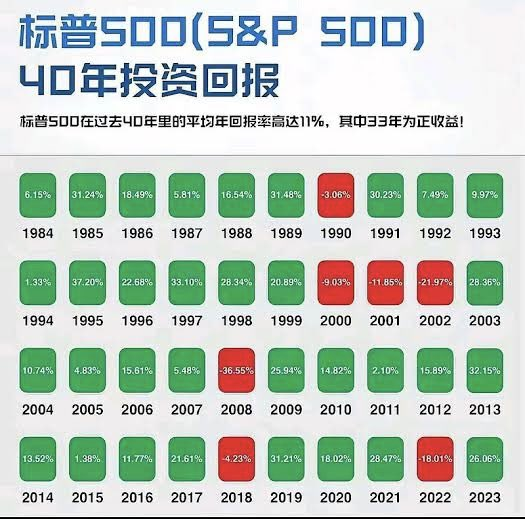

2025 年之股票、国债、基金一文讲清全网最全教程

最近分享了很多关于投资的事情，包括美股，标普/纳斯达克指数，以及加密货币这些东西。

但是我在评论区可以明显地感受到大家其实对这些东西的了解还都是非常有限的，或者更多是不了解！

我们经常可以在电视上看到一些人就购买国债，然后股票投资和分红，以及**美联储****加息**，**降息**等内容！

了解的朋友已经在这个过程中赚的盆满钵满，然而有些朋友对这些东西还无从下手，导致错失了很多机会！

这些东西都是投资的基本概念，但是碍于没有完整的学习，所以大家脑子里面感觉就是一团浆糊，在很多时候由于对完整的体系没有了解，导致没有办法在局部做出正确的选择！

所以今天我想要以一篇内容，一次性来给大家讲清楚关于**股票**、**债券**、基金的一些基本概念、原理，以及收益情况！

看完本期内容之后，保证大家可以从全局上来重新审视投资这件事，也能够做出更多关于投资的正确选择！

OK 话不多说，我们就开始今天的内容！

以下内容分为三个部分，分别是**股票**、国债、基金指数，我这边也做了一个脑图，来给大家先做一个简单的说明！



## 一、股票

定义：**股票**在现代社会中代表了对一家公司所有权的部分权益份额。

具体而言，当一家公司发行**股票**时，它将公司的所有权分割成若干等份，每一份即为一股**股票**。投资者购买**股票**后，成为该公司的股东，享有相应的权利和义务。

### 股票的核心特征

**1、** 所有权与权益：**股票**持有者（股东）拥有公司资产和收益的 proportionate 权益。
这包括投票权（例如在股东大会上选举董事会）、分红权（公司盈利时可获得股息）和剩余财产分配权（公司清算时）。

**2、** 类型分类：
- **普通股**（Common Stock）：最常见的类型，提供投票权和潜在股息，但优先级较低，在公司破产时最后获得补偿。
- **优先股**（Preferred Stock）：通常不提供投票权，但享有固定股息和在清算时优先于**普通股**的补偿权，常被视为**债券**与**股票**的混合体。

**3、** 发行与交易：**股票**通常通过首次公开募股（**IPO**）发行，随后在证券交易所（如纽约证券交易所NYSE或纳斯达克NASDAQ）二级市场交易。价格受供需、公司业绩、经济环境等多因素影响，体现为波动性（Volatility）。

**4、** 风险与回报：**股票**投资具有高回报潜力（如资本增值和股息），但也伴随市场风险、公司特定风险（如破产）和系统性风险（如经济衰退）。

根据现代投资组合理论（Modern Portfolio Theory），**股票**通常作为多元化投资组合的核心，以平衡风险。

说直白一些，购买**股票**其实就像是你购买这个公司权益份额，当你切实拥有这个**股票**的时候，你不仅仅拥有决策权，更有分红权，和剩余财产分配权，你的收益也是和公司的**股票**进行一比一挂钩的！

当你以一个特定价格购入一只**股票**的时候，**股票**价格上升你就赚钱，**股票**价格下跌你就亏钱！

### 知识点补充

了解完毕**股票**的基础知识之后，这里再给大家补充大家经常问到的知识点：

**第一个知识点**是公司市值的计算，我们经常看到说公司市值多少，以及创始人身价多少，其实也都是从**股票**开始计算来的！

举例子如果一家公司现在的股价是 A 元，如果对外发行了 B 股普通股票，最后的市值计算就是 A*B，例如8.20号苹果公司股票现价是229美元，发行了148.4亿股，最后的市值就是约为3.43万亿美元！

**第二个知识点**我们最近经常看到消息说腾讯在回购**股票**，那意义在哪里呢？

是因为如果回购**股票**，流通中的**普通股**总数就会减少，在公司净利润不变或增长的情况下，每股收益（Earnings Per Share, EPS）会增加，因为同样的利润分摊到更少的股份上。
这样其实是利好的，也是一个公司持续回馈股东的一种方式。

**第三个知识点**是**股票**价格在一定程度上反应的是公司的盈利水平和营收，我们把股价比作是小狗，把实际价值比做是你，你在"遛狗"的过程中，有时候小狗会跑到你的前面，即股价偏高，有时候会跑在你的后面，即股价偏低！

但是在无形中其实都会受到实际价值的牵制，所以股价即便是再波动，我们在购买一只公司的**股票**的时候，更多的还是要去看公司的实际价值，这样才可以做出更好的判断！

**第四个知识点**，在国内买**股票**需要开户，普通用户开的都是 **A股** 账户，如果你想要腾讯**股票**，可能无法购买！

因为平时我们第一次开的大部分都是只能够交易上海或深圳证券交易所上市的股票（**A股**），以及通过沪港通或深港通机制允许交易的部分香港上市股票（港股通标的）。

但是腾讯是在香港证券交易所进行上市，所以需要你开通港股账号，这个道理就像是你要购买苹果的**股票**，需要开通对应美股券商账号，才可以购买！

了解完毕这些基本情况之后，我们还是重点来看 **A股** 的一些整体数据，这样可以对 **A股** 的数据有一个进一步的了解。

上证指数从1990年12月19日成立（基点100点）至2024年底的CAGR约为 **8%-10%**（未调整通货膨胀），若考虑股息再投资（总回报指数），可能接近10%-12%！

如果考虑到中国过去30年的平均通胀率约为2%-3%（根据国家统计局CPI数据）。因此，扣除通胀后的实际年化收益率约为6%-9%。

其中年化率最高发生在2007，那年上证指数从约2675点涨至6092点（年末收盘），年收益率约为 **130%**（不含股息），从2006-2007年中国股市经历超级牛市，受到经济高速增长、股权分置改革完成以及资金流入推动，市场情绪高涨。

年化率最低的时候发生在2008年，那年受全球金融危机影响，上证指数从5261点（2007年末）跌至1664点（2008年末），年收益率约为-65.4%。

如果单单从年化率来看，**A股** 平均年化我们按照 8% 来算，其实算是不错的数据，但是我们前面聊到过为什么 **A股** 给人的感受那么差，这就不得不考虑一个数据：股市的年化波动率。

在这个数据上**A股**市场的年化波动率（Volatility）约为 **25%-30%**，远高于美股（S&P 500约为15%），意味着短期风险较高，长期投资需耐心。

虽然在 24 年国庆的时候 **A股** 迎来了一次大爆发，那个时候股民纷纷入场。

数据显示是散户疯狂入场，然后机构疯狂离场，解套！

而且如果一个人真的从 08 年被股价高位套住之后，真正有耐心等待到 24 年再解套的人，我也相信是寥寥无几。

> 综合情况，考虑下来来看，**A股** 当真无愧的股市有风险，入市需谨慎！

## 二、债券

定义：**债券**是一种固定收益证券，代表发行人向**债券**持有人借入资金的债务凭证。

发行人（可以是政府、地方政府、公司或金融机构）承诺在**债券**到期时偿还本金，并在存续期间按约定利率定期支付利息（称为票息，Coupon）。

从专业角度看，**债券**是资本市场中重要的融资工具和投资资产，具有以下核心特征：

### 债券的核心特征

**1、** 债务性质：**债券**是发行人对持有人的债务承诺，持有人是债权人，而非公司所有者（如股东）。**债券**持有人无投票权，但有优先于股东的清偿权（在破产清算时）。

**2、** 固定收益：**债券**通常提供固定的票息收入，利息支付频率（如每半年或每年）在发行时确定。到期时，发行人偿还面值（Par Value），除非发生违约。

**3、** 种类多样：
- 政府**债券**：如中国国债、美国国债（Treasury Bonds），通常风险最低，被视为"无风险"基准。
- 企业**债券**：由公司发行，风险和收益高于政府**债券**，取决于发行人信用评级（如AAA至垃级）。
- 市政**债券**：由地方政府或机构发行，常用于基础设施融资。
- 可转债：可按一定条件转换为公司**股票**，具有**债券**和股权双重特性。

**4、** 价格与收益率：**债券**价格与市场利率呈反向关系。当市场利率上升，**债券**价格下跌，反之亦然。其收益率（如到期收益率，YTM）反映投资回报，考虑票息、价格和到期时间。

**5、** 风险特征：
- 信用风险：发行人违约可能导致本金或利息损失。
- 利率风险：市场利率波动影响**债券**价格。
- 流动性风险：某些**债券**交易不活跃，可能难以买卖。

**6、** 交易市场：**债券**可在交易所（如上交所、深交所）或场外市场（OTC）交易，流动性因**债券**类型而异。

### 影响债券的参数

了解完毕**债券**是什么时候，我们再来了解一下其细节！

决定一个**债券**产品风险和收益率的参数有三个，主要由发行人的资质、**债券**的年限和利息率！

首先是发行人的资质，在某种程度上决定了**债券**的等级，在国际上也有专门的**债券**评级公司给**债券**进行评等级。

从政府到企业、再到市政、和可转债等，评级也从最高级的AAA到最低的D（或者垃圾）；评级越高的**债券**产品风险越低，比如，美国的国债评级是AAA，欧盟是AA，日本和中国是A+，不同的等级发售的**债券**也会有相等级的评级！

其次就是**债券**的年限，目前市场上比较流行的年限有一年、五年、十年、二十年和三十年等！

通常情况下，**债券**的年限越长，产品的风险等级也就越高，毕竟随着时间越久，不可预估的事情越多，**债券**发行方也不知道未来**债券**发行方的财务状况。

最后就是利息率，就是**债券**发行方和投资人双方都约定好的利息，当然如果一个**债券**的风险越高，其利率就越高！

在**债券**主体发售这部分，主要分为政府、市政、企业、以及资产抵押可转债，正如我们前面聊到的风险等级越高，其利率越高，风险等级越低，利率越低，这里我们主要以国债，来大概了解国内的**债券**收益。

数据显示截至2024年底，中国**债券**市场存量规模约为149万亿元人民币（Wind数据），2025年持续增长，占全球**债券**市场约15%，是仅次于美国全球第二大**债券**市场！

### 国债类型

在中国有三大类型的国债，分别是：

**1、** 记账式国债：通过银行间市场或交易所市场交易，面向机构和个人投资者，流动性较强，期限从3个月到50年不等。

**2、** 储蓄式国债：通过商业银行柜台发售，主要面向个人投资者，期限通常为3年或5年，不可二级市场交易，适合长期持有。

**3、** 电子式储蓄国债：通过网上银行或柜台购买，类似储蓄国债，强调便利性。

其长期平均收益率（1990-2024） 根据Wind和人民银行数据，中国10年期国债收益率（最常用的基准）自1990年代以来平均约为3.0%-3.5%（名义收益率）。

在通胀调整后（中国平均通胀率约2%-3%），实际收益率约为0.5%-1.5%，基本上就是略微跑赢通货膨胀。

储蓄国债（3年或5年期）平均票面利率略高，约为3.5%-4.0%，因面向零售投资者且不可交易，收益率更稳定。

近期看来，在2020-2024年，受中国央行宽松货币政策和低通胀环境影响，10年期国债收益率波动在2.0%-3.2%区间。

截至2025年8月，10年期国债收益率约为2.1%-2.3%（Wind实时数据），储蓄国债3年期和5年期票面利率分别约为2.5%和2.7%（财政部2024年公告）。

聊完平均之后，再来看一下最高和最低收益：

最高收益率：

年份：2007年收益率：约4.5%-4.8%（Wind数据）。

背景：2006-2007年中国经济高速增长，通胀压力上升（CPI接近6%），央行收紧货币政策，推高国债收益率。

2007年10年期国债收益率一度接近4.8%，为历史高点。
其他高点：1996-1999年，受亚洲金融危机和国内高通胀影响，10年期国债收益率曾达到5%-6%。

最低收益率：

年份：2020年约2.4%-2.6%（10年期国债，Wind数据）。

背景：新冠疫情导致全球经济放缓，中国央行实施宽松货币政策（如降准、降息），国债收益率跌至历史低位。2020年4月，10年期国债收益率一度低至2.4%。

近期低点：2023-2024年，10年期国债收益率多次跌破2.5%，反映低通胀和经济复苏放缓。

如果我们个人想要投资也很简单：

- 储蓄国债：通过银行柜台或网上银行购买，起投100元，适合稳健投资者。
- 记账式国债：通过券商账户在交易所购买，需关注市场价格波动。
- **债券****ETF**：如华泰柏瑞上证5年期国债**ETF**（511010），提供低成本、流动性好的国债投资方式。

因为我们从风险上来考虑，一定是购买国债最为安全，国债的优势与风险：

优势：
**1、** 安全性高：国家信用担保，违约风险几乎为零。
**2、** 收益稳定：固定票息提供可预测收入，适合低风险偏好投资者。
**3、** 流动性强：记账式国债在银行间和交易所市场交易活跃。
**4、** 税收优惠：免税政策提升实际回报。

风险：
**1、** 利率风险：市场利率上升时，国债价格下跌（尤其影响记账式国债）。
**2、** 通胀风险：实际收益率可能被高通胀侵蚀。
**3、** 流动性风险：储蓄国债不可转让，提前赎回可能损失利息。

> 基本上购买国债，就是一个可以跑赢通货膨胀，让自己的钱不至于贬值那么快，比较适合不方便进行**股票**投资，适合大资产，购买一个 5 年，10 年的国债产品，长期持有！

## 三、基金指数

目前在证券市场就是这两大类型产品，一是前面聊到的**股票**，二就是**债券**，可以发现的是无论是**股票**还是**债券**，其在某种程度上都有"实体"作为承接，但是指数基金是另外一种产品！

定义：基金&指数在投资领域通常指指数基金（Index Fund）或追踪特定市场指数的基金产品，它是一种被动管理的投资工具，旨在复制某一特定市场指数（如上证指数、**标普500**指数）的表现。

是一种通过投资一篮子证券（如**股票**、**债券**等）来追踪某一市场指数表现的公募基金。

它的目标是通过低成本、高透明度的方式，为投资者提供与目标指数接近的回报，而非试图通过主动选股超越市场。

### 核心特质

**1、** 被动管理：基金指数的管理目标是复制指数表现，而非通过主动选股追求超额收益（Alpha）。基金经理根据指数成分股的权重调整持仓，保持与指数一致。

**2、** 追踪目标：基金指数通常追踪广义市场指数（如**沪深300**指数、**标普500**）、行业指数（如中证医药指数）、或主题指数（如MSCI ESG指数）。

**3、** 低成本：由于无需频繁交易或深入研究，基金指数的管理费和交易成本较低（如年化费用率通常0.1%-0.5%，远低于主动基金的1%-2%）。

**4、** 分散化：通过持有指数中的所有或大部分成分股，基金指数天然实现风险分散，降低单一证券的风险。

**5、** 透明性：指数成分和权重公开，投资者可清楚了解基金持仓和表现预期。

### 类型

有以下几种类型：
**1、** 股票指数基金：如跟踪**沪深300**、**纳斯达克100**的基金。
**2、** 债券指数基金：如跟踪中债综合指数的基金。
**3、** **ETF**（交易所交易基金）：可在交易所实时交易的指数基金，如华泰柏瑞**沪深300** **ETF**（510300）。
**4、** LOF（上市开放式基金）：兼具场内交易和场外申赎的指数基金。

目前中国基金指数市场概况：

市场规模：截至2024年底，中国指数基金（包括**ETF**）总规模超2万亿元人民币（Wind数据），占公募基金约7%-10%。

主流指数：
**1、** **沪深300**指数：覆盖**A股**市场300家大中型公司，代表性强。
**2、** 中证500指数：聚焦中小型公司，成长性较高。
**3、** 上证50指数：集中于50家大型蓝筹股，稳定性强。
**4、** 创业板指数：代表新兴产业和高科技公司。

交易渠道：
**1、** 场内交易：通过券商账户在交易所买卖**ETF**，如华夏上证50 **ETF**（510050）。
**2、** 场外申赎：通过银行、基金公司或第三方平台申购指数基金份额。
**3、** 投资门槛：场内**ETF**起投金额低（通常100元），场外基金申购起点一般1000元。

下面再来看一下收益率，我们这边以**沪深300**指数：覆盖**A股**市场300家大中型企业，代表蓝筹股，市值占比约60%-70%，来举例子看一看实际情况。

**沪深300**指数基金：

- 10年年化收益率（2015-2024）：约5%-7%。
- 20年年化收益率（2004-2024）：约 **8%-10%**。

背景：**沪深300**涵盖大盘蓝筹，收益稳定性较高，但受经济周期和政策影响（如2015年股灾、2020-2022年地产危机）。

**A股**市场波动性高，指数基金年度表现差异显著。以下以**沪深300**指数基金（代表性最强）为例：

最高年份：
2007年：**沪深300**指数上涨约160%（Wind数据），指数基金年收益率接近150%（扣除费用）。背景为2006-2007年超级牛市，经济高增长和资金流入驱动。

其他高点：2014年（约51%）、2020年（约27%），受益于政策宽松和市场回暖。

最低年份：

2008年：**沪深300**指数下跌约-66%，指数基金收益率约-65%（含费用）。受全球金融危机和国内紧缩政策影响。

其他低点：2018年（约-25%）、2022年（约-21%），受贸易战、疫情和地产危机拖累。

> 碍于 **A股** 在国内的波动性比较大，衍生出来的 **A股** 相关的基金效益并不是非常好！

最重要的问题在于波动性实在是太大了，除非你是非常专业的长期主义者，否则在 **A股** 中无论是熊市，还是牛市，大家赚到钱的概率都只有 20%！

## 四、标普 500 & 纳斯达克 100

了解完毕什么是指数基金之后，其实我们也就可以理解到底什么是**标普500**和**纳斯达克100**，其实和**沪深300**指数一个道理，就是主要是以追踪为主，对象的不同，收益也就自然也就大有不同！

### 标普 500 指数

定义：**标普500**指数（Standard & Poor's 500 Index）是由标普全球（S&P Global）编制的股票市场指数，追踪美国证券市场中500家大型上市公司的**股票**表现。它是衡量美国股市整体表现和经济健康状况的基准指数，广泛用于评估投资组合表现。

构成：

**1、** 成分股：包括500家在美国主要交易所（NYSE或Nasdaq）上市的公司，覆盖11个行业板块（GICS分类），如信息技术（约30%权重）、金融（约13%）、医疗（约12%）、消费品等。

**2、** 筛选标准：公司需满足市值（通常≥$15亿）、流动性（日均交易量）、盈利能力（连续四季度盈利）等要求。成分股按自由流通市值加权（Free-Float Market Capitalization Weighted），即市值越大，权重越高。

**3、** 代表公司：苹果（Apple, ~7%）、微软（Microsoft, ~6%）、英伟达（Nvidia, ~6%）、亚马逊（Amazon, ~4%）等（权重基于2024年底，具体随市场波动）。

**4、** 市值覆盖：约占美国股市总市值的80%，截至2025年8月，总市值约 **$50万亿美元**（Wind/Bloomberg数据）。

特点：

**1、** 广泛代表性：涵盖大盘股，跨行业分散，反映美国经济核心。
**2、** 低波动性：年化波动率约15%-18%，低于中小盘指数（如罗素2000）。
**3、** 投资工具：通过指数基金（如Vanguard S&P 500 **ETF**, VOO）或期货、期权投资。

### 纳斯达克 100 指数

定义：**纳斯达克100**指数（Nasdaq 100 Index）是由纳斯达克交易所编制的指数，追踪纳斯达克市场中100家非金融类大型上市公司的**股票**表现。它以科技和成长型公司为主，是全球科技行业投资的标杆指数。

构成：

**1、** 成分股：100家非金融公司（排除银行、保险等），以信息技术（约60%权重）、消费服务（约20%）、医疗和工业为辅。成分股按调整后的市值加权（Modified Market Capitalization Weighted），限制单一公司权重过高（如不超过24%）。

**2、** 筛选标准：公司需在纳斯达克上市，满足最低市值（约$1亿）、交易量和上市时间要求。定期调整（每年12月）。

**3、** 代表公司：英伟达（~12%）、苹果（~10%）、微软（~8%）、亚马逊（~6%）、Meta（~5%）等（权重基于2024年底）。

**4、** 市值覆盖：约占纳斯达克市场总市值的50%，截至2025年8月，总市值约 **$25万亿美元**。

特点：
**1、** 科技导向：高度集中于科技和成长型企业（如半导体、软件、互联网），波动性较高（年化波动率约20%-25%）。

**2、** 成长性强：受益于科技行业创新（如AI、云计算），长期回报高于**标普500**。

**3、** 投资工具：通过**ETF**（如Invesco QQQ Trust, QQQ）、衍生品或指数基金投资。

那我们根据公式来计算一下最近 40 年的年化平均回报率，计算公式如下：

```
CAGR = ((终值 / 初值)^(1 / 年数)) - 1
```

- **标普500** = ((6050 / 211)^(1 / 40)) - 1 ≈ **10.8%**
- **纳斯达克100** = ((21000 / 250)^(1 / 40)) - 1 ≈ **13.97%**

> 在过去 40 年里面，**标普500** 和**纳斯达克100**的年化平均回报率约等于 **10.8%** 和 **13.97%**。

这个是切实最真实的数据，这样大家也就有了更加情绪的了解和认知！

## 五、美联储加息 & 降息

既然要投资那就不得不聊到**美联储****加息**和**降息**，那到底什么是**美联储**呢？

**美联储**是美国的中央银行体系，成立于1913年，根据《联邦储备法案》设立，是美国货币政策的制定和执行机构。其主要目标是维持经济稳定，促进充分就业、稳定物价和适度的长期利率。

有以下特征：

**1、** 联邦储备委员会（Board of Governors）：位于华盛顿特区，由7名成员组成，负责制定货币政策。

**2、** 12家地区联邦储备银行：分布于美国各大城市（如纽约、芝加哥），执行货币政策、监督银行等。

**3、** 联邦公开市场委员会（**FOMC**）：由委员会成员和地区联储主席组成，负责决定关键货币政策，如联邦基金利率。

职责：
**1、** 货币政策：通过调整利率、公开市场操作（如购买/出售国债）管理货币供应和经济活动。
**2、** 金融监管：监督银行和金融机构，确保金融体系稳定。
**3、** 支付系统：管理美元清算、支付系统运行。
**4、** 经济研究：提供经济数据和分析，支持政策决策。

简单了解完毕**美联储**之后，我们再来了解**加息**和**降息**的定义以及其对股市的影响：

- **加息**（Rate Hike）：**美联储**通过**FOMC**提高联邦基金利率（Federal Funds Rate，即银行间隔夜拆借利率），使借贷成本上升。**加息**通常通过减少货币供应（如出售国债）实现。

- **降息**（Rate Cut）：**美联储**降低联邦基金利率，降低借贷成本，增加货币供应（如购买国债），刺激经济活动。

### 加息对股市的影响

机制：
**1、** 借贷成本上升：企业融资成本增加，利润率可能下降，尤其对高负债公司（如科技成长股）。

**2、** 消费者支出减少：高利率提高贷款成本（如房贷、信用卡），减少消费，影响企业收入。

**3、** 贴现率提高：**股票**估值基于未来现金流折现，高利率增加折现率，降低**股票**现值（DCF模型），尤其是高估值成长股（如**纳斯达克100**成分股）。

**4、** 资金流向：高利率使固定收益资产（如国债）更具吸引力，资金可能从股市流向**债券**。

股市表现：

**1、** 通常利空：**加息**周期常导致股市下跌，尤其是科技股和成长股，因其对利率敏感度高。例如，2022年**美联储****加息**（从0.25%升至4.5%-5%），**标普500**下跌约18%，**纳斯达克100**下跌约33%（Bloomberg数据）。

**2、** 行业差异：金融股（如银行）可能受益于高利率（净息差扩大），而科技、地产等行业受压。

**3、** 市场情绪：**加息**信号经济过热或通胀压力，投资者可能担忧经济放缓甚至衰退，增加市场波动（如VIX指数上升）。

> 说白了就是**加息**之后的话，**股票**就会下跌，是你抄底的好机会！

### 降息对股市的影响

机制：
**1、** 借贷成本下降：企业融资成本降低，利润率改善，投资扩张增加。

**2、** 消费刺激：低利率鼓励借贷和消费，提振企业收入。

**3、** 贴现率降低：低利率减少折现率，提升**股票**估值，成长股受益更大。

**4、** 资金流入：低利率降低**债券**吸引力，资金流向股市，尤其是高风险资产。

股市表现：

**1、** 通常利多：**降息**周期常推动股市上涨，尤其是科技和成长股。例如，2020年疫情期间**美联储****降息**至0%-0.25%，**标普500**从低点反弹约50%，**纳斯达克100**上涨约80%（2020-2021，Wind数据）。

**2、** 行业差异：科技、消费品和周期性行业受益明显，防御性行业（如公用事业）表现可能平稳。

**3、** 市场情绪：**降息**信号经济支持或复苏预期，提振投资者信心，降低波动性。

> 说白了，或者换一个我们容易理解的方式就是**降息**之后的话，**股票**就会上涨，是利好的！

但是**美联储**对经济的调控和影响都是复杂的，我们暂时不用了解那么多，只需要了解**加息**/**降息**情况之下，你要提前做好准备就好！

## 六、总结

**股票**：反应一个公司的真实营收情况，多数情况之下要秉承不懂不投的概念，如果你真的看好这只**股票**，一定要明白或者是可以讲出来他为何如何好，这样才算是真正有"预谋"的投资，也是正确的投资！

**债券**：就当做是某一个机构给你打的借条，你把钱放在他那里，那每到一段时间之后给你支付一定的利息。

**债券**通常适合投资大型长期国债，力求跑赢通货膨胀即可，赚钱估计是不太可能的事情！

基金指数：**股票**和**债券**都是实体，但是指数是一种追踪产品，例如**标普500**追踪的是美国 500 家企业的经营状况，购买基金指数就是在押注国运，选择一个一直在持续增长的，一直拿着就好！

**美联储**：**美联储**主要目标是维持经济稳定，促进充分就业、稳定物价和适度的长期利率，我们理解其**降息**和**加息**对市场欢迎的影响即可。


## 七、写在最后

这期内容文字内容很多，主要的也就是对基础概念和基础数据的完善和补充，学习完毕之后，也就对这些东西有了解以及其大概的收入有了一个了解！

这个时候别人再和你聊**标普500**，和**纳斯达克100**，你也就有了更多的实感，也能够明白他们到底代表了什么含义，剩下的就是寻找各种可能的方式去按照自己的节奏进行定投。

因为目前我的投资仓位里面还会有一些加密货币，加密货币大概占据所有仓位的 10% 左右，后面我的规划是等我对整个市场和玩法了解更清楚之后，把仓位提升到 30%，等到后面也会慢慢给大家继续分享！

我个人也是非常认可加密货币的投资，认为加密货币也是我们实现财富自由的一种方式。

那无论是**标普500**，亦或者是**纳斯达克100**，再或者是加密货币，我们应该如何配置自己的仓位，这也是很多朋友都在思考的问题！

最后就是欢迎大家给我点赞，如果本期内容点赞过 100，我会在这周末给大家分享一下，我认为的在不同的年龄段里面应该如何分配自己的资产，实现能够有较大的收益的同时，还能够有更低的风险！

以上就是今天的全部内容了！

感谢大家的支持与点赞，这期内容很干，建议先点个关注+收藏，防止以后找不到了。

有空的话找个时间慢慢看，把这篇文章里面的内容都梳理清楚&理解清楚之后，投资也算是正儿八经入门了！

👌，那我们就下期再见！
