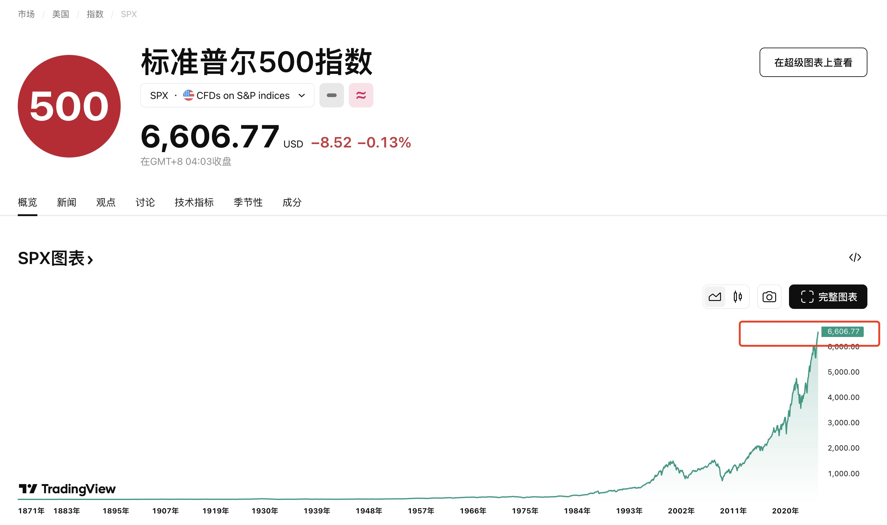
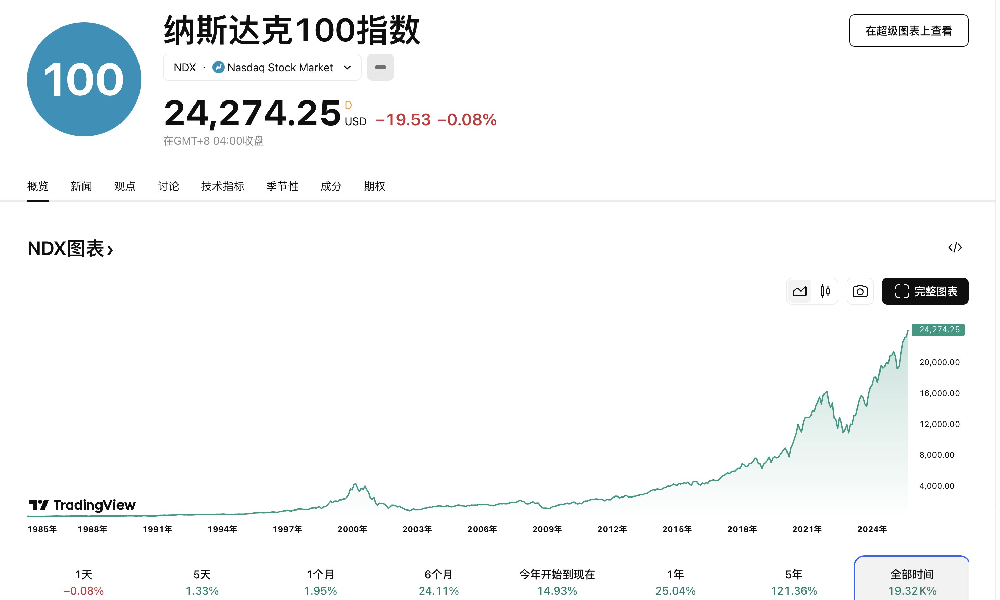
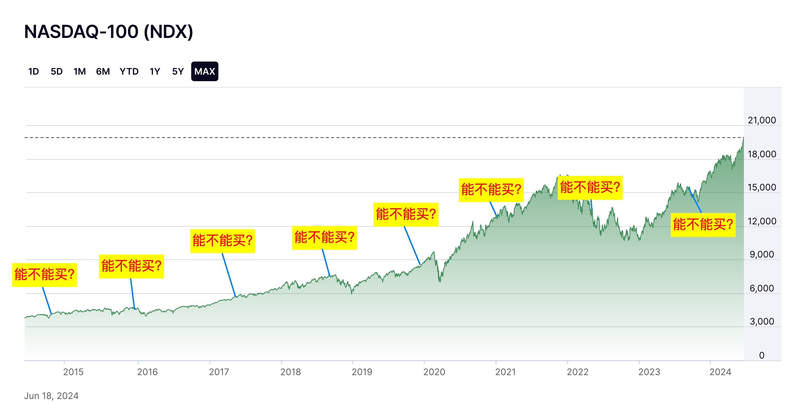

## 写在前面

最近分享了很多关于**标普/纳指**投资相关的内容，收获了很多朋友的关注！

从最开始的籍籍无名，到现在短短一个月时间，两个文字平台涨粉超过 **1W+**，感谢各位朋友的支持！

然后就有很多朋友也都在问我有没有视频内容，我说暂时还没有！

因为我本身是一个创业者&业务创始人，所以一部分的时间和精力要用在业务上，他不等同于上班，周六周末时间是固定的，可以固定用来做一些业务，创业者的时间都是被内容填充满的。

其实我对于创业而言，或者是我在做业务的时候，秉承的依旧是投资思想：**睡后收益**，**被动收益**，把模型打造出来，剩下的就是招聘员工填充细节即可。

关于视频内容，我计划等到进入到 25 年的第四季度（也就是 10月份之后），我将会启动视频板块内容，届时会在 YouTube，抖音，以及 B 站上进行内容的同步。

YouTube 内容会更加大胆一些，然后抖音/B 站会是一些阉割内容，因为要符合平台的规则，到时候启动的话，再和大家聊这件事儿！

回到正题，今天这期内容，主要是我收集推特/小红书评论区大家出现频率比较高的问题进行回答，给大家做一期扫盲录。

今天先给大家整理 **10 个问题**，虽然都是已经写在之前的推文里面的内容，但是做系统的整理也是方便大家后面复习！

---

## 问答录

**Q：为什么要定投，我一次性买入不行吗？**

**A：** 如果有钱，一次性投入 **10w** 一定是更好的，其实**定投**的含义是随着时间的增长，你的财富越来越多，持续买入，持续增长自己的财富，买入越早，赚的也越多！

如果手头上有一部分闲钱，并且已经了解了很多，就是看准了，我个人建议是投资 **80%** 一次性买入，然后剩下的 **20%** 用作后续的子弹慢慢打。

这里还是说看准，就是你已经了解了七七八八，通过多方位验证自己的思考之后，再去投资，现在 AI 很发达，去问你手机上的 AI 软件，让他给你介绍，理解的会更深刻。

---

**Q：月定投和日定投有什么区别？**

**A：** 没啥很大的区别，日**定投**一次性少，分散投资，月**定投**一次性买入，定投多。

我个人的操作偏向于**月定投**，资金回笼之后，拿出其中的 **60%-70%** 投资，剩下一部分用作日常开销和公司的运营。

> 对比很多上班的朋友来说就是月定投，确保你不会乱花钱，钱到手之后立马拿进去投资，强制储蓄。

---

**Q：现在好高，要不要过段时间再买入？**

**A：** 这句话每年都会有人问，对于这句话我给出的回复永远只有这张图！

没啥好回答的，就像是那句话，如果你信我你立马就会去吗，奥，也不是相信我，是相信**市场**，相信这些指数里面的公司产出的价值。

> 如果你不相信，我就算是把中华上下五千年都给你讲一遍，你也会说再考虑考虑！

---

**Q：场内和场外到底是什么意思？**

**A：** **场外**就是支付宝，**场内**是一些证券公司 App 直接购买。

不是国内和国外，总有人弄混，其实你不了解也没关系，收益就是**美股 > 国内券商 App > 支付宝**，然后复杂程度相反就好了。

---

**Q：择时买入和持续定投的收益差距大吗？**

**A：** 不大，在前面关于如何成为百万富翁那一章节里面分享过。

关键就是人很难去预测市场小的回调和波动，和我们持续 **DCA**、持续收入的目标并不匹配，所以关于**择时**去买入当属专业炒股人群，这里不做分享！

我在标普/纳指上分享的都还是**被动收入**，等到后面分享到美股的时候，再去给大家分享这个基本面如何判断。

---

**Q：可以不可以等到回调的时候再去建仓？**

**A：** 可以的，这个要看你对这个市场的投入和期待的回报！

有两种类型的人：

**第一种**，每个月**定投**，其他时间一概不看，开开心心过好自己的生活，这种就是纯粹地 **DCA**，也不用考虑回调和波动。这种就不考虑各种回调了，你对市场不了解怎么去预测回调？

**第二种**，每个月**定投**，然后会花时间去了解学习，这种你就是已经不属于是简单的持续 **DCA** 人群。如果你足够专业，可以预测各种大小回调，如果没有那么专业，只预测大的回调也行，例如全球**降息**，大概率会新高，发生重大**黑天鹅**事件，大概率会回调。

> 所以看你个人的投入，如果你想要赚取更多，那你就需要花费更多的时间精力去做研究。如果不想要动脑筋，就不考虑回调建仓了！

---

**Q：总有言论说明年就开始暴跌，27 年年底？这个可能吗？**

**A：** 除非世界末日了，我们要明白的是例如**标普 500** 指数参考的是全美国 500 家公司的收益情况，并且是持续变化的，如果你业绩不好，就会被踢出去。

所以只要是持续创造价值，世界依旧在运转，他们给世界创造的价值就一直存在，那价值就会越来越高。

> 不考虑世界末日，我们依旧需要努力！

---

**Q：国外的收益会比国内的收益高很多吗？**

**A：** 那**纳斯达克**举例子，国外的费率在 **0.2%** 左右，国内的在 **0.8%**（0.65%-1%），差距在 **3-5 倍**。

收益上国外一定要比国内高，但是你出金会有磨损，而且需要缴纳各种税。

如果有条件，例如有港澳通行证，或者是护照，开个长桥，再办理一些免手续费的卡（兴业寰宇人生）想要操作开户的也可以联系我（不免费）。

> 那如果没这些材料，也懒得麻烦，认认真真国内投资，也可以跑赢全国 **90%** 以上的投资者了。饭要一口吃，路要一步一步走家人们！

---

**Q：要不要预判回调及时落袋为安？**

**A：** 还是那句话，投资你要明白你主要的策略是什么以及什么目标，你想要得到多少的收益，就要付出多少的努力。

如果你想要赚更多，那就预测市场，然后回调落袋，持续加仓，但是需要你花费更多的时间和精力去做这个事情，拿自己的精力去换取多一份的收入！

如果没有这个能力，或者是不想要麻烦，就不落袋，一直持续拿着，**和时间做朋友**。

---

**Q：A/C 的区别在哪里？**

**A：** 不要想的那么复杂，**A 就是长期，C 就是短期**。

你就看你要不要投资 **2 年以上**，如果是的那就是 **A**，如果不是那就是 **C**。

> 很多事情先去了解大概，从整体性的角度去考虑之后，再分步学习会有不错的效果，也不需要了解那么多里面的细节，直接抄作业就行。

---

## 写在最后

基本上都是一些很简单的问题，但是大家重复会问的问题，再拉出来讲一下给大家。

如果大家觉得今天的内容对你有帮助，记得要给我**点赞和收藏**呀，如果大家点赞过 300，我也会在三天内给大家更新问答录的第二期内容。

本期内容基本上没有给大家看一些数据，我在这个过程中收集到了很多有趣的数据，欢迎大家点赞，我给大家在下一期内容中进行分享呀！

以上就是今天推文的全部内容了！

这里是 **WiseInvest**！专注于美股/加密货币投资，坚持投资改变命运，力求通过投资来打造自己财富积累的第三曲线，实现 10 年内财富自由！

如果你对投资、理财、赚钱、Web3 感兴趣，欢迎关注我，我也会在后面持续推出更多优质且精彩的内容！

最后的最后，就是如果大家觉得今天的内容对你有帮助，不要忘记给我**点赞、收藏和转发**哦，你的支持就是我持续更新的最大动力。

我们就下期再见，拜拜。
