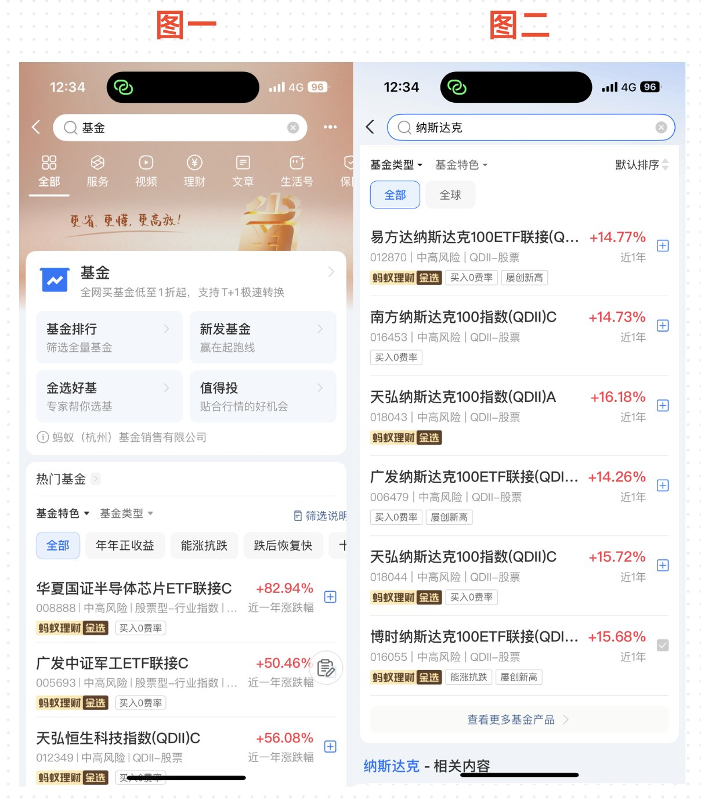
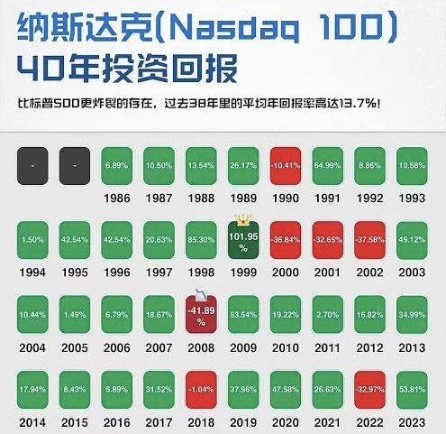
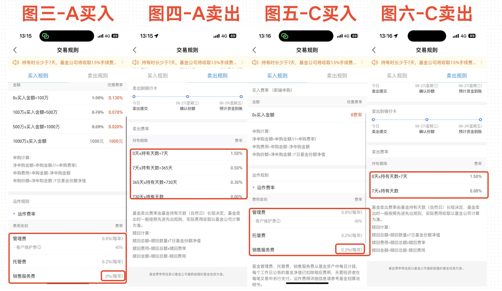

## 一、支付宝投资

关于投资我们先从最简单的方式，那就是**支付宝投资**，可以说是最简单，也是最无脑的方式！

首先，我们打开支付宝在检索页面检索基金，然后点击进入基金输入**纳斯达克**进行检索，即可看到很多的纳斯达克基金供我们选择，如下图1-2 所示：

但是当我们看到那么多基金和名字之后，应该如何去进行选择呢？

这里给大家举个例子：**广发纳斯达克 100 ETF 链接（QDII）C（006479）**！

我们分别给大家介绍一下他们都是代表了什么含义，然后基本上所有的基金产品你也就都可以了然于胸了！

---

### 1、广发

**释义**：这是基金的发行管理公司，即**广发基金管理有限公司**。

- **背景**：广发基金是中国一家大型公募基金公司，成立于 2003 年，属于国内前几大基金公司之一。
- **角色**：它负责产品设计、投资组合管理、信息披露、风险控制等。
- **区别点**：不同基金公司（比如**国泰**、**华夏**、**易方达**等）会推出各自的"纳指ETF"或"联接基金"，策略上可能略有不同。

> 举例子：我们经常看到的 **513100**，其实就是**国泰**发行的追踪纳指的基金！

---

### 2、纳斯达克 100

**释义**：这是基金跟踪的目标指数，英文是 **NASDAQ-100 Index**。

**成分**：

- 纳斯达克证券交易所市值最大的 **100 家非金融类公司**。
- 包含**苹果**、**微软**、**亚马逊**、**英伟达**、**Meta**、**谷歌**、**特斯拉**等。

**特点**：

- **科技权重高**：成分股中大约 **50%~60%** 都是科技公司。
- **高成长性**：纳指100过去 **20 年**涨幅显著高于**标普500**。
- **波动性较大**：涨跌更快，适合风险承受能力高的投资者。

> **核心逻辑**：买这类基金 = 间接投资**美股科技龙头**。

---

### 3、ETF

**释义**：**交易型开放式指数基金**（Exchange Traded Fund）。

**特点**：

- **跟踪指数**：ETF 追踪某个指数，比如**纳斯达克100**。
- **像股票一样交易**：ETF 在证券交易所上市，你可以在交易日的任何时候买卖。
- **低费率**：相比主动基金，ETF 的管理费一般更低。
- **价格接近净值**：ETF 采用"一级市场申赎+二级市场交易"的方式，价格和基金净值非常接近。

> 在这里的作用：**广发纳指100 ETF（代码：159941）** 就是广发基金推出的 ETF 产品，直接在**深交所**交易。

---

### 4、联接

**释义**：**ETF 联接基金**（ETF Link Fund），简单来说，它并不是 ETF 本身，而是"**买 ETF 的基金**"。

**原理**：

- ETF 只能在交易所买卖，需要**证券账户**。
- 如果你没有证券账户，或者想通过基金平台（比如**支付宝**、**天天基金**、**银行APP**）投资ETF，就可以买**联接基金**。
- 联接基金 **80%-95%** 的资金会买对应的 ETF，剩余部分可能配一点现金或货币基金，方便赎回，这也就是这类基金的收益和真正的纳斯达克会有明显区别的原因！

**区别**：

| 类型 | 账户要求 | 交易方式 | 成交时效 |
|------|----------|----------|----------|
| **ETF** | 需要证券账户 | 盘中实时买卖 | T+1 交割 |
| **联接基金** | 不需要证券账户 | 申赎操作 | 非实时成交 |

---

### 5、QDII

**释义**：**QDII**（Qualified Domestic Institutional Investor，**合格境内机构投资者**）是一个**跨境投资制度**。

**作用**：允许境内基金公司募集人民币资金，再换汇投资到境外市场，比如**美股**、**港股**。

**特点**：

- 资金要经过**国家外汇管理局**的额度批准。
- 基金的买卖是**人民币**，但基金经理实际是去买**美元**计价的纳指100 ETF 或股票。
- 投资者**无需自己换汇**，基金公司会在后台自动完成。

**风险**：

- **汇率风险**：人民币贬值 → QDII基金收益增加；人民币升值 → 收益被侵蚀。
- **境外监管风险**：受美股市场波动直接影响。

---

### 6、A/C 份额

**释义**：公募基金常见的**份额类别**。

**特点**：

- **A 类**：一般是"前端收费"或"免申购费"，适合**长期持有**。
- **C 类**：一般没有申购费，但会收取较高的赎回费或持有费，适合**短期操作**。

> **这只基金（006479）** 是 A 类份额，意味着：如果通过基金销售平台购买，可能会收取少量申购费，但**长期持有更划算**。如果你打算频繁申赎，可能 **C 类**（如果有的话）更合适。

---

## 二、补充知识

基本上了解这些东西之后，我们还有几个特殊的点需要给大家再补充一下知识：

### QDII、QDII-LOF、QDII-FOF 的区别

有一些不是 QDII，而是 **QDII-LOF**，这个是什么意思？

前面我们聊到如果是**链接（QDII）**，其就是投资场内的 ETF，是场外基金，只能在基金平台、银行、支付宝、天天基金等操作。举例子，我们前面聊到的 **006479**，其实际投资的是**广发纳指100 ETF（代码：159941）**，两个代码是不一样的。

但是 **QDII-LOF**，其 LOF = **Listed Open-Ended Fund（上市型开放式基金）**，它是结合了 **QDII跨境投资 + ETF部分功能** 的一种混合型基金，最直接的区别就是 LOF 可以进行**场外申赎 + 场内买卖**，更加灵活一些。

- **QDII**：适合想长期**定投**，不关心盘中波动的用户群体。
- **QDII-LOF**：适合想**实时交易**、低成本套利或高频操作。

而有一些不是 QDII，而是 **QDII-FOF**，这个是什么意思？**FOF = Fund of Funds**，意思是：这只基金不是直接投资股票、债券，而是**投资其他基金**。

> 换句话说，你是"用人民币 → 买一只国内基金 → 这只基金再去买海外基金 → 海外基金再去买股票"，属于**套娃式投资**，费率会更高。

---

### A/C 基金的详细对比

细心的朋友可能有看到有一些基金写的是**链接 A**，有一些写的是**链接 C**，我们这里拿广发的两只举例子，他们分别是 **270042（A）** 和 **006409（C）**。

首先图 3-4 是 **A 类基金**的买入/卖出规则，5-6 是 **C 类基金**的买入/卖出规则。

可以看到他们都会有一个基础的**管理费**和一个**托管费**，加在一起是 **1%** 每年，这部分两者都是相同的。但是不同的地方在于三个地方，分别是**申购费用**、**销售服务费**，还有就是**卖出费率**。

| 费用项目 | A 类 | C 类 |
|----------|------|------|
| **申购费用** | 有（约 **1.3%**） | **免申购费** |
| **销售服务费** | **无** | 有（约 **0.2%/年**） |
| **卖出免费条件** | 持有超过 **730 天（两年）** | 持有超过 **7 天** |

了解了这个规则之后，我们来做一个总结：如果你需要**长期持有超过两年**，直接购买 **A 类**，有一个前置的申购费用，一次性收费，后续没有每年的销售服务费。但是 **C 类**虽然申购不要钱，但是每年除却管理和托管，每年还需要 **0.2%** 的销售服务费！

**费用对比（以 10 万元为例）**：

**A 类持有 1 年**：
- 申购费用：**1.3% = 1300 元**
- 管理费+托管费：**1% = 1000 元**
- **总费用：2300 元**

**A 类持有 10 年**：
- 申购费用：**1.3% = 1300 元**
- 管理费+托管费：**1% × 10 = 10000 元**
- **总费用：11300 元**

**C 类持有 1 年**：
- 管理费+托管费：**1% = 1000 元**
- 销售服务费：**0.2% = 200 元**
- **总费用：1200 元**

**C 类持有 10 年**：
- 管理费+托管费：**1% × 10 = 10000 元**
- 销售服务费：**0.2% × 10 = 2000 元**
- **总费用：12000 元**

> 可以看到的是随着时间的增长，**A 类费用渐渐就会和 C 类费用拉开差距**，所以如果你是想要**长期持有**，建议入手 **A 类**，长期持有，手续费更低！

---

## 三、写在最后

了解完毕这些基础的内容之后，我们大概也就知道如何选择合适的产品进行购买，以及选择 **A** 还是 **C** 进行购买！

再结合我上一篇推文关于购买哪些股票，直接找到对应代码购买即可！

以上就是今天推文的全部内容了！

这里是 **WiseInvest**！专注于美股/加密货币投资，坚持投资改变命运，力求通过投资来打造自己财富积累的第三曲线，实现 10 年内财富自由！

如果你对投资、理财、赚钱、Web3 感兴趣，欢迎关注我，我也会在后面持续推出更多优质且精彩的内容！

最后的最后，就是如果大家觉得今天的内容对你有帮助，不要忘记给我**点赞、收藏和转发**哦，你的支持就是我持续更新的最大动力。

我们就下期再见，拜拜
