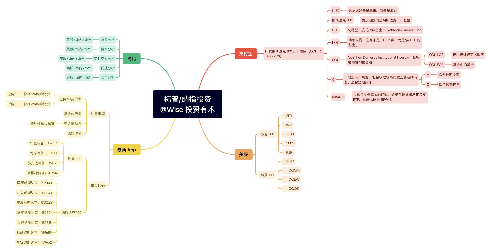
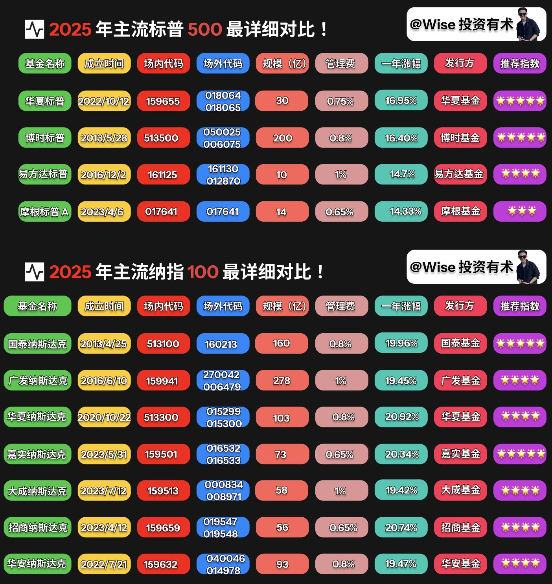
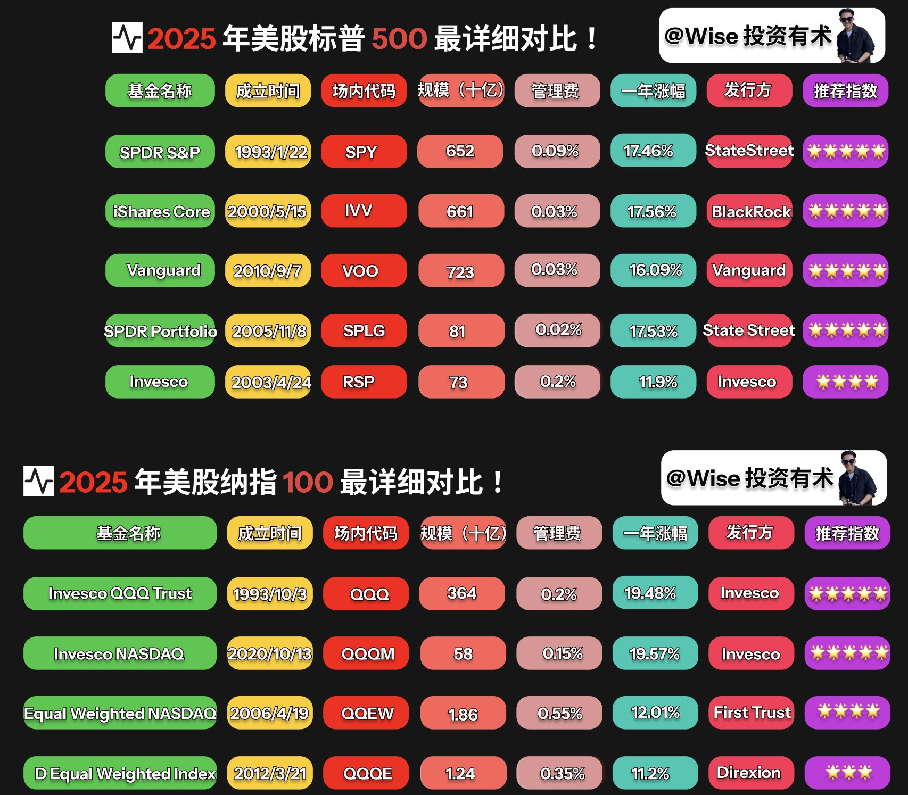
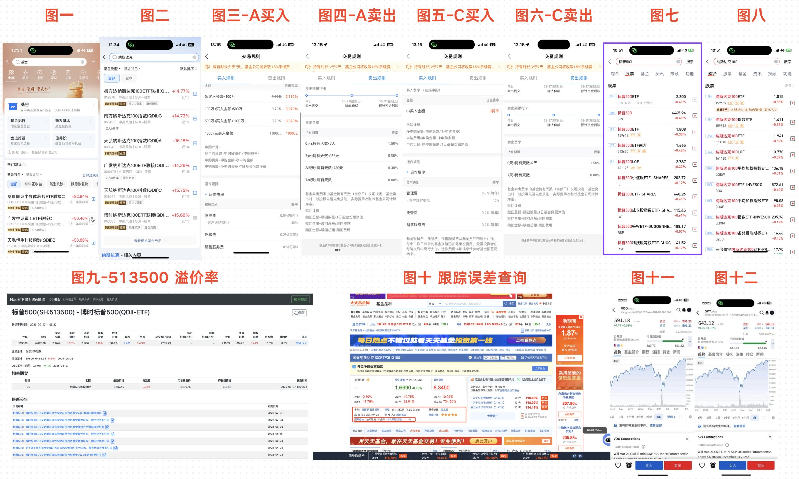

在上一期内容《2025 年之如何在美股不动脑子成为百万富豪实操版》https://x.com/WiseInvest513/status/1957395396105519141里面，我们分享了很多东西，也说了很多东西！

如果让我总结上一篇文章，哪个内容最重要、最关键的、也是最期望大家可以记住的，那就是年化回报率。

我为什么要在这篇文章里面再重新聊一下这个事情呢？我个人觉得主要是两个方面，一个是道，一个是术层面！

什么是术，那就是具体的方法！

例如我的名字叫做投资有术，所以我给大家的都是最直接的实操的方法，包括未来，我也会持续分享更多实操的、落地的、可直接执行赚钱的方法。

什么是道，就是抽象的思想理论！

年化回报率，当你把这五个字牢牢记在心中，其实我觉得你做什么事情都会成功，因为你都会考虑最真实的回报率！

拉长时间来看，任何微小的回报率加以大范围的时间加持都是王炸，期望大家可以坚持长期主义！

讲完这些之后，我们再回到正题，那就是今天要聊到的纳指和标普的投资！

我在最初接触到这些信息的时候都是零碎的信息，东一榔头西一棒子，花费了大量的时间去研究、尝试、实验，等到最真实的反馈。

在这个过程中，我发现很多赚钱的事情都是信息差，包括我们在投资的美股同样如此！

你打破了这个信息差，你了解了，你投资了，你就赚到了、你不了解，你拒绝，那你的钱就跑不赢通货膨胀！

还有可能就因为配置错误的资产，导致原本富裕的家庭因为简单的几次决策而家道中落。

所以我在这一期内容里面，我想要把关于纳指和标普在支付宝、券商 app 以及美股投资上的所有问题都给罗列清楚和理清楚，并且做成脑图给大家看个清楚！

同时也会直接告诉大家，哪里买，买什么，怎么买、各种你考虑不到，但是会实际存在的问题都会给你罗列清楚！

在学习本期内容之前，建议先把https://x.com/WiseInvest513/status/1958511704951959881这期内容学习一下，里面有详细讲到关于什么是基金，这样大家也好对基金有一个基础的了解。

ok，那我们就开始正式开始今天的内容吧！

PS：介于今天的内容会涉及到比较多的图片，所以我会把一些我觉得非常有必要贴出来的图片给大家放在一起进行观看。

## 一、支付宝

我们先从最简单的方式，那就是支付宝投资，可以说是最简单，也是最无脑的方式！

首先，我们打开支付宝在检索页面检索基金，然后点击进入基金输入纳斯达克进行检索，即可看到很多的纳斯达克基金供我们选择，如下图1-2 所示：

但是当我们看到那么多基金和名字之后，应该如何去进行选择呢？

这里给大家举个例子：广发纳斯达克 100 **ETF** 链接（**QDII**）C（006479），我们分别给大家介绍一下他们都是代表了什么含义，然后基本上所有的基金产品你也就都可以了然于胸了！

### 1、广发

- **释义**：这是基金的发行管理公司，即广发基金管理有限公司。
- **背景**：广发基金是中国一家大型公募基金公司，成立于 2003 年，属于国内前几大基金公司之一。
- **角色**：它负责产品设计、投资组合管理、信息披露、风险控制等。
- **区别点**：不同基金公司（比如国泰、华夏、易方达等）会推出各自的"纳指ETF"或"联接基金"，策略上可能略有不同。

举例子：我们经常看到的 **513100**，其实就是国泰发行的追踪纳指的基金！

### 2、纳斯达克 100

**释义**：这是基金跟踪的目标指数，英文是 NASDAQ-100 Index。

**成分**：

- **1、** 纳斯达克证券交易所市值最大的 100 家非金融类公司。
- **2、** 包含苹果、微软、亚马逊、英伟达、Meta、谷歌、特斯拉等。

**特点**：

- **1、** 科技权重高：成分股中大约 50%~60% 都是科技公司。
- **2、** 高成长性：**纳指100** 过去 20 年涨幅显著高于**标普500**。
- **3、** 波动性较大：涨跌更快，适合风险承受能力高的投资者。

> 核心逻辑：买这类基金 = 间接投资美股科技龙头。

### 3、ETF

**释义**：交易型开放式指数基金。

**特点**：

- **1、** 跟踪指数：**ETF** 追踪某个指数，比如**纳斯达克100**。
- **2、** 像股票一样交易：**ETF** 在证券交易所上市，你可以在交易日的任何时候买卖。
- **3、** 低费率：相比主动基金，**ETF** 的管理费一般更低。
- **4、** 价格接近净值：**ETF** 采用"一级市场申赎+二级市场交易"的方式，价格和基金净值非常接近。

在这里的作用：广发纳指100 **ETF**（代码：**159941**）就是广发基金推出的 **ETF** 产品，直接在深交所交易。

### 4、联接

**释义**：**联接基金**（ETF Link Fund），简单来说，它并不是 **ETF** 本身，而是"买 **ETF** 的基金"。

**原理**：

- **1、** **ETF** 只能在交易所买卖，需要证券账户。
- **2、** 如果你没有证券账户，或者想通过基金平台（比如支付宝、天天基金、银行APP）投资**ETF**，就可以买**联接基金**。
- **3、** **联接基金** **80%-95%** 的资金会买对应的 **ETF**，剩余部分可能配一点现金或货币基金，方便赎回，这也就是这类基金的收益和真正的纳斯达克会有明显区别的原因！

**区别**：

| 类型 | 账户要求 | 交易方式 | 成交时效 |
|------|----------|----------|----------|
| **ETF** | 需要证券账户 | 盘中买卖 | T+1 交割 |
| **联接基金** | 不需要证券账户 | 申赎操作 | 非实时成交 |

### 5、QDII

**QDII**（Qualified Domestic Institutional Investor，合格境内机构投资者）**释义**：这是一个跨境投资制度。

**作用**：允许境内基金公司募集人民币资金，再换汇投资到境外市场，比如美股、港股。

**特点**：

- **1、** 资金要经过国家外汇管理局的额度批准。
- **2、** 基金的买卖是人民币，但基金经理实际是去买美元计价的**纳指100** **ETF** 或股票。
- **3、** 投资者无需自己换汇，基金公司会在后台自动完成。

**风险**：

- **1、** 汇率风险：人民币贬值 → **QDII** 基金收益增加；人民币升值 → 收益被侵蚀。
- **2、** 境外监管风险：受美股市场波动直接影响。

### 6、A

**释义**：公募基金常见的份额类别。

**特点**：

- **1、** **A类**：一般是"前端收费"或"免申购费"，适合长期持有。
- **2、** **C类**：一般没有申购费，但会收取较高的赎回费或持有费，适合短期操作。

这只基金（006479）是 **A类** 份额，意味着：

- **1、** 如果通过基金销售平台购买，可能会收取少量申购费，但长期持有更划算。
- **2、** 如果你打算频繁申赎，可能 **C类**（如果有的话）更合适。

### 补充知识

**1、QDII、QDII-LOF、QDII-FOF**

有一些不是 **QDII**，而是 **QDII-LOF**，这个是什么意思？

是因为前面我们聊到如果是链接（**QDII**）其就是投资场内的 **ETF**，是场外基金，只能在基金平台、银行、支付宝、天天基金等操作。

举例子我们前面聊到的 006479，其实际投资的是广发纳指100 **ETF**（代码：**159941**），两个代码是不一样的。

但是 **QDII-LOF**，其 LOF = Listed Open-Ended Fund（上市型开放式基金）它是结合了 **QDII** 跨境投资 + **ETF** 部分功能的一种混合型基金，最直接的区别就是 LOF 可以进行场外申赎 + 场内买卖更加灵活一些。

> **QDII** 适合想长期定投，不关心盘中波动的用户群体，而 **QDII-LOF** 基金适合想实时交易、低成本套利或高频操作。

而有一些不是 **QDII**，而是 **QDII-FOF**，这个是什么意思？**QDII-FOF** 中 FOF = Fund of Funds，意思是：这只基金不是直接投资股票、债券，而是投资其他基金。

换句话说，你是"用人民币→买一只国内基金→这只基金再去买海外基金→海外基金再去买股票"。

**2、A/C 基金的区别**

细心的朋友可能有看到有一些基金写的是链接 A，有一些写的是链接 C，我们这里拿广发的两只举例子，他们分别是 270042（**A类**）和 006409（**C类**）给大家举例子看差别。

首先我们看图 3-6，图 3-4 是 **A类** 基金的买入/卖出规则，5-6 是 **C类** 基金的买入/卖出规则。

可以看到他们都会有一个基础的管理费和一个托管费，加在一起是 **1%** 每年，这部分两者都是相同的，但是不同的地方在于三个地方，分别是申购费用、销售服务费，还有就是卖出费率。

**A类** 基金有申购费用，**C类** 没有申购费用，申购免费、**A类** 没有销售服务费，**C类** 有销售服务费，**A类** 超过 730 天（两年）卖出是免费的、**C类** 是七天就卖出免费！

了解了这个规则之后，我们来做一个总结，那就是如果你需要长期持有，超过两年你直接购买 **A类**，这类有一个前置的申购费用，一次性收费，后续没有每年的销售服务费！

但是 **C类** 虽然申购不要钱，但是每年除却管理和托管，每年还需要 **0.2%** 的销售服务费！

如果我们要计算也很简单，那就是如果你有 **10** 万块钱，我们分别拿 1 年和 10 年进行对比（不考虑卖出）。

**A类** 如果持有 1 年，整体费用是：

- 申购费用：**1.3%** = 1300
- 管理费 + 托管费：**1%** = 1000
- 总费用是 **2300**

**A类** 如果持有 10 年，整体费用是：

- 申购费用：**1.3%** = 1300
- 管理费 + 托管费：**1%** = 1000 × 10 = 10000
- 总费用是 **11300**

**C类** 如果持有 1 年，整体费用是：

- 管理费 + 托管费：**1%** = 1000
- 销售服务费：**0.2%** = 200
- 总费用是 **1200**

**C类** 如果持有 10 年，整体费用是：

- 管理费 + 托管费：**1%** = 1000 × 10 = 10000
- 销售服务费：**0.2%** = 200 × 10 = 2000
- 总费用是 **12000**

| 持有年限 | **A类** 总费用 | **C类** 总费用 |
|----------|---------------|---------------|
| 1 年 | **2300** 元 | **1200** 元 |
| 10 年 | **11300** 元 | **12000** 元 |

> 可以看到的是随着时间的增长，**A类** 费用渐渐就会和 **C类** 费用拉开差距，所以如果你是想要长期持有，建议入手 **A类**，长期持有，手续费更低！

了解完毕这些基础的内容之后，我们大概也就知道如何选择合适的产品进行购买，以及选择 **A类** 还是 **C类** 进行购买。

## 二、场内 App 购买

了解完毕支付宝购买之后，我们再来了解一下场内的 **场内ETF** 等基金，其实我们上面聊到的带"链接**QDII**"，其实都是追踪的意思，就是追踪场内的基金！

例如我们经常聊到的 **513500**，这个原型其实是博时基金开设的追踪**标普500**的指数基金。

购买他需要你开设相对应的场内账号（A 股账号），那如果我们没有场内账号，或者是不想要麻烦，那就购买对应的支付宝 050025/006075，分别是**联接基金** A/C。

熟悉完毕整个流程之后，那如果我们觉得场外的价格太高，而且有时候伴随着严重的**溢价率**，就可以直接去场内券商 APP 直接购买各种基金产品，这里我拿平安证券进行举例。

ok，我们下面来聊一下在相关的在场内相关 App 上购买相关产品，我们需要注意的事项！

不同于场外的那么多叫法，在场内的名字就简单很多，要么是**标普500**，要么就是**纳指100**，或者是**纳斯达克100**，唯一最大不同的地方可能就是代码不同。

代码不同寓意着也是不同的基金公司发行的基金，等我们先把基础的了解完毕之后，最后再来给大家对比一下。

首先我们可以打开平安证券，检索**标普500**，或者是**纳斯达克100**，就可以看到很多可以购买的产品，如图 7-8！

那**场内ETF**，我们需要关注哪些信息呢？这里给大家几个我们需要额外注意的点：

### 需要关注的点

### 1、溢价率/折价率

这部分是我们需要重点关注的，我们首先来了解一下其基础概念：

| 概念 | 定义 | 影响 |
|------|------|------|
| **溢价率** | **ETF** 价格 > **NAV** 的比例 | 花的钱 > 基金实际价值 |
| **折价率** | **ETF** 价格 < **NAV** 的比例 | 花的钱 < 基金实际价值 |

**核心逻辑**：**ETF** 本质上是"证券市场的基金份额"，它有两个价格：

- **1、** 基金净值（**NAV**）→ 每天基金公司盘后计算
- **2、** **ETF** 市场价格 → 场内即时交易价格

**ETF** 的价格 ≈ 基金净值 + 溢折率。

> 如果**溢价率**高，你实际上"花贵了"；**折价率**高，可能"捡便宜"，但有风险。

计算公式是：溢折率 =（**ETF** 市场价格 − 基金净值）÷ 基金净值 × 100%。

**为什么 ETF 会出现溢价/折价？**

**ETF** 跟普通公募基金不同，它是二级市场交易 + 一级市场申赎的结构。造成溢折的主要原因我个人认为大概是如下三种：

- **其一** 是流动性不足，这个时候交易量太小，导致买盘/卖盘稀薄，**溢价率**和**折价率**波动更大。
- **其二** 是资金流入/流出，大量资金突然流入/流出，**ETF** 价格被抬高/降低，但 **NAV** 还没更新，这是造成溢价/折价最直接的原因。
- **其三** 是套利机制延迟，做市商或机构需要时间完成 **ETF** 的"申购赎回"套利，价格和净值可能短暂偏离。

> 如果你是中长期投资，偶尔的**溢价率**不必过于担心；如果你是短线交易者，需要结合实时估值（**iNAV**）+ 纳指期货 + 溢折率来判断入场时机。

那我们可以去哪里查询呢，给大家一个网址：https://haoetf.com/qdii/513500。

可直接查询 **513500** 这只基金一路以来的溢折率，了解一路以来的情况，如图九所示。

### 2、基金费率

不同基金的费率，略有不同，主要是不同基金是由不同的管理公司进行管理，所以价格略有不同，总体的费用也从 **0.6%-1%** 不等。

### 3、资金流动性

当资金可以大范围地流动起来的时候，其就会越准，但是如果其资金规模比较小，这样的话，其最终距离真实的情况差距就会比较大。

> 所以我个人认为如果选择基金的时候，成立时间 + 流动性其可能会比费率更加重要！

因为我们秉承的是长期持有 + 长期复利，如果创建时间短，其未来发展趋势，无法精准预判，很有可能会因为资金管控不周而出现无法预测的黑天鹅事件。

### 4、追踪误差

简单说：**ETF** 的目标是复制标的指数的涨跌，比如**标普500**涨 10%，**ETF** 也应该涨 10%。

现实情况：**ETF** 实际涨幅 ≠ 指数涨幅，中间存在差距。这个差距就叫**追踪误差**。

**造成追踪误差的主要原因**：

- **1、** 管理费、托管费等成本：**ETF** 本身是公募基金，有管理费和托管费，这些费用会导致 **ETF** 表现比指数略低。

- **2、** 汇率波动（境外指数 **ETF** 特别明显）：**513500** 追踪的是美元计价的**标普500**，但它在 A 股是人民币交易。如果美元兑人民币波动，会导致 **ETF** 表现 ≠ 美元指数表现。

- **3、** 分红再投资的时差：指数假设分红立即再投资，但 **ETF** 需要时间把分红派发或再投资，可能造成差距。

- **4、** 复制方法的差异：完全复制是买齐标的指数的所有成分股，误差小，但成本高；抽样复制只买部分成分股，用统计方法近似跟踪，成本低，但误差可能大。

- **5、** 流动性与交易溢价/**折价率**：**ETF** 在二级市场交易，价格受供需影响，可能和真实净值（**NAV**）有差异，从而导致**追踪误差**。

这里我们可以看**追踪误差**率来看实际的情况，各种 App 看误差率没有那么方便，我们这里直接看 https://fund.eastmoney.com/513100.html 这个网站。

可以精准追查到误差率，如图十所示。

还有就是买入和卖出的规则上，还是需要大家仔细了解一下的，在券商 App 上购买基金，同 A 股交易佣金一致，起点是五元，买卖双边收取，具体以账户实际为准，这点还是不同于场外的！

## 三、场内 & 场外对比

最后就是我们把所有上面已经讨论过的支付宝购买和场内 App 购买，我们需要注意的点结合在两张图表里面，来详细分析一下我们应该购买哪些产品：

整理总结下来，如果购买，需要重点关注如下三个关键点：

**1、** 基金规模与流动性（核心关注）因为规模大、流动性高，意味着交易更方便、买卖价差更小、成本更低！

举例子基金规模要大于 **10 亿**，例如 **513100**（纳指 **ETF**）、日均成交额 5000 万元，例如 **159941**（纳指 **ETF**）。如果成交量太小，买卖价差会变大，可能会导致隐性成本升高。

**2、** 费率（管理费 + 托管费 + 交易成本），费率直接影响长期回报，尤其是被动指数型 **ETF**，例如**场内ETF**其管理费 + 托管费在一起大概是 **0.65%** 左右，而场外的 **QDII**-**ETF**，基本上都在 **1%** 左右。

**3、** 基金公司实力与成立时间，大公司寓意着更强的投研能力 + 更低的**追踪误差**，基金公司我们优先选择易方达、华夏、南方、广发，成立时间越早越好，例如 **513100** 成立于 2013 年。

如上图所示就是我罗列出来了主流**标普500**和主流**纳指100**的场内和场外对比图，包含上面我们聊到的一些关键指标。

主要关注成立时间、规模、管理费和一年涨幅，综合考虑选择 1-2 个进行投资购买。

当然，还有很多其他优秀的产品，这里碍于内容有限只整理了一部分，如果大家觉得还有哪些自己发现也还不错的，欢迎在评论区留言！

## 四、美股 ETF

最后就是美国本土的 **ETF**，前面聊到了很多关于国内场内和场外的 **ETF** 基金，这些主要针对的人群是没有办法注册国外券商 App，或者是没有办法办理港卡的一部分伙伴。

那我在评论区，也看了很多朋友想要了解如果是国外的美国本土的 **ETF**，我们应该选择哪些进行投资。

这里就不进行过多的介绍，因为是美股本土的 **ETF**，所以像是我们在场外买时考虑到的各种费率，以及溢折率和各种误差，其实都不用考虑那么多。

而且美国本土的 **ETF**，基本上都是老牌 **ETF**，都是运行了十几年，甚至是几十年，都是十分值得信赖的，就不用考虑那么多。

这里直接给出一些可以供我们购买的代码。

从费率到规模，再到创建时间和收益，都在图里面，大家可以对照着去选择自己喜欢的购买即可！

在**标普500**里面比较推荐 VOO 和 IVV，数据都还不错，并且费率也比较低、**纳指100**就推荐 QQQ 还有 QQQM，QQQM 的费率要比 QQQ 低 **0.05%** 个点，更加适合我们持有！

而在**标普500** **ETF** 购买的时候例如图 11-12 所示，可以看到 VOO 和 IVV 的价格并不一致，但是这大家也不用在意，我们只需要关注最后的收益即可！

至于没有国外券商账号的朋友，也不要着急，我也会把我在后面更新相关的内容，帮助大家走完美股购买股票的第一步，大家持续关注即可！

## 五、对比

上面我们已经聊完了场外-支付宝、场内-券商APP、以及美股 **ETF**，那他们三者之间有什么区别呢？这里从几个方面给大家进行科普一下。

**1、收益分析**

收益主要看的就是最后的**追踪误差**，从这三种投资方式进行考虑。

美股 **ETF** 收益率是最高，因为其是最直接追踪标普/**纳指100**的产品、其次就是**场内ETF**，其追踪的是美股的指数，在收益上会存在一些误差，最后就是场外的支付宝投资，其追踪的是**场内ETF**，在效率上更慢一步！

> 所以如果有条件的话，最好直接去购买美股的 **ETF**，收益也是最高的。

**2、费率分析**

费率上美股也是出奇的低，就拿追踪**标普500**的 SPLG 举例子，其每年的管理费只有 **0.02%**，可以说微乎其微。

相对之下**场内ETF**费率就要略高一些，在一定程度上也会收取各种手续费，基本上加在一起会在 **0.65%-1%** 之间，相比美股的要高出几十倍！

而对比到场外支付宝的费率，各种手续费就更多了，不仅仅有基础的管理费和托管费，在不同的**A类**/**C类**基金，还会有一些销售付费，可以说是手续费最多的一种投资产品！

**3、实时交易分析**

其次就是能否进行实时交易，在这部分考量上，其实美股 **ETF** 和**场内ETF**的部分，都可以做到 T+0，即随时买随时卖，没有任何的交易限制！

但是在场外的支付宝投资上，无法做到实时交易，有 T+1/T+2 的交易限制，当面对到一些特殊的情况时候，没有办法及时地进行加仓，比较适合不怎么操作、长久 DCA 的人群！

**4、便捷分析**

如果考虑到便捷性，那场内的支付宝一定是最方便的，我们无需开户，也无需下载各家的 APP 产品，直接就可以购买。

其次就是一些券商 APP，其需要我们去开 A 股账户，但是只要提供合适的材料和证明，开户还是很方便的，也适合大家长期去进行投资。

最后就是美股券商 APP，这个难度比较高，一般开户的时候，还需要我们有境外银行卡进行入金，方可激活和购买对应的产品，适合能够出入境的朋友。

**5、安全分析**

最后就是安全性分析，无论是支付宝，还是券商 App，其都受到我们国家的监管，相对之下还是比较安全的！

但是美股 App，就会涉及到出入金问题，在出入金问题上，国外的管控还是很严格的，如果想要进行正常地出入金，还是需要好好学习一下出入金知识，后面我也会给大家分享出入金教程，帮助大家进行这部分难题的解决！

说到这部分，也欢迎看到这里的小伙伴，给我点个赞，并且关注我的账号，后面我也会持续出更多细节教程！

帮助大家从零到一地走出从支付宝到美股投资的这条路，让自己的资产收益最大化！

## 六、写在最后

本期内容因为工作量巨大，以及涉及的知识面比较广，并且需要收集各种数据，而且要验证数据的真实性和可靠性！

在这个期间，我找了几十个网站，查阅了上百个界面，就是为了得到最真实的数据！

所以才会推迟了一些时间发出，但是我觉得也是值得的，毕竟零碎的内容无法构成体系，只有经过系统并且体系化的学习，才可以对整个投资有一个大而全的了解！

但是投资领域细节还很多，我们目前主要关注的还是 DCA **纳指100**和**标普500**，打开全球的视野，慢慢在未来我也会把更多的目光打开。

包括但不限于科技股、美股七巨头，以及加密货币等，一切我觉得可以投资的产品进行讲解以及实操投资！

自加密货币诞生以来，其一直都饱受争议，我最开始接触的时候，因为对整体的局势了解不清楚，也产生过怀疑！

但是了解越发多了之后，我也越发觉得加密货币这条路，我们是一定要去了解和接触的，从全球的视角来看，Web3 在未来一定会颠覆我们的日常生活。

在这个洪流中，我也期待已经加入其中的朋友们，可以保持一个开放的态度，去迎接更加科幻并且是美好的未来！

以上就是今天推文的全部内容了！

这里是 WiseInvest！专注于美股/加密货币投资，坚持投资改变命运，力求通过投资来打造自己财富积累的第三曲线，实现 10 年内财富自由！

如果你对投资，理财、赚钱、Web3 感兴趣，欢迎关注我，我也会在后面持续推出更多优质且精彩的内容！

最后的最后，就是如果大家觉得今天的内容对你有帮助，不要忘记给我点赞、收藏和转发哦，你的支持就是我持续更新的最大动力。

随着近几年 AI 的蓬勃发展，很多科技股也都迎来了大幅度的增长，我也看到很多朋友都在讨论，要不要买，以及如何看待其波动性和收益性等问题！

如果本期内容点赞过 300，我也会尽力在本周末给大家详细讲一下科技股，包含其跟踪的公司、波动率、收益率，以及国内外购买渠道和代码等问题，力求一篇文章给大家讲明白科技股！

我们就下期再见，拜拜
