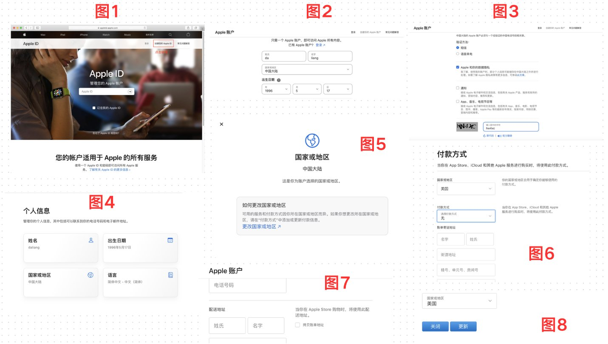
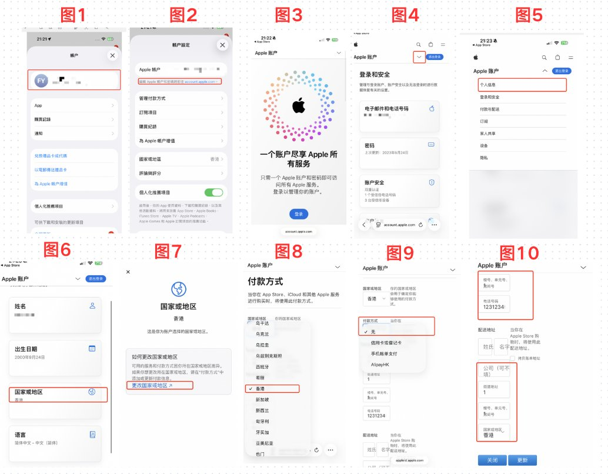

## 一、写在前面

在前面的教程中，多次聊到了港区 ID 和美区 ID 等，用于下载各种 App。

但是我发现评论区有很多小伙伴还是没有对应的 ID，所以今天就给大家制作一期教程，来详细讲解一下这部分内容。

本期的内容主要分为两部分：

**①** 讲解如何从零到一注册一个美区 ID 账号。

**②** 讲解如何修改现有的国区 ID 为港区 ID。

分别对应大家如果没有美区 ID，可以看教程注册，以及如果你现在有多余的国区 ID，如何修改成为港区 ID 教程！

ok，那我们就开始本期的内容吧！

---

## 二、注册美区 ID

**1、** 打开苹果的官网：[https://appleid.apple.com/account](https://appleid.apple.com/account) 点击**创建您的 ID**。

**2、** 填写姓氏和名字【英文或者拼音】、国家或地区先选**中国大陆**，出生日期最好选择大于 18 岁以上，邮箱填写 QQ、126、163 邮箱或者 Gmail 邮箱都可以。

**3、** 填写手机号，验证方式选择**短信验证**，去掉下方公告前面的两个勾（那两个是广告推送），填写验证字符，点击继续。

**4、** 第 2 步里填写的邮箱里去找一下验证码，填进去，点击继续。

**5、** 这时候会收到手机验证码，填进去点击继续。

**6、** 注册成功后默认自动到登录与安全界面，这个时候就注册成功了，接下来点击**个人信息**。

**7、** 点击国家或地区——继续点击下方蓝色字体**更改国家或地区**。

**8、** 跳转到付款方式界面，将**中国改为美国**，付款方式选择**「无」**。

**9、** 下方账单地址需要美国人的信息，这时候打开 [https://meiquid.com](https://meiquid.com) 在网站里随便选个美国城市，自动会生成美国人信息。（因为付款方式是无，这里的信息就不是特别重要，所以就可以随便用，供参考）把生成的信息依次复制粘贴过来。

**10、** 填好信息后，下拉会看到配送地址，右侧勾选**拷贝账单地址**，上面的信息就会自动同步到下面了。

**11、** 点击最下面的**更新**按钮，即可成功将账号更新成为美区 ID 账号了！

---

## 三、修改港区 ID

聊完了如何从零到一注册美区 ID 之后，我们再来聊一下如何修改一个现有的国区 ID 成为港区 ID。

**1、** 打开自己的苹果 ID，点击右上角入口。

**2、** 然后点击蓝色的字体进入到浏览器登录到官网。

**3、** 直接点击登录，人脸验证或者是账号密码登录。

**4、** 点击倒三角，然后选择**个人信息**，点击进去。

**5、** 选择**国家和地区**，然后选择**更改**，选择**香港**。

**6、** 付款方式选择**无**就好，其他的都写 1 就好，手机号码随便写一个 `1231234567`。

**7、** 最后完成之后，点击**更新**，即可更新这个 ID 归属地。

**8、** 最后你就成功得到了一个苹果港区 ID，后续可以正常下载对应的 App 啦！

---

## 四、写在后面

整体不算是难，但是就是有很大的信息差，这部分内容你在某音上想要找到合适的信息，或者是过于片面化。

所以我给大家做了一个小总结，帮助大家来快速完成这整个流程！

记得收藏哦，防止后续刷着刷着就找不到了！

这里是 **WiseInvest**！专注于美股/加密货币投资，坚持投资改变命运，力求通过投资来打造自己财富积累的第三曲线，实现 10 年内财富自由！

如果你对投资、理财、赚钱、Web3 感兴趣，欢迎关注我，我也会在后面持续推出更多优质且精彩的内容！

最后的最后，就是如果大家觉得今天的内容对你有帮助，不要忘记给我**点赞、收藏和转发**哦，你的支持就是我持续更新的最大动力。

**感谢大家的关注！**
