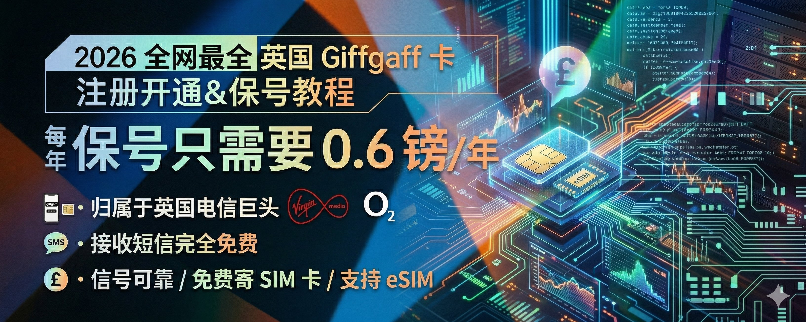

## 一、写在前面

哈喽，大家好，这里是 Wise 投资有术，我是你们的老朋友 Wise！

在前面我们聊到过，我们准备开始启动手机卡这个系列的内容了！

[👉 手机卡教程启动贴](https://x.com/WiseInvest513/status/2033938535972241838)

其实做这个内容的初衷很简单，即在这个持续分享的过程中发现还是有很多的产品正在逐步需要境外的手机号方可注册和使用。

**在出海的过程中，大家也都在聊境外手机号也是一个必备的板块**，所以我就准备计划启动这个板块的内容，给大家对比各个不同的手机号，其相互的优劣点以及价格等，方便大家都能够找到适合自己的手机卡，开启数字游民 + 世界公民的生活。

ok，话不多说，我们就即刻开始吧！

---

## 二、前置准备

在准备注册和开通此卡之前，咱们也需要进行一些前置的准备。

### 其一：购买实体卡

目前此卡以实体卡居多，但最近一段时间各大平台都已经下架了此产品，而且需求量大，很多人可能会钻空子售卖不合规的卡。

如果大家没有合适的渠道购买，可以加我联系方式，我有一个稳定的渠道可以出未注册/注册过的卡，确保安全和稳定。

> **联系方式：**
>
>   - 个人微信： **WiseInvest513**
>   - Telegram：**@WiseInvest513**

### 其二：准备支付方式

如果大家想要自己开卡，需要虚拟银行卡用来进行支付。目前我们可以使用 Bitget、SafePal 以及 Bybit 虚拟 U 卡进行支付。

- 有护照 → 推荐 **Bitget**（消费最顺畅）
- 无护照 → 推荐 **Bybit**

图文教程如下：

- [Bitget 开卡教程](https://x.com/WiseInvest513/status/1953841324236714497)
- [SafePal 开卡教程](https://x.com/WiseInvest513/status/1982742923117764950)
- [Bybit 开卡教程](https://x.com/WiseInvest513/status/2033136852073664975)

### 其三：不想用实体卡？考虑 eSIM

如果你不想使用实体卡，可以使用 eSIM。Xesim 可以导入 30 张 eSIM 卡，实现一张设备享有全球境外卡！

[👉 Xesim eSIM 教程](https://x.com/WiseInvest513/status/2025197514362863835)

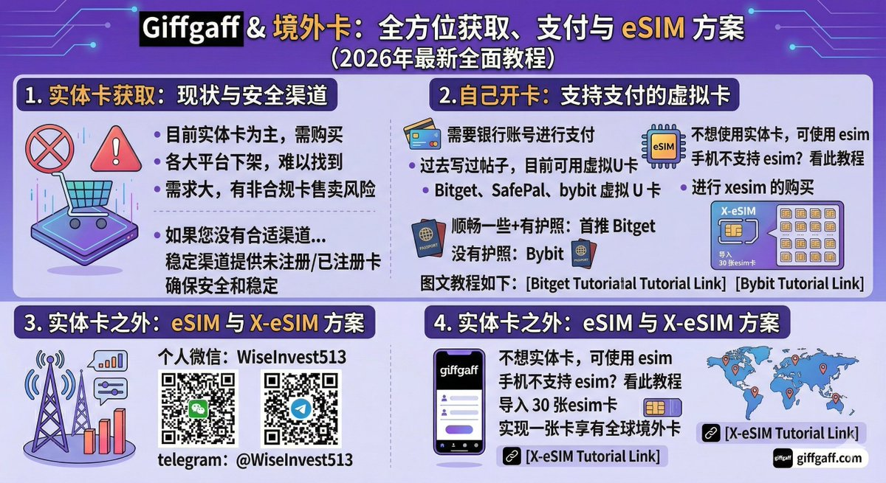

> 提前购买好卡、开好相关的虚拟 U 卡，并确保里面有钱，准备好之后再进行下一步操作！

---

## 三、注册开卡

我们采用**网页端**进行注册，更加稳定。整个流程大概需要 **20-30 分钟**，请确保这段时间网络稳定、无人打扰，争取一次性开卡成功。

**1、打开官网激活页面**

访问：[https://www.giffgaff.com/activate](https://www.giffgaff.com/activate)

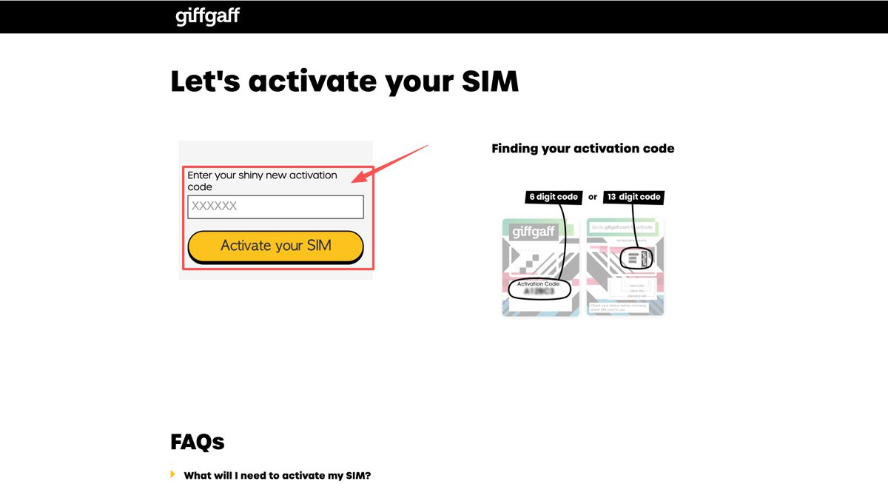

**2、输入激活码**

拿出你的卡片，可以输入**六位数激活码**，也可以输入**卡背面 13 位数字**，任选其一输入后走激活流程。

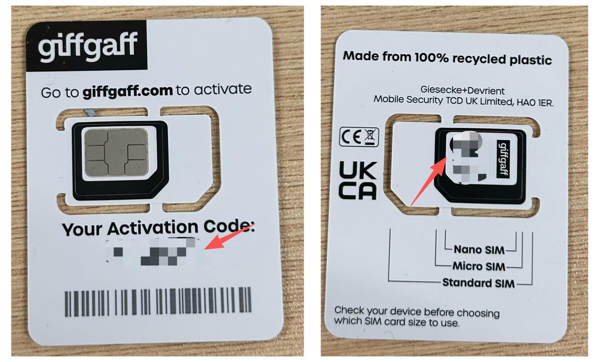

**3、填写邮箱账号**

官网识别此卡为正版卡后，输入你的邮箱作为登录账号。

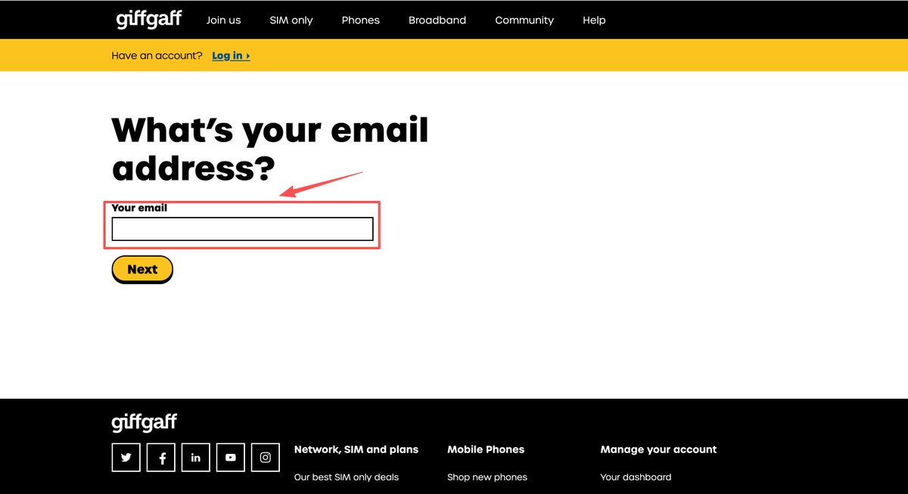

**4、设置密码**

密码要求：大小写字母 + 数字，**至少 12 位**。

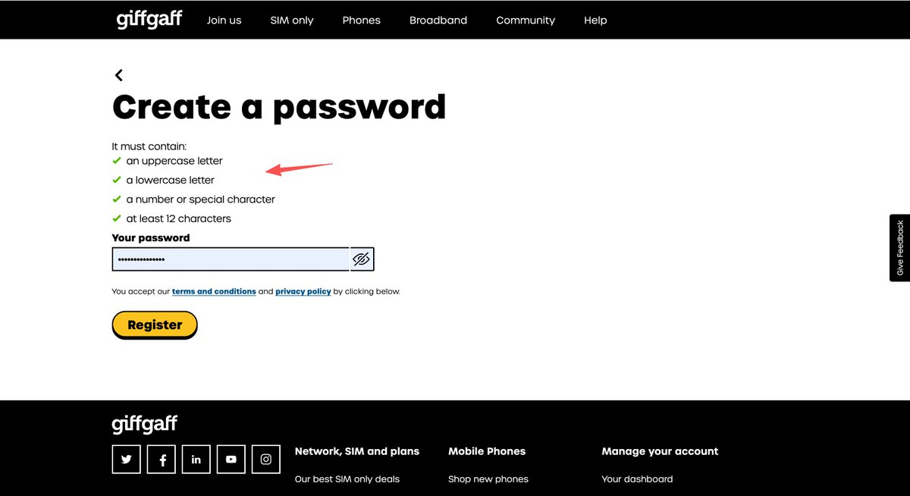

> 推荐直接使用谷歌自动生成的密码，保存在谷歌账号里，省去记录麻烦。

**5、跳过营销选项**

这里选择 **No, thanks**，生日可以不填写。

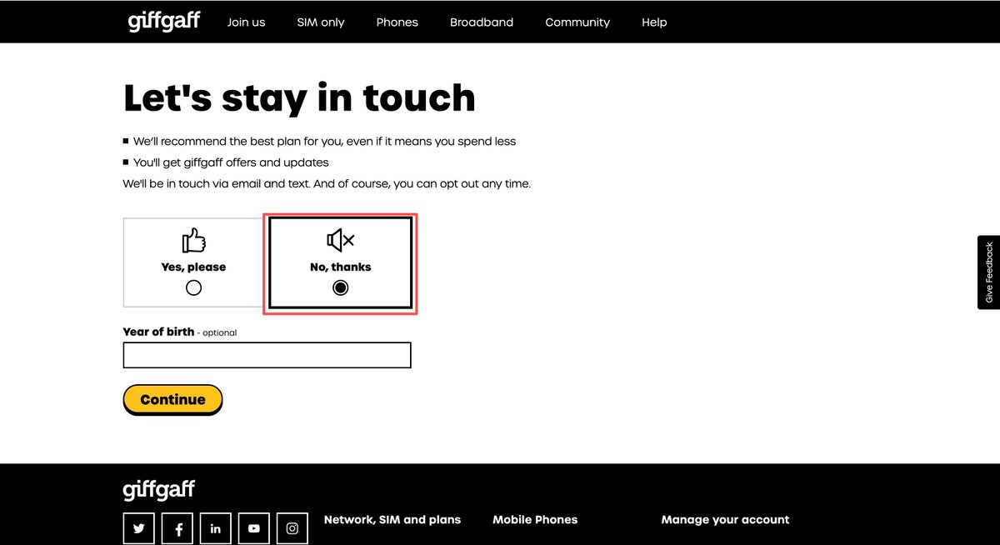

**6、选择套餐 → Pay As You Go**

进入购买套餐界面后，**不要购买流量套餐**，直接下拉到最下面，选择 **Pay As You Go**（按需自定义充值额度）。

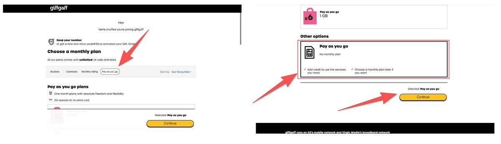

**7、充值最低额度**

充值选择最低 **£10**，约 90+ 人民币。

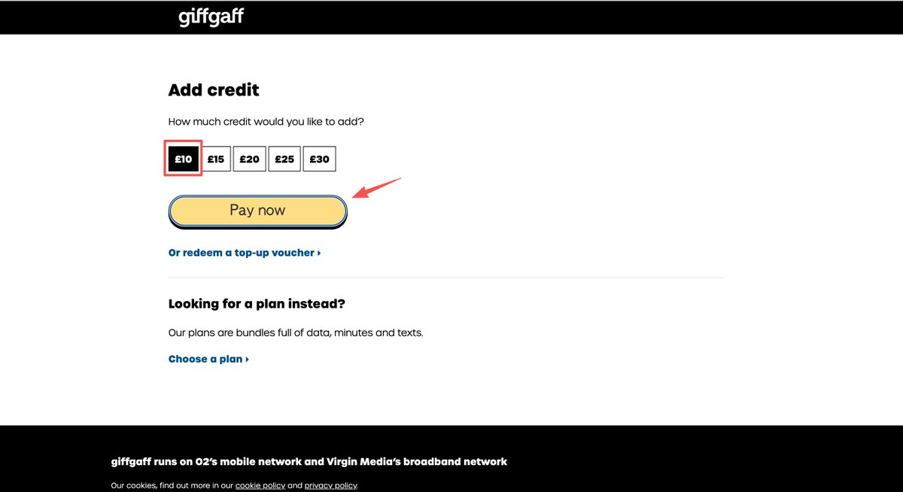

**8、填写姓名和地址**

- 姓名：按要求填写即可
- 国家：选择英国
- 地址：可以随意填写

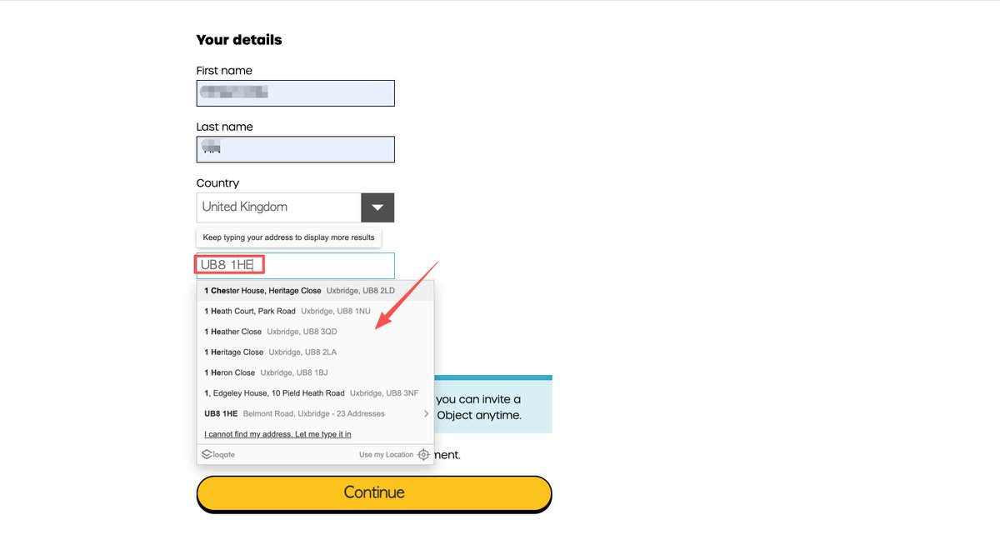

> 不知道填什么地址？试着输入邮编 **U88 1HE**，系统会自动弹出英国地址供选择，随意勾选一个即可。

**9、填写付款卡信息**

填入卡号、过期时间、CVV 数据值等。

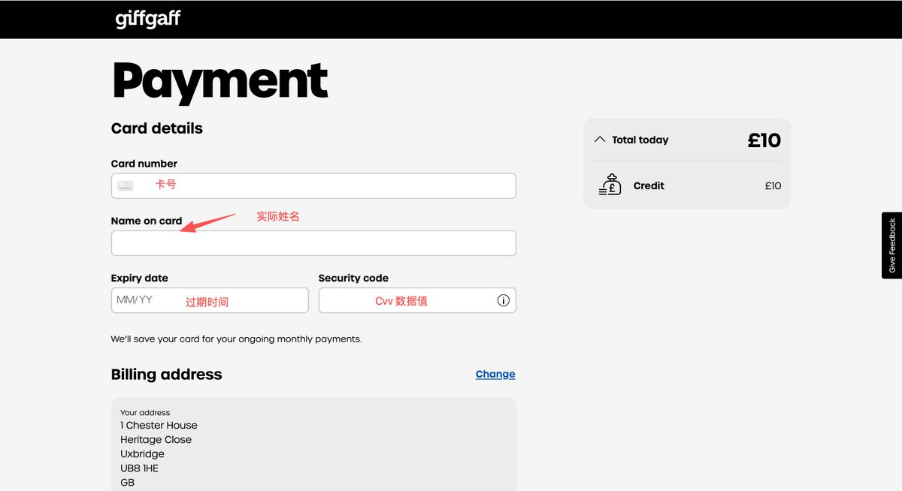

**10、选择支付虚拟卡**

只要是符合要求的虚拟卡都可以使用，包括 Bitget、SafePal、Bybit 虚拟卡。

打开 **Bitget Wallet App** → 右下角钱包 → 查看账号信息，即可获取卡号 / 过期时间 / CVV。

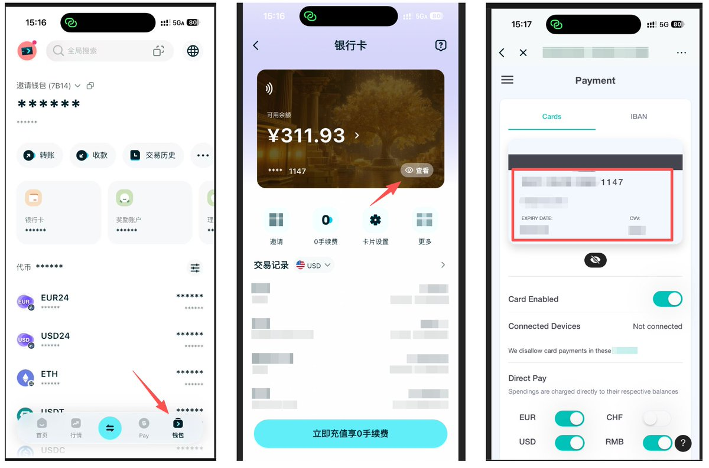

> 注意：银行卡里的钱需要是**美元**，人民币无法支付，注意提前换汇。

**11、提交付款**

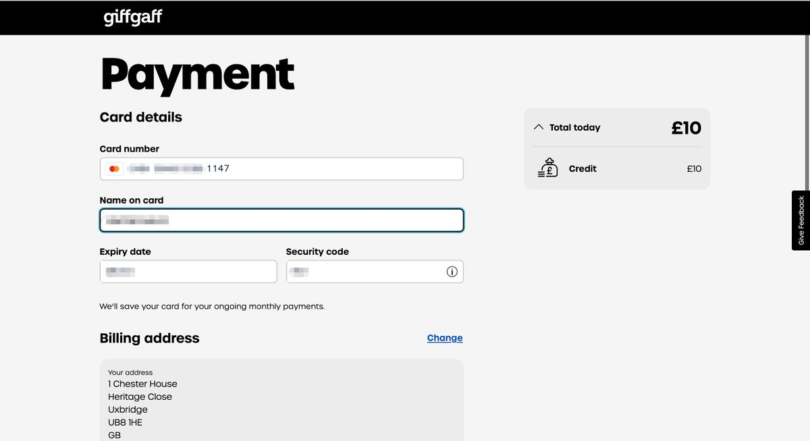
输入卡片数据后，下拉到最下面点击付款。

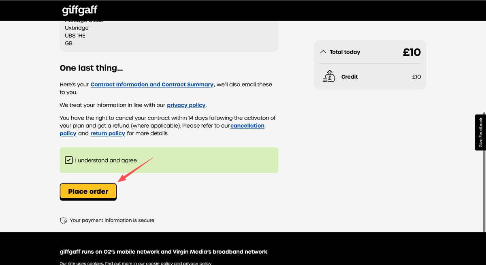

**12、填写验证码（Bitget 用户）**

如果使用 Bitget 付款，系统会发送验证码到绑定邮箱，前往邮箱回填即可。

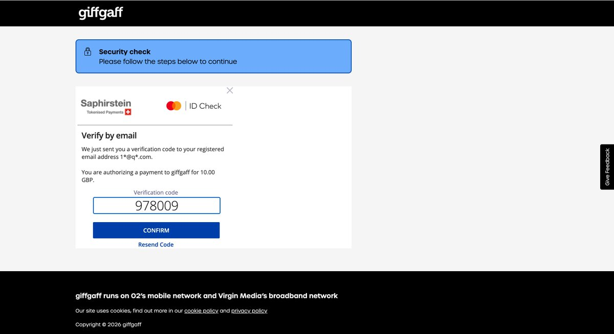

**13、等待付款成功**

稍等 5-10 秒，付款成功后即可看到你的手机号。

🎉 至此，你的卡就成功注册完成，获得了一个官方认证的境外手机号！

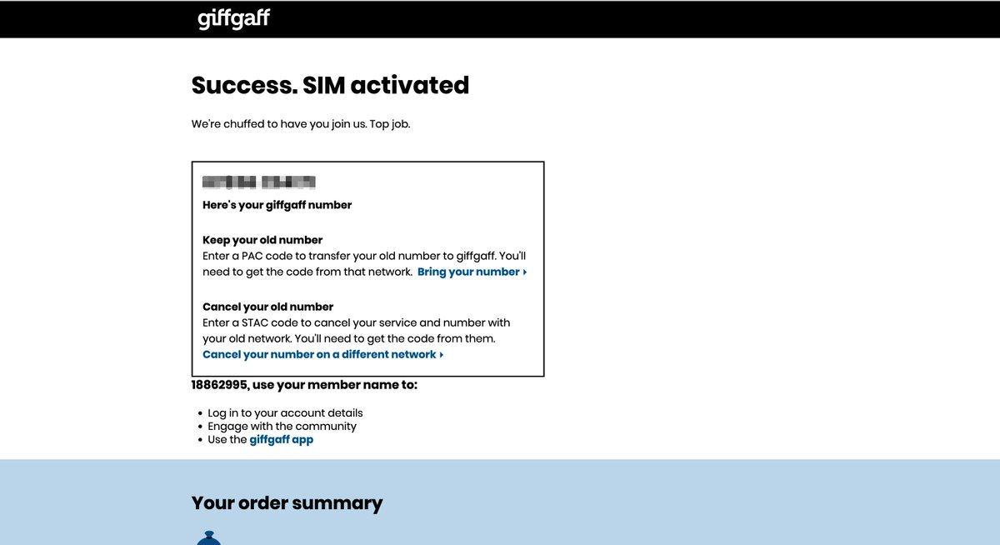

**14、查看账号信息**

点击右上角头像 → **My Account**，即可看到账号 ID 和手机卡号（一般以 078 开头）。

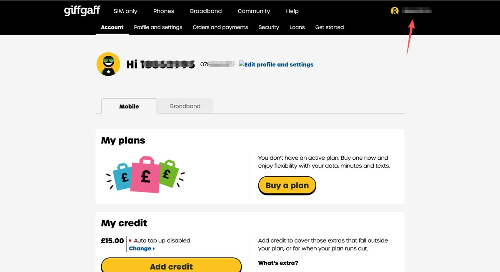

---

## 四、激活 & 保号

卡成功开通后，将 SIM 卡插入手机。插入后会收到欢迎短信，如果没有收到，请关闭手机"屏蔽未知号码"功能。

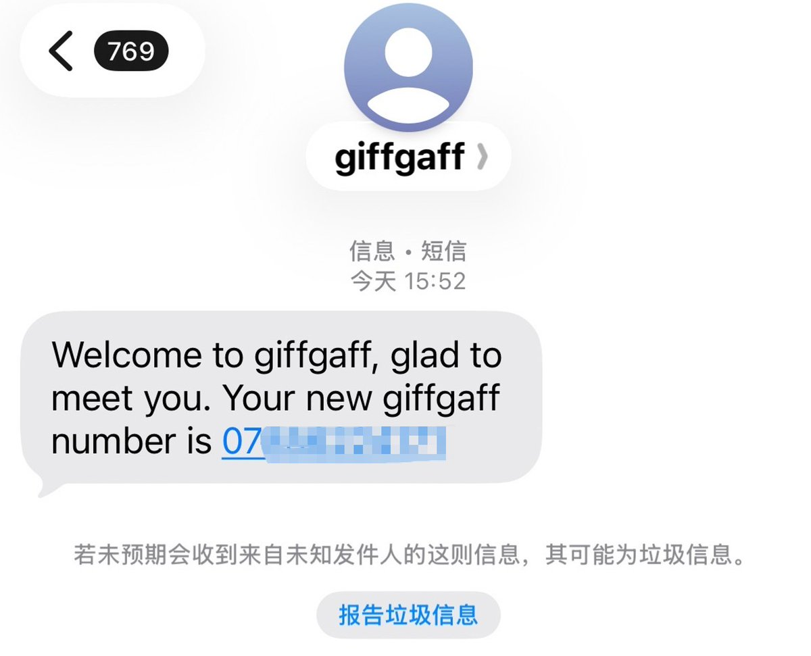

**发送一条短信完成激活：**

在短信收件人输入 `0044 + 78XXXX`，系统会自动转换为 `+44 78XXXX`。注意手机号前面默认有 `078`，把第一个 `0` 删除再输入。

发出短信后，成功收到即完成激活 ✅
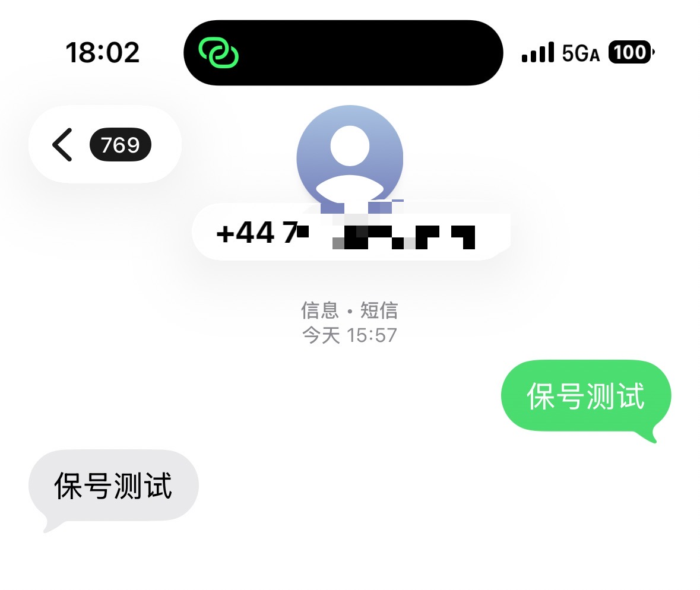

---

## 五、注意事项

> 以下几点非常重要，一定要认真看！

### 1️⃣ 最重要：保号（防止号码被回收）

- giffgaff 要求每 **180 天（6 个月）** 内至少有一次余额变动，否则号码会被停用并回收。
- **最低成本保号方式**：发一条短信，费用 ≈ £0.3/条，一年只需两次 ≈ **£0.6（约 5-6 元人民币）**。
- 保号动作包括：发短信、小额充值、产生任何消费（不建议打国内号，容易触发反诈风控）。
- 官方会在到期前 35 天和 5 天发**邮件提醒**，务必关注注册邮箱（建议检查垃圾邮件）。
- 首次激活的充值也算一次变动，激活后 180 天内记得再动一次。

---

### 2️⃣ 防止意外扣费（非常重要！）

**立即关闭数据漫游 / 移动数据**

在中国/香港流量费用极贵（£0.2/MB ≈ 2 元/MB），一不小心后台用流量可能几分钟扣几十上百镑。

操作：手机设置 → 蜂窝数据 → 找到 giffgaff 这张卡 → 关闭「数据漫游」+ 关闭「蜂窝数据」

**关闭语音信箱（防止挂断扣费）**

giffgaff 默认开通语音信箱，来电不接会转语音信箱并产生费用。

激活后在拨号界面输入：`##002#` → 拨号 → 看到确认提示即关闭成功。

**苹果手机特别注意**

- 插卡后**不要点**「激活 iMessage/FaceTime」，系统会自动发短信验证，扣 £0.3。
- 双卡 iPhone 用户：关闭「自动切换蜂窝数据」，防止副卡偷跑流量。

**其他容易扣费场景**

| 操作 | 费用 |
|------|------|
| 打/接电话 | £1 / 分钟 |
| 发短信 | £0.3 / 条 |
| 接收短信 | **完全免费** ✅ |

---

### 3️⃣ 信号 & 收验证码优化

- 插卡后可能需要 **1-15 分钟**才有信号（漫游登记过程），耐心等待。
- 收不到短信/验证码时：手机设置 → 移动网络 → 选 giffgaff → 运营商 → 关闭自动 → **手动选「中国移动」**→ 重启手机。大部分地区中国移动信号更好。
- 发送格式：国内号码 → `0086 + 手机号（去掉0）`，英国号码 → `0044 + 7xxxxxxxxx（去掉前面的0）`

---
### 4️⃣ 其他实用建议

- 下载 **giffgaff App**，方便查余额、查消费记录（每个账号可免费换 2 次号码）。
- 余额建议保持 **£5-10 以上**，防止保号时余额不足。
- 如果以后想转 eSIM：可在 App 里操作（需手机支持 eSIM），但转完后依然要关闭数据漫游。
- 目前（2026 年）未见大规模封中国/香港长期漫游用户，但保持低频使用（只收短信 + 半年保号）最安全。

---

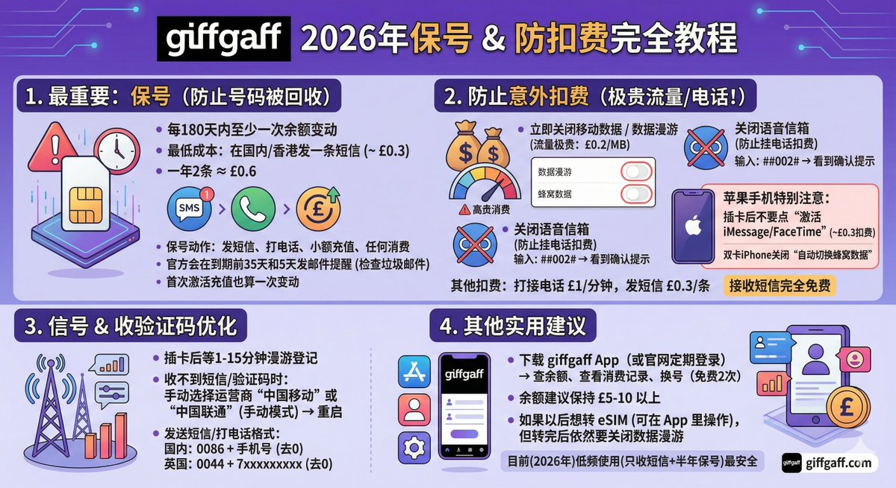

### 总结：最关键三件事

> 1. **每 180 天发一条短信保号**
>   2. **永远关闭数据漫游 / 蜂窝数据**
>   3. **激活后立即输入 `##002#` 关闭语音信箱**
>
>   做好这三点，基本可以安心用很多年。

---

## 六、写在最后

ok，以上就是今天开卡部分的全部内容，完整介绍了 giffgaff 的开通、激活、保号以及注意事项。

**目前最低费用只需 £0.6，即可享有一个完整的境外卡，性价比极高。**

过去的沃达丰卡现在已需要线下验证，此卡目前国内也在缺货中，所以我十分建议看到此教程的朋友们都花时间去注册一个，以备不时之需！

如果大家对此卡有需求，可以添加我的个人微信购买，收到之后按教程操作即可。

如果内容对你有帮助的话，记得给我点赞和收藏哦，感谢大家的支持了。 

那后续更多的电话卡系列教程，我还在持续安排中，后续陆续上线。

记得关注和锁定我们的频道，我们下期再见。 
