## 一、写在前面

哈喽，大家好，这里是 Wise 投资有术，我是你们的老朋友 Wise！

作为数字游民，我们时常需要去各个地方跑，那经常出去的朋友都知道无论是流量还是卡来说都是出行必备的。

对于我们多数的国行手机来说，我们用的都是传统的 SIM 卡，即是一张实实在在的塑料卡片，要插进手机卡槽里，每张卡只对应一个运营商的号码/套餐，换运营商就要换卡。

而对于很多美版手机来说，其已经内置了 eSIM，即这种就是直接焊接/内置在手机主板上的一个小芯片（手机出厂时就有了），它本质是一个可编程的存储空间，能通过网络下载并保存多个运营商的"配置文件"（叫 Profile 或 eSIM profile），每个 profile 就相当于一张虚拟的 SIM 卡。

好处也非常显而易见——一个手机可以有不同的电话号码，可以随时切换，出行也比较方便，直接购买各种 eSIM 流量包，扫描二维码之后就可以立马激活，不用再购买各种 SIM 卡，也不用开各种昂贵的路由！

**但是国行手机因为政策和证书的原因一般都不支持这种策略和方式，所以就诞生了今天我们讲到的 Xesim 这种类型的卡！**

---

## 二、Xesim 介绍

对于 Xesim 来说，其外表看起来就是一张普通的 SIM 卡，但是其实是一张特殊的实体 eUICC 卡（可编程的 eSIM 芯片做成实体卡的样子）。

也就是说我们可以用这张卡实现 eSIM 的效果，而且可以写入多个手机号，也方便我们进行一些平台的注册和解码！

如下图所示，我在前几天购买了 Xesim 家的 X2 Pro 已经到货了，所以今天我就给大家来讲一下具体的使用方式！

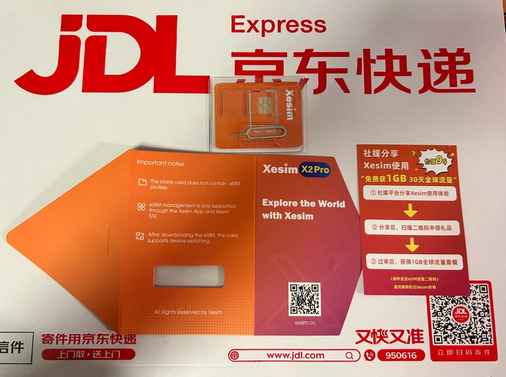

购买链接：[点击此处购买 Xesim](https://xesim.cc/?DIST=RkJHFVg%3D)

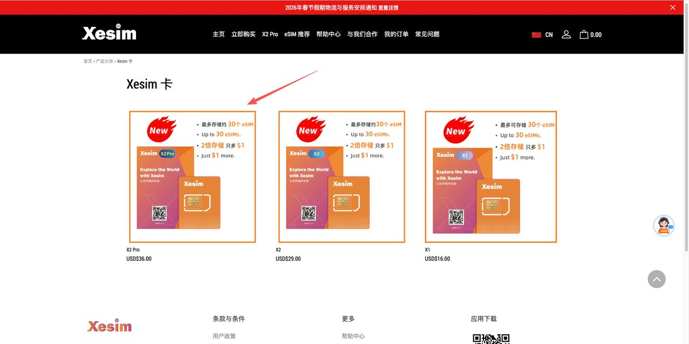

选择 **X2 Pro** 进行购买，这个使用起来最方便，其他型号不是很建议，因为 X2 Pro 自带了 SeedLink 自带流量，操作起来都会更加方便。

输入折扣码 **「WISE666」**，我给大家申请了一个九折折扣。

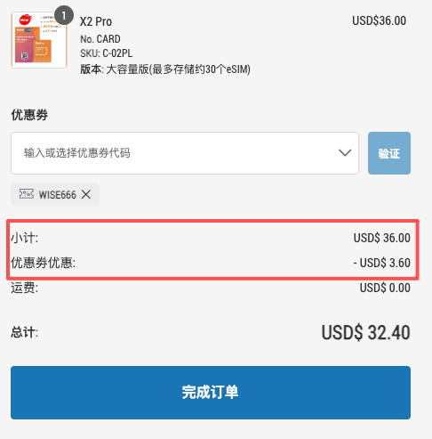

---

## 三、具体使用

如下是 X1/X2 和 X2 Pro 的一些使用方式对比，大家可以先行了解一下。

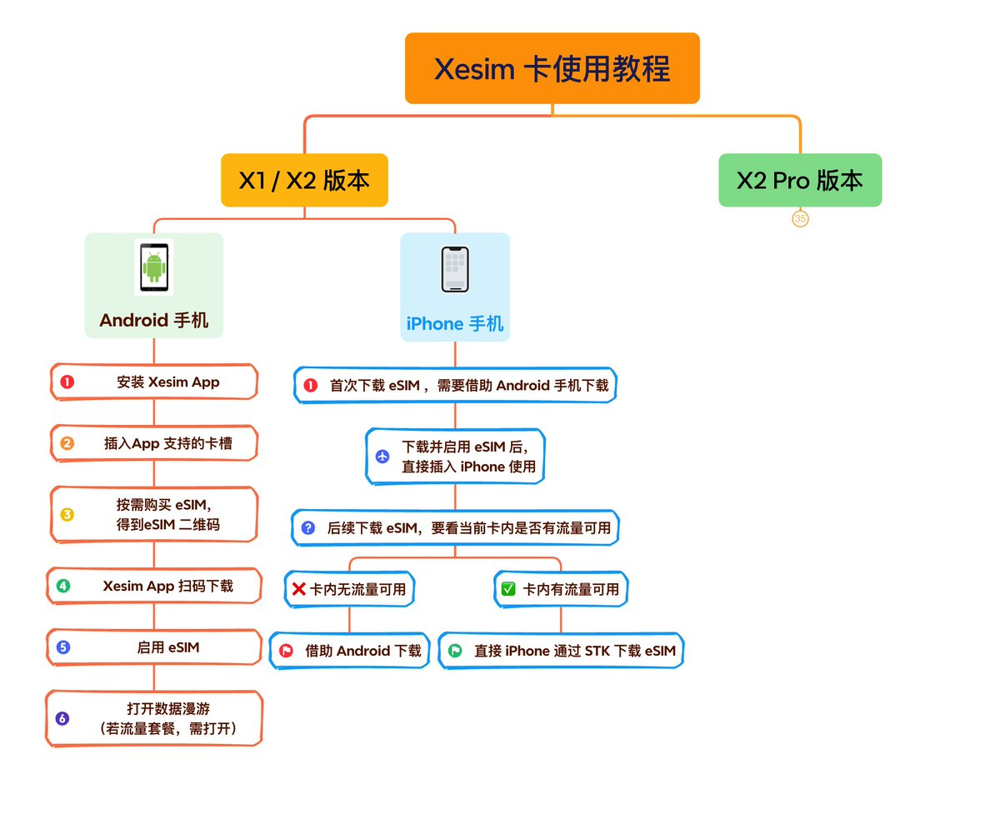

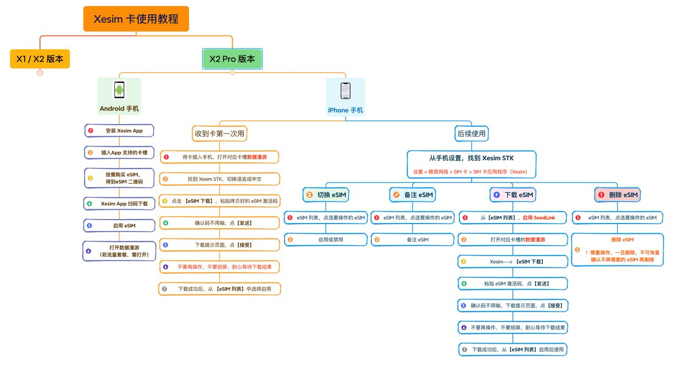

然后我们就开始操作细节：

### 1. 收到 Xesim 卡后，将卡插入 iPhone

### 2. 打开数据漫游开关

手机设置 → 蜂窝网络，找到对应 Xesim 卡槽对应的移动网络，打开数据漫游开关。如果手机有使用 VPN，也请先关闭 VPN。

### 3. 下载 Xesim App

从苹果应用商店 AppStore 搜索 **Xesim App**，下载安装。

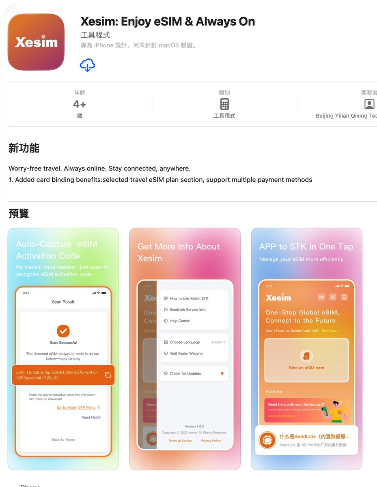

### 4. 在 Xesim App 上绑定 Xesim 卡

绑定后，可以查看 SeedLink 有效期，也可以通过 App 来续期 SeedLink 服务。

- **X2 Pro**：可以通过短信验证码绑定
- **X1 和 X2**：必须要通过绑定码（插入 Android 手机，App 上可查）或官网订单信息绑定

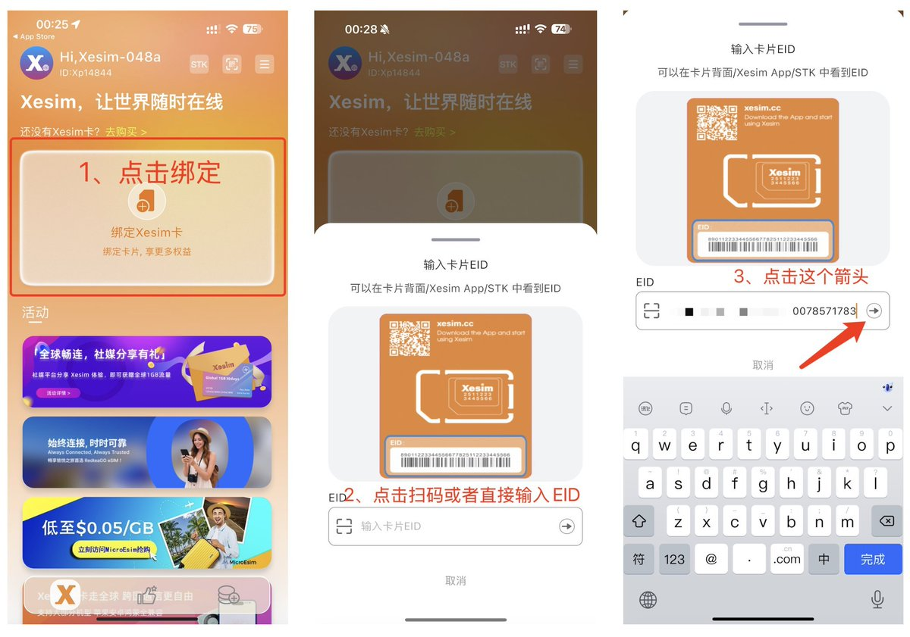

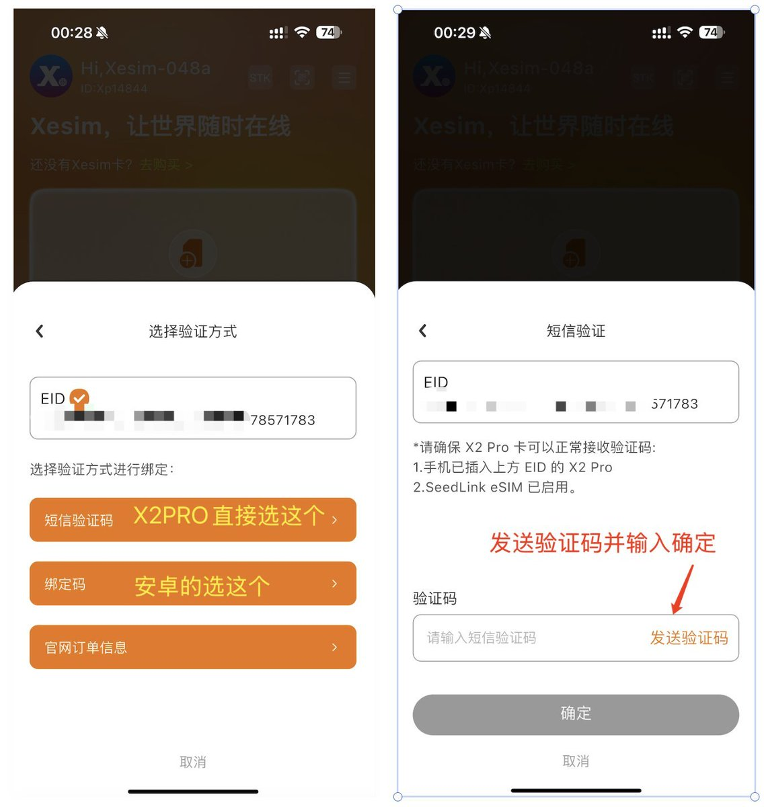

### 5. 购买所需 eSIM 套餐

购买后，会得到 eSIM 二维码（也叫 eSIM 激活码，是一串以 LPA 开头的字符串）。

> ⚠️ eSIM 二维码只能下载使用一次，请妥善保管。

这部分内容参考了鱼总的沃达丰卡注册教程：[教程链接](https://x.com/AI_Jasonyu/status/2017934338889834825)，大家可以自行看教程，然后去购买对应的卡。

### 6. 识别并拷贝 eSIM 激活码

申请完毕之后，你会得到对应的 PDF 和二维码，识别并复制其中的激活码。

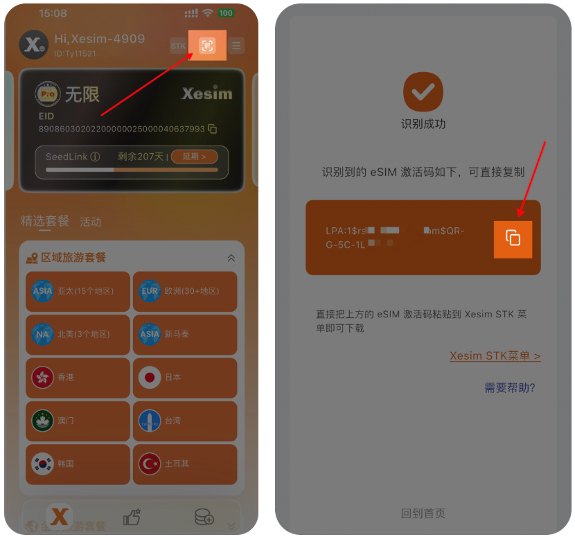

### 7. 通过 Xesim STK 下载 eSIM

首先打开 Xesim 对应卡槽的数据漫游开关，然后：

**① 找到 Xesim STK：**
iPhone：设置 → 蜂窝网络 → SIM 卡 → SIM 卡应用程序中找到 STK

**② 切换语言为中文：**
Xesim → Language → Chinese (Simplified)

**③ 点击"eSIM 下载"：**

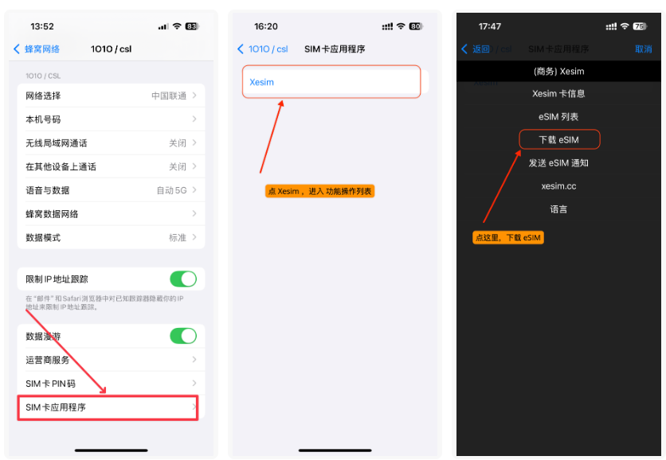

在激活码输入框中，粘贴拷贝好的 eSIM 激活码，点击【发送】。

确认码页面，不用输入，直接点【发送】（大多数都没有确认码，如果 eSIM 供应商提供了确认码，则需输入）。

**④ 等待下载完成：**

点击【接受】后，切记：**不要锁屏，不要任何操作，不要点 STK，耐心等待**，直到下载结果提示。整个下载过程大约需要 40～90 秒。

提示下载成功后，可以去 eSIM 列表里看到新下载的 eSIM。

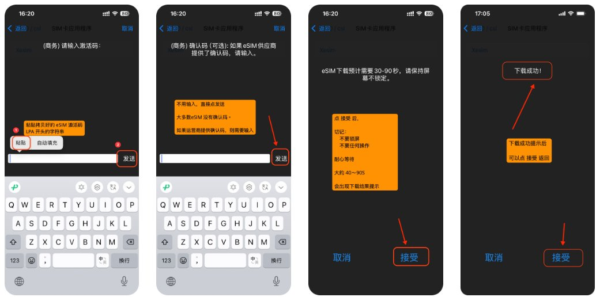

后续进行 PIN 码的激活即可，就可以正常进行使用了！

---

## 四、写在后面

这整个链路大概会花费你 1 小时的时间，包含申请 Xesim 和沃达丰卡等。后续的话，基本上 Xesim 就可以写入任何你想要办理的卡，无论是你想要专门用来注册各种 App 的电话卡，亦或者是专门购买一些流量卡用于境外旅游都是不错的选择！

唯一的问题就是 Xesim 的价格不是很便宜，但是买了一次之后后续就可以终身使用，个人觉得还是挺划算的！

OK，今天的内容就到这边了，最后就是我做了一张图，记录了我目前的平台，如果有大家平时比较喜欢的平台，也欢迎大家前往关注！

那我们就下期再见啦！
