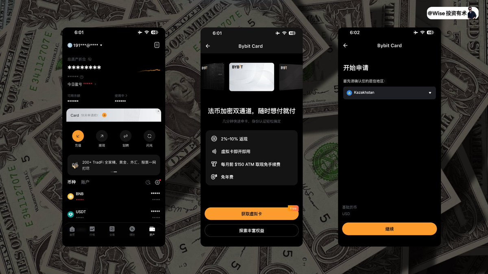
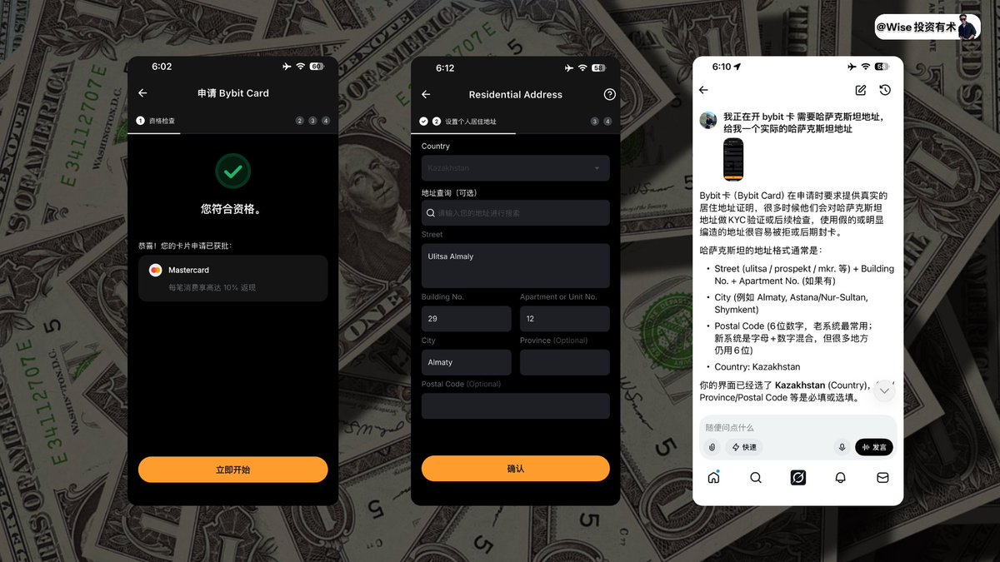
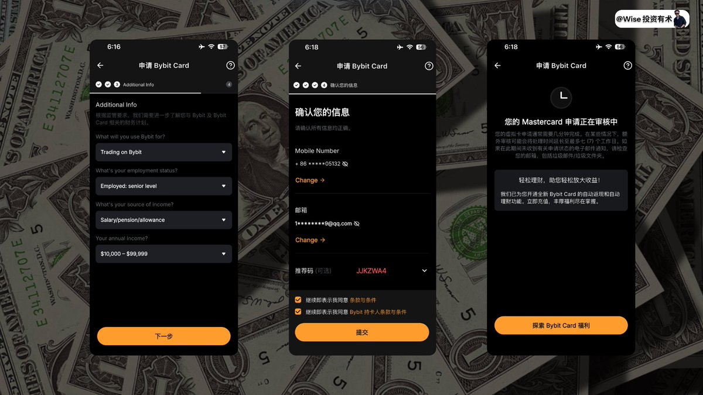
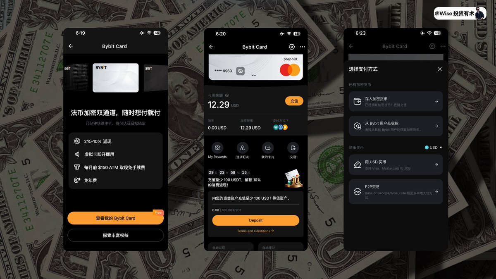
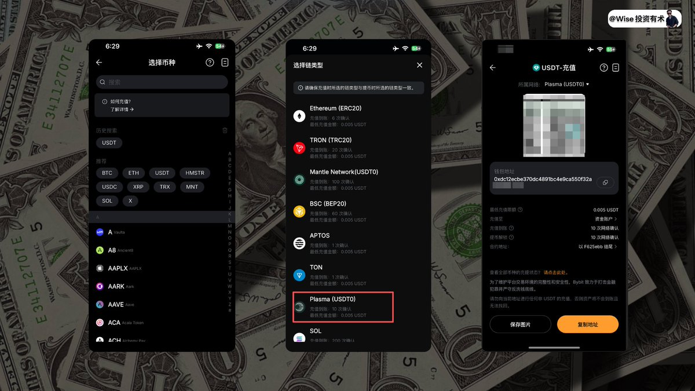
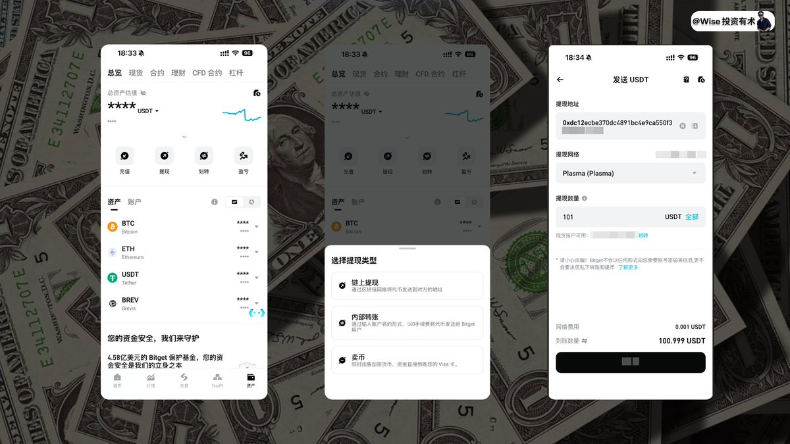
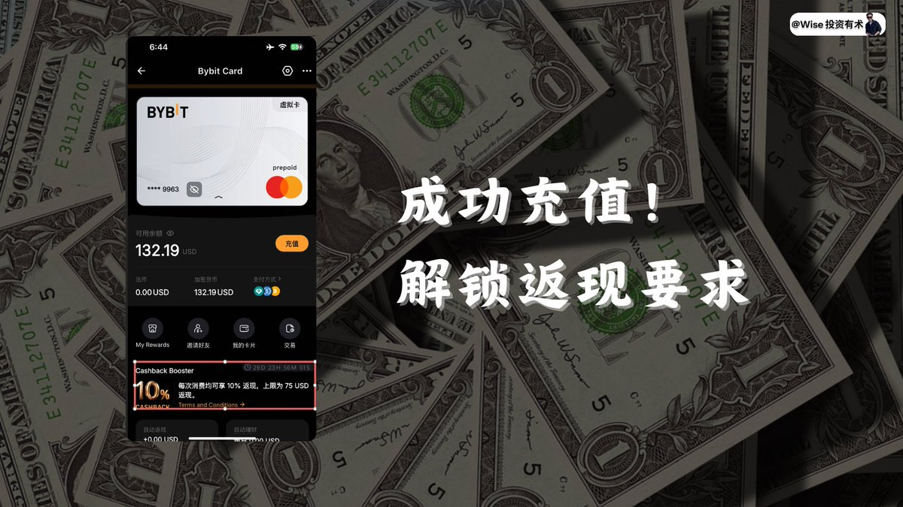

## 一、写在前面

如果你想要开 Bybit 卡，那还是要先注册 Bybit 账号，而关于Bybit，大家可以看此教程进行学习！
https://x.com/WiseInvest513/status/1980641416243212480?s=20

那这里多讲一句，因为咱们开完 Bybit 之后，可能还需要充值入金，所以如果你想要同步注册其他的交易所，也欢迎查阅此链接：

https://www.wise-invest.org/perks
里面有详细的介绍其他的交易所注册的教程，以及一些券商/银行的注册教程，帮助大家来打开美股/加密的投资之路。
## 二、开 Bybit 虚拟 U 卡
ok，那聊完了咱们的 Bybit 开通之后，咱们就正式来聊一下如何开通咱们的 Bybit 虚拟卡。
1️**⃣、**打开咱们的 Bybit，然后点击资产，即可看到可以申请请开通 Bybit 虚拟卡。
2️**⃣、**然后我们可以看到其给我们提供的一些福利，主要关注的还是消费返现，每次消费可做饭 10% 返现，上线单次为 75U。
3️**⃣、**点击获取虚拟卡，而后定位居住地区，咱们记得定位到哈萨克斯坦，方可进行下一步流程。

4️**⃣、**填完了之后，其就会告诉我们咱们符合资格，这里多说一下，开卡的时候节点可以切换到新加坡/日本等，这样速度也会更稳定一些。
5️**⃣、**而后是填入地址，这里的地址咱们就写哈萨克斯坦地址就好，地址只是作为一个开卡使用，并不会进行地址信息的审查，所以随便写入一个就好。
我这里给一些方案大家可以参考
**1、**打开谷歌地图：https://maps.google.com/ 手动选到对应的地址，然后复制过来。
**2、**询问 AI，表述我们在进行的操作，然后让其给咱们一个稳定的地址。 
我这里比较推荐第二种，像是美国地址/香港地址，以及任何国家的地址，你都可以通过 AI 获取到，而且准确率还比较高，直接复制过来即可使用。 
6️**⃣、**如图所示填入 Street、building No、Unit No以及 City 即可正常通过。

7️**⃣、**完毕之后，就会让我们选择用此卡做什么以及自己的收入和雇佣情况，如果大家不是很会的话，可以按照咱们的图进行填写。 
8️**⃣、**而后就是确定你的信息，包含邮箱和手机号，这里我们注册的时候只用邮箱即通过了，所以这里记得补充上你的手机号。
PS：推荐邀请码大家可以写：JJKZWA4，如图 2 所示，绑定邀请码，可以领取到额外的奖励
9️**⃣、**而后就是等待审核了，其说可能会需要几个工作日，其实三分钟即可审核通过
**🔟、**而后你就可以查看此卡的状态，点击上面的小眼睛，也可以获取到咱们的卡的卡号，过期时间以及 CVV 数据值，这些也是最关键的部分。

## 三、入金 Bybit 虚拟 U 卡
目前咱们开卡成功了，但是卡里面没有钱，所以还需要咱们去给其进行入金，这里也可以看到咱们充值至少充值 100U，方可解锁 10% 的消费返现，所以咱们要充值够 100U，
那充值的话，有多种方式可以充值，你可以直接在 Bybit 中进行收款，也可以通过其他交易所转入资产。
这里咱们就拿我最常用的 Bitget 举例子，看 Bitget 中的资金如何入金到 Bybit 虚拟 U 卡里面。 
1️**⃣、**首先点击充值，进入到充值的界面中

2️**⃣、**而后点击存入加密货币，选择 USDT 进行存款，网络可以选择 Plasma，目前单次损耗在 0.001U，基本忽略不计了，其他的网络费用可能会贵一些，而后就得到了你的入金链上地址。

3️**⃣、**而后打开咱们的 Bitget 交易所，点击右下角的资产，点击提现，如果 Bitget/币安/欧易注册还是看咱们的网站！
4️**⃣、**选择链上提现，选择 USDT，然后把对方的地址复制进来，这里提现网络注意一定要选择 Plasma 网络，可以看到网络费用只需要 0.001U，然后验证进行提现即可。

5️**⃣、**最终咱们就成功的在自己的 Bybit 虚拟 U 卡里面收到了这笔资金，也可以看到已经解锁了 10% 的消费返现了。

下面咱们就是准备开始给咱们的 Claude，绑定，而后进行消费付款了。
